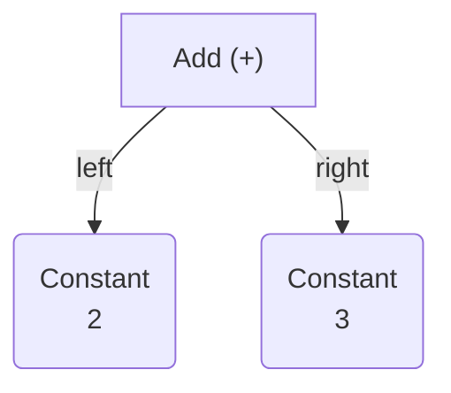
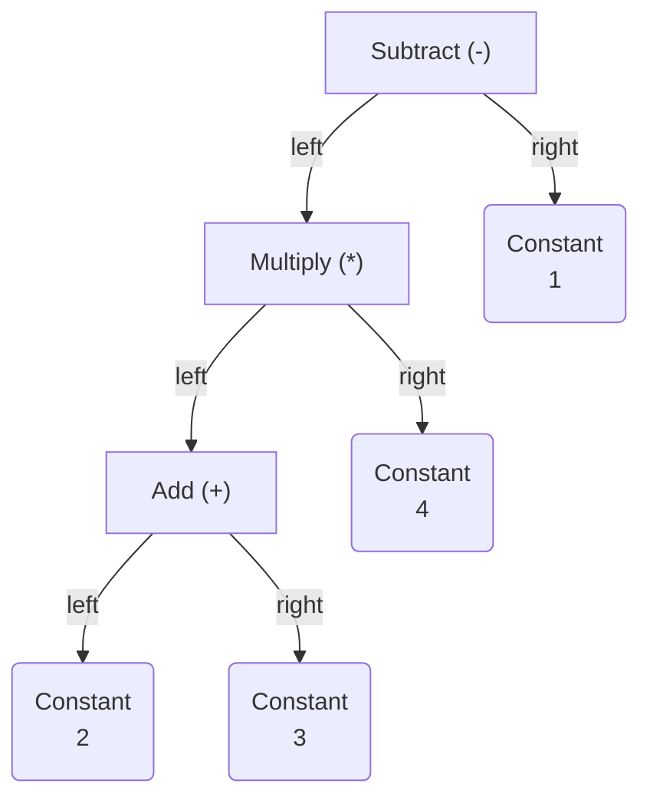
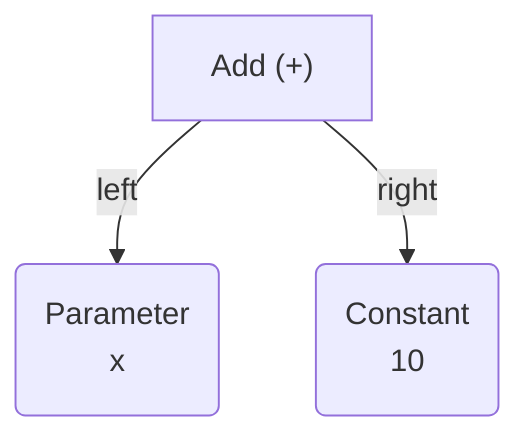
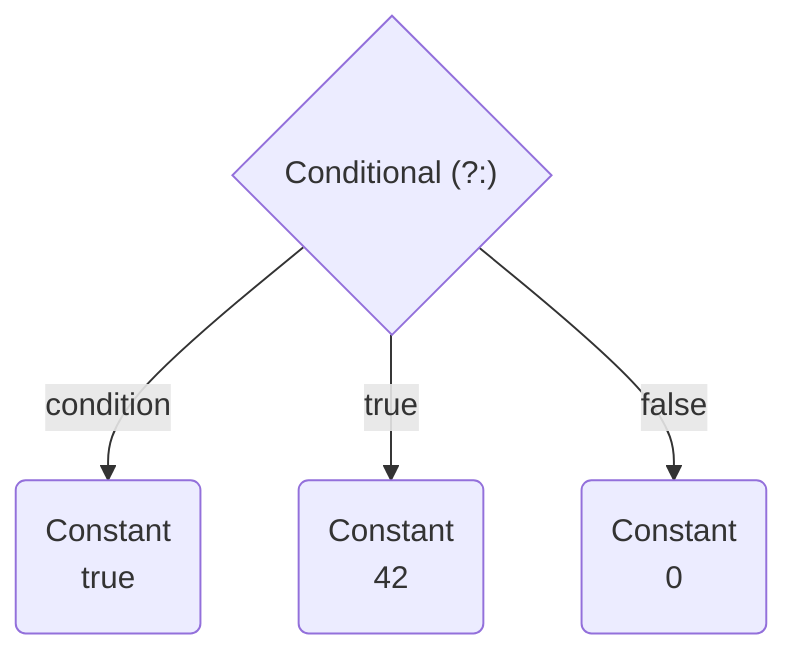

# Mermaid AST Generator Examples

## Example 1: Simple Addition (2 + 3)

```csharp
var ast = new Add(new Constant(2), new Constant(3));
var generator = new MermaidAstGenerator();
var mermaid = generator.Generate(ast);
```

Output:


## Example 2: Complex Expression ((2 + 3) * 4 - 1)

```csharp
var lexer = new ArithmeticLexer("(2 + 3) * 4 - 1");
var tokens = lexer.Tokenize();
var parser = new ArithmeticParser(tokens);
var ast = parser.Parse();
var generator = new MermaidAstGenerator();
var mermaid = generator.Generate(ast);
```

Output:


## Example 3: With Parameter (x + 10)

```csharp
var x = new Parameter("x", TypeReference.To<int>());
var ast = new Add(x, new Constant(10));
var generator = new MermaidAstGenerator();
var mermaid = generator.Generate(ast);
```

Output:


## Example 4: Conditional (true ? 42 : 0)

```csharp
var ast = new Conditional(
    new Constant(true),
    new Constant(42),
    new Constant(0));
var generator = new MermaidAstGenerator();
var mermaid = generator.Generate(ast);
```

Output:


## Usage Notes

- **Node Shapes**:
  - Rounded rectangles `()` for leaf nodes (Constants, Parameters, Variables)
  - Rhombus `{}` for conditionals (if statements, ternary operators)
  - Hexagons `{{}}` for loops
  - Rectangles `[]` for operations

- **Direction Options**:
  - `TB` (default) - Top to Bottom
  - `LR` - Left to Right
  - `BT` - Bottom to Top  
  - `RL` - Right to Left

- **With Analysis**: Pass an `AnalysisResult` to the constructor for enhanced output with semantic information.
