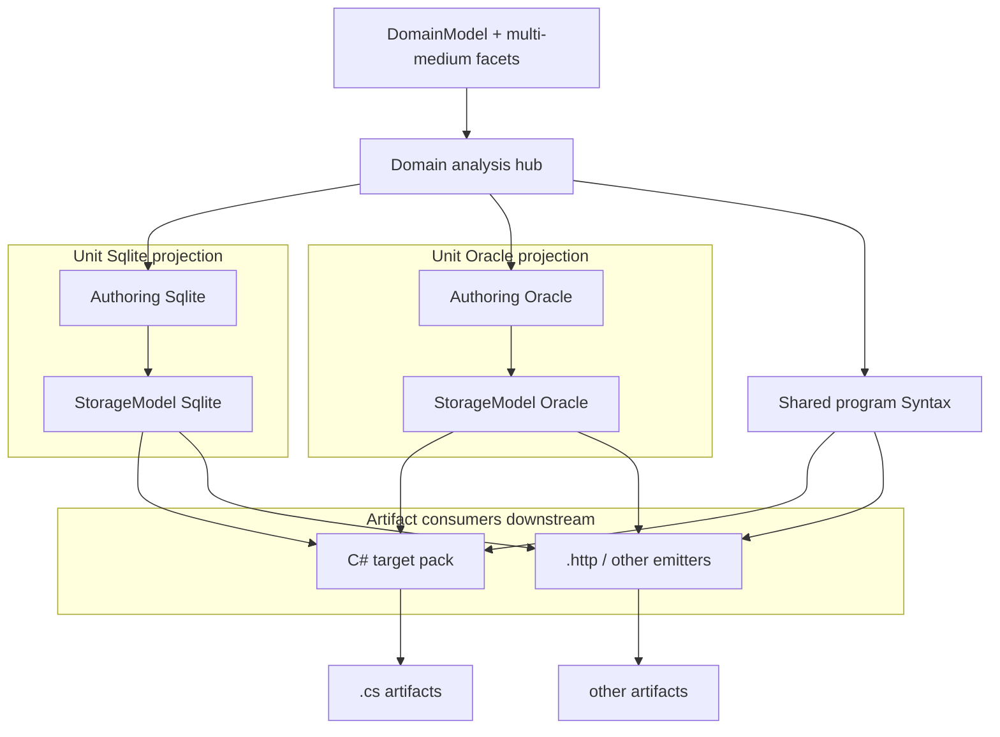
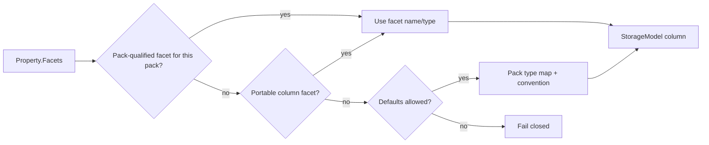

# ADR: Persistence Units, Medium-Scoped Facets, and Pack Syntax Export

**Date:** 2026-07-22  
**Updated:** 2026-07-22 — resulting artifacts; C# as pack-movable target; **analysis drives, artifacts consume downstream**  
**Status:** Accepted (direction)  
**Deciders:** Primary author  

**Related:**

- [`AGENTS.md`](../../AGENTS.md) — §1 domain artifact, §2 end-to-end ownership, §5 shipped capability, §6 working code before abstractions
- [`docs/CORE.md`](../CORE.md) — pipeline and module ownership
- [`docs/decisions/2026-06-08-domain-lowering-boundary.md`](2026-06-08-domain-lowering-boundary.md) — no domain-specific VM opcodes; domain lowers to generic Syntax/ops
- [`docs/decisions/2026-07-11-platform-trust-bar-and-dogfood.md`](2026-07-11-platform-trust-bar-and-dogfood.md) — honesty bar; dogfood real product paths
- [`docs/decisions/2026-core-engineering-principles.md`](2026-core-engineering-principles.md) — principles
- Shipped scaffolding: `DomainAuthoringContext`, `IAnnotationSyntax`, `Facet`/`Annotation`, `StorageAnalyzer`, `TypeMappingRegistry`, `IStorageConvention`, `Poly.Packs.Sqlite`, `Poly.Packs.SqlServer`, `DomainToCSharpExporter`, `CSharpGenerator`, host `DbContextGenerator` (string path — transitional)

---

## Context

Poly can already:

- Author domains in `.poly` DSL (MCP `apply_dsl`, evolution, analysis).
- Attach **facets** (including pack-registered annotation keywords such as `column` / `table`) on entities and properties.
- Project storage shape via `StorageAnalyzer` → `StorageModel`, influenced by pack **type maps** and **conventions**.
- Export **entity program IR** through the structured path: `DomainToCSharpExporter` → `Poly.Syntax` nodes → `CSharpGenerator` (names are historical; the exporter’s valuable output is Syntax, not “being C#”).
- Emit **EF DbContext** (and Minimal API / `.http`) through **host string generators** in `Poly.DslCompiler`, selected by a single `--dbms` / `DbmsPack` flag.
- Dogfood a Sqlite RestApi against generated types + `EnsureCreated`.

Several product pressures collide if left implicit:

1. **Multi-DBMS packs in one project** — Sqlite and SqlServer (later Oracle, etc.) must be able to coexist. EF’s natural boundary is **typed `DbContext`s**, not one ambient “current DBMS.”
2. **Brownfield decomposition** — Agents and humans must peel existing apps onto Poly **without migrating data** to a Poly-canonical schema. Medium-specific column names, types, tables, and bindings are *declared truth*, not compiler folklore.
3. **Honest artifact production** — Entity export already lowers to Syntax before text. DbContext and pack satellite types still printf strings. That fork will become painful if packs’ extension model is “emit text” rather than “emit structured IR (Syntax where the artifact is program code) like domain lowering.”
4. **Resulting artifacts are broader than C#** — A compile/export may produce entity sources, typed DbContexts, API hosts, `.http` samples, DI registration, schemas, migration factories, docs, and later non-.NET targets. “C# output” is the wrong umbrella name.
5. **C# generation is not privileged core** — Turning Syntax (or other IR) into `.cs` text, and even opinionated C#/EF project shapes, **may move into a pack** (a *target* / language pack). Core should not assume `CSharpGenerator` is the forever in-tree edge of the platform.
6. **Avoid wrong abstractions** — Opening the tokenizer into abstract token hierarchies / general parse-combinator frameworks is *not* required for the above and violates §6 until a second real grammar forces it.

This ADR locks the **direction** so near-term pack work (Sqlite defaults, annotations, single-unit CLI) stays scaffolding on the right spine—not a dead-end contract.

---

## Decision

### 1. North star (one paragraph)

One portable domain type forest; **analysis is the hub** that makes the model and its projections meaningful; N persistence units bind **persistence packs** and resolve medium-scoped facets into unit IR; **consumers of analysis** (target packs, host emitters, tools) produce **resulting artifacts** downstream—including a C# path that may itself be a pack. Program shapes prefer `Poly.Syntax` before text. No silent cross-medium translation. Brownfield success means attaching facets and running against the existing store.

### 1b. Resulting artifacts (vocabulary)

Prefer **resulting artifacts** (or simply **artifacts**) over “the C# output” when describing what compile/export produces.

A **resulting artifact** is any durable product of domain + analysis + pack projection intended for a consumer outside the in-memory domain session. Examples:

| Kind | Examples | Typical path |
|------|----------|--------------|
| **Shared domain program IR** | Entity types, stage enums, `DomainResult`, action methods as Syntax | Domain → Syntax (core or shared lowerer) |
| **Per-unit persistence IR** | Typed `DbContext` shape, model config, converters as Syntax / storage IR | Persistence unit + pack |
| **Target-language sources** | `.cs` files (or later other languages) | **Target pack** (e.g. C#) renders program IR → text |
| **Host / app surface** | Minimal API `Program`, DI extensions, test fixtures | Target and/or host packs bound to a unit |
| **Operator / integration** | `.http` samples, OpenAPI, SQL scripts, EF migrations metadata | Purpose-built emitters from domain + unit IR |
| **Documentation / snapshots** | DSL export, domain snapshot JSON, analysis reports | Existing export tools; not all need Syntax |

**Rules of thumb:**

- Name the *set* “resulting artifacts”; name a *member* by what it is (`LibrarySqliteDbContext.cs`, `demo.http`).
- **C# is one target**, not the umbrella term for all outputs—and **not a required core module forever**.
- Artifacts that are programs should prefer **structured IR** (`Poly.Syntax` for code shapes we own) before text.
- Artifacts that are not programs (HTTP transcripts, markdown, binary schemas) **must not** be forced through `TypeDefinitionNode` or any single language generator.
- Multi-unit / multi-target compiles produce a **bag of artifacts** with stable identities (path/name); collisions fail closed.

Conceptual compile result:

```text
CompileResult {
  Success
  Artifacts: [ { Identity, Kind, Content or structured payload } ]
  Diagnostics
}
```

(`DslCompiler.CompileResult.Files` is an early, C#-centric form of this idea and should evolve toward explicit artifact kinds without breaking the “list of produced outputs” shape.)

### 1c. Pack families: persistence vs target (C# may be a pack)

Not every pack is a DBMS pack. At least two families matter:

| Family | Role | Examples |
|--------|------|----------|
| **Persistence / medium packs** | Facet vocabulary, type maps, conventions, unit storage projection, persistence-shaped IR | Sqlite, SqlServer, Oracle, … |
| **Target / language packs** | Turn shared + unit program IR into language-specific **resulting artifacts**; may own idioms (records vs classes, EF fluent style, project file snippets) | **C#** (today in-tree as `CSharpGenerator` + host generators), later others |
| **Host / surface packs** (optional later) | API styles, test harnesses, operator samples | Minimal API, `.http`, OpenAPI |

**Decision:** Architecture must allow **C# generation to move into a pack** (e.g. `Poly.Packs.CSharp` or a broader .NET target pack) without redesigning domain, facets, or persistence units.

Implications:

1. **Core owns** domain model, **analysis as hub**, medium-facet seams, storage projection IR, and (preferably) **domain → `Poly.Syntax` lowering** as shared program IR—not “emit C#.”
2. **`CSharpGenerator` and C#-shaped host printers are downstream artifact consumers (target concerns).** Their current home under `Poly.Interpretation.CSharp` / `Poly.DslCompiler` is **scaffolding placement**, not a vow that C# text emission is substrate forever.
3. **`DomainToCSharpExporter` is misnamed for the end state.** Its durable job is “analyzed domain → program Syntax (type defs, members, lowered effects).” Rename/split when it moves; do not bake “CSharp” into new public seams.
4. **Persistence packs must not require the C# pack.** A Sqlite unit can exist for storage projection, schema artifacts, or a future non-C# target. Conversely, a C# pack can render shared domain Syntax with **zero** persistence units (entities-only export).
5. **Composition is explicit:** e.g. analyzed domain + Sqlite unit + C# target → entity `.cs` + `LibrarySqliteDbContext.cs` + optional API artifacts. Missing target when the user asked for language sources → fail closed.
6. **Do not move early “for purity.”** Extract a C# pack when a second target, packaging boundary, or host composition pain forces it (§5/§6). Until then, keep APIs **analysis-out / artifacts-out** in shape (consumers plug in downstream of analysis).

### 1d. Analysis drives; artifacts consume downstream

**Decision:** The productive pipeline is **analyze first, emit second**.

```text
Domain (+ facets)
    → domain analysis          (structure, semantics, diagnostics — fail closed)
    → unit projections           (StorageModel / infra IR per persistence unit; pack maps + facets)
    → optional program IR        (domain → Syntax; pack Syntax slices)
    → optional further analysis  (e.g. Interpreter.Analyze on program Syntax when needed)
    → artifact consumers         (target packs, host emitters, MCP export tools, tests)
         └─► resulting artifacts
```

**What “analysis drives everything” means:**

1. **Meaning and validity live in analysis (and analysis-gated evolution), not in printers.**
   A generator must not be the first place a bad model is rejected if analysis could have said so.
2. **Artifact producers are consumers of analysis outputs** — `AnalysisResult`, effective members, entity structure metadata, per-unit `StorageModel` / `InfrastructureModel`, diagnostics — not re-interpreters of raw DSL with a private second opinion.
3. **Packs may contribute to analysis inputs** (facet registries, type maps, conventions, unit-scoped projection rules) and may run **pack-scoped projection/validation** that feeds the shared analysis story. They must not bypass diagnostics with “emit anyway and hope the compiler fails.”
4. **Many consumers, one hub.** C# target, `.http` emitter, schema dump, MCP `export_*`, RestApi dogfood, future languages — all hang off the same analyzed model + unit projections. Adding a consumer should not require a new parse of the domain.
5. **Text is never the analysis medium.** Round-trip fidelity is DSL ↔ domain facets ↔ IR; `.cs` is a downstream view.
6. **VM / execution analysis stays a separate consumer path** when the goal is run effects (Interpreter pipeline). Codegen analysis and execution analysis may share machinery; they are still *consumers*, not places where domain truth is redefined.

**Anti-patterns:**

- String generators that invent keys, nullability, or column types without reading `StorageModel` / domain analysis
- Target packs that re-parse `.poly` or scrape previous `.cs` to decide structure
- Persistence packs that only work when the C# pack runs (analysis/projection must stand alone)
- “Fix it in the template” for rules that belong in analyze-time diagnostics

```text
Domain ──► Analysis (hub)
              │
              ├─► unit StorageModel(s)   (persistence pack projection)
              ├─► program Syntax         (shared + unit slices)
              │         └─► optional Syntax analysis
              ▼
     Artifact consumers (downstream only)
       target pack(s) e.g. C# ──► .cs
       other emitters ──────────► .http, schemas, docs, …
```

### 2. Layer cake

```text
DomainModel  (portable entities, properties, stages, actions, policies, relationships)
    + Facet bags (may hold facets for many media at once)
        │
        ▼
   Domain analysis (hub — diagnostics, effective members, structure metadata)
        │
        ├─ PersistenceUnit A → StorageModel_A / unit IR   (pack projection consumes analysis)
        ├─ PersistenceUnit B → StorageModel_B / unit IR
        └─ Shared domain → Syntax (program IR; may be further analyzed)
                    │
                    ▼
         Artifact consumers (downstream)
           target pack (C# may live here) + host/other emitters
                    │
                    ▼
              Resulting artifacts
                (.cs, .http, schemas, docs, …)
```

| Layer | Responsibility | Multiplicity |
|-------|----------------|--------------|
| **Domain** | Logical product truth | One per domain |
| **Facets** | Declarative medium / host projections on model elements | Many media retained on one model |
| **Domain analysis** | **Hub** — validity, metadata, what consumers may rely on | Once per evolve/export (plus incremental forms) |
| **Authoring context** | Parse/print registries, type maps, conventions for a pack | Per persistence unit (or superset at parse-time — see §5) |
| **StorageModel / InfrastructureModel** | Resolved storage IR for *one* unit (analysis consumer + input to further consumers) | **Per unit** — never merge maps across packs |
| **Shared domain → Syntax** | Provider-agnostic program IR | Once per export |
| **Persistence pack export** | Unit-bound persistence IR / Syntax slices from analyzed domain + unit projection | Per unit |
| **Artifact consumers** | Target pack (C# pack-movable), host emitters, tools | Per selected consumer |
| **Resulting artifacts** | Durable outputs only — no new domain truth | Bag with stable identities |

### 3. Persistence unit (first-class compile artifact)

A persistence unit is not a process-global enum flag. Conceptually:

```text
PersistenceUnit {
  Name              // stable identity, e.g. "LibrarySqlite"
  PackId            // "sqlite" | "sqlserver" | "oracle" | …
  Authoring         // DomainAuthoringContext for this unit’s maps/conventions/keywords
  ContextTypeName   // LibrarySqliteDbContext (dependency boundary for app code)
}
```

**Rules:**

- Same `Domain` + domain `AnalysisResult`; **re-run** storage projection per unit with that unit’s authoring.
- **Do not merge** Sqlite and SqlServer type maps into one `StorageModel`.
- CLI `--dbms sqlite` remains **sugar for a single unit**, not the long-term multi-unit API.
- Downstream **artifact producers** (Minimal API, tests, DI snippets, `.http`) bind to a **unit / context type name**, never to an ambient “the DbContext.”

### 4. Medium-scoped facets (brownfield truth)

**Facets ≠ constraints.** Constraints (`required`, `unique`, `length`, …) are domain validation. Facets carry host/medium projection data (`column`, `table`, collations, tablespaces, proc bindings, …).

#### 4.1 Why

Decomposing an existing app requires the model to say explicitly, for example:

- Sqlite: property `Isbn` → column `isbn_text` / `TEXT`
- Oracle: same property → `"ISBN"` / `VARCHAR2(32)`

without:

- silently rewriting one medium into another inside the compiler, or
- forcing a data migration to a single canonical store.

#### 4.2 Attachment targets

| Target | Medium facets for |
|--------|-------------------|
| **Entity / domain type** | table, schema, tablespace, temporal, soft-delete storage name, … |
| **Property** | column name/type, collate, identity, DB default/computed, legacy index name, … |
| **Relationship** (when needed) | FK name, join table, medium on-delete rules |
| **Action** (optional, narrower) | stored proc / SQL / RPC **bindings** — not a replacement for portable domain effects |
| **Stage** | almost never storage; lifecycle stays domain |

#### 4.3 Qualification

Unscoped `column` / `table` (shipped today) is the **portable / single-store v1** form.

Multi-media models require **pack-qualified** forms (exact DSL spelling can evolve; semantics must not):

```poly
entity Book {
  Isbn: text required unique
    column("Isbn", "nvarchar(32)")            // portable overlay (single-store / legacy)
    sqlite column("isbn_text", "TEXT")        // medium-specific
    oracle column("ISBN", "VARCHAR2(32)")     // medium-specific

  table("Books")
  sqlite table("books")
  oracle table("LIBRARY_BOOKS")
}
```

#### 4.4 Resolution order (per unit, deterministic, fail-closed)

For unit *U* with pack id `sqlite`, when resolving a property’s storage column:

1. Last matching **pack-qualified** column facet for `sqlite`
2. Else last **portable** (unqualified) column facet — if policy allows
3. Else pack **default** type map + naming convention
4. **Never** apply another pack’s facets (`oracle.*`) in this unit
5. Empty/invalid facet args → hard failure (already true for `column`)

**Policy modes:**

| Mode | Behavior |
|------|----------|
| **Greenfield / demo** | Defaults allowed; prefer diagnostics when a default was used |
| **Strict brownfield** | Require pack-qualified (or portable) facet for every persisted element; defaults = error |

Defaults are a **fallback tier**, not the source of truth for production brownfield.

#### 4.5 Pack-authored bespoke facets

`Annotation` is the open wire format. Packs may own **typed `Facet` subtypes** when structure demands it (e.g. `SqliteCollateFacet`, Oracle tablespace). Pack responsibilities:

1. Register syntax (keyword → parse/print)
2. Validate target and args (fail closed)
3. Project only in that pack’s unit resolution
4. Contribute resulting artifacts (via storage IR and, for program shapes, Syntax)

Core does **not** grow vendor facet types. Core grows: facet bags, registry seams, resolution helpers, fail-closed unknown keywords for the authoring set in play.

#### 4.6 Action facets

Allowed as **bindings** to existing medium entry points:

- `oracle proc("LIBRARY.CHECKOUT")`
- `sqlite sql("checkout_v2")`

**Not allowed** as the sole definition of domain lifecycle meaning, and **not** as new VM opcodes. Pattern:

```text
Action = portable domain effects  +  optional medium binding facets
```

Host/codegen may choose in-process effects vs adapter call when the unit’s facet says so.

### 5. Parse-time vs emit-time packs

| Concern | Scope |
|---------|--------|
| **Domain parse / evolve** | Portable core + annotation keywords. A multi-unit **repo** may register **all** packs’ facet keywords so one `.poly` can hold `sqlite` and `oracle` facets together. |
| **Storage projection + unit artifact emit** | **Per unit** — only that pack’s defaults and facet consumption apply. |

Prefer portable domain text + per-medium facets over maintaining divergent `.poly` files per DBMS for the same logical domain.

Unknown keywords fail closed relative to the **active parse registry**. Vendor-only facets consumed by the wrong unit are ignored only under an explicit policy; default is: other packs’ qualified facets are simply out of scope for resolution (not an error), while **required** strict-mode facets for *this* pack missing → error.

### 6. Packs contribute projections and artifacts (program shapes via Syntax; C# is a target)

#### 6.1 Goal

**Persistence packs** contribute unit IR and program-shaped **Syntax slices** (e.g. DbContext type graphs). **Target packs** (C# may be one) turn Syntax/IR into language **resulting artifacts**. Host/surface emitters cover non-program or opinionated app shapes. Nobody’s long-term extension model is “printf the final file in core.”

Conceptual contracts:

```text
// Persistence pack: structured contribution (not final .cs)
IPersistenceSyntaxExport:
  IReadOnlyList<TypeDefinitionNode> Export(   // or richer IR
      Domain domain,
      AnalysisResult analysis,
      InfrastructureModel infra,    // unit-specific
      PersistenceUnit unit);

// Target pack: language artifacts from Syntax / IR
ITargetPack:  // e.g. future Poly.Packs.CSharp
  IReadOnlyList<ResultingArtifact> Render(
      IReadOnlyList<TypeDefinitionNode> programSyntax,
      /* unit bindings, options */);

// Broader / mixed contribution
IArtifactExporter:
  IReadOnlyList<ResultingArtifact> Export(...);
  // ResultingArtifact = identity + kind + structured payload and/or text
```

A persistence unit + C# target composition may yield artifacts such as:

| Artifact kind | Example | Who owns the concern |
|---------------|---------|----------------------|
| Typed `DbContext` (program IR → `.cs`) | `LibrarySqliteDbContext` | Persistence pack shapes IR; **C# target** emits text |
| Model config body | `OnModelCreating` as Syntax | Persistence pack |
| Design-time factory | EF migrations factory | Persistence and/or C#/EF target idioms |
| Helpers / converters | pack satellites | Persistence pack IR; target renders |
| DI registration | `AddLibrarySqlite(...)` | Target or host pack |
| Integration sample | `demo.http` | Host/surface emitter (not C# pack required) |
| Schema / SQL | DDL snapshot | Persistence / schema emitter |

Executable app code depends on **program artifacts** rooted at a **typed DbContext** when EF is in play — not on a global DBMS singleton. Other artifacts may reference those type names as text or structured links.

#### 6.2 Shared vs per-unit vs target

- **Shared once:** domain → Syntax for entities, stage enums, `DomainResult`, domain action methods (provider-agnostic).
- **Per persistence unit:** context type, provider fluent config, medium satellites (as IR/Syntax).
- **Per target selection:** language text and language-only idioms (file headers, nullable contexts, implicit usings, etc.).
- **Do not** subclass entities per provider (`SqliteBook : Book`). Configure the same entity type differently per context IR.

#### 6.3 Execution pipeline stays separate

Emitting Syntax for **artifact production** is not the same as injecting nodes into the **VM execution** forest.

- Artifact AST and effect/execution AST may share node vocabulary.
- Different roots and consumers.
- Packs must not invent domain opcodes or bypass lower → analyze → execute for runtime semantics ([domain-lowering boundary](2026-06-08-domain-lowering-boundary.md)).

#### 6.4 Transitional placement of C#

Today:

- `Poly.Interpretation.CSharp.CSharpGenerator` — in-tree Syntax → C# text
- `DomainToCSharpExporter` — domain → Syntax (C#-oriented naming)
- `Poly.DslCompiler` string generators — DbContext / API / `.http`

These are **valid scaffolding**. The locked direction is:

- Treat them as the **de facto C# target**, not as CORE substrate forever.
- Prefer seams where a future `Poly.Packs.CSharp` (name illustrative) can own text emission + .NET idioms.
- Replace string **program** generators with Syntax → target-pack render incrementally.
- **Non-program** artifacts may remain purpose-built emitters indefinitely and need not move with the C# pack.

Extract the C# pack when there is a **second real consumer** of the target-pack seam (second language, separate shipping package, or host that must omit C#). Until then, avoid new public APIs that *hard-wire* `CSharpGenerator` as the only possible edge.

### 7. What packs are (and are not)

**Packs are (by family):**

- **Persistence:** facet lexicon, type maps/conventions, per-unit storage projection from **analyzed** domain, persistence Syntax slices
- **Target (e.g. C#):** **downstream consumers** — language rendering of program IR, language idioms, optional project artifacts
- **Host/surface (optional):** **downstream consumers** — API/test/operator artifact styles

**Packs are not:**

- Owners of portable domain entity *meaning* (shared domain + analysis stay central)
- Places where model validity is decided instead of analysis
- Mergers of multi-DBMS maps into one model
- Implicit translators that rewrite Oracle facets into Sqlite types when emitting Sqlite
- Required to be C#-centric — persistence packs must compose without a C# target
- Registrars into `Interpreter`’s VM analysis pipeline for storage sugar
- A reason to rewrite the DSL tokenizer into abstract token classes / general pattern engines (§6)

### 8. Multi-unit composition rules

**Allowed:**

- N units, N context types, one shared entity forest
- Same entity CLR type mapped differently per context
- Explicit app references: `LibrarySqliteDbContext` vs `LibrarySqlServerDbContext`
- Clear namespaces/files per unit (`Persistence/Sqlite/…`)

**Forbidden / fail-closed:**

- One merged `OnModelCreating` with both providers’ maps
- Global static “current pack” changing entity codegen
- Silent type-name collisions across pack exports
- API generator assuming a single ambient context when multiple units exist (must require binding)
- Entity export gaining provider-specific column types

### 9. Name stability and layout (guidance)

Illustrative **artifact layout** (identities, not a mandate that everything is C#):

```text
# When C# target is selected (illustrative layout)
_all.cs / Book.cs / …           # shared domain program artifacts (once)
Persistence/
  Sqlite/
    LibrarySqliteDbContext.cs   # unit IR rendered by C# target
    (optional satellites)
  SqlServer/
    LibrarySqlServerDbContext.cs
demo.http                       # integration artifact (non-program emitter; no C# pack required)
Program.cs                      # host artifact bound to a chosen unit (when generated)
```

Conventional context type name: `{Domain}{PackTitle}DbContext` or explicit unit name. Artifact identity collisions fail closed. Without a C# (or other language) target, program text artifacts are simply not produced—storage IR and non-program artifacts may still be.

Migrations: **one migrations assembly / design-time factory per context** when EF migrations matter.

### 10. Near-term scaffolding vs locked contracts

| Current artifact | Status |
|------------------|--------|
| `Facet` bags, `Annotation`, `IAnnotationSyntax`, evolution add-facet | **Keep — real seam** |
| Pack type maps + `IStorageConvention` | **Keep as defaults tier** under facets |
| `StorageAnalyzer` pure `(Domain, Analysis, maps, conventions) → StorageModel` | **Keep — call per unit** |
| Domain analysis + evolution gate | **Hub** — keep fail-closed; artifact paths consume it |
| Domain → Syntax export (`DomainToCSharpExporter`) | **Keep job** as analysis consumer → program IR; rename when seams harden; stay provider-agnostic |
| `StorageAnalyzer` / infra projection | **Analysis-adjacent projection** per unit; inputs to artifact consumers |
| `CSharpGenerator` | **Downstream target consumer** — may move to a C# pack; do not add new core APIs that assume it is eternal substrate |
| `CompileResult.Files` | **Evolve toward typed resulting artifacts** (kind + identity); list-of-outputs shape stays |
| C# as required core | **No** — optional target pack in the end state |
| Single `--dbms` / `DbmsPack` / one authoring context | **Sugar for one unit** — do not freeze as sole multi-DB API |
| Unscoped `column`/`table` last-wins | **v1 portable form**; design qualified facets before many packs depend on unscoped-only resolution |
| `DbContextGenerator` strings | **Transitional** — not pack API |
| MCP single `CreateWithSqlPack()` | **OK short-term**; sessions may grow unit lists later |

### 11. Explicitly out of scope (for now)

- Abstract `Token` type hierarchies and “expression = series of token patterns” parser frameworks
- Letting packs register arbitrary `INodeAnalyzer`s into the VM `Interpreter` pipeline for EF sugar
- Full Oracle pack / action-proc runtime
- Replacing every string generator in one PR
- Data migration tooling (brownfield goal is **avoid** requiring migration for the first successful attach)

### 12. Capability ladder (execution order when work resumes)

1. Document this direction (**this ADR**).
2. Reserve resolution order: **qualified → portable → default**; add diagnostics for “defaulted.”
3. Pack-qualified `column`/`table` (or equivalent) + tests with two facet media on one property.
4. `PersistenceUnit[]` compile model; two units → two `StorageModel`s, no map merge; context type names include pack/unit.
5. Strict brownfield mode (optional flag).
6. Name compile outputs as **resulting artifacts** in APIs/docs; describe C# as a **target**, pack-movable.
7. Keep domain → Syntax and persistence IR **independent** of `CSharpGenerator` call sites where cheap.
8. Syntax fidelity audit for EF fluent shape; one golden DbContext-as-Syntax test (assert IR and/or rendered text via current C# path).
9. Replace string program generators (`DbContextGenerator`, …) with Syntax slices + target render, slice-by-slice.
10. Extract **C# target pack** when a second target or packaging boundary forces it—not before.
11. Action binding facets + host interpretation as needed by real decomposition.
12. Second brownfield dogfood (existing DB, facets from live catalog, no migration).

Each step should stay a thin vertical under AGENTS §4–§6.

### 13. Success criteria

Multi-DBMS packs and brownfield facets are “real” when:

1. One `.poly` → analyzed domain once; shared program IR from that analysis.
2. Two units in one compile → two context projections, two storage models, **no map merge**, distinct artifact identities when a target renders them.
3. Medium-scoped facets round-trip in DSL and win over defaults per §4.4.
4. **Artifact producers only consume analysis/projection outputs** — they do not re-derive a private domain truth.
5. Persistence packs contribute IR/Syntax from analysis; target packs (C# optional) and other emitters are **downstream consumers**; non-program artifacts remain first-class.
6. App can register/inject multiple typed contexts; nothing global assumes a single DBMS or a single language target.
7. Unknown pack, duplicate artifact/type identities, API without unit binding when N>1, or language sources requested without a target → **fail closed**.
8. A Sqlite (or other) unit can describe an **existing** schema via facets without requiring `EnsureCreated` migration of customer data as the only path.
9. Docs and APIs say **resulting artifacts**; C# is a **pack-movable target consumer**, not core substrate or the whole product of compile.

---

## Consequences

### Positive

- Clear spine for packs without detonating parser/VM core.
- Brownfield decomposition becomes a first-class story (facets + units).
- EF multi-context model aligns with Poly multi-unit model.
- **Artifact vocabulary** stays open; **C# can leave core** without a second architecture pass.
- Program-shaped honesty: shared IR (`Poly.Syntax`) before any target text; fewer parallel string DSLs.
- Persistence packs stay useful even when the consumer is schema/HTTP/another language.
- Near-term Sqlite/SqlServer + in-tree C# path remains valuable scaffolding.

### Negative / costs

- Qualified facet syntax and multi-unit CLI/manifest are new surface area (guide + MCP must track).
- Target-pack seam + eventual C# extraction is more moving pieces than “always call `CSharpGenerator`.”
- Syntax must grow enough fidelity for EF fluent APIs before string program generators die.
- Authors must learn portable domain vs medium facet vs target distinction.
- Strict mode will feel noisy until agents attach facets systematically.
- Compile APIs must eventually distinguish artifact kinds and selected targets.

### Risks if ignored

- Freezing single-`--dbms` + unscoped `column` + string `DbContextGenerator` as the pack contract makes multi-unit and brownfield a rewrite later.
- Treating in-tree C# generation as CORE forever makes a second language or thin core package a rewrite later.
- Calling everything “the C# output” erases non-C# artifacts and paints a .NET-only ceiling into the architecture language.
- Implicit type-map translation as the only mechanism trains agents to lie about existing schemas.
- Provider-specific entity types fork the domain artifact.

---

## Diagrams

### Analysis hub and downstream artifacts



### Facet resolution (one property, one unit)



---

## Implementation notes (non-normative pointers)

Current code touchpoints (will move as the ladder advances):

- Facets: `Poly/DomainModeling/Property.cs`, entity/type facet bags, `AddFacetToPropertyChange` / `AddFacetToDomainTypeChange`
- Annotations: `IAnnotationSyntax`, `AnnotationRegistry`, `SqlAnnotationSyntax`, parser property-tail interleaving
- Storage: `StorageAnalyzer.ResolveColumnAnnotation` / table resolution, `TypeMappingRegistry`, `IStorageConvention`
- Authoring: `DomainAuthoringContext.CreateWithSqlPack`, pack `AddSqliteDefaults` / `AddSqlServerDefaults`
- Shared domain → Syntax path: `DomainToCSharpExporter` (name transitional)
- De facto C# target (pack-movable): `Poly.Interpretation.CSharp.CSharpGenerator`
- Host transitional artifact producers: `src/Poly.DslCompiler/DbContextGenerator.cs`, `MinimalApiGenerator`, `HttpFileGenerator`, `DslCompiler.DbmsPack`, `CompileResult.Files`
- Persistence packs: `src/Poly.Packs.Sqlite`, `src/Poly.Packs.SqlServer`
- Product DSL guide: `Poly.Mcp/Docs/poly-dsl-guide.md` (must update when facet/unit surface ships)

When this ADR’s mechanisms land in product surfaces, update [`docs/CORE.md`](../CORE.md) and the DSL guide in the same change. If/when C# moves to a pack, update placement tables and package boundaries in the same change—do not leave CORE describing `CSharpGenerator` as eternal substrate.

---

## References (discussion summary captured here)

This ADR freezes the outcome of the 2026-07-22 design thread:

1. Pack extension via **resulting artifacts**, with program shapes going through **Syntax** (like domain lowering), not abstract tokens first.
2. **Multi-DBMS** ⇒ multiple **typed DbContexts** / persistence units over shared entities.
3. **Bespoke medium facets** so Sqlite/Oracle (etc.) differences are explicit model data for brownfield attach without data migration.
4. Outputs are a **bag of resulting artifacts**; C# is a **target** that **may move to a pack**, not core forever and not the whole product of compile.
5. Persistence packs and target packs compose; neither should hard-require the other.
6. **Analysis drives**; target/host/tooling **consume analysis downstream** to produce artifacts — printers are not a second source of truth.
7. Confirmation that current Sqlite annotation + defaults + in-tree C# path is **right-direction scaffolding** if the contracts in §10 are respected.
