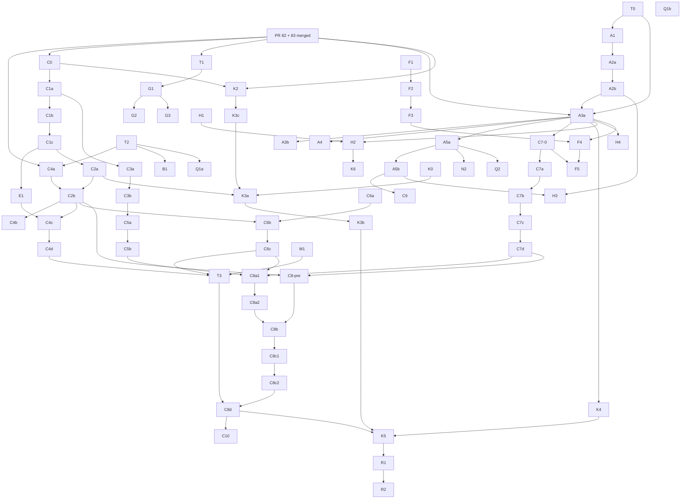

# Poly pipeline convergence plan, v2

Status: revision 2 of the plan, merged to master with PR 84. Scot signed off on 2026-10-03 and wave 0 was released; later waves still start only on Scot's word. Done so far: T0 (`bde1f7c5`), A1 (`8e5ef81b`), A2a (`08eda8eb`), A2b (`16403b60`), T2 (`afa246c2`). In review, not merged: K1 (PR 90), C4a (PR 91). The five reviews were read and folded in. It answers the same question as v1: for each place the code differs from the agreed pipeline (stage map section 7), how do we bring the code in line in small steps you could review and edit by hand?

Base: builds on the PR 84 plan with decisions 1 to 20 and the 2026-10-02 rulings. Companion file: `docs/domain-modeling/pipeline-convergence-plan.decisions.md` (V1 to V11 answered 2026-10-03; V10 as a revised scope).

Method for this revision: the five reviews were read, the headline experiment (the Analyze gate patch, full suite) was re-run, and the other disputed claims were checked against master `9db8868f` with `git grep` in a throwaway clone. Hand-written code is truth; docs are ideation. Where a claim could not be checked, that is stated and the reviewer's probe is named.

## 0. How to read this

- **Slice** = one PR. Each carries: scope, files, a **Done when** condition, a **SHIP / NOT SHIP** check a reviewer can run, a hand-edit check, size (S under a day of mill time and readable in one sitting; M a few files and tests; L new design or many files), the lane (A catalog, B DEI retire), whether it **runs alone**, how many review passes it gets, and what it depends on.
- Every PR lists its exact test command (a `dotnet test` filter or TUnit tree filter, the named test classes) and any `git grep` probe with the expected output. Use `git grep`, not `rg`: `rg` hangs in these clones. Before editing, re-check every file and line claim on current master and report any that moved; the line numbers below are as of master `945a2164`; re-check at slice start.
- **Release rule:** no code slice or wave starts until Scot says so; a sign-off for one wave does not release another.
- Foreman is the coordinating agent; Final Boss is the verifying reviewer.
- **Hand-edit gate (applies to every code slice).** Beyond the yes/no line, a reviewer runs three probes: (1) no new unreachable branch or unused member in touched files with warnings on; (2) `git grep` for every name the PR removed or renamed, in code, comments and docs, returns nothing; (3) no "fallback", "legacy" or "interim" branch is added without a named removal slice. Tangled code is moved behind a clearer abstraction before it is deleted.
- **Review depth.** Review 1 = the verifying reviewer alone (small, deletion-only or mechanical). Review 2 = the exhaustive first review, then a verification review. In both cases the reviewer runs on the opposite mill from the implementer. See section 13.
- Slice ids are labels. New in v2: T (test and measurement foundations), B (bug triage), E, M, N4, P, Q (work that reviews showed had no owner). Divergence numbers D1 to D10 still match stage map section 7. Decisions 1 to 20 are the numbered list in section 19. **V1 to V11** are in the decisions file; V1 to V11 answered 2026-10-03 (V10 as a revised scope).
- Slices that were conditional on an open decision in v1 are unconditional in v2 wherever you already ruled (decisions 8, 10, 11, 12, 14, 17).

## 1. Rules every slice is held to, and the test that proves each

| Your rule | Proving test or probe | Slice that builds it |
|---|---|---|
| Simulate equals print | `ParityScenario` (one scenario, interpreter vs Roslyn-compiled printed C#, compare values, stage, success/failure, message, exception type). Each C-slice adds a failing-first row. A green suite is not evidence. | T2; used by every C, Q, K4, E1, F4/F5 slice |
| Every mutation enforces every invariant | Mutation-by-invariant matrix over sample domains, both modes; every empty cell is a listed gap with a slice id | T3 (with C2b, C4a to C4d, C6b, C6c) |
| Only named actions mutate their own entity (create, link, unlink are the one exception; the relationship owns them). V4 = a: entry, exit and `when` count as named actions; recommended style is to invoke an action from those blocks rather than assigning own state directly | Analyze Error for a mutation whose target is not the owner; negative and positive tests | M1 (rule stated in stage map 2.4 by K1) |
| Interpreter keeps only session-aware storage after DEI retires | Structural test: storage type references nothing from the ontology or `Domain`, holds no link table, uniqueness registry or notify code, and the link/unique/cardinality/notify tests pass with storage swapped for a plain per-session dictionary store | the storage structure test (inside C8a1) |
| No auto-link guessing | `TryAutoLinkUnambiguousOutbound` gone (`git grep`), printed by-name create no longer auto-links, an unlinked navigation stays unlinked, guide edited | C6a |
| Artifact ids are name path plus type | `ArtifactId` tests; ids survive recompilation; catalog text identical across fresh sessions | A1, A2a, T0 |
| Hand-editability | The three-probe gate above, plus scripted commands for mechanical diffs | every slice |
| Opposite-mill review | Lane rules in section 13 | process |
| Code is truth | Every "Wrong today" claim below was checked or is flagged | this document |

## 2. What the code check changed

These are the claims the reviews disputed, with the result of the code check. "Verified" = checked in the code or re-run; "reviewer's probe" = the reviewer's scratch test, which was not re-run here.

| Claim in v1 | Verdict | Evidence |
|---|---|---|
| The Analyze gate (G1) "breaks nothing" | **False.** 110 of 2895 tests fail (measured on master `9db8868f`, 2026-10-03; the count has since grown with PRs 82/83) | Verified by running: the gate patch (HasErrors check in `GetOrLower` and `ToSyntax(domain, AnalysisResult)`) was applied on a clone of master `9db8868f` and the full Poly.Tests project was run: total 2895, failed 110, succeeded 2785. Sorted by the gate message: 98 are "Property 'X' references unknown type 'Text/Number'" (the missing-primitives problem, 11 files, about 91 of them in `DomainEntityInstanceTests.cs`); 1 is a genuinely invalid hand-built domain ("CreateEntityInstance references unknown relationship"); 11 hit the `ToSyntax` gate or an assertion that expects a lowering-time exception message the gate now pre-empts (for example `Export_NestedPeerPathPrefix_Throws`), and those 11 were not root-caused individually. So T1 is a triage, not only a fixture. One review measured 110 and another measured 111, so the number is stable. Cause, verified in `DomainCatalogPass.ResolveTypeReference` (`DomainCatalogPass.cs:207-222`): hand-built domains declare no primitives, so the type lookup fails. |
| K4 / decision 8: action policies are never printed | **Mostly false.** DSL `require` on an action is printed; stage-scoped policies are not | Verified in code: `DomainToCSharpExporter.Actions.cs:238-257` emits the guard for every `action.Policies` entry; the exporter never reads `stage.Policies` (the only Lowering uses of `Policies` are `Actions.cs:128, 238` and `DomainToCSharpExporter.cs:379`), while the simulator enforces them (`DomainEntityInstance.cs:559`). `AddPolicyToStage` exists only in evolution and tests; the DSL cannot author or print stage policies. The printed-guard probe is a reviewer's probe. |
| A failed `apply_dsl` stores the error analysis | **False for `apply_dsl`, true for `McpSessionStore.Evolve`** | Verified: `apply_dsl` returns at the rollback branch before `McpSessionStore.Replace` (`DomainTools.cs:1310-1331`); `Evolve` stores `current with { LatestAnalysis = outcome.Analysis }` on failure (`McpSessionStore.cs:89-92`). |
| K3 can run before C2 | **False.** The text said K3 depends on C2 but the order put it first | Verified by reading the v1 wave list (items 7 and 8) against the K3 and graph entries. |
| K3 touches 3 sites | **13 branches** plus 61 `new LoweringContext(` sites | Verified: `git grep` on `Poly/DomainModeling/Lowering` finds 13 `analysis is null/not null` branches; 61 `new LoweringContext(` across product and tests. |
| C3 needs an exporter handler-signature change | **No.** The printed handler already takes the peer as a typed parameter | Verified: `DomainToCSharpExporter.cs:481-489`. The rewrite exists because the VM cannot pass a second argument: `DirectVmAbiEmitter.Statements.cs:424-430` returns `InstanceHandle` for parameter 0 when `ParamSlotOffset==0 && !HasInlineParameters && !IsCompiledFunctionBody`. |
| C4a deletes the create helpers cleanly | **No.** They have other callers | Verified: `ValidateCreateConstraints` and `FillCreateDefaults` are called from `DomainInstanceStore.cs:149-150, 174-175` and `HostAbi.cs:658, 729`. |
| "Checks when a property is set: none in simulation" | **Overstated.** Action `assign` is enforced; only `SetProperty` is unchecked | Verified: `SetProperty` (`DomainEntityInstance.cs:328`) has no product callers and 13 test callers. Action-assign enforcement is a reviewer's probe. |
| Equality constraint divergence is a DSL-visible live bug | **API-only** | Verified: no `new EqualityConstraint` in the parser; `DomainDslPrinter.cs:799` prints it as `""`. Simulate-accepts/print-rejects is a reviewer's probe. |
| Unknown stage/enum names are unchecked | **Three spots only** | A reviewer's probes; the silent no-op for unknown stage is verified (`HostAbi.cs:85-87`, bare `return`). |
| `Node.Id` is a random GUID | Time-ordered v7 GUID; conclusion (use a name path) stands | Verified: `Poly/Ast/NodeId.cs:23-24` `Guid.CreateVersion7`. |
| Instance delete needs trees | **No delete operation exists** | Verified: no `delete_instance`, `RemoveInstance` or similar in `Poly`, `Poly.Mcp`. Unlink is the only removal; delete semantics are decision V9. |
| Decision 9 / C8a contradict your storage-only ruling | **Yes, inside the document.** Decision 9's text already says storage-only wins, but section 1 (D2) and C8a still describe a generic link/uniqueness/notify host | Verified by reading PR 84 head. v2 rewrites C8 around storage only (C8a1/C8a2); the storage surface is V2 = a (minimal). |

## 3. Foundations: tests that make the rest checkable

Everything below says "simulate equals print" and "every mutation enforces every invariant". A green suite cannot detect a violation of either: it passed through every gap in the v1 gap table. These slices build the instruments first. T0 is a baseline commit so "byte-for-byte the same" is not argued by eye. T1 turns the gate precondition from a reading into a measurement. T2 is the shared parity helper. T3 is the cross-cutting matrix. The storage structure test (inside C8a1) lives there.

**Slices (in recommended order).**

**T0. Golden emit baseline and reproducibility**

_Lane A · Size S · Review 1 · Depends on: none_
- Scope: Check in text snapshots of everything compile produces for every sample domain: `Emit` files, the catalog text (placeholder shape for now), and the DslCompiler outputs (DbContext, Program.cs, demo.http) for the CRM sample. A test compiles twice in separate sessions and twice on one session and asserts equal text (a reviewer's probe: Emit is already byte-identical, so this pins what is true today).
- Files: New `Poly.Tests/DomainModeling/Compile/EmitGoldenTests.cs` plus a snapshot folder. No product file.
- Done when: Snapshots generated from unchanged master are committed; the reproducibility test is green.
- SHIP if `EmitGolden*` tests pass on master and the diff has no product file. NOT SHIP if any snapshot was edited by hand to make a test pass.
- Hand-edit: Yes: data plus one small test. Probe: `git diff --stat` shows only Poly.Tests.

**T2. Shared simulate-equals-print parity helper**

_Lane B · Size M · Review 2 · Depends on: none_
- Scope: One helper built on `ExportedCSharp.CompileAndLoad`: run the same scenario (create, invoke, link, transition) through the interpreter and through the Roslyn-compiled printed code, then compare property values, stage, success versus failure, failure message and exception type. Seed it with the existing agreeing case (`Patron_HasOverdueLoans_SimulateAndGeneratedCSharp_Agree` pattern). Add a check that printed C# compiles for every sample domain (see B1). Every later C-slice adds a failing-first row; a green suite alone cannot see these divergences.
- Files: `Poly.Tests/TestHelpers/ExportedCSharp.cs` (extend) or a sibling file; new `ParityTests`. `ExportedCSharp.cs` is untouched by PRs 82 and 83.
- Done when: `ParityScenario` exists with at least four passing rows (create fail, action fail, stage transition, policy) and a `PrintedCSharpCompiles` test over all sample domains; any failing domain is listed by name as a known gap owned by B1.
- SHIP if deliberately breaking one check turns a parity row red. NOT SHIP if the helper only compares that both sides compile, or only text.
- Hand-edit: Yes. Probe: helper under ~150 lines, no reflection tricks.

**T1. Valid-domain fixture (measured gate precondition)**

_Lane B · Size M · Review 2 · Depends on: PRs 82 and 83 merged, decision V3 (decisions file)_
- Scope: Hand-built domains (`DomainTestFactory`, `new Domain(..)`) declare no primitive types, so Analyze says "Property 'X' references unknown type 'Text'". Add one test fixture that declares the core primitives and move the 11 affected test files onto it (DomainEntityInstanceTests holds about 91 of the failures; also DomainToCSharpExporterTests, OracleToolTests, ClockLoweringTests, SubscriptionAnalysisTests, HostAbi and StoreBind tests). The MCP oracle's throwaway domain is G3's job. Of the 110 failures reproduced (measured on master `9db8868f`, 2026-10-03; the count has since grown with PRs 82/83), 98 are the missing-primitives case; the other 12 need a one-by-one decision (one hand-built domain has a genuinely invalid relationship; others assert a lowering-time exception message that the gate now pre-empts): fix the domain, or move the assertion to the gate message, and list each in the PR. V3 = a, so this is the fixture; option (b) would have replaced it with an Analyze change.
- Files: `Poly.Tests/TestHelpers/*` (new fixture), the 11 test files that fail under the gate probe.
- Done when: Temporarily add `if (analysis.HasErrors) throw new InvalidOperationException(...)` at the top of `RuntimeAnalysisCache.GetOrLower` (after the null checks) and of `DomainProgramProjection.ToSyntax(Domain, AnalysisResult)`; do not commit it. With that probe applied locally, the full suite shows 0 failures (master with the probe: 110 of 2895, measured on master `9db8868f`, 2026-10-03; the count has since grown with PRs 82/83). The PR pastes before and after counts.
- SHIP if the probe run is 0 failures and the normal run has the same pass count as master before and after, 0 new failures. NOT SHIP if any test was deleted or weakened, or the fixture silently adds types a real author would have to declare.
- Hand-edit: Mostly (find and replace onto one helper); the PR gives the command so it can be re-run cold. Probe: no test body changed beyond the construction line.

**B1. Printed C# that does not compile for a peer-tracking transition**

_Lane B · Size S · Review 1 · Depends on: T2, PRs 82 and 83 merged_
- Scope: A reviewer's probe (`Tr: Tracks: Paper; P: stage {when Tracks B {transition to Q}}`) produced printed C# that fails to compile ("'Tr' does not contain a definition for 'Notify'"). Not root-caused. Failing-first compile test, find the cause, fix it, or record it as not a bug with the reason.
- Files: Probably `Lowering/DomainToCSharpExporter.Notify.cs`; confirm at start.
- Done when: The failing-first test in `PrintedCSharpCompiles` passes after the fix, or a written note replaces the slice.
- SHIP if the exact probe domain compiles and runs the same in parity. NOT SHIP if the fix special-cases the probe.
- Hand-edit: Yes if the cause is local.

**T3. Mutation by invariant matrix**

_Lane B · Size M · Review 2 · Depends on: C4d, C6c, M1_
- Scope: Decision 11 (every mutation enforces every invariant) has no cross-cutting test. For each mutation kind (action assign, entry/exit effect, transition, create, create-in child, link, unlink, MCP tool) against each invariant kind (required, range, length, pattern, equality, unique, enum, cardinality), assert the outcome in both simulation and printed code. Every empty cell goes on the H4 known-gaps list with a slice id.
- Files: New `MutationInvariantMatrixTests` using T2.
- Done when: The matrix runs; no cell is silently untested.
- SHIP if each cell either passes or is listed. NOT SHIP if a cell is unlisted and unchecked.
- Hand-edit: Yes.

## 4. D3: Compile does not stop on Errors

**Wrong today (verified).** `DomainSession.Lower`, `RuntimeAnalysisCache.GetOrLower` and `DomainProgramProjection.ToSyntax` never look at `HasErrors`. `Interpreter.FailLoudOnAnalysisErrors` throws on the first Error at the VM level (`Interpreter.cs:76-81`), but the domain level does not. MCP `export_domain_to_csharp` only checks that an analysis exists. `McpSessionStore.Evolve` keeps a failed analysis next to the old domain; a failed `apply_dsl` stores nothing.

**Target.** Compile refuses an analysis with Errors, naming the first error, in the VM's style (`InvalidOperationException`). The catalog stays empty on refusal. Simulation refuses too (decision 7).

**What v1 got wrong.** It said the gate should break nothing. Run for real, it breaks 110 of 2895 tests (measured on master `9db8868f`, 2026-10-03; the count has since grown with PRs 82/83), because hand-built domains in tests and in the MCP oracle declare no primitive types. So the fixture (T1) comes first and the gate (G1) is "0 failures, measured". G2's follow-up is mandatory, and the G2 oracle test was vacuous. G3 needs the same primitives. K0 pulls a three-line fail-open fix forward.

**Slices (in recommended order).**

**K0. Null analysis no longer silently drops a create effect**

_Lane B · Size S · Review 1 · Depends on: PRs 82 and 83 merged_
- Scope: `LowerCreateInProbe` returns null when there is no analysis and the caller omits the effect (`EffectLoweringPass.cs:927-929, 1037-1038`). Make that branch throw now (about 3 lines) instead of waiting for K3.
- Files: `Lowering/EffectLoweringPass.cs`.
- Done when: Failing-first test: a context without analysis and a `create` effect throws; suite stays green.
- SHIP if the new test passes and no existing test needed a change. NOT SHIP if a test now passes an analysis only to dodge the throw.
- Hand-edit: Yes.

**G1. Compile refuses an analysis with Errors**

_Lane A · Size M · Review 2 · Depends on: T1, PRs 82 and 83 merged_
- Scope: Throw `InvalidOperationException` with the first error when the analysis has Errors, in `DomainSession.Lower`, `RuntimeAnalysisCache.GetOrLower` and `DomainProgramProjection.ToSyntax(domain, AnalysisResult)` (the public AnalysisResult wrapper). `GetOrLower` at `RuntimeAnalysisCache.cs:109` calls the internal 4-argument `ToSyntax` overload; the 2-argument `ToSyntax(domain, INodeMetadataProvider)` is the public wrapper and has no HasErrors; every caller of that wrapper reaches it through a checked path and a test says so. The catalog stays empty on refusal. Fix the stale comment on `IArtifactContributor`.
- Files: `Lowering/DomainProgramProjection.cs`, `Analysis/RuntimeAnalysisCache.cs`, `Compile/DomainSession.cs`, `Compile/IArtifactContributor.cs` (comment).
- Done when: Full suite green with 0 failures (T1 makes this a measured fact, not a reading). New tests: Lower on an Error analysis throws and the catalog is empty; ToSyntax throws; `DomainEntityInstance.Create` and MCP `create_instance` refuse a domain with Errors (decision 7). The last two are named in K5 and C8d as must-still-pass.
- SHIP if the new tests pass and the suite count is unchanged. NOT SHIP if any existing test was edited to avoid the gate.
- Hand-edit: Yes, about 15 lines in three places. Probe: no new fallback branch.

**G2. MCP export refuses error analyses; failed edits stop storing the error analysis**

_Lane A · Size S · Review 1 · Depends on: G1_
- Scope: `export_domain_to_csharp` returns the errors instead of emitting. The follow-up in the old plan was optional; it is mandatory: `McpSessionStore.Evolve` stores the failed analysis next to the old domain (`McpSessionStore.cs:89-92`), so the new gate would refuse a valid old domain after a failed edit. Check the readers of `LatestAnalysis` first (for example `get_domain_analysis`) and keep any message they need. A failed `apply_dsl` stores nothing (it returns before `Replace`, `DomainTools.cs:1331`); only the `Evolve` path is affected. Replace the vacuous test `ExportDomainToCSharp_WithPeerAnalysisError_FailsClosed` (its DSL is rejected by `apply_dsl`, so it never reaches export).
- Files: `Poly.Mcp/Tools/OracleTool.cs`, `Poly.Mcp/Sessions/McpSessionStore.cs`, `SurfaceExtensionDogfoodTests.cs`.
- Done when: Test 1: drive `McpSessionStore.Evolve` to an error analysis, then export refuses. Test 2: a failed edit leaves export of the old domain working.
- SHIP if both tests pass and the old vacuous test is gone or fixed. NOT SHIP if export can still pair an error analysis with a domain.
- Hand-edit: Yes.

**G3. `oracle_expression` analyzes first**

_Lane A · Size S · Review 1 · Depends on: G1, T1_
- Scope: The throwaway domain at `OracleTool.cs:399-412` uses `Property(k,"Text")` with no primitive declared, which is exactly the G1 failure. Declare the primitives it uses (same shape as the T1 fixture), run Analyze, return diagnostics.
- Files: `Poly.Mcp/Tools/OracleTool.cs`.
- Done when: MCP test: a valid expression evaluates; an invalid one returns diagnostics, not an exception.
- SHIP if `OracleToolTests` pass and the error case is a normal response. NOT SHIP if every call reports unknown type 'Text'.
- Hand-edit: Yes.

## 5. D1 and D6: artifact suite and catalog

**Wrong today.** An artifact was three strings (`ArtifactDescriptor(Kind, Name, Source)`); `Lower` overwrites the catalog with one placeholder entry; contributors return `(fileName, text)` pairs; the compiled trees are one list split by entity name in `Emit`. Since A1, A2a and A2b (master `16403b60`) `ArtifactId`, `Artifact` and `ArtifactCatalog` exist, with declared types, typed references and a dangling check, but `Lower` still registers only the placeholder and the rest of this paragraph still holds.

**Target.** An artifact has a type, a stable id, a producer, a payload and typed references. A catalog holds them and checks them. Every output (trees, printed C#, DbContext, Program.cs, demo.http, the analysis report) is registered through it.

**Rules added in v2, from a review.**
1. *Ids* are name path plus type (decision 1). The id names a method; same-named stage actions are one method that dispatches on stage today, so one artifact. A rename produces a new id, because ids are derived, not stored (V6 = a).
2. *Allowed edges:* each artifact type declares which types it may reference; the producer that defines the type owns that declaration (A2b). Otherwise a library-added type cannot be dangling-checked.
3. *Ownership:* the catalog is a value rebuilt whole by every compile. Nothing edits or deletes an artifact; a changed domain yields a new catalog (A2a, tested as "no public remove or replace").
4. *Trace back:* each tree points to the domain element it came from (A3b), so a debugger step can be traced. Node-level positions do not exist and are not in scope.
5. *Unlink and delete:* unlink gets a tree (C6c). No delete operation exists today; delete semantics are decision V9.

**Slices (in recommended order).**

**A1. Artifact id**

_Lane A · Size S · Review 1 · Depends on: T0_
- Scope: A tiny `ArtifactId` type: written name path plus type (for example `Hotel/Reservation/Confirm#method`), parse, format, equality. The id names the method, not a stage body: one method dispatches on current stage (exporter comment, `DomainToCSharpExporter.cs:371-374`), so same-named stage actions are one artifact. No wiring.
- Files: New file under `Poly/DomainModeling/Compile/`.
- Done when: Unit tests for format, parse, equality and rejection of malformed ids.
- SHIP if the type is referenced only by its tests (`git grep ArtifactId` outside the new files is empty). NOT SHIP if it is wired into Lower or Emit.
- Hand-edit: Yes, one small file.

**A2a. Real catalog**

_Lane A · Size S · Review 1 · Depends on: A1_
- Scope: `Artifact` (descriptor plus payload) and a catalog class: register (duplicate id throws), look up by id, list, stable `ToText()`. The catalog is a value rebuilt whole by each compile; it has no public remove or replace (explicit rule, tested). `DomainSession.ArtifactCatalog` becomes this type. The old `SyntaxModule` placeholder stays for now and is removed in A3a.
- Files: `Compile/ArtifactDescriptor.cs`, new `Compile/Artifact.cs` and `Compile/ArtifactCatalog.cs`, `Compile/DomainSession.cs`, new `ArtifactCatalogTests.cs`, and the two existing test files that read the catalog: `SliceCProducerLoopCatalogTests.cs` and `EmitGoldenTests.cs` (its catalog text line). Done as PR 88.
- Done when: Catalog unit tests (duplicate, lookup, stable text); a surface test that the public API has no remove or replace; T0 golden unchanged.
- SHIP if T0 golden is unchanged. NOT SHIP if any golden snapshot changed.
- Hand-edit: Yes.

**A2b. Typed references and allowed edges**

_Lane A · Size S · Review 1 · Depends on: A2a_
- Scope: An artifact lists references as id plus expected type. Each artifact type declares which types it may point at; the producer that defines the type owns that declaration. Registering a type without one is refused, so a library-added type can be dangling-checked. `FindDanglingOrWrongType()`.
- Files: `Compile/ArtifactDescriptor.cs`, `Compile/ArtifactCatalog.cs` (the problem record and enum live there), `Compile/DomainSession.cs` (`Lower` declares the placeholder type), `Compile/ArtifactId.cs` (one name check made internal), `ArtifactCatalogTests.cs`, and one line in `SliceCProducerLoopCatalogTests.cs`. Done as PR 89.
- Done when: Tests: dangling, wrong type, edge not allowed, undeclared type refused.
- SHIP if each failure kind has its own test. NOT SHIP if an unknown type is accepted silently.
- Hand-edit: Yes.

**A3a. Lower registers its trees as artifacts**

_Lane A · Size M · Review 2 · Depends on: A2b, T0, PRs 82 and 83 merged_
- Scope: Lower registers one scaffolding tree (today's `Poly.Types.cs` content) and one tree per entity with its stage enum, each with an id. `Emit` reads them from the catalog. Remove the `SyntaxModule` placeholder. Artifact analysis (H2) runs over the catalog's whole module, not per artifact, because `Emit` resolves cross-entity types from one analysis (`TryAnalyzeForEmit`, `DomainSession.cs:203-208`). Granularity per decision 3: one tree per entity. Stage map 2.5, Definition of done ("a tree per concept in the right place") is NOT met until A6.
- Files: `Compile/DomainSession.cs` (Lower, Emit), `Lowering/DomainProgramProjection.cs` only if the split moves.
- Done when: T0 golden identical for all sample domains; catalog text snapshot added; `git grep SyntaxModule` in product code is empty.
- SHIP if golden is byte-identical and the grep is empty. NOT SHIP if any snapshot changed or the placeholder remains.
- Hand-edit: Yes. Probe: no "legacy" or "fallback" branch added.

**A3b. Each tree points back to its source element**

_Lane A · Size S · Review 1 · Depends on: A3a_
- Scope: Add a reference type from a tree artifact to the domain element it came from (id path), so a debugger step can be traced (principle 0.1). Entity granularity only: tree nodes carry no source positions today and this slice does not add them.
- Files: Catalog and `DomainSession.cs`.
- Done when: Test: every tree artifact for the sample domains has a source reference that resolves to an element that exists in the `Domain`.
- SHIP if removing an entity from the domain makes the dangling check report its tree. NOT SHIP if the reference is a free string.
- Hand-edit: Yes.

**A4. Analysis report as an artifact**

_Lane A · Size S · Review 1 · Depends on: A3a_
- Scope: First a test over every diagnostic produced by the analyzer test fixtures asserting it carries a domain element, with exceptions listed by diagnostic code in the test. Any gap becomes a small Analyze fix (own PR if larger than a few lines). Then register an `AnalysisReport` artifact; each finding carries the element's id path.
- Files: `Compile/DomainSession.cs`, a small report payload type; the gap-check test.
- Done when: The gap-check test exists with its exception list; a domain with warnings produces a report artifact listing them.
- SHIP if the exception list is explicit and short. NOT SHIP if the check silently skips diagnostics without an element.
- Hand-edit: Yes.

**A5a. Contributors return artifacts**

_Lane A · Size M · Review 2 · Depends on: A3a_
- Scope: `IArtifactContributor.Contribute` returns artifacts instead of `(fileName, text)` tuples (4 implementers: DbContext, Minimal API, two in tests). `DslCompiler` writes files from the catalog. Replace the source-text test (`SliceCProducerLoopCatalogTests.cs:75-90` reads `DslCompiler.cs` as text and greps it) with a behavioral one: compile a sample domain, assert the `demo.http` and DbContext artifacts come from registered contributors. Then N2 needs no test edit.
- Files: `Compile/IArtifactContributor.cs`, `DbContextArtifactContributor.cs`, `MinimalApiGenerator.cs` (contributor class), `DslCompiler.cs`, `DomainSession.cs`; tests `SliceCProducerLoopCatalogTests.cs`, `DslCompilerArtifactContributorTests.cs`.
- Done when: T0 golden (including DslCompiler outputs) identical; the behavioral catalog test replaces the grep test.
- SHIP if golden is identical and no test reads product source as text. NOT SHIP otherwise.
- Hand-edit: Yes. Public interface change, so the PR lists all four implementers.

**A5b. Emit files and generator trees registered with references**

_Lane A · Size M · Review 2 · Depends on: A5a_
- Scope: `Emit` registers each per-entity `.cs` with a reference to its tree. The generators build a tree and print it immediately (`MinimalApiGenerator.cs:148-149`, `DbContextArtifactContributor.cs:28`); register those trees as Tree artifacts too. A declared list names the artifact types allowed to have no tree reference (`demo.http` only). The reference is checked by type, not just that some id resolves.
- Files: `DomainSession.cs`, `MinimalApiGenerator.cs`, `DbContextArtifactContributor.cs`.
- Done when: Every printed file artifact has a reference of the right type; the allowed-no-tree list is a test constant; golden identical.
- SHIP if a deliberately wrong-type reference fails the dangling check. NOT SHIP if text files can ship with no tree behind them and are unlisted.
- Hand-edit: Yes.

**C9. Generators stop asking for the module**

_Lane A · Size S · Review 1 · Depends on: A5b_
- Scope: The Minimal API contributor calls `GetOrLower` and checks action names against the module (`RequireHttpActionsInModule`). Hand it the tree artifacts from the catalog. Generators reading Domain plus analysis is fine (decision 5).
- Files: `MinimalApiGenerator.cs`, `Compile/IArtifactContributor.cs`.
- Done when: `MinimalApiGeneratorTests` output unchanged; `git grep GetOrLower -- src` is empty.
- SHIP if golden unchanged and the grep is empty. NOT SHIP if a new cache read appears.
- Hand-edit: Yes.

**N2. Http library registers its own contributor**

_Lane A · Size S · Review 1 · Depends on: A5a, decision 19 (still open)_
- Scope: Do the Http one now: `HttpLibrary` (same assembly as the Minimal API contributor) registers it. DbContext only once the database kind is read from loaded libraries (decision 19, still open).
- Files: `src/Poly.DslCompiler/HttpLibrary.cs`, `DslCompiler.cs`.
- Done when: The behavioral catalog test from A5a passes without edit.
- SHIP if the A5a test needed no change. NOT SHIP if it needed a string edit.
- Hand-edit: Yes.

**A6. Finer trees (deferred)**

_Lane A · Size L · Review 2 · Depends on: A3a, H4_
- Scope: One artifact per action, policy, subscription handler, entry/exit body. Scheduled only when a consumer needs it; closes the gap against the stage map 2.5 Definition of done and lets H4 check at concept granularity.
- Files: Decided when scheduled.
- Done when: H4 known-gaps entries of the kind 'inside entity tree only' reach zero; scheduled only when a consumer needs it and Scot approves the wave.
- Hand-edit: Decided when scheduled.

**A7. Other artifact types: tests, docs, spec exports (deferred)**

_Lane A · Size M · Review 1 · Depends on: A5b_
- Scope: Added one at a time, when something consumes it.
- Files: Decided when scheduled.
- Done when: Each type ships with its consumer and a reference check.
- Not schedulable without a named consumer.
- Hand-edit: Decided when scheduled.

## 6. Analysis hardening and work the reviews found without an owner

These slices have no home in v1's divergence list. N4, C4e and M1 close Analyze gaps that cause real simulate-differs-from-print behavior; P1 (V8 = a) makes the equality constraint authorable; Q-slices come from the 09-27 reviews (see section 7 for Q1a and Q1b; Q2 is here because it is a harness/library composition fix).

**Slices (in recommended order).**

**C4e. Analyze catches three unknown-name cases**

_Lane A · Size S · Review 1 · Depends on: none_
- Scope: Analyze already rejects unknown stage and enum names in most places; three spots still pass with 0 errors (a reviewer's probes): (a) `when Tracks B { transition to Nope }` (simulate silently stays, print silently drops it), (b) `Level: Sev default(Nope)` (simulate creates "Nope", print throws at export), (c) `if (Level is Nope)` (both fail at run time). Three Analyze rules, one failing-first test each.
- Files: Analysis passes for subscriptions, defaults and stage comparisons.
- Done when: Three tests, each an Error with a code, before any runtime change.
- SHIP if each probe domain is rejected by Analyze and valid neighbours still pass. NOT SHIP if only some of the three are covered.
- Hand-edit: Yes.

**N4. Reserved generated names are an Analyze error**

_Lane A · Size S · Review 1 · Depends on: none_
- Scope: `Emit` splits files by type name, so a user type named like a generated stage enum collides (a reviewer's probe: `OrderStage: enum` plus entity `Order` with stages gives 0 Analyze errors and CS0101 when compiled). Add an Analyze error for names the generator reserves, plus a catalog-level unique-name test in A2a.
- Files: `Analysis/DomainCatalogPass.cs` or the nearest naming pass.
- Done when: Failing-first test using the probe domain gives an Error with a code.
- SHIP if the probe domain is rejected by Analyze. NOT SHIP if only Emit throws.
- Hand-edit: Yes.

**M1. Only the owning entity's named behavior mutates its state (Analyze rule)**

_Lane A · Size M · Review 2 · Depends on: decision V4 (decisions file)_
- Scope: Analyze Error for any mutation whose target is not the owning entity. First check whether an existing check (DMEFF001) already rejects `AssignEffect.Target` pointing at another entity (the parser already rejects cross-entity `assign`, but the effect target is any expression). Entry/exit blocks and `when` handlers assign their own entity's state today and Analyze accepts it; V4 = a, they count as named actions. Recommended authoring style: write state changes as named actions; use entry, exit and when blocks to invoke an action rather than assigning own state directly. Allowed (V4 a), not required; a stricter rule may come later as its own slice. Tests: negative (cross-entity assign), positive (create-in, link, unlink, cross-entity `invoke Rel.Action` still pass). The rule is stated in stage map section 2.4 (K1).
- Files: `Analysis/EffectAnalyzer.cs` / `EffectInvariantAnalyzer.cs` or a new small pass.
- Done when: Negative and positive tests as listed, plus the V4 outcome tested.
- SHIP if a cross-entity mutation is an Error with a code and every positive case passes. NOT SHIP if the rule only exists in the parser.
- Hand-edit: Yes.

**P1. (V8 = a) Equality constraint is authorable and printed**

_Lane A · Size S · Review 1 · Depends on: decision V8 (decisions file)_
- Scope: The parser never constructs `EqualityConstraint` and `DomainDslPrinter.cs:799` prints it as an empty string, so an API-built equality constraint is dropped in the DSL round trip. V8 = a: add syntax, parser and printer with a round-trip test.
- Files: `Language/PolyDslParser.cs`, `DslGrammar.cs`, `DomainDslPrinter.cs`.
- Done when: Parse and print round trip keeps the constraint.
- SHIP if the round trip is lossless. NOT SHIP if the printer still prints "" for it.
- Hand-edit: Yes.

**Q2. MCP harness opens domains that use sqlite or http**

_Lane A · Size M · Review 2 · Depends on: A5a_
- Scope: From the 09-27 reviews; no slice owned it. `apply_dsl` calls `DomainSession.ForSource(polyText, seed)` with the default catalog, so a domain with `uses sqlite` or `uses http` fails with 'Unknown domain extension' (`DomainTools.cs:1273-1276`; `ExtensionCatalog.Resolve` throws at `ExtensionCatalog.cs:57-58`; `ExtensionCatalog.Core` is the in-assembly chain at `:29-32`). Give the harness the same catalog the compiler uses, as a library composition that ends at core. Open design point for the slice: where the shared catalog lives so `Poly.Mcp` does not depend on `src/Poly.DslCompiler` the wrong way; the PR starts with one paragraph on that.
- Files: `Poly.Mcp/Tools/DomainTools.cs`, `Compile/ExtensionCatalog.cs`.
- Done when: MCP test: apply a domain with `uses sqlite` and `uses http`, then analyze, simulate and export.
- SHIP if the sellable-shape domain opens in the harness. NOT SHIP if the harness keeps its own copy of the catalog list.
- Hand-edit: Partly.

## 7. D2, D5 and D8: consumers reach back; Domain is held live; pre-run rewrites

This is the DEI problem. DEI is retired with no replacement layer (your ruling). v2 reads that ruling literally: **the interpreter keeps only session-aware storage**. Everything the v1 plan put in a "generic host" (uniqueness, links, notify, cardinality, transitions, constraints) becomes trees, and storage is what those trees call. The v1 text that assumed a generic link/uniqueness/notify host is removed; C8a is rewritten as C8a1 (storage) and C8a2 (instance from a type definition). What the storage offers is V2 = a (minimal; lookup by property value only if a test domain makes the scan too slow).

**Compile gaps (corrected table).**

| Concept | Today | Tree status / slice |
|---|---|---|
| Create-time checks (required, range, length, pattern) | DEI re-implements in C# | `Create` factory tree has them; simulator does not run it. C2b |
| Equality constraint on create | DEI ignores it; printed C# enforces it | Tree exists. API-built domains only (DSL cannot author it). C4a interim, C2b final, P1 (V8 = a) |
| Defaults | DEI evaluates in C# | Tree exists. C2b |
| Unique on assign | Store plus a tree call | Done |
| Unique on create | Store scan only | No tree; printed factory skips it. C4b |
| Checks on set (range, length, pattern, required) | Action assign enforced (probe); public `SetProperty` unchecked | C4c |
| Enum value check | Gaps are `default(Nope)` and `Level is Nope` (Analyze) and set/create | C4e (Analyze), C4c (tree) |
| Legal stage transitions | `TransitionStage` silently no-ops on an unknown stage; no table | C4d (source of table: V5 = a) |
| Entry and exit effects | DEI walks the ontology, then runs the tree | Trees exist; C7 moves lookups |
| Policies on actions | Printed (`require` guard) | Done. Gap is only policies with no entity method |
| Policies on stages | Simulator enforces; exporter never reads `stage.Policies` | K4 |
| Subscription fan-out | Store matches links in C#; `when any` differs (>=1 vs exactly 1) | `Notify{Stage}Subscribers` trees exist. C5a, C5b |
| Collection rules (any/all/none/count) | Already lowered to foreach loops (PR 79). Residue: parity tests (Q1a) and the stale checked-in demo (Q1b) | Q1a, Q1b |
| Link cardinality | none | C6b |
| Unlink minimum | none | C6c |
| Create initializers | Lowered at run time when no store | C2a |
| Owned or aggregate rules | none at run time | Analysis only; ruling V9; listed in the H4 ratchet |

**Three kinds of reach-back, three fixes (unchanged).** (1) Lookups (21 `GetOrAnalyze` call sites, excluding the definition) move onto the catalog index (C7-0, C7a to C7d). (2) Doing domain work in C# (the gaps above) become trees. (3) Holding `Domain` goes away once the interpreter builds instances from a type definition (C8a2).

**D5. Pre-run rewrites.** On master `BindThis`, `RewriteVoidFailClosedThrow` and `BindExportBody` are gone (deleted in PR 82). `BindModuleMethodBody` still rewrites trees before they run; PR 82 left `BindForSimulate` and `AsVoidResultBody`. Old C1 was really three problems (C1a parameter slots in the interpreter, C1b the exception type, C1c the unbound adapter result shape). `MaterializePeerInSyntax` goes with C3. PR 82's `RuntimeEnumTypeProvider` goes with E1 (decision 17). C10 is the end check with a real mechanism.

**Slices (in recommended order).**

**C4a. Equality constraint on create, interim fix (live divergence)**

_Lane B · Size S · Review 1 · Depends on: T2, PRs 82 and 83 merged_
- Scope: The simulator's `ValidateConstraints` switch (`DomainEntityInstance.cs:179-215`) has no equality case; the printed factory enforces it (`DomainToCSharpExporter.Notify.cs:438`). Reachable only through API-built domains (the DSL cannot author it, see P1), but still a live simulate-differs-from-print bug. Interim: add the case and the parity row. C2b deletes this code, so it is a named twin with a removal slice.
- Files: `Runtime/DomainEntityInstance.cs`.
- Done when: The parity row fails on master and passes after.
- SHIP if the parity row is red before and green after. NOT SHIP if the fix is not tagged for removal in C2b.
- Hand-edit: Yes, a few lines.

**C0. Delete the dead DEI code**

_Lane B · Size S · Review 1 · Depends on: PRs 82 and 83 merged_
- Scope: Four helpers with no callers: `EvaluateParameterBindings`, `BindPeerInEffect` with `PeerBindingRewrite` and `EvaluateExprOnPeer`, `TryEvaluateRelationshipPresence`, `GetOutboundRelatedInstances`. Re-verified on master by two reviews.
- Files: `Runtime/DomainEntityInstance.cs`, `.HostAbi.cs`, `.Runtime.cs`.
- Done when: `git grep` for the names shows zero references before; build and suite unchanged after. Use `git grep`; `rg` hangs in these clones.
- SHIP if the diff is pure removal and suite counts are identical. NOT SHIP if any non-deleted line changed.
- Hand-edit: Yes, pure deletion.

**C1a. Interpreter: root program with declared parameters after `this`**

_Lane B · Size M · Review 2 · Depends on: PRs 82 and 83 merged, C0_
- Scope: First of three parts of old C1 (P3-D). The module body runs as the root program, so parameter 0 aliases `this` (`DirectVmAbiEmitter.Statements.cs:424-430`: returns `InstanceHandle` when `ParamSlotOffset==0 && !HasInlineParameters && !IsCompiledFunctionBody`; verified). PR 82 tried `SetArgs(this, previousStage)` and `when all` fired twice. An existing mode, `IsCompiledFunctionBody` (`Invoke.cs:481`), already treats parameters as real slots. Allow it for the root program. P3-C was barred from `Poly/Interpretation`; this slice is explicitly allowed to touch it. Removes the `BindForSimulate` arm for action parameters and `previousStage`.
- Files: `Poly/Interpretation/Vm/DirectVmAbiEmitter.Statements.cs`, `Invoke.cs`, `Runtime/DomainEntityInstance.*`.
- Done when: Parity rows for an action with parameters and for `when all` previousStage (fires once).
- SHIP if the `when all` row passes and `BindForSimulate` no longer rewrites parameter references. NOT SHIP if parameter 0 can still alias `this`.
- Hand-edit: Partly: small diff, the risk is VM semantics.

**C1b. Dedicated constraint-failure exception; delete `AsVoidResultBody`**

_Lane B · Size M · Review 2 · Depends on: C1a_
- Scope: Second part. Void `throw InvalidOperationException` is rewritten to `return Failure`, and `AsVoidResultBody` exists, only because host fail-loud throws are also `InvalidOperationException`. Printed trees throw a dedicated exception type for constraint failure; the host catches only that. Deletes the throw arm and `AsVoidResultBody`.
- Files: `Lowering/DomainToCSharpExporter*.cs`, `Runtime/DomainEntityInstance.*`.
- Done when: Parity rows: constraint failure gives the same Failure in both; host fail-loud errors still escape.
- SHIP if a host fail-loud throw is still not swallowed (test) and `git grep AsVoidResultBody` is empty. NOT SHIP if Execute catches `InvalidOperationException` broadly.
- Hand-edit: Partly.

**C1c. Unbound adapter result shape; last `BindForSimulate` arm**

_Lane B · Size S · Review 1 · Depends on: C1b, decision V7 (decisions file)_
- Scope: Third part. Simulate returns Failure for a contract endpoint with no in-process adapter (`DomainEntityInstance.cs:~949-953`); print throws `NotImplementedException`. Make both do what V7 = a says (same Failure value), then delete the last arm.
- Files: `Runtime/DomainEntityInstance.cs`, exporter adapter code.
- Done when: Parity row for an unbound endpoint; `git grep BindForSimulate` is empty.
- SHIP if the row passes and the grep is empty. NOT SHIP if simulate and print still differ.
- Hand-edit: Yes.

**E1. Domain enums become real enum type definitions; delete `RuntimeEnumTypeProvider`**

_Lane B · Size M · Review 2 · Depends on: C1c_
- Scope: PR 82 adds `RuntimeEnumTypeProvider`, which reads `Domain` (`:31, :40`): a run-time shim and a reach-back. Emit domain enums as enum type definitions in the module so the provider can go (decision 17: removed in the enum slice). Scheduled before C4c and C10.
- Files: `Lowering/*` (enum emission), `Runtime/RuntimeEnumTypeProvider.cs`.
- Done when: `git grep RuntimeEnumTypeProvider` is empty; enum comparison parity row.
- SHIP if the grep is empty. NOT SHIP if the provider stays 'for now' (decision 17 allows no exception here).
- Hand-edit: Partly.

**C2a. Create initializers without re-lowering**

_Lane B · Size M · Review 2 · Depends on: C0, C1c_
- Scope: Remove the two run-time lowerings (`PrevalidateCreateInitializers`, `CreateChildInstance` when no store is attached). A simulator without a store gets a default internal one, so the compiled `Create` trees always run (that default store is a named twin, removed in C8d).
- Files: `Runtime/DomainEntityInstance.HostAbi.cs`, maybe `DomainInstanceStore.cs`.
- Done when: `StoreBindCreate*`, `Item4FailBeforeMutate*` pass; new test: store-less create with an initializer.
- SHIP if no `DomainExpressionLoweringPass` is constructed under `Runtime/` for creates. NOT SHIP if the default store is public API.
- Hand-edit: Yes.

**C2b. Run the compiled Create checks; delete the C# twins**

_Lane B · Size M · Review 2 · Depends on: C2a, C4a_
- Scope: The simulator runs the `Create` factory tree for required, range, length, pattern, equality and defaults. Delete `ValidateCreateConstraints` and `FillCreateDefaults` and their callers, which the old plan did not list: store child-create paths (`DomainInstanceStore.cs:149-150, 174-175`) and `HostAbi.cs:658, 729` (verified). Delete C4a's interim case. Combines the old C4a deletion step with C2 on a reviewer's advice because both rewrite the same create path.
- Files: `Runtime/DomainEntityInstance.cs`, `.HostAbi.cs`, `DomainInstanceStore.cs`.
- Done when: `git grep` for both helper names is empty; parity rows for each check kind.
- SHIP if greps are empty and all parity rows pass. NOT SHIP if any check kind is covered only by suite-green.
- Hand-edit: Partly: several call sites; the PR lists them.

**C4b. Unique on create in the factory tree**

_Lane B · Size S · Review 1 · Depends on: C2b_
- Scope: Add the `EnsureUnique` call to the printed factory (as assign already does). Today the printed factory skips it (`DomainToCSharpExporter.Notify.cs:448-450`) and the simulator scans the store. Printed output changes (called out in the PR).
- Files: `Lowering/DomainToCSharpExporter.Notify.cs`.
- Done when: Parity row: a duplicate create fails identically.
- SHIP if the row is red on master. NOT SHIP if the printed change is not called out.
- Hand-edit: Yes.

**C4c. Constraints on set; enum value check**

_Lane B · Size M · Review 2 · Depends on: C2b, E1_
- Scope: Narrowed by a reviewer's probe: an action `assign` already enforces range in the trees. The only unchecked set is the public `DomainEntityInstance.SetProperty` (`DomainEntityInstance.cs:328`, unique only), with 0 product callers and 13 test callers (verified). Route it through the compiled check tree, or make it internal or delete it. Add the enum value check as a tree for create and set. Decision 11 is unconditional.
- Files: `Runtime/DomainEntityInstance.cs`, exporter check trees, tests that call `SetProperty`.
- Done when: Parity rows for range, length, pattern, required, enum on set; soundness test: whenever `EffectInvariantAnalyzer` (DMEFF008) accepts an assignment the runtime set check never trips.
- SHIP if `SetProperty` cannot bypass a check. NOT SHIP if the soundness test is missing.
- Hand-edit: Partly.

**C4d. Stage transition table as a tree**

_Lane B · Size M · Review 2 · Depends on: C4c, decision V5 (decisions file)_
- Scope: Decision 12 is unconditional: transition tables compile as trees. The table's source is V5 = a (derive from transition effects; the DSL has no transition declarations). Replace the silent bare `return` in `TransitionStage` (`HostAbi.cs:85-87`, verified) with a failure. Unknown stage names are already Analyze errors (C4e covers the last three spots).
- Files: `Runtime/DomainEntityInstance.HostAbi.cs`, exporter.
- Done when: Parity rows: a legal transition succeeds; an illegal one fails identically in both.
- SHIP if no silent no-op remains for an unknown or illegal stage. NOT SHIP if the table has no stated source.
- Hand-edit: Partly.

**Q1a. Parity rows for collection rules (any/all/none/filtered count)**

_Lane B · Size S · Review 1 · Depends on: T2_
- Scope: Quantifier lowering already landed in PR 79: `DomainExpressionLoweringPass` lowers filtered quantifiers (any/all/none/filtered count) to foreach loops (class remarks at lines 27-31; `LowerFilteredQuantifier` at ~475-481), and `git grep AnyRelated|AllRelated|CountRelated` is empty in Poly, Poly.Mcp and Poly.Tests. Add `ParityScenario` rows (T2) for any, all, none and filtered count so the guarantee is tested in both simulate and print, plus the H4 check that no tree holds a `Constant` of an authoring `DomainExpression`. Existing tests `Export_HasOverdueLoans_PrintsForeachOverLoans` and `Patron_HasOverdueLoans_SimulateAndGeneratedCSharp_Agree` (`DomainToCSharpExporterTests.cs` ~3034, ~3045) cover one any-quantifier case.
- Files: Poly.Tests only.
- Done when: Parity rows for any, all, none and filtered count pass in both simulate and print; the H4 Constant check is present.
- SHIP if the rows pass in both modes. NOT SHIP if any row is skipped.
- Hand-edit: Yes.

**Q1b. Regenerate demo/Poly.RestApi and test the checked-in demo equals fresh output**

_Lane B · Size S · Review 1 · Depends on: none_
- Scope: The printer already fails the whole export for an unlowerable policy (no per-policy stub; `DomainToCSharpExporter.cs` ~378). The only throwing `HasOverdueLoans` is the stale checked-in `demo/Poly.RestApi/Patron.cs:112`; nothing under `Poly/` produces that message. No test compares the checked-in demo to fresh output. Regenerate `demo/Poly.RestApi` with the current exporter and add a test that exports the same domain and compares to the checked-in files. There is no `.poly` next to the demo; the Library domain (same five entities as the demo) is the `LibraryCheckoutDsl` constant in `Poly.Tests/DomainModeling/Lowering/DomainToCSharpExporterTests.cs` (the Library domain those exporter tests already parse for `HasOverdueLoans`). The slice decides how that constant is shared with the comparison test.
- Files: `demo/Poly.RestApi/*` and one test.
- Done when: `git grep` for the throw message is empty under `demo/`; the comparison test passes; `POST /reinstate` in `demo.http` works if it runs in this environment (otherwise the PR says it was not checked).
- SHIP if the throw is gone and the comparison test passes. NOT SHIP if the demo was edited by hand to match.
- Hand-edit: Yes.

**C3a. Peer passed as a real argument**

_Lane B · Size M · Review 2 · Depends on: C1a_
- Scope: The printed handler already takes the peer as a typed parameter (`DomainToCSharpExporter.cs:481-489`, verified); the old plan's pointer to `Notify.cs` was wrong. `MaterializePeerInSyntax` exists only because the VM could not pass a second argument (fixed by C1a). Call handlers with `SetArgs(this, previous, peer)`.
- Files: `Runtime/DomainEntityInstance.HostAbi.cs`.
- Done when: P4Subscription, SubscriptionAnalysis and multi-hop tests pass; parity row for a peer handler.
- SHIP if `MaterializePeerInSyntax` has no callers. NOT SHIP if the exporter signature changed.
- Hand-edit: Partly.

**C3b. Delete `MaterializePeerInSyntax`**

_Lane B · Size S · Review 1 · Depends on: C3a_
- Scope: About 130 lines (`HostAbi.cs:294-423`), plus its twin tree-walker.
- Files: `Runtime/DomainEntityInstance.HostAbi.cs`.
- Done when: `git grep MaterializePeerInSyntax` is empty; suite unchanged.
- SHIP if pure deletion. NOT SHIP if behavior code moved.
- Hand-edit: Yes.

**C5a. Store calls the compiled Notify trees**

_Lane B · Size M · Review 2 · Depends on: C3b_
- Scope: `DomainInstanceStore.NotifyTransition` calls the compiled `Notify{Stage}Subscribers` trees instead of matching links itself. First row: the known `when any` mismatch (simulate fires when at least one linked target matches; print only when exactly one does).
- Files: `Runtime/DomainInstanceStore.cs`, HostAbi.
- Done when: Parity rows for `when any`, `when all`, single hop.
- SHIP if the `when any` row is red on master and green after. NOT SHIP if print and simulate still differ on any or all.
- Hand-edit: Partly.

**C5b. Multi-hop, depth and fan-out leave the store**

_Lane B · Size M · Review 2 · Depends on: C5a_
- Scope: Delete the store's link matching and the silent depth limit of 10 for cascades (it becomes modeled behavior or an Error). The store keeps no subscription logic (decision 9).
- Files: `Runtime/DomainInstanceStore.cs`.
- Done when: Multi-hop parity rows; the storage structure test (inside C8a1) will find no subscription code.
- SHIP if `NotifyTransition` contains no link matching. NOT SHIP if a cascade can stop silently.
- Hand-edit: Partly.

**C6a. Remove auto-link; linking is explicit**

_Lane B · Size M · Review 2 · Depends on: T2, PRs 82 and 83 merged_
- Scope: Decision 10 (no guessing) is unconditional. Delete `TryAutoLinkUnambiguousOutbound` (`DomainEntityInstance.HostAbi.cs:820`; callers `HostAbi.cs:782` and `DomainInstanceStore.cs:226`) and its printed C# twin in `DomainToCSharpExporter.StoreBind.cs:105-116` (`autoLink = outs.Count == 1`, `wireUnambiguousBackRef: autoLink`) and `BuildTargetCreateArgs` at `StoreBind.cs:237-243` (via `FindAutoWireBackReference`, `Actions.cs:846`). Edit `Poly.Mcp/Docs/poly-dsl-guide.md:73-75, 141`, which documents auto-link. Other callers of `FindAutoWireBackReference`: `Notify.cs:126` (explicit `create in Rel` names the relationship, so the link itself is explicit; the back-reference slot is picked by "exactly one singular navigation to the source", the same pattern as the guessed outbound) and `StoreBind.cs:277` (by-name create args). `TryLinkCreateInBackReference` (`HostAbi.cs` ~833) is the runtime twin of that back-ref wiring and is also used after explicit create-in. C6a leaves that wiring in place and pins it with a parity row. Whether decision 10 covers the slot choice is for Scot when C6a starts (not a new numbered decision).
- Files: `Runtime/DomainEntityInstance.HostAbi.cs`, `Runtime/DomainInstanceStore.cs`, `Lowering/DomainToCSharpExporter.StoreBind.cs`, `Poly.Mcp/Docs/poly-dsl-guide.md`.
- Done when: `git grep -n TryAutoLinkUnambiguousOutbound` is empty; the `autoLink` / `wireUnambiguousBackRef` printing of by-name create is gone; a T2 parity row: bare `create Type` with one matching many-relationship is unlinked in both simulate and print. A second parity row pins explicit `create in Rel` back-ref wiring.
- SHIP if the greps hold, the guide no longer describes auto-link, and both parity rows pass. NOT SHIP if simulate and print disagree, or if `FindAutoWireBackReference` at Notify was deleted without Scot's word.
- Hand-edit: Partly: runtime and printer both change.

**C6b. Link cardinality as a tree**

_Lane B · Size M · Review 2 · Depends on: C6a, C2b_
- Scope: Cardinality has no tree today. The relationship owns link effects (decision 11): a compiled link check per relationship, enforced identically in simulation and print.
- Files: Exporter, lowering, `DomainInstanceStore.cs`.
- Done when: Parity row: a cardinality violation on link fails identically.
- SHIP if the row is red on master. NOT SHIP if only MCP `link_instances` enforces it.
- Hand-edit: Partly.

**C6c. Unlink cannot drop below a required minimum**

_Lane B · Size M · Review 2 · Depends on: C6b_
- Scope: There is no instance delete operation anywhere in product code (checked), so delete semantics are out of scope (V9). Unlink gets a tree that refuses to drop a link count below the modeled minimum.
- Files: Exporter, lowering.
- Done when: Parity rows for unlink at and below the minimum.
- SHIP if below-minimum unlink fails identically. NOT SHIP if unlink has no tree.
- Hand-edit: Partly.

**C7-0. Catalog index**

_Lane B · Size M · Review 2 · Depends on: A3a, C0_
- Scope: A small index over the catalog: method by name on a tree, tree by name, navigation by name.
- Files: `Compile/*`.
- Done when: Index unit tests; no consumer yet.
- SHIP if no consumer changed. NOT SHIP if the index duplicates cache logic.
- Hand-edit: Yes.

**C7a. Six 'get compiled module' sites use the catalog**

_Lane B · Size M · Review 2 · Depends on: C7-0_
- Scope: The 6 sites that feed `GetOrLower` hold the artifact list instead.
- Files: `Runtime/*`.
- Done when: `git grep -c GetOrAnalyze` drops by 6; suite unchanged; G1's simulator-refuses tests still pass.
- SHIP if the count drops by the stated number. NOT SHIP if a new cache read appears.
- Hand-edit: Yes.

**C7b. Three action-by-name lookups use the index**

_Lane B · Size S · Review 1 · Depends on: C7a_
- Scope: Stage-scoped fallthrough baked in at compile time.
- Files: `Runtime/*`.
- Done when: `GetOrAnalyze` count drops by 3.
- As C7a.
- Hand-edit: Yes.

**C7c. Entity and relationship lookups use index and navigation**

_Lane B · Size S · Review 1 · Depends on: C7b_
- Scope: The 4 entity and 3 relationship lookups (two of the relationship ones sit in methods nobody calls; C0 removes those first).
- Files: `Runtime/*`.
- Done when: `GetOrAnalyze` count drops by the group size.
- As C7a.
- Hand-edit: Yes.

**C7d. One-offs and `BehaviorMetadata`**

_Lane B · Size S · Review 1 · Depends on: C7c_
- Scope: Stage enum names, subscription fan-out, storage target, `BehaviorMetadata`.
- Files: `Runtime/*`.
- Done when: `git grep GetOrAnalyze -- Poly/DomainModeling/Runtime` is empty.
- As C7a.
- Hand-edit: Yes.

**C8-pre. Creation helper for tests (creation only)**

_Lane B · Size M · Review 1 · **RUNS ALONE** · Depends on: C2b, C7d_
- Scope: Replaces the old C-pre, demoted. One forwarding helper for `DomainEntityInstance.Create` (149 calls in `DomainEntityInstanceTests`, 37 test files), moved by a scripted find-and-replace whose command is in the PR so it can be re-run cold. `InvokeAction` and `GetProperty` stay on the instance; C8b keeps those names. It runs after the consumers are done, so it does not conflict with every open test lane, and it is paid for by C8b.
- Files: `Poly.Tests/TestHelpers/*`, mechanical edits in 37 test files.
- Done when: Suite identical counts; the PR states the exact replacement command and a re-run produces the same diff.
- SHIP if re-running the command reproduces the diff. NOT SHIP if any non-call-site line changed.
- Hand-edit: No: mechanical and large; reproducible script instead.

**C8a1. Session-aware storage (the only thing the interpreter keeps)**

_Lane B · Size M · Review 2 · Depends on: C5b, C6c, C7d, decision V2 (decisions file)_
- Scope: Rewritten against Scot's storage-only decision: the old plan's generic link, uniqueness and notify host is NOT built. A storage type holds instances and state per session, with the surface chosen in V2 = a (minimal). Link checks, uniqueness, constraints, transitions and notify are already trees by this point (C2b, C4b, C4d, C5, C6). The storage type references nothing from the ontology or `Domain`. Adds the storage structure test (inside C8a1).
- Files: New storage type under `Poly/Interpretation` or `Poly/DomainModeling/Runtime`; `DomainInstanceStore.cs` shrinks.
- Done when: the storage structure test (inside C8a1) passes: the storage type references no ontology or Domain type (namespace or project-reference test); `git grep` finds no link table, uniqueness registry or notify code in it; the link, unique, cardinality and notify parity tests still pass with storage swapped for a plain per-session dictionary store.
- SHIP if the storage structure test (inside C8a1) passes. NOT SHIP if storage contains any rule.
- Hand-edit: Yes if it stays small. Probe: under ~200 lines, no domain terms.

**C8a2. Dictionary-backed instance from a type definition**

_Lane B · Size M · Review 2 · Depends on: C8a1_
- Scope: Interpreter-side factory: `TypeDefinitionNode` in, dictionary-backed instance out. Pieces exist (`TypeDefinitionNodeAnalyzer`, `DictionaryBackedValue`, `InvokeNamed`). No DEI change yet.
- Files: `Poly/Interpretation/*`.
- Done when: Own unit tests; no `Domain` or `Entity` parameter anywhere in the new code.
- SHIP if the factory runs a compiled Create tree for a sample domain. NOT SHIP if it takes `Domain`.
- Hand-edit: Yes if small.

**C8b. Move `Create` and the test helper over**

_Lane B · Size M · Review 2 · Depends on: C8a2, C8-pre_
- Scope: Point the C8-pre helper and `Create` at the new factory.
- Files: Test helper, `Runtime/*`.
- Done when: The whole suite passes through the helper.
- SHIP if suite counts are unchanged. NOT SHIP if DEI is still the factory for any test.
- Hand-edit: Partly.

**C8c1. MCP read tools move over**

_Lane B · Size M · Review 2 · Depends on: C8b_
- Scope: `get_instance`, `list_instances`, `evaluate_policy`, `oracle_expression`.
- Files: `Poly.Mcp/Tools/*`.
- Done when: MCP smoke tests pass.
- SHIP if tool outputs are unchanged. NOT SHIP if any tool still builds a DEI.
- Hand-edit: Yes.

**C8c2. MCP mutating tools move over**

_Lane B · Size M · Review 2 · Depends on: C8c1_
- Scope: `create_instance`, `link_instances`, `unlink_instances`, `invoke_action`.
- Files: `Poly.Mcp/Tools/*`.
- Done when: MCP smoke tests plus G1's refuse-on-Errors test pass.
- As C8c1.
- Hand-edit: Yes.

**C8d. Delete DEI**

_Lane B · Size M · Review 2 · **RUNS ALONE** · Depends on: C8c2, T3_
- Scope: Delete `DomainEntityInstance`, the `DomainInstanceStore` leftovers and everything else left. Mostly deletion. C2a's default internal store goes too (named removal).
- Files: `Runtime/*`.
- Done when: `git grep DomainEntityInstance` is empty in product code; G1's refuse tests, the parity suite and T3 pass.
- SHIP if greps are empty and suite counts match. NOT SHIP if any twin (default store, interim code) remains.
- Hand-edit: Yes, deletion.

**C10. End check: the interpreter runs exactly the artifact**

_Lane B · Size M · Review 2 · Depends on: C1c, C3b, C2b, E1, C8d_
- Scope: The old grep (`Rewrite|Bind(This|ForSimulate)`) is name-based and misses a renamed rewrite. Define a mechanism: record the node identity or structural hash that `Interpreter.Compile` receives for every sample-domain tree and assert it equals the catalog artifact's tree. Keep the grep as a second check. Dependencies now match the text.
- Files: One test plus a small test seam if needed.
- Done when: The test walks every compiled tree for all sample domains; the grep for rewrite names under `Runtime/` is empty.
- SHIP if a deliberately added rewrite step makes the test fail. NOT SHIP if the test only greps.
- Hand-edit: Yes.

## 8. D4: Compile does more than domain plus analysis

**Wrong today.** Lowering reads the session tables through a cache keyed by `Domain`, has a re-scan fallback when analysis is missing (13 branches), writes five side tables, re-lowers action and stage policies in `CompletePolicyBodies`, and `Emit` re-analyzes the lowered trees and ignores failures. The cache can open a second core-only session.

**Target.** Compile's inputs are the domain, the analysis result and the session's libraries (decision 4). Everything it produces is an artifact. Nothing is written to a side cache and nothing is re-judged. K1 also fixes the stage map text that still says "exactly two things".

**Slices (in recommended order).**

**K1. Name the third input; fix the stage map**

_Lane A · Size S · Review 1 · Depends on: none_
- Scope: Docs only. Compile takes domain, analysis result, and the session's libraries. Edit stage map lines 66 ("exactly two things"), 92 (consumers never reach back; add a Domain-stage reader carve-out for generators and MCP read tools, decisions 5 and 6), 107 (compilation depends only on domain and analysis), and the headers that still say "no PR exists" and "Not a PR". Also lines 66-72, 123, 157-167 (stale "after PRs 82/83", "Suggested order after PRs 82/83") and line 169 (pointer to a raw-findings file kept outside the repo). Record the artifact id scheme (decision 1) and artifact analysis shape (decision 14). State the mutation rule (decision 11) in section 2.4. Note line 70 is not met until A6.
- Files: `docs/domain-modeling/pipeline-stage-map.md` and the plan.
- Done when: `git grep "exactly two" docs/domain-modeling/pipeline-stage-map.md` is empty and section 2.5 names three inputs.
- SHIP if the greps hold and no code changed. NOT SHIP if the doc still contradicts a settled decision.
- Hand-edit: Yes.

**K4. Stage-scoped policies reach the printed output**

_Lane A · Size M · Review 2 · Depends on: A3a_
- Scope: K4 verifies decision 8 against the code. DSL-authored action `require` IS printed (`DomainToCSharpExporter.Actions.cs:238-257`; a reviewer's probe printed `if (!this.Funded()) return DomainResult.Failure("'Close' blocked by policy 'Funded'.")`). The real gap: the exporter never reads `stage.Policies`, while the simulator enforces them on every stage action (`DomainEntityInstance.cs:559`). Stage policies are API-only (no DSL syntax and no DSL printing). Also check an action-scoped policy that is not an entity policy: the guard calls `this.<name>()`, which would not exist. Failing-first test for each, then compile them into the output and delete `CompletePolicyBodies` if nothing reads it. If nothing is unprinted, the slice is closed with no change.
- Files: `Lowering/DomainToCSharpExporter.Actions.cs`, `Analysis/RuntimeAnalysisCache.cs`.
- Done when: Parity rows: a stage policy blocks an action identically in both; the printed output change is called out.
- SHIP if the stage-policy row is red on master and green after. NOT SHIP if the PR claims action `require` was unprinted.
- Hand-edit: Yes.

**K2. Session tables passed in**

_Lane B · Size M · Review 2 · **RUNS ALONE** · Depends on: PRs 82 and 83 merged, C0_
- Scope: `LoweringContext` already has optional meaning and forms. Make them required, pass them from the session, delete the lookups through the Domain-keyed cache (about 12 sites). Many lowering files and conflict-prone, so nothing else is open.
- Files: Lowering passes, exporter, type-map lookups.
- Done when: Output unchanged on all lowering tests and the T0 golden.
- SHIP if golden is identical. NOT SHIP if any lookup still goes through the cache.
- Hand-edit: Partly.

**K3c. One helper for building a lowering context in tests**

_Lane B · Size S · Review 1 · Depends on: K2_
- Scope: `git grep "new LoweringContext("` finds 61 construction sites, most in tests, plus the convenience constructors at `DomainExpressionLoweringPass.cs:53` and `EffectLoweringPass.cs:48`. One test helper that always supplies analysis.
- Files: `Poly.Tests/TestHelpers/*`, test files.
- Done when: No test builds a context without analysis (the PR shows the `git grep` count).
- SHIP if suite unchanged. NOT SHIP if the helper hides a null.
- Hand-edit: Yes.

**K3a. Delete the re-scan fallback in Actions.cs**

_Lane B · Size S · Review 1 · Depends on: K3c, K0, C2a_
- Scope: The `analysis is not null` branches at `DomainToCSharpExporter.Actions.cs:484, 519, 529, 557`. In total there are 13 such branches (not the 3 the plan named).
- Files: `Lowering/DomainToCSharpExporter.Actions.cs`, `LoweringContext.cs`.
- Done when: `git grep "analysis is not null"` is empty in this file.
- SHIP if the grep is empty and the suite builds. NOT SHIP if a null check was merely renamed.
- Hand-edit: Yes.

**K3b. Delete the re-scan fallback in EffectLoweringPass.cs**

_Lane B · Size M · Review 2 · Depends on: K3a_
- Scope: The remaining 9 branches (`EffectLoweringPass.cs:97, 127, 266, 541, 573, 770, 1038, 1215, 1235`). Make analysis required in `LoweringContext`.
- Files: `Lowering/EffectLoweringPass.cs`, `LoweringContext.cs`.
- Done when: `git grep -E "analysis is (not )?null" -- Poly/DomainModeling/Lowering` is empty.
- As K3a.
- Hand-edit: Yes.

**K5. Remove side tables and the cache**

_Lane B · Size M · Review 2 · **RUNS ALONE** · Depends on: C8d, K2, K3b, K4_
- Scope: Delete the five body tables, `GetOrLower`, `GetOrAnalyze`, the fallback session and `RuntimeAnalysisCache`. 12 test files reference the cache and move to the catalog. G1's gate must already live on the catalog path; the refuse-on-Errors tests named in G1 must still pass.
- Files: `Analysis/RuntimeAnalysisCache.cs`, 12 test files.
- Done when: `git grep -E "RuntimeAnalysisCache|GetOrAnalyze|GetOrLower"` is empty in product code.
- SHIP if the grep is empty and G1's refuse tests pass. NOT SHIP if the simulator gate was lost.
- Hand-edit: Partly.

**K6. Replace Emit's re-analysis**

_Lane A · Size S · Review 1 · Depends on: H2_
- Scope: Delete `TryAnalyzeForEmit` (it returns null on failure and silently falls back to `new CSharpGenerator()`, `DomainSession.cs:169-174`; the method is at `:203-208`); hand the printer the artifact analysis from H2.
- Files: `Compile/DomainSession.cs`.
- Done when: `git grep TryAnalyzeForEmit` is empty.
- SHIP if the grep is empty. NOT SHIP if the silent fallback remains.
- Hand-edit: Yes.

## 9. Artifact analysis (new step 2.6)

The VM analyzer already uses the same `Diagnostic` types as the domain analyzer and `Emit` already runs it over the lowered module and ignores the result (`TryAnalyzeForEmit`). Decision 14: its own passes in the same analysis system, with a separate result set. The simulator half of the gate already exists in `Interpreter.Compile`. H1 measures first and records that `Emit` is fail-open until H2/K6.

**Slices (in recommended order).**

**H1. Report-only VM analyzer run**

_Lane A · Size S · Review 1 · Depends on: none_
- Scope: Wrap compiled trees in a compilation unit, run the VM analyzer on the sample domains, print counts (no failure). Also record how many sample domains return null from `TryAnalyzeForEmit` or carry any Error today, since `Emit` is fail-open until H2/K6. The PR pastes the counts table; H2 cites it.
- Files: One new test; optionally one small helper in `Compile/`.
- Done when: A counts table in the PR and as test output.
- SHIP if the table is in the PR. NOT SHIP if it asserts nothing and records nothing.
- Hand-edit: Yes.

**H2. Emit refuses VM-analysis Errors and registers the report**

_Lane A · Size M · Review 2 · Depends on: A3a, H1_
- Scope: The simulator half already exists: `Interpreter.Compile` throws on VM analysis errors (`Interpreter.cs:76-81`, used via `CompileChecked`). So H2 is Emit refusing plus registering the report as an artifact, analyzed over the whole module (cross-entity types).
- Files: `Compile/DomainSession.cs`.
- Done when: A hand-built tree with a VM Error makes Emit refuse; the report artifact exists.
- SHIP if the refuse test passes and H1's count of failing sample domains is 0 or listed. NOT SHIP if H1's numbers were ignored.
- Hand-edit: Yes.

**H3. Dangling and wrong-type references as diagnostics**

_Lane A · Size S · Review 1 · Depends on: A2b, A5b_
- Scope: Report catalog dangling and wrong-type results as diagnostics.
- Files: `Compile/*`.
- Done when: A test with one dangling and one wrong-type reference reports both.
- SHIP if both are reported with element paths. NOT SHIP if one kind is missing.
- Hand-edit: Yes.

**H4. Every concept has its tree (ratchet)**

_Lane A · Size M · Review 2 · Depends on: A3a_
- Scope: For each sample domain list entities, actions, policies, subscriptions, stages with effects and constraints, and assert each has its tree in the catalog (by name, inside the entity trees until A6). The known-gaps list is a checked-in file; each entry names the slice that closes it, or is a permanent entry with owner Scot (for example instance delete, V9); the test fails when a listed gap now has its tree (entry must be removed) and when an unlisted concept lacks one. Entries today include owned and aggregate rules (V9). Also fails if any tree holds a `Constant` of an authoring `DomainExpression` (Q1a's guarantee).
- Files: One test plus a `known-gaps` file.
- Done when: The two-direction ratchet works.
- SHIP if adding or fixing a gap without editing the file fails the build. NOT SHIP if the list can drift.
- Hand-edit: Yes.

**H5. Dead code and read-never-assigned**

_Lane A · Size M · Review 1 · Depends on: H2_
- Scope: Turn definite-assignment results into diagnostics; decide which unreachable cases are Errors versus Warnings.
- Files: VM analyzer wiring.
- Done when: One test per new diagnostic.
- SHIP if each diagnostic has a test. NOT SHIP if it only adds warnings nothing reads.
- Hand-edit: Yes.

## 10. D7: function authoring

**Wrong today.** No `function` form; `"function"` is on the parser's unsupported list; no call expression; actions are the only named behavior. **Target.** A named, typed function written in the DSL, analyzed like everything else, compiled to its own tree artifact, referenced by id. Private to its domain. F1 to F3 are authoring and analysis and can fill an idle lane (they touch the expression analyzer, so not while lowering work is hot); F4 onward needs the catalog and must not be built on DEI. F5 states how simulation reaches the function (the C7-0 index), and F4 brings the failing-first parity scenario.

**Slices (in recommended order).**

**F1. The function record**

_Lane A · Size S · Review 1 · Depends on: decision 13 (still open)_
- Scope: `DomainFunction(Name, Parameters, ReturnType, Body)` on `Domain`, with printing. Body form per decision 13 (still open; recommended: single expression).
- Files: Ontology, `Domain`.
- Done when: Builds, prints, round-trips through evolution.
- SHIP if the round trip is lossless. NOT SHIP if the body form was chosen without decision 13.
- Hand-edit: Yes.

**F2. Parser**

_Lane A · Size S · Review 1 · Depends on: F1_
- Scope: `function Name(p: Type): Type = expr`. Remove `"function"` from the unsupported list (`PolyDslParser.cs:1524-1525`, verified).
- Files: `Language/PolyDslParser.cs`, `DslGrammar.cs`, `DomainDslPrinter`.
- Done when: Parse and print round-trip tests.
- SHIP if the round trip passes. NOT SHIP if 'function' is still on the unsupported list.
- Hand-edit: Yes.

**F3. Analysis of calls**

_Lane A · Size M · Review 2 · Depends on: F2_
- Scope: Call expression; checks: argument count and types, unique names, return type matches body, no recursion in v1. A bad function is an Error and blocks Compile.
- Files: `Analysis/ExpressionTypeAnalyzer.cs`, `StructuralDomainAnalyzer.cs`.
- Done when: One test per check.
- SHIP if each check has a failing case. NOT SHIP if recursion is accepted.
- Hand-edit: Yes.

**F4. Compile functions**

_Lane A · Size M · Review 2 · Depends on: F3, A3a, T2_
- Scope: Each function becomes a static method on one `{Domain}Functions` tree artifact; a call lowers to an invoke; callers' trees reference the function artifact by typed id. The PR adds the simulate-equals-print scenario for a function call using T2, with the simulate side marked as F5's work, before F4 merges.
- Files: Lowering, catalog.
- Done when: A call lowers to an invoke carrying a typed id that the catalog resolves; a dangling one fails the dangling check.
- SHIP if the print side of the parity scenario passes and the reference resolves. NOT SHIP if the scenario is missing.
- Hand-edit: Partly.

**F5. Simulate and print agree on function calls**

_Lane B · Size S · Review 1 · Depends on: F4, C7-0_
- Scope: The simulator finds the function through the C7-0 index (not `TryGetModuleMethod` or DEI).
- Files: Runtime lookup.
- Done when: The F4 scenario passes in both.
- SHIP if the parity scenario passes. NOT SHIP if DEI gained a lookup.
- Hand-edit: Yes.

**F6. Docs and MCP guide**

_Lane A · Size S · Review 1 · Depends on: F4_
- Scope: Update the DSL guide, which says `function` is unsupported.
- Files: `Poly.Mcp/Docs/poly-dsl-guide.md`.
- Done when: `git grep -n "function" Poly.Mcp/Docs/poly-dsl-guide.md` no longer says unsupported.
- SHIP if the grep shows supported. NOT SHIP if the examples do not parse.
- Hand-edit: Yes.

## 11. D9 and D10: naming, registration, measurement, rename

N1 (`Information` to `Info`), N3 (measure cascading errors) and N2 (libraries register their contributors) are as in v1 with sharper checks. R1 and R2 are the rename; they are mechanical, so their hand-edit line is "no, scripted command in the PR". Nothing else runs during them.

**Slices (in recommended order).**

**N3. Measure cascading errors**

_Lane A · Size S · Review 1 · Depends on: none_
- Scope: A script (not a product change) that breaks each sample domain one way at a time and counts diagnostics per root cause. The PR pastes the table; decision 18 cites it.
- Files: `scripts/` or test output.
- Done when: Table pasted in the PR.
- SHIP if the table is present. NOT SHIP if there are no numbers.
- Hand-edit: n/a (measurement).

**N1. `Information` to `Info`**

_Lane A · Size S · Review 1 · Depends on: decision 16 (still open)_
- Scope: Counts disagree (one review: 14 lines in 6 files; another: 12 hits): re-count with `git grep` at slice start and put the command in the PR. Check whether MCP prints the severity as text (an outward change).
- Files: `Diagnostic.cs`, `AnalysisDiagnosticConfiguration.cs`, `ControlFlowAnalysisPass.cs`, `SideEffectAnalysisPass.cs`, `DomainQueries.cs`, one comment in `DomainTools.cs`.
- Done when: Build and suite; an MCP output test if the text changes.
- SHIP if `git grep` for the renamed identifiers is empty. NOT SHIP if MCP text changed unannounced.
- Hand-edit: Yes, IDE rename.

**R1. Rename stage-level names**

_Lane B · Size S · Review 1 · **RUNS ALONE** · Depends on: K5_
- Scope: `DomainSession.Lower` to `Compile`, `GetOrLower` if still alive, the `"Lower"` producer string, docs (`AGENTS.md`, `docs/CORE.md`, plan files).
- Files: Many; scripted.
- Done when: `git diff -M --stat` shows only renames and replaced text; the leftover `git grep` (command in PR) is empty.
- SHIP if the diff is renames only. NOT SHIP if behavior changed.
- Hand-edit: No: mechanical; scripted command in the PR so it can be re-run.

**R2. Rename types, namespace and folder**

_Lane B · Size M · Review 1 · **RUNS ALONE** · Depends on: R1, decision 20 (still open)_
- Scope: `Poly.DomainModeling.Lowering` to a Compile namespace per decision 20 (still open). Counts disagree between docs (stage map: 27 files/~225 hits and 80/~490; plan: 32/~294 and 57/~414; a review: 36/350 and 57/466): the PR puts the `git grep` command and counts at the top.
- Files: Many; scripted.
- Done when: Same as R1.
- As R1.
- Hand-edit: No: mechanical, big diff; scripted command in the PR.

## 12. Recommended order

Why this order: tests and measurements come first so every later claim is checkable; the gate waits for the fixture because the gate breaks 110 tests without it; the live divergence (C4a) goes ahead of any refactor; artifacts exist before anything moves onto them; consumers move before the rename so we do not rename code we are about to delete; K3 follows C2 because it depends on it; the rename is last.

**Wave 0: released by Scot on 2026-10-03 (everything here is test-only, docs-only or new code that nothing calls yet; `ExportedCSharp.cs` is untouched by PRs 82 and 83)**
- Lane A: T0 (done, `bde1f7c5`), A1 (done, `8e5ef81b`), A2a (done, `08eda8eb`), A2b (done, `16403b60`), K1, H1, N3 (N1 when decision 16 is answered)
- Lane B: T2 (done, `afa246c2`)

**Wave 1: PRs 82 and 83 are merged (hold point HP1 reached); wave 1 still starts only on Scot's word**
- Lane A: G1 (after T1), G2, G3, C4e, N4, A3a, A3b, A4, A5a, A5b
- Lane B: C4a first (in review as PR 91; live divergence, ahead of everything), C0, T1 (freezes the 11 test files it edits), K0, B1, C1a, C1b, C1c (V7 = a)

**Wave 2: consumers move onto the catalog; Compile gaps close**
- Lane A: K4, M1 (V4 = a), H2, H3, H4, C9, Q2 (V10 = revised scope), P1 (V8 = a)
- Lane B: E1, C2a, C2b, C4b, C4c, C4d (V5 = a), Q1a, Q1b (V10 = revised scope), C3a, C3b, C5a, C5b, C6a, C6b, C6c, C7-0, C7a to C7d

**Wave 3: retire DEI and the cache (hold point HP5: every C slice merged)**
- Lane A: K6, F1 to F4, F6, N2 (F1 after decision 13, N2 after decision 19)
- Lane B: K2 (runs alone), C8-pre (runs alone), C8a1, C8a2, C8b, C8c1, C8c2, T3, C8d (runs alone), K3c, K3a, K3b, K5 (runs alone), C10, F5

**Wave 4: last**
- Lane A: H5, A6, A7 (deferred; not schedulable until each has a named consumer and Scot approves the wave)
- Lane B: R1 then R2 (each runs alone)

Full sequence (dependencies verified to appear earlier in this list): T0, T2, K1, H1, N3, A1, A2a, A2b, N1, C4a, C0, T1, K0, B1, G1, G2, G3, C4e, N4, A3a, A3b, A4, A5a, A5b, C1a, C1b, C1c, E1, C2a, C2b, C4b, C4c, C4d, Q1a, Q1b, C3a, C3b, C5a, C5b, C6a, C6b, C6c, C7-0, C7a, C7b, C7c, C7d, C9, K4, M1, P1, H2, H3, H4, Q2, K2, C8-pre, C8a1, C8a2, C8b, C8c1, C8c2, T3, C8d, K3c, K3a, K3b, K5, C10, K6, F1, F2, F3, F4, F5, F6, N2, R1, R2, H5, A6, A7.

## 13. Lane view, runs-alone slices and review capacity

**Two lanes, work-in-progress cap of 2 (one slice per lane).** Almost every C slice edits the same DEI files, and every A, H and K slice edits `Compile/DomainSession.cs`, so a third lane would only produce merge conflicts.

- **Lane A (catalog):** T0, A1, A2a, A2b, A3a, A3b, A4, A5a, A5b, C9, N2, A6, A7, G1, G2, G3, N4, C4e, M1, P1, Q2, K1, K4, K6, H1 to H5, F1 to F4, F6, N1, N3.
- **Lane B (DEI retire):** T1, T2, T3, B1, K0, C0, C1a to C1c, E1, C2a, C2b, C3a, C3b, C4a to C4d, C5a, C5b, C6a to C6c, C7-0 to C7d, Q1a, Q1b, C8-pre, C8a1 to C8d, C10, K2, K3a, K3b, K3c, K5, F5, R1, R2.
- **Join points:** C7-0 needs A3a; K3a needs C2a; K5 needs C8d; C8a1 needs C5b, C6c and C7d; M1 and T3 join (T3 needs M1); H2 and K6 chain in lane A.
- Do not put two slices from the same lane in flight.

**Slices that run alone** (both lanes idle, no other open PR, scheduled right after a merge window): **K2, C8-pre, C8d, K5, R1, R2.** T1 is a partial freeze: no other PR may touch the 11 test files it edits.

**Review capacity is the bottleneck, not implementation.** PR 82 took six verification-review rounds, each finding a new variant. Count for v2: 42 slices get one review pass (the verifying reviewer on the opposite mill) and 40 get two (the exhaustive first review, then a verification review), about 122 review passes across 82 slices. Rules that keep this from stalling:
1. Every implementer TASK carries a shape matrix for the slice up front (kinds of input the change must handle), and the first reviewer's first pass lists every finding in one table (id, severity, file:line, fix). Later passes check only those fixes and real regressions.
2. The first review is an exhaustive sweep. The implementer's self-review sweep (full tests, hand-editability probes, grep for the same bug class) goes in the PR comment; no sweep, no review.
3. A third NOT SHIP comes to you as a decision: waive, narrow or split.
4. The verifying reviewer is the single verifier for both lanes. That is why the one-pass list is long and why V11 = a is a standing merge rule on the low-risk slices.
5. One PR per slice means 82 merges by you. V11 = a: standing "merge when SHIP and gate YES" for the pure-deletion, rename, docs, test-only and unwired-new-code slices; hand merges stay for the risky ones. Standing approval does not release any wave (the release rule).
6. Dispatch each slice to an implementer agent and route its finish notice to the coordinator; keep the hourly board poll only as a backstop.

## 14. Hold and release points

Hold points exist so the coordinating agent does not have to guess. Each release needs Scot's word.

| Point | Event | Releases |
|---|---|---|
| HP0 | Reached 2026-10-03: you signed off PR 84 (V1 to V11 are answered) | Wave 0: T0, A1, A2a, A2b, K1, H1, N3, T2. N1 also needs decision 16. |
| HP1 | reached (82 and 83 merged); still needs Scot's word to release | C4a, C0, T1, K0, B1, C1a (then C1b, C1c after V7), A3a and the rest of wave 1 |
| HP2 | T1 and G1 merged, and A3a merged | C7-0, K4 (needs A3a); G2, G3 follow G1 |
| HP3 | C2b merged | C4b, C4c (also needs E1), C6b |
| HP4 | A5a/A5b merged | C9, N2 (after decision 19), K6 (after H2), Q2 |
| HP5 | every C slice before C8 merged | C8-pre, C8a1 onward, then K5, C10, R1, R2 |

F1 to F3 only fill an idle lane; they do not wait for HP5.

## 15. Dependency graph (principal edges only; each slice's Depends line is authoritative)

## 16. Rough sizing

| Group | Slices | Sizes |
|---|---|---|
| Foundations | T0, T1, T2, T3, B1 | S, M, M, M, S |
| Gate | G1, G2, G3, K0 | M, S, S, S |
| Artifact model | A1, A2a, A2b, A3a, A3b, A4, A5a, A5b, C9, N2, A6, A7 | S, S, S, M, S, S, M, M, S, S, L, M |
| Analysis hardening | N4, C4e, M1, P1 | S, S, M, S |
| Pre-run rewrites | C1a, C1b, C1c, E1, C3a, C3b, C10 | M, M, S, M, M, S, M |
| Create and constraints | C0, C4a, C2a, C2b, C4b, C4c, C4d | S, S, M, M, S, M, M |
| Collection rules | Q1a, Q1b | S, S |
| Subscriptions and links | C5a, C5b, C6a, C6b, C6c | M, M, M, M, M |
| Consumer lookups | C7-0, C7a, C7b, C7c, C7d | M, M, S, S, S |
| Instances and DEI | C8-pre, C8a1, C8a2, C8b, C8c1, C8c2, C8d | M, M, M, M, M, M, M |
| Compile inputs | K1, K2, K3c, K3a, K3b, K4, K5, K6 | S, M, S, S, M, M, M, S |
| Artifact analysis | H1, H2, H3, H4, H5 | S, M, S, M, M |
| Harness | Q2 | M |
| Functions | F1, F2, F3, F4, F5, F6 | S, S, M, M, S, S |
| Naming and rename | N1, N3, R1, R2 | S, S, S, M |

82 slices (v1 had about 55 but several were bundles: old C1 is now three, C3, C5, C6, C8a, C8c, K3 and A2/A5 are split, and 13 slices are new: T0, T1, T2, T3, B1, K0, E1, M1, N4, C4e, Q1a, Q1b, Q2, plus the conditional P1). Sizes: 38 S, 43 M, 1 L. Overall: **L**. The risky slices are C1a, C3a, C5a, C8a1/C8a2 and K2; everything before them is small and reviewed on its own. The first PRs in order (T0, A1, A2a, C4a, C0) are S with low risk. Review passes: about 122.

## 17. Dogfood probes per wave

Run against the real MCP harness and the built C# API; they check the product, not the plan.
- **Wave 0 and 1.** Break a domain through `apply_dsl`: export and simulate must refuse, naming the element. Compile the sample domains and dump catalog text: ids unchanged after an unrelated edit; rename an entity through evolution and record what moves (V6); emitted files byte-identical to before.
- **Wave 2.** Differential probe: one scripted scenario (equality violation on create, unique on create, set-time range, unknown stage, `when any` subscription, quantifier rule, stage policy, link past cardinality, unlink below minimum) run in the simulator and in the built C# API; outcomes must match. Debugger probe (principle 0.1): through MCP, pause an action, step, inspect, and name the domain element each frame maps to. Corrupt one artifact on purpose: artifact analysis must catch it before anything runs.
- **Wave 3.** After DEI is gone, rerun every probe unchanged. Add a throwaway library that contributes a new artifact type with a reference: it must load, dangle-check and compose. Open a `uses sqlite` plus `uses http` domain in the harness (Q2). Function call: simulate equals print.
- **Sellable proof, any time after wave 1.** Take one small real business domain (for example reservations), author, compile, run the generated API on sqlite and replay its business scenarios over `demo.http`. Pass means a buyer could use it. This stands in for pulling A7 (tests and spec exports) forward, which was not done because no consumer exists yet.

## 18. Things that could not be confirmed

- The 12 non-primitive failures of the G1 probe run (see section 2) were not root-caused individually; T1 triages them.
- A reviewer's probe, each with a failing-first test in its slice (action-assign enforced on set, printed `require` guard, equality simulate/print mismatch, three unknown-name spots, entry/exit own-state assignment accepted, `OrderStage` collision, the peer-transition compile failure). The first PR re-verifies it. If a probe does not reproduce, the slice is dropped, not forced.
- Whether DMEFF001 already rejects an assignment to another entity is checked at the start of M1.
- Whether every diagnostic carries a domain element is checked at the start of A4.
- Whether stage-scoped policies are the only unprinted policies, or an action-scoped policy that is not an entity policy also lacks its method, is checked at the start of K4.
- File and line numbers are as of master `945a2164`. Re-check each at slice start.

## 19. Decisions

**Settled (your rulings, unchanged from PR 84 section 7).**

| # | Topic | Ruling |
|---|---|---|
| 1 | Artifact id | Written name path plus type |
| 2 | Artifact types | Open set; core defines core types, libraries add their own |
| 3 | Granularity for now | One tree per entity plus a scaffolding tree; expected to evolve |
| 4 | Compile's inputs | Domain model, analysis result and the session's libraries |
| 5 | Generators | Minimal API and DbContext generators are part of Compile |
| 6 | MCP read tools | Keep reading the authored Domain |
| 7 | Simulating a domain with Errors | Refuse, like Compile |
| 8 | Action- and stage-scoped policies | Compile into the printed output; no simulate-only behavior. |
| 9 | What stays in the interpreter | Session-aware storage only; uniqueness, links, constraints, transitions and notify are trees. |
| 10 | Auto-link | No guessing. The domain model decides links and cardinality; compiled trees enforce exactly that |
| 11 | Constraints on set | Every mutation of state must enforce every specified invariant, including constraints on set, not just on create. Constraints propagate and are validated as early as possible. Only named actions may mutate their own entity's state; cross-entity property access is read-only. Simulation and printed code both follow this. Create, link and unlink are effects of relationship operations, and they are the only time an outside entity can influence another entity's state. The relationship owns those lifecycle effects (think RAII). So they are the one named exception to "only named actions mutate their own entity". |
| 12 | Transitions and enum values | Transition tables and enum checks are compiled as trees, so constraints are validated at runtime. Unknown stage names and enum values are also Analyze errors, with static propagation catching what it can early. |
| 14 | Artifact analysis shape | Its own passes in the same analysis system, separate result set |
| 15 | Start non-conflicting slices first | No preference. After you sign off, in the order Foreman picks. Scot signed off PR 84 on 2026-10-03, so wave 0 is released; N1 still waits for decision 16. |
| 17 | `RuntimeEnumTypeProvider` | Accepted as interim; removed in the enum slice (E1) |

Notes: v2 narrows the work on decision 8 to what is actually unprinted (K4). v2 rewrites C8 accordingly. v2 names the slices for decision 15: T0, A1, A2a, A2b, K1, H1, N3, T2 (and N1 after decision 16).

**Still open from v1, not needed until the lane reaches them (ask then):** 13 function body form (before F1), 16 `Information` to `Info` (before N1), 18 cascading errors (after N3 results), 19 contributor registration (before N2), 20 rename scope (before R2).

V1 to V11 are in `pipeline-convergence-plan.decisions.md`, all answered 2026-10-03 (V10 as a revised scope).
