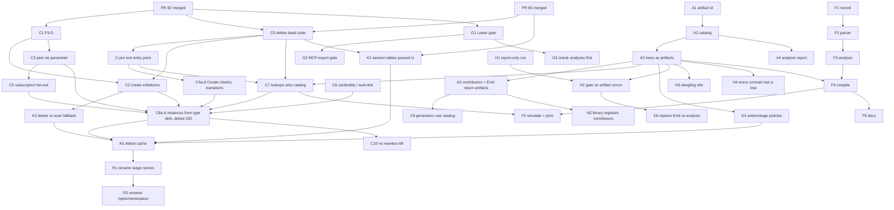

# Poly convergence plan (DRAFT, plans only)

Status: draft for Scot Murphy, 2026-10-02. Nothing here is implemented, no PR exists, nothing on the board changed. It answers one question: for each place the code differs from the agreed pipeline (section 7 of `pipeline-stage-map.md`), how do we bring the code in line, in small steps you could review and change by hand?

Method: Grok Build (grok-4.6) read master `9db8868f` in a throwaway clone (`/workspace/poly-ro`) and both open PR branches, then I spot-checked the load-bearing claims myself (`DomainSession.Lower` has no error check; `ArtifactDescriptor` is three strings; four DEI helpers have no callers). Code is truth. Line-level evidence is in `pipeline-convergence.facts-raw.md` and `pipeline-convergence.dei-inventory.md` next to this file.

Open PRs: PR 82 (`d7c1da48`) and PR 83 (`c2265740`) are unmerged. P3-D (retire `BindForSimulate` and `AsVoidResultBody`) is queued after 82. The Lower to Compile rename is its own mechanical slice after both merge. Every slice below is one PR, goes through implement then opposite-mill review later, and none starts until you say so.

## 0. How to read this

- **Slice** = one small PR. Each has: scope, files, how to verify, risk, what it depends on, and a one-line **hand-edit check** (could you change it by hand without an agent?).
- **Size**: S = under a day of mill time and a diff you can read in one sitting; M = a few files and some tests; L = touches many files or needs a new piece of design.
- Slice ids (G, A, C, K, H, F, N, R) are just labels. The divergence numbers (D1 to D10) match the numbered list in section 7 of the stage map.
- "Decision" markers point to the list at the end. Each is a plain choice with my recommendation.

## 1. The divergences

### D1. No real artifact suite or catalog (and D6: one module, not many trees)

**Wrong today.** An artifact is three strings (`ArtifactDescriptor(Kind, Name, Source)`). `Lower` overwrites the catalog with one placeholder entry. Contributors return plain `(fileName, text)` pairs. Nothing has an id, a payload, or a reference to anything else. The compiled trees are one big list of type definitions that `Emit` splits apart afterward by entity name.

**Target.** An artifact has a type, a stable id, a producer and a payload. Artifacts point at each other by id only. A catalog holds them, resolves ids, and can list what is dangling or the wrong type. Every output (trees, printed C#, DbContext, Program.cs, demo.http, the analysis report) is registered through it.

**Facts that shape the plan.**
- A domain element's identity today is only its `Name`. `Node.Id` is a random GUID per instance and changes on every rebuild, so it can't be the stable id. A name path is the obvious start (for example `Hotel/Reservation/Confirm`).
- Duplicate action names across stages collapse to one C# method today (exporter lines 372 to 375). The id scheme has to say what happens there (Decision 1).
- `Emit` already splits the list into one file per entity plus `Poly.Types.cs`. That split is the natural first set of tree artifacts (Decision 3). Finer trees (one per action, policy, handler) are a later step.
- There are 4 contributors (2 real, 2 in tests). Only 2 test files touch the catalog and 5 touch `Emit`.

**Slices (in order).**

**A1. Artifact id.** A tiny `ArtifactId` type: how an id is written, parsed and compared. No wiring.
- Files: new file under `Poly/DomainModeling/Compile/`.
- Verify: unit tests for format/parse/equality; build.
- Risk: low. Depends on Decision 1. Hand-edit check: yes, one small file.

**A2. Real catalog.** `ArtifactDescriptor` gains `Id`, `Type`, `Producer`, `References` (list of id plus expected type). Add an `Artifact` (descriptor plus payload) and a catalog class: register (duplicate id throws), look up by id, list all, `FindDanglingOrWrongType()`, and a stable `ToText()` so the catalog can be read and diffed by eye. `DomainSession.ArtifactCatalog` becomes this type. Keep today's placeholder entry working so nothing else changes yet.
- Files: `Compile/ArtifactDescriptor.cs`, new catalog file, `Compile/DomainSession.cs`.
- Verify: catalog unit tests (dangling, wrong type, duplicate); update `SliceCProducerLoopCatalogTests.cs`.
- Risk: low to medium (the existing test asserts the old shape). Depends on A1, Decision 2. Hand-edit check: yes.

**A3. Lower registers its trees as artifacts.** Lower registers (a) one scaffolding tree (what `Poly.Types.cs` holds today) and (b) one tree per entity with its stage enum, each with an id. `Emit` reads these from the catalog instead of splitting the list itself. Printed output must be byte-for-byte the same.
- Files: `Compile/DomainSession.cs` (Lower and Emit), `Lowering/DomainProgramProjection.cs` only if the split moves.
- Verify: golden test, emitted files before and after identical across all sample domains (hotel, university, CRM and the Emit contract tests); catalog text snapshot.
- Risk: medium. Depends on A2, Decision 3. Hand-edit check: yes.

**A4. Analysis report as an artifact.** The analysis result is registered as an `AnalysisReport` artifact; each finding carries the domain element it points at (by id path). I did not verify that every diagnostic really carries an element today. The slice starts by checking that, and any gap becomes a small Analyze fix.
- Files: `Compile/DomainSession.cs`, a small report payload type.
- Verify: test that a domain with warnings produces a report artifact listing them.
- Risk: low. Depends on A2. Hand-edit check: yes.

**A5. Contributors and Emit return artifacts.** `IArtifactContributor.Contribute` returns artifacts (file artifact of type CSharpFile or HttpFile, each referencing the tree artifact it was printed from) instead of tuples. The DslCompiler producer loop writes files from the catalog. `Emit` registers its per-entity `.cs` files the same way, each pointing at its tree.
- Files: `Compile/IArtifactContributor.cs`, `DbContextArtifactContributor.cs`, `MinimalApiGenerator.cs` (contributor class only), `DslCompiler.cs`, `Compile/DomainSession.cs`; tests `SliceCProducerLoopCatalogTests.cs`, `DslCompilerArtifactContributorTests.cs`.
- Verify: generated files unchanged; every printed file artifact has a reference that resolves; dangling check passes.
- Risk: medium (public interface change, 4 implementers). Depends on A3. Hand-edit check: yes.

**A6 (deferred). Finer trees.** One artifact per action, policy, subscription handler, entry/exit body. Only worth doing when a consumer needs it; today's consumers all want the type. Decision 3.

**A7 (deferred). Other artifact types** (tests, docs, spec exports). Add each when something consumes it, not before.

**Tests.** Keep the 2 catalog test files and update them in A2 and A5. New: catalog unit tests, golden emit test, catalog-text snapshot. No existing Emit test should need edits; if one does, the slice changed behavior and is wrong.

### D3. Compile does not stop on Errors

**Wrong today.** `DomainSession.Lower`, `RuntimeAnalysisCache.GetOrLower` and `DomainProgramProjection.ToSyntax` never look at `HasErrors`. Only evolution, `DslCompiler` and `apply_dsl` stop upstream. MCP `export_domain_to_csharp` only checks that an analysis exists, and a failed `apply_dsl` stores the error analysis next to the old domain, so export can pair the two. Simulation (`DomainEntityInstance`) lowers whatever it is given.

**Target.** Lower refuses an analysis with Errors, with the first error in the message, in the same style the VM already uses (`InvalidOperationException`, as in `FailLoudOnAnalysisErrors`). The catalog stays empty when it refuses.

**Good news from the code check.** No test today passes an analysis with errors into Lower, Emit or the exporter. The dirty-domain tests already stop before Lower. The gate should therefore break nothing, but that is a reading, not a run. The slice's verify step is the full test suite.

**Slices (in order).**

**G1. The gate.** Add the check in `DomainProgramProjection.ToSyntax(domain, analysis)` and `RuntimeAnalysisCache.GetOrLower`, so Lower, Emit, the simulator and the Minimal API contributor are all covered. Fix the stale comment on `IArtifactContributor` while there.
- Files: `Lowering/DomainProgramProjection.cs`, `Analysis/RuntimeAnalysisCache.cs`, `Compile/IArtifactContributor.cs` (comment).
- Verify: full suite green; new tests: Lower on an error analysis throws and leaves the catalog empty; ToSyntax on an error analysis throws.
- Risk: low. Dependencies: after PR 82 merges (82 edits `RuntimeAnalysisCache.cs`, 4 lines). Decision 7. Hand-edit check: yes, about 10 lines.

**G2. MCP export refuses error analyses.** `export_domain_to_csharp` returns the errors instead of emitting. Optional follow-up if you want it: stop pairing an error analysis with the old domain.
- Files: `Poly.Mcp/Tools/OracleTool.cs`, maybe `McpSessionStore.cs`.
- Verify: new MCP test; the existing `ExportDomainToCSharp_WithPeerAnalysisError_FailsClosed` still passes.
- Risk: low. Depends on G1 (not strictly). Hand-edit check: yes.

**G3. `oracle_expression` analyzes first.** It builds a throwaway domain and simulates a policy without running analysis. After G1 that would throw a confusing error. Make the tool analyze and return diagnostics.
- Files: `Poly.Mcp/Tools/OracleTool.cs` (lines about 399 to 412).
- Verify: MCP smoke test with a valid and an invalid expression.
- Risk: low. Depends on G1. Hand-edit check: yes.

**Tests.** The three new test groups above. Watch for: tests that simulate without calling `Analyze` first (32 test files use the simulator); they must still pass, since the simulator analyzes on first use and only a real error trips the gate.

### D2 and D8. Consumers reach back and re-run stages; Domain is held live

This is the DEI problem. DEI is retired with no replacement layer (your decision). The inventory shows what that really means. DEI plus its store have 69 members: 45 are plain instance and link bookkeeping, 8 are callbacks the VM makes (Notify, create child, ensure unique and so on), 8 interpret domain concepts directly (those are Compile gaps), 3 already just run a compiled tree, and 5 are odd ones. Detail: `pipeline-convergence.dei-inventory.md`.

**What "no replacement layer" needs from you (Decision 9).** After the gaps become trees, what's left is a dictionary per instance, a table of links between instances, a uniqueness registry, and the VM callbacks. Something has to implement those. The cleanest reading of your rule: that remainder lives inside the interpreter as a generic piece that knows nothing about `Domain` or `Entity`, only compiled type definitions. If you read it as "no such piece at all", those behaviors must become trees too, which is a much bigger piece of work. The slices below assume the first reading and mark where.

**Three kinds of reach-back, three fixes.**
1. *Looking things up* (21 `GetOrAnalyze` call sites): 6 just feed `GetOrLower` to get the compiled module, 3 find actions by name, 4 find entities by name, 3 find relationships, 5 are one-offs (stage enum names, subscription fan-out, storage target, `BehaviorMetadata`). All of these have a tree-side equivalent that already exists: a method by name on the entity's type, a type by name, navigation properties on the type. Two of the relationship lookups sit in methods nobody calls.
2. *Doing domain work itself* (the Compile gaps). Table below.
3. *Holding `Domain`* (the constructor takes `Entity` and `Domain`): goes away once 1 and 2 are done and the interpreter builds instances from a type definition.

**Compile gaps found (domain concept, what DEI does, whether a tree already exists).**

| Concept | Today | Tree status |
|---|---|---|
| Create-time checks (required, range, length, pattern) | DEI re-implements them in C# | The `Create` factory tree already has them; the simulator doesn't run it |
| Equality constraint on create | **DEI ignores it; the printed C# enforces it** | Tree exists. This is a live simulate-differs-from-print bug |
| Defaults | DEI evaluates them in C# before `Create` | Tree exists (constructor parameters) |
| Unique on assign | Store plus a tree call | Done |
| Unique on create | Store scan only | **No tree; the printed factory skips it** |
| Checks when a property is set (range, length, pattern, required) | none in simulation | **No tree is run** (Decision 11) |
| Enum value check | none | **Missing** |
| Legal stage transitions | `TransitionStage` silently does nothing on an unknown stage | **Missing table** (Decision 12) |
| Entry and exit effects | DEI walks the ontology to decide what to run, then runs the tree | Trees exist |
| Policies on actions and stages | DEI walks the ontology when no module body exists | Entity policies exist; action and stage policies are lowered separately and never printed (Decision 8) |
| Subscription fan-out | Store matches links in C# | `Notify{Stage}Subscribers` trees exist; store doesn't call them |
| Link cardinality | none | **No tree** |
| Create initializers | evaluated by lowering at run time when no store is attached | Store-bind tree exists |
| Owned or aggregate rules | none at run time | **No tree** (analysis only) |

**Slices (in order).** The first few are cheap and make later steps smaller.

**C0. Delete the dead code.** Four DEI helpers have no callers: `EvaluateParameterBindings`, `BindPeerInEffect` with `PeerBindingRewrite` and `EvaluateExprOnPeer`, `TryEvaluateRelationshipPresence`, and `GetOutboundRelatedInstances`.
- Files: `Runtime/DomainEntityInstance.cs`, `.HostAbi.cs`, `.Runtime.cs`.
- Verify: `rg` shows zero references first; build; full suite unchanged.
- Risk: very low. Dependencies: after PR 82 and PR 83 (both edit HostAbi and DEI). Hand-edit check: yes, pure deletion.

**C1. P3-D (already queued).** Retire `BindForSimulate` and `AsVoidResultBody`. Not re-planned here. The code check says the reasons they exist are: the module body runs as the root program so `this` takes slot 0, and the void-result shape. Fix those in lowering or the interpreter instead of rewriting at run time.
- Depends on PR 82. Conflicts: this is the same area as 82. Note: PR 82 adds `RuntimeEnumTypeProvider`, a new run-time shim; treat as interim (Decision 17).

**C-pre. A test entry point.** 32 test files call `DomainEntityInstance.Create` (31), `InvokeAction` (30), `new DomainInstanceStore` (26) and `GetProperty` (31). Add one small test helper that creates and invokes through, move the tests over mechanically, and leave DEI behind it. Then later steps and the final deletion change one helper instead of 32 files.
- Files: `Poly.Tests/TestHelpers/*` plus mechanical edits to the test files.
- Verify: suite green with identical counts; diff is edits of call sites only.
- Risk: low but big diff (M). Depends on C0. Hand-edit check: yes (find and replace).

**C2. Create initializers without re-lowering.** Remove the two run-time lowerings (`PrevalidateCreateInitializers`, `CreateChildInstance` when no store is attached). Simplest route: a simulator without a store gets a default internal one, so the compiled `Create` trees always run.
- Files: `Runtime/DomainEntityInstance.HostAbi.cs`, maybe `DomainInstanceStore.cs`.
- Verify: `StoreBindCreate*`, `Item4FailBeforeMutate*` tests; new test for a store-less create with an initializer.
- Risk: medium. Depends on C0, C1. Hand-edit check: yes.

**C3. Peer binding as a real parameter.** Compile subscription handlers as methods that take the peer as a parameter and pass it in, then delete `MaterializePeerInSyntax` (about 130 lines, which rewrites trees before they run).
- Files: `Lowering/DomainToCSharpExporter.Notify.cs` (handler signature), `Runtime/DomainEntityInstance.HostAbi.cs`.
- Verify: P4Subscription, SubscriptionAnalysis and multi-hop tests; simulate-equals-print test for a peer handler.
- Risk: medium to high. Depends on C1. Size M to L. Hand-edit check: partly (the handler signature change is small; the VM side is the risk).

**C4. Run the compiled Create checks (the real bug).** In order, four sub-slices, each its own PR:
- **C4a** a failing test showing the equality-constraint difference; make the simulator run the `Create` factory tree for required, range, length, pattern, equality; delete `ValidateCreateConstraints` and `FillCreateDefaults`. (M)
- **C4b** unique on create: add an `EnsureUnique` call in the factory tree (same as assign does). (S)
- **C4c** set-time checks and enum value check, only if you choose so in Decision 11 and 12. (M)
- **C4d** legal transition table, only if Decision 12 says yes; otherwise make an unknown stage name an Analyze error so the silent no-op can't happen. (S to M)
- Verify: for each, a test that fails on master and passes after, and the printed C# for the same domain contains the same check.
- Risk: medium. Depends on C-pre (and A3 if the check uses ids). Conflicts: none with PRs after merge.

**C5. Subscription fan-out through trees.** The store calls the compiled `Notify{Stage}Subscribers` trees instead of matching links itself.
- Files: `Runtime/DomainInstanceStore.cs` (`NotifyTransition`), HostAbi.
- Verify: P4Subscription tests plus simulate-equals-print.
- Risk: medium to high. Depends on C3. Size M.

**C6. Link cardinality and auto-link.** Cardinality has no tree. The three auto-link helpers (link if exactly one matching navigation) are guessing, which is the kind of hidden rule the interpreter contract forbids. Either compile real link checks or make linking explicit (Decision 10).
- Size S to M, depends on the decision. Risk: behavior change visible to MCP users.

**C7. Move lookups onto the catalog.** First **C7-0**: a small index over the catalog (method by name on a tree, tree by name, navigation by name). Then one PR per group of lookups:
- **C7a** the 6 "get compiled module" sites hold the artifact list instead of asking the cache.
- **C7b** the 3 action-by-name lookups use the index (stage-scoped fallthrough baked in at compile time).
- **C7c** the 4 entity lookups and 3 relationship lookups use the index and navigation properties.
- **C7d** the 5 one-offs and `BehaviorMetadata`.
- Verify: unchanged test results; `rg GetOrAnalyze` count drops by the group size each time.
- Risk: medium. Depends on A3, C0, C-pre. Size S each (M for C7-0 plus C7a).

**C8. Instances from a type definition; delete DEI.** The interpreter has no API today that builds a dictionary-backed instance from a `TypeDefinitionNode`; DEI's `Create(Entity)` is that factory. The pieces exist (`TypeDefinitionNodeAnalyzer`, `DictionaryBackedValue`, `InvokeNamed`).
- **C8a** (additive) an interpreter-side factory: type definition in, dictionary-backed instance out, plus the generic link, uniqueness and notify host (Decision 9). Own unit tests, no DEI change. (M)
- **C8b** move the C-pre helper and `Create` over to it. (M)
- **C8c** move the MCP execution tools (`create_instance`, `link_instances`, `unlink_instances`, `get_instance`, `list_instances`, `invoke_action`, `evaluate_policy`, `oracle_expression`) over. (M)
- **C8d** delete DEI, `RuntimeAnalysisCache` body tables (see K5) and anything left. (M, mostly deletion)
- Verify: whole suite through the helper; `rg DomainEntityInstance` returns nothing; MCP smoke tests.
- Risk: medium to high (largest design risk in the plan). Depends on C2 to C7. Hand-edit check: C8a yes if it stays small; the new generic host is the one place where a hand edit needs care.

**C9. Generators stop asking for the module.** The Minimal API contributor calls `GetOrLower` and then checks action names against the module (`RequireHttpActionsInModule`). Hand it the tree artifacts from the catalog instead. The generators reading `Domain` plus the analysis result is fine (Decision 5): they are part of Compile, not consumers.
- Files: `MinimalApiGenerator.cs`, `Compile/IArtifactContributor.cs`.
- Verify: `MinimalApiGeneratorTests` output unchanged.
- Risk: low to medium. Depends on A5. Size S.

**MCP read-only tools** (`get_domain_overview`, `get_entity_detail`, `get_domain_analysis`, `get_relationships`, `get_constraints`, `export_dsl`, `describe_domain_element` and so on) read the authored `Domain` and its analysis. That is the Domain stage, not a use of artifacts. Recommend they stay as they are (Decision 6).

### D4. Compile does more than domain plus analysis result

**Wrong today.** Lowering reads the session's tables (meaning, forms, type maps) through a cache keyed by `Domain`, has a re-scan fallback when analysis is missing, writes five side tables onto the cache, re-lowers action and stage policies in `CompletePolicyBodies`, and `Emit` re-analyzes the lowered trees and ignores failures. The cache can also quietly open a second, core-only session when nothing is bound.

**Target.** Compile's inputs are the domain, the analysis result, and the session's libraries (Decision 4: the code check says the libraries are a legitimate input; the design text should name them). Everything it produces is an artifact. Nothing is written to a side cache and nothing is re-judged.

**Slices.**

**K1. Name the third input.** A design-doc edit only: Compile takes domain, analysis result, and the session's libraries. No code.

**K2. Pass the session tables in.** `LoweringContext` already has optional meaning and forms. Make them required, pass them from the session, and delete the lookups through the Domain-keyed cache (about 12 sites in the exporter, effect and expression passes, and the type-map lookups).
- Verify: output unchanged on all lowering tests.
- Risk: medium (many files, conflict-prone). Depends on PR 82 and 83 merged, C0. Size M.

**K3. Delete the re-scan fallback.** Make the analysis result required in `LoweringContext`; remove the fallback branches (`LoweringContext.cs`, `DomainToCSharpExporter.Actions.cs` about 556, `EffectLoweringPass.cs` about 27 and 1037). Test helpers that build a context without analysis must be fixed; I did not count them.
- Risk: low to medium. Depends on C2 and C0 (DEI's run-time lowering is the only caller of the null path). Size S to M.

**K4. Action and stage policies.** They are lowered separately and never reach the module, so the printed C# lacks policies the simulator enforces. Make them part of the compiled output (Decision 8), then delete `CompletePolicyBodies`.
- Verify: new simulate-equals-print test for an action policy; printed output changes (expected and called out in the PR).
- Risk: medium. Depends on A3. Size S to M.

**K5. Remove the side tables and the cache.** Once C7 and C8 have removed readers (each table has one reader), delete the five body tables, `GetOrLower`, `GetOrAnalyze`, the fallback session, and `RuntimeAnalysisCache` itself. 12 test files reference the cache and move to the catalog.
- Risk: low if done last. Size M.

**K6. Replace `Emit`'s re-analysis.** Delete `TryAnalyzeForEmit` and hand the printer the artifact-analysis result from H2. Until then, leave it.
- Depends on H2.

### D5. Pre-run rewrites before the interpreter

**Wrong today (on master).** `BindThis`, `RewriteVoidFailClosedThrow`, `BindExportBody` and `BindModuleMethodBody` rewrite trees before they run; peer handling (`MaterializePeerInSyntax`) and create initializers do the same.

**What the PRs do.** PR 82 deletes the first three and leaves `BindForSimulate` and `AsVoidResultBody`, which P3-D (C1) retires. It also adds `RuntimeEnumTypeProvider`, a new simulate-only shim that wraps enum types. Remaining after P3-D: `MaterializePeerInSyntax` (C3) and create initializers (C2).

**Target.** Nothing rewrites a tree between catalog and interpreter. The tree that prints is the tree that runs.

**Slices.** C1, C2, C3 above. Add one end-of-series check, **C10**: a test that walks every compiled tree for the sample domains and asserts the interpreter ran exactly the artifact (no rewrite step exists: `rg "Rewrite|Bind(This|ForSimulate)"` in `Runtime/` returns nothing, and the enum shim from PR 82 is gone or justified).
- Size S. Depends on C1 to C3. Hand-edit check: yes.

### D7. No snippet or function authoring

**Wrong today.** No `function` form. `"function"` sits on the parser's unsupported list (it triggers only where a type name is expected). There is no `DomainFunction` record and no call expression; actions are the only named behavior and they live on entities and stages.

**Target.** A named, typed function (parameters and return type), written in the DSL, analyzed like everything else, compiled to its own tree artifact, referenced by id from the places that call it. Private to its domain until visibility levels are designed.

**Slices.** Sequence matters: F1 to F3 are about authoring and analysis and can run any time; F4 and F5 need the catalog and should not be built on DEI.

**F1. The record.** `DomainFunction(Name, Parameters, ReturnType, Body)` in the ontology, on `Domain`, with printing. Decision 13 sets the body form (recommended: a single expression, using the expression grammar that already exists).
- Verify: record builds, prints, round-trips through evolution.
- Risk: low. Hand-edit check: yes.

**F2. Parser.** `function Name(p: Type): Type = expr`. Remove `"function"` from the unsupported list; add parse and print round-trip tests.
- Files: `Language/PolyDslParser.cs`, `DslGrammar.cs`, `DomainDslPrinter`.
- Risk: low.

**F3. Analysis.** A call expression, with checks for argument count and types, unique names, return type matches the body, and no recursion in v1. A bad function is an Error and blocks Compile like any other.
- Files: `Analysis/ExpressionTypeAnalyzer.cs`, `StructuralDomainAnalyzer.cs`, new `DomainExpression` form.
- Risk: medium (touches the expression type system).

**F4. Compile.** Each function becomes a static method on one `{Domain}Functions` tree artifact; a call lowers to an invoke of it; callers' trees reference the function artifact by id (typed reference, checked by the catalog).
- Depends on A3 and F3. Size M.

**F5. Simulate and print agree.** Test that a function call gives the same result simulated and printed. Today the simulator finds module methods through DEI (`TryGetModuleMethod`); do this after C7 so it doesn't add new work to DEI.
- Depends on C7, F4.

**F6. Docs and MCP guide.** Update the DSL guide, which currently says `function` is unsupported. Size S.

**Tests.** Parser, printer and analyzer tests per slice; one simulate-equals-print test for calls (F5).

### D9. Naming and registration

**N1. `Information` to `Info`.** 9 identifier hits in product code, 0 in tests: the enum member, `ReportInformation`, the verbosity name `InformationAndAbove`, and four passes that call them. Check whether MCP output prints the severity as text, because that would be an outward change (Decision 16).
- Verify: build; MCP output test if the text changes. Risk: low. Size S. Hand-edit check: yes (IDE rename). No conflict with open PRs.

**N2. Libraries register their own contributors.** `DslCompiler.OpenCompileSession` adds the DbContext and Minimal API contributors itself. `HttpLibrary` lives in the same assembly as the Minimal API contributor, so it can register it directly. `PersistenceEmitLibrary` lives in `Poly`, which cannot reference the DbContext contributor in `src/Poly.DslCompiler`. The contributor also takes the database kind as a constructor argument, and that comes from the compiler, not from `uses`. So: do the Http one now; do DbContext only if the database kind is read from the loaded libraries (Decision 19).
- Files: `src/Poly.DslCompiler/HttpLibrary.cs`, `DslCompiler.cs`; update the test that asserts the old source text (`SliceCProducerLoopCatalogTests.cs` lines 78 to 82).
- Risk: medium. Depends on A5 (registration looks different afterward) - do after it. Size S.

### D10. Analysis default runs every pass after the first error

**Wrong today.** Not wrong by the design ("Analyze must catch every real problem"), but one real error can produce a pile of follow-on errors that an agent has to untangle. There is no per-pass suppression, and tests only cover that duplicates are kept and that `FailFast` skips later passes.

**Target.** Keep reporting everything, and know how noisy it is before deciding anything.

**N3. Measure.** Script (not a product change) that breaks each sample domain one way at a time and counts diagnostics per root cause. Output a short table. If the noise is bad, a later slice can make passes skip elements that already have an Error. Decision 18: leave it unless the numbers hurt.
- Size S. Hand-edit check: n/a (a measurement).

### Artifact analysis (new step 2.6, not a section 7 divergence)

Not checked in the earlier code pass; checked now. The VM analyzer (`Interpreter.Analyzer`) already uses the same `Diagnostic` and `DiagnosticSeverity` types as the domain analyzer. It has passes for type compatibility, unresolved members, `this` use, dangling jumps, unreachable code (Warning), infinite loops (Information) and definite assignment (writes metadata only, no diagnostic). `Emit` already runs it over the lowered module and ignores the result.

**H1. Report-only run.** Wrap the compiled trees in a compilation unit, run the VM analyzer, and report what it finds on the sample domains (a test that prints counts, no failure). This is the pain gauge: it tells us how many Errors the current output would trip.
- Files: a new test; no product code, or one small helper in `Compile/`.
- Risk: none. Size S. Can start now. Hand-edit check: yes.

**H2. Gate on Errors.** Register the result as an artifact and make `Emit` and the simulator refuse trees whose analysis has Errors (same exception style as G1). Decision 14 says same diagnostics system or separate report; recommend the same system, since the analyzer already uses the same types.
- Risk: medium (H1 tells us how many existing outputs fail). Depends on A3, H1. Size M.

**H3. Dangling and wrong-type references.** Report `FindDanglingOrWrongType()` from the catalog (A2) as diagnostics. Size S. Depends on A3.

**H4. Every concept has its tree.** Start as the CI check you agreed to: for each sample domain, list its entities, actions, policies, subscriptions, stages with effects, and constraints, and assert each has its tree in the catalog (name-based, inside the entity trees, until finer trees exist). It will start failing on the known gaps from the table in D2; list them as an explicit known-gaps list that shrinks with C4 to C6. Later it becomes a real pass.
- Depends on A3. Size M.

**H5. Dead code and read-never-assigned.** Turn definite-assignment results into diagnostics and decide which unreachable cases are Errors vs Warnings. Size S to M. Last.

## 2. What conflicts with the open PRs

| Area | PR 82 | PR 83 | Rule |
|---|---|---|---|
| `DomainEntityInstance*.cs` (C0, C1 to C8) | rewrites 403 lines | 3 lines in DEI, 9 in HostAbi | Wait for both |
| `RuntimeAnalysisCache.cs` (G1, K5) | 4 lines | none | Wait for 82 |
| Lowering passes (K2, K3, rename) | `DomainExpressionLoweringPass.cs` (+61) | five lowering files | Wait for both |
| `Compile/` folder (A1 to A5, H1, F1 to F2, N1, N3) | not touched | not touched | **Can start now** |
| `src/Poly.DslCompiler` (A5, C9, N2) | not touched | not touched | Can start now, but A5 needs A3 first |

PR 82 moves toward the design (hop guards in lowering so simulate equals print; `this` stays in the cached trees). It also moves away in two ways: it makes DEI bigger on its way to being deleted, and adds the enum shim. Neither PR adds a catalog, a gate or removes reach-back. I suggest we don't polish that DEI code beyond what P3-D needs.

Also: PR 83 is bug fixes only and has no effect on the plan.

## 3. Recommended order

Wave 0 (now, no code): you decide the Wave 1 decisions. A1, A2, H1, N1 and N3 touch nothing the open PRs touch, so they could run while 82 and 83 wait (Decision 15).

Wave 1, after 82 and 83 merge:
1. C1 (P3-D), already queued.
2. C0 delete dead code.
3. G1, G2, G3: Lower refuses Errors.
4. A1, A2, A3, A4, A5: artifacts get ids, types and references; every output registers through the catalog.
5. C-pre: test entry point.

Wave 2, consumers move onto the catalog:
6. C7-0, C7a to C7d, C9.
7. K2, K3, K4: Compile uses only its named inputs.
8. C2, C3, C4a to C4d, C5, C6: close the Compile gaps (C4a first: it's a live bug).
9. H2, H3, H4 (artifact analysis gated), K6.

Wave 3, retire:
10. C8a to C8d and K5: instances from type definitions; delete DEI and the cache; C10 end check.
11. R1 and R2: the rename (nothing else runs during it).
12. F1 to F6: function authoring (F1 to F3 earlier if you want).
13. N2 (when A5 lands), H5, A6, A7.

Why this order: the gate is the cheapest and protects everything after it; artifacts must exist before anything can move onto them; the consumer moves have to come before the rename so we don't rename code we're about to delete; and artifact analysis is gated only after the compiled trees are the real ones.

### Rename slices (placed above in wave 3)

**R1. Stage-level names.** `DomainSession.Lower` to `Compile`, `GetOrLower` (if still alive after K5), the `"Lower"` producer string, docs (`AGENTS.md`, `docs/CORE.md`, plan files). No behavior change.
- Verify: build; full suite; `rg` for leftovers; `git diff -M --stat` shows only renames and replaced text. Risk: low. Size S. Hand-edit check: yes.

**R2. Types, namespace and folder.** `Poly.DomainModeling.Lowering` (11 product files, 28 test files) to a Compile namespace; classes like `LoweringContext`, `LoweredExpression`, `EffectLoweringPass`, `DomainExpressionLoweringPass`, `ExpressionLoweringRegistry`, `TemporalLowering`. Counts now: about 294 hits in 32 product files and 414 hits in 57 test files (loose: includes `ToLowerInvariant`). The existing `Poly/DomainModeling/Compile/` folder already holds the session; the folder move is a choice. Decision 20 (recommend: keep the word "lowering" for the expression-translation step that really is lowering).
- Verify and risk as R1. Size M (mechanical). Hand-edit check: yes via IDE rename, but the diff is big.

## 4. Dependency graph

## 5. Rough sizing

| Group | Slices | Size |
|---|---|---|
| Gate | G1, G2, G3 | S, S, S |
| Artifact model | A1, A2, A3, A4, A5 | S, S to M, M, S, M |
| Cheap cleanups | C0, N1, N3, K1 | S each |
| Test entry point | C-pre | M (big mechanical diff) |
| Pre-run rewrites | C1 (queued), C2, C3, C10 | M to L, M, M to L, S |
| Compile gaps | C4a, C4b, C4c, C4d, C5, C6 | M, S, M, S to M, M, S to M |
| Consumer lookups | C7-0, C7a, C7b, C7c, C7d, C9 | M, M, S, S, S, S |
| Compile inputs | K2, K3, K4, K5, K6 | M, S to M, S to M, M, S |
| Instances and DEI | C8a, C8b, C8c, C8d | M, M, M, M |
| Artifact analysis | H1, H2, H3, H4, H5 | S, M, S, M, S to M |
| Functions | F1 to F6 | S, S, M, M, M, S |
| Rename | R1, R2 | S, M |
| Library registration | N2 | S |

About 50 slices. Overall: **L**. The risky ones are C3, C5 and C8; everything before them is small and gets reviewed on its own. Apart from C1 (already queued, M to L), the first PRs in the order (C0, G1, A1, A2, C-pre) are all S or M with low risk.

## 6. Things I could not confirm

- The gate breaking nothing is from reading the tests. Running the full suite is G1's first step.
- That every diagnostic points at a domain element ("every diagnostic points at a domain element" in the stage map) was not checked. A4 starts by checking it.
- The enum-value check and stage transition table gaps come from the code check of the runtime. I did not check whether printed C# contains either; C4 starts with that comparison.
- The count of tests that build a lowering context without analysis (K3) was not taken.
- File line numbers are from master `9db8868f` and will move after PR 82 and 83 merge. Re-check each at slice start.

## 7. Decisions for Scot

Plain choices. Recommended option first. "Needed before" says when it blocks anything, so you don't need all of them now. Items marked "Decided 2026-10-02" are settled; items marked "Open, not yet decided" still need Scot.

A1, A2, H1, N1 and N3 are HELD until Scot signs off on this plan.

**Needed before the first PRs (wave 0 and 1)**
1. **Artifact id format.** (a) Written name path plus type, like `Hotel/Reservation/Confirm#method` (recommended). (b) A numbered or hashed id. If two stages have an action with the same name, the id must also include the stage; say if you want that, or want same-name actions to remain a single method. *Before A1.* Decided 2026-10-02: the id is the written name path plus the type.
2. **Artifact types.** (a) Open set: core defines the core types, libraries add their own (recommended; matches "libraries are producers"). (b) A fixed list in core. *Before A2.* Decided 2026-10-02: open set; core defines core types and libraries can add their own.
3. **Artifact granularity for now.** (a) One tree per entity plus one scaffolding tree, matching the current file split (recommended). (b) One per action, policy and handler now (much bigger, no consumer needs it yet). *Before A3.* Decided 2026-10-02: one tree per entity for now; expected to evolve.
4. **Compile's inputs.** Amend the design to say domain model, analysis result, and the session's libraries? (a) Yes (recommended). (b) No: then libraries must be inlined into the analysis result, which is a larger redesign. *Before K2; it also fixes the doc.* Decided 2026-10-02: yes. Compile takes the domain model, the analysis result, and the session's libraries.
5. **Where generators sit.** Are the Minimal API and DbContext generators part of Compile (allowed to read domain and analysis, must register their output with references) rather than consumers? (a) Yes (recommended). (b) No: they must read only artifacts, which means moving their inputs into artifacts first. *Before C9.* Decided 2026-10-02: yes. The Minimal API and DbContext generators are part of Compile.
6. **MCP read-only tools.** Do overview, detail, analysis, relationships, constraints, DSL export and describe tools keep reading the authored `Domain`? (a) Yes, they are the Domain stage (recommended). (b) No: they must read artifacts too. *Before C8c.* Decided 2026-10-02: yes. They keep reading the authored Domain.
7. **Simulating a domain that has Errors.** (a) Refuse, like Compile (recommended, consistent). (b) Allow with a warning. *Before G1.* Decided 2026-10-02: refuse, like Compile.
15. **Start non-conflicting slices while 82 and 83 wait?** A1, A2, H1, N1 and N3 touch nothing the PRs touch. (a) Yes, start them (recommended). (b) Wait, keep the lanes idle until merge. *Now.* Decided 2026-10-02: Scot has no preference. Start non-conflicting slices; Foreman picks the order. A1, A2, H1, N1 and N3 are HELD until Scot signs off on this plan.

**Needed before wave 2**
8. **Action- and stage-scoped policies.** The simulator enforces them; the printed C# omits them. (a) Compile them into the output so print matches (recommended; changes printed code). (b) Keep them simulate-only. *Before K4.* Decided 2026-10-02: they compile into the printed output. There is no simulate-only behavior; simulate and print always agree.
9. **What stays in the interpreter after DEI.** (a) A generic, domain-unaware piece inside the interpreter: dictionary instances from type definitions, link table, uniqueness registry, VM callbacks (recommended). (b) None; links, uniqueness and notify must also be trees. *Before C8a.* Decided 2026-10-02: the interpreter keeps only session-aware storage (a place to hold instances and state per session). Everything else (uniqueness, links, constraints, transitions) must be trees.
10. **Auto-link guessing** (link automatically if there is exactly one matching navigation). (a) Remove; linking must be explicit (recommended; it is a hidden rule). (b) Keep it, expressed as compiled trees. *Before C6.* Also say whether link cardinality (one-to-one vs many) should be enforced when linking. Decided 2026-10-02: no auto-link guessing. The domain model decides links and cardinality, and compiled trees enforce exactly what is modeled.
11. **Constraints when a property is set** (range, length, pattern, required). (a) Check them on set, in the compiled trees. (b) Create-time only, as now. I don't know which you intend; the design doc doesn't say. *Before C4c.* Decided 2026-10-02: every mutation of state must enforce every specified invariant, including constraints on set, not just on create. Constraints propagate and are validated as early as possible. Only named actions may mutate their own entity's state; cross-entity property access is read-only. Simulation and printed code both follow this.
12. **Stage transitions and enum values.** (a) Add a legal-transition table and an enum-value check as trees. (b) Not now; instead make an unknown stage name an Analyze error so it can't silently do nothing (smallest change). *Before C4d.* Decided 2026-10-02: transition tables and enum checks are compiled as trees, so constraints are validated at runtime. Unknown stage names and enum values are also Analyze errors, with static propagation catching what it can early.
14. **Artifact analysis shape** (stage map open item 11). (a) Same diagnostics system and levels (recommended; the VM analyzer already uses the same types). (b) A separate verification step with its own report. *Before H2.* Decided 2026-10-02: artifact analysis is its own passes in the same analysis system, with a separate result set.
17. **PR 82's enum wrapper (`RuntimeEnumTypeProvider`).** (a) Accept as interim; revisit after C8 (recommended). (b) Ask for a change before merge. *Before merging 82.* Decided 2026-10-02: accept it as an interim stopgap; remove it in the enum/transition slice.

**Needed before wave 3**
13. **Function authoring v1.** Name: `function` (recommended; matches your static-function analogy). Body: (a) one expression using the grammar that exists (recommended), or (b) a statement list. No recursion in v1. Private to its domain until visibility levels are designed. Confirm all three. *Before F1.* Open, not yet decided.
20. **Rename scope.** (a) Rename stage-level names and the namespace, but keep the word "lowering" for the expression-translation step that really is lowering (recommended). (b) Rename everything that says Lower or Lowering. *Before R2.* Open, not yet decided.
16. **`Information` to `Info`.** (a) Do it as its own tiny PR (it changes an enum member and, if MCP prints it, the visible severity text). (b) Leave it. *Before N1.* Open, not yet decided.
18. **Cascading errors.** (a) Leave the analyzer reporting everything and measure first (recommended). (b) Make passes skip elements that already have an Error now. *Before N3 results.* Open, not yet decided.
19. **Registering contributors from libraries.** (a) Http now; DbContext only once the database kind comes from the loaded libraries (recommended). (b) Both now (needs the database kind moved first). (c) Leave as is. *Before N2.* Open, not yet decided.
