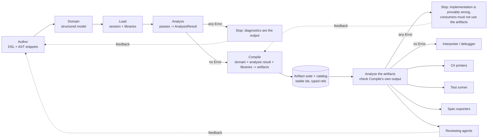

# Poly pipeline stage map

Status: working design for Scot Murphy, written 2026-10-02 from the design agreed in discussion, then cross-checked against master `9db8868f` (2026-09-29). Updated 2026-10-04 for the settled decisions and for the artifact catalog work merged through master `16403b60`. Rule: the hand-written code is the truth; this doc is ideation until the code matches it. PRs 82 (`d7c1da48`) and 83 (`c2265740`) merged into master `945a2164`; the doc's other line numbers and claims were taken on `9db8868f`.

## 1. Overview

Poly turns a business domain into running, shippable software. The pipeline reads: Analyze the domain, Compile, Analyze the artifacts, then consumers. The domain is written once. The same small syntax trees are then simulated, debugged and printed, so what you simulate is what you ship.

Principles this leans on:
- **Principle zero:** the trivial syntax tree is the unit of meaning.
- **0.1:** the interpreter is a debugger (step, pause, inspect).
- **Hand-editability:** trees and artifacts stay small, readable and serializable.
- **Composition ends at core:** libraries build on libraries and bottom out at core.
- **Correct before optimal:** Compile produces the correct artifact first; optimization is a later, separate step. Analyzing the artifacts (2.6) is what makes this enforceable.

Roadmap context: phase 1 is sellable domain-modeling software, phase 2 is any software with agent review feeding back into authoring, phase 3 is neurosymbolic (pulling algorithms out of model weights into executable code). The pipeline above is the same in all three; only what gets authored and consumed widens.

## 2. The stages

### 2.1 Author
- **Input:** a person or agent.
- **Output:** authored text in the domain DSL (entities, relations, stages, subscriptions, constraints), plus raw AST snippets.
- **Snippets** are like static functions in a C program: named, typed parameters and return type, compiled as ordinary code (not expanded like preprocessor macros), analyzed like everything else, and referenced by id from domain elements. The name is still open; "function", "helper" or "snippet" are preferred over "macro".
- **Rules:** a bad snippet produces diagnostics and blocks Compile like any other error. Visibility (private to a library or domain vs shareable) is parked.

### 2.2 Domain
- **Input:** authored text.
- **Output:** one structured, immutable domain model.
- **Rules:** changes go through evolution, not in-place edits. The model records facts (including which libraries it uses by id), not behavior.

### 2.3 Load
- **Input:** the domain model.
- **Output:** a session holding the domain's libraries (analyzers, type maps, artifact producers).
- **Rules:** unknown or duplicate library ids fail. Libraries compose and bottom out at core.

### 2.4 Analyze
- **Input:** the loaded domain.
- **Output:** the analysis result: diagnostics plus the facts passes discovered.
- **Rules:**
  - Each pass reads the domain and adds diagnostics; libraries can contribute passes. Future passes (for example one that proposes alternative trees) plug in here without changing Compile.
  - Any Error means a real problem was found. Compile does not run. The diagnostics report is the output and points at the exact domain elements.
  - Analyze must catch every real problem. Compile trusts it and never re-checks; if Compile trips over something Analyze should have caught, that is an Analyze bug.
  - The analysis result is itself an artifact in the catalog so findings can point at the artifacts they affect.
  - **Mutation rule (Scot, decision 11):** every mutation of state must enforce every specified invariant, including constraints on set, not just on create. Constraints propagate and are validated as early as possible. Only named actions may mutate their own entity's state; cross-entity property access is read-only. Simulation and printed code both follow this. Entry, exit and `when` blocks count as named actions, and the recommended style is to invoke an action from them rather than assign the entity's own state directly. Create, link and unlink are effects of relationship operations, and they are the only time an outside entity can influence another entity's state; the relationship owns those lifecycle effects, so they are the one named exception to "only named actions mutate their own entity". Analyze does not enforce all of this yet. What it enforces today (slices M1 and F380): an assign whose target starts with a relationship (another entity's state), or with a `when` handler's peer binder, is an Error, `DMEFF012`, in actions, entry and exit blocks, and `when` handlers; any other target that is not a bare property (for example a relationship nested under an owned value) is `DMEFF001`. Change another entity with `invoke rel.Action` instead.

### 2.5 Compile (today still named "Lower")
- **Input:** three things: the domain model, the analysis result, and the libraries the session loaded for the domain (their type maps, meaning tables, expression forms and artifact producers). Compile reads nothing else.
- **Output:** only artifacts. Nothing else is produced and nothing is re-derived or re-judged.
- **Rules:** one compilation produces a suite of typed artifacts. Syntax trees (many small ones, each a component of a valid implementation) are one type among others: API specs, schemas, tests, docs, the analysis report. Dangling references are compile errors. Correct before optimal.
- **Compile contract:** Compile transforms domain concepts (constraints, transitions, subscriptions, defaults, failures and so on) into valid, correct, interpretable ASTs, each placed in the right spot in the artifact graph. For example, a constraint's tree sits on its entity and a subscription's tree sits on its trigger. The interpreter never has to interpret a concept, only trees.
  - **Definition of done:** every domain concept ends up as a tree in the right place. A concept with no tree is a Compile bug. This is the target and is not met yet: trees are per entity at best until finer trees are built (slice A6 in the convergence plan).
  - **Suggested automatable check:** for a given domain, list its concepts and confirm each one has its tree attached where expected. Run it over the sample domains in CI.
- **Rename:** "Lower" becomes "Compile" in separate renaming slices (R1 and R2 in the convergence plan), not mixed into other work. PRs 82 and 83, which it was waiting for, have merged.

### 2.6 Analyze the artifacts
- **Input:** the artifact suite and catalog that Compile produced, plus the domain model and analysis result it was compiled from (needed only to check that nothing was dropped).
- **Output:** diagnostics about the artifacts, reported against the artifact (and the domain element it came from).
- **Purpose:** check Compile's own output. A Compile bug shows up here as a diagnostic, not as wrong behavior at run time.
- **Expected checks:**
  - **Type and shape correctness:** every tree is well-typed and well-formed.
  - **No dangling references:** every id an artifact points at resolves in the catalog, to an artifact of the right type.
  - **No unreachable or never-assigned values:** no dead code paths and no values that are read but never set.
  - **Every domain concept has its tree:** this is the Compile contract's definition of done (2.5), checked by the pipeline itself instead of only by a CI test.
- **Rules:**
  - An Error here means our implementation is provably wrong, not that the author's model is wrong. It blocks consumers from using the artifacts, the same way a domain Error blocks Compile.
  - It guards against runtime black magic: a tree that is invalid or missing something shows up before anything runs.
  - It makes "correct before optimal" enforceable: an optimization step later has to pass the same checks.
  - Consumers trust it the way Compile trusts Analyze and never re-check the artifacts themselves.
- **Decided (Scot, decision 14):** artifact analysis has its own set of analysis passes, run through the same analysis system, and produces a result set separate from the domain analysis.

### 2.7 Consumers
Anything that reads artifacts: the interpreter (in-process debugger), C# printers, test runner, spec exporters, reviewing agents. Adding a consumer never requires changing Compile.
- **Rules:** consumers only use artifacts that passed 2.6. Consumers never reach back into the domain model or re-run Analyze. If a consumer needs something the artifacts do not carry, that is a missing artifact type, not a shortcut.
- **Reader exceptions (decisions 5 and 6):** the Minimal API and DbContext generators are part of Compile, not consumers, so they read the domain the way Compile does. The MCP read-only tools keep reading the authored Domain.

**Interpreter contract**
- The interpreter does two things: it maps type definitions from the ASTs into instances backed by `Dictionary<string,object?>`, then it runs the trees.
- All runtime semantics, and every need of simulation and of the printed artifacts, must be provided via ASTs. No runtime black magic.
- **Test for any piece of runtime code:** "could this be a tree?" If yes, it belongs in Compile's output, not in the interpreter.
- This is what guarantees simulation and printed C# behave the same. If they ever differ, a hidden runtime behavior is the cause.
- **Decided (Scot): no separate runtime layer replaces `DomainEntityInstance` (DEI).** DEI is replaced by the interpreter interpreting the ASTs correctly and the ASTs containing everything that actually needs to be defined. Anything DEI did beyond that is either a missing tree (a Compile bug to fix) or removed.
- **Decided (Scot): built-in operations (arithmetic, string, collection, etc.) are emitted as generic AST operations, and interpretation and analysis guide the rest.** Their runtime meaning is already fully implemented and defined inside the interpreter, so no separate primitive list or boundary work is needed.

## 3. Artifact model and catalog
- An **artifact** has a type, a stable id that survives recompilation, a producer (core or a library), and a payload.
- **Ids (decision 1):** a written name path plus the artifact type, for example `Hotel/Reservation/Confirm#method` (the `ArtifactId` type in `Poly/DomainModeling/Compile/ArtifactId.cs`). The id names the method, not a stage body, so same-named stage actions are one artifact. Ids are derived on every compile from the written names, so renaming an element gives a new id. Artifact types are an open set: core defines core types and libraries add their own (decision 2).
- Artifacts reference each other **by id only**. The compilation's **catalog** resolves ids and is the single place that answers "what depends on what". Artifacts stay simple, serializable and hand-editable.
- References are **typed**: a test may reference a tree; the reverse is not allowed by accident. Examples: test -> tree it exercises; printed C# method -> tree it came from; analysis finding -> domain element and affected artifacts.
- A dangling or wrongly typed reference fails the compile, and is also checked again when the artifacts are analyzed (2.6).
- A compilation is reproducible: artifacts depend only on the domain model, the analysis result and the session's libraries.

## 4. Diagnostics
Four levels: **Hint, Info, Warning, Error**.
- Error blocks Compile. An Error found when analyzing the artifacts (2.6) blocks consumers.
- Warning and Info travel with the analysis result.
- Hint recommends a pattern and carries only a message. A later analysis pass may add proposed alternative trees to the analysis result.
- Every diagnostic points at a domain element.

## 5. Consumers
See 2.7. Each artifact type has a producer and one or more consumers; the pairing is the extension point. Examples: tree -> interpreter and C# printer; analysis report -> reviewing agent; API spec -> spec exporter.

## 6. Open items
1. **Visibility levels** for snippets/functions (private vs shareable): parked.
2. **Name** for raw AST snippets (function / helper / snippet).
3. **Hint proposals pass:** an analysis pass that proposes alternative trees.
4. **Compile rename:** code-level "Lower" -> "Compile" in the renaming slices R1 and R2 (sizing in section 7).
5. *(Resolved: ids are a written name path plus the artifact type, decision 1; see section 3. Number kept so other references stay stable.)*
6. **Library-contributed passes:** the exact contract, and how they order relative to core passes.
7. **Feedback loop:** how agent review findings flow back into authoring (phase 2).
8. **Partial/debug compile of a broken model:** settled as "no" (Errors stop Compile); revisit only if debugging a broken model becomes a real need.
9. *(Resolved: built-in operations are emitted as generic AST operations; see the interpreter contract in 2.7. Number kept so other references stay stable.)*
10. *(Resolved: DEI replacement decided by Scot; see the interpreter contract in 2.7. Number kept so other references stay stable.)*
11. *(Resolved: decision 14, its own passes in the same analysis system with a separate result set; see 2.6. Number kept so other references stay stable.)*

## 7. Where the code differs today
Checked against master `9db8868f`, except difference 1, which was updated for master `16403b60`. Code is truth. File names are under `Poly/DomainModeling/` unless noted.

**Note on `DomainEntityInstance` (DEI):** DEI is a known anti-pattern. Agents generated it and iterated on it; it was never a goal Scot specified. Its behavior is not design intent and it is not a consumer to migrate. Everything below that DEI does (re-analyzing and re-lowering, pre-run rewrites, holding `Domain`) is a violation to retire. Decided (Scot): nothing separate replaces it. The interpreter interprets the ASTs correctly and the ASTs contain everything that actually needs to be defined; anything DEI did beyond that is either a missing tree (a Compile bug to fix) or removed (see the interpreter contract in 2.7).

**Note on artifact analysis (2.6):** added after the code check above. It has not been checked against the code, so it is not listed in the differences below.

**Already matches the design**
- Load: `DomainSession` (`Compile/DomainSession.cs`) with `SessionBuilder` and `IDomainLibrary`; unknown/duplicate library ids throw.
- Analyze: ordered passes (`Analyzer`, `StructuralDomainAnalyzer`, `DomainCatalogPass`, ... `AuthoringSuggestionAnalyzer`); library passes append after core (`HttpSurfacePass`, `StoragePass`).
- Hints already exist: `DiagnosticSeverity.Hint` (`Poly/Analysis/Diagnostic.cs`), emitted by `AuthoringSuggestionAnalyzer` and `RuleCoverageAnalyzer`, message only.
- Stop on errors is enforced for evolution (`Evolution/DomainEvolution.cs`, rollback when `HasErrors`), `DslCompiler`, and MCP `apply_dsl`.

**Differences (biggest first)**
1. **The artifact suite and catalog exist, but only the compiled trees and the domain elements they came from are registered through them.** `ArtifactId`, `Artifact` and `ArtifactCatalog` (`Compile/`) now give artifacts an id, a payload, declared types with allowed targets, a duplicate check and a dangling or wrong-type check. `DomainSession.Lower` registers one scaffolding tree and one tree per entity (A3a), each pointing at a `source-domain` or `source-entity` artifact (A3b); nothing from contributors or generators is registered yet. `IArtifactContributor.Contribute` still returns plain `(FileName, Source)` pairs. Today's outputs: the syntax module, one `.cs` per entity, `Poly.Types.cs`, `{Domain}DbContext.cs`, `Program.cs`, `demo.http`. No test, doc or analysis-report artifacts.
2. **Consumers reach back and re-run stages (DEI behavior: violation to retire).** `RuntimeAnalysisCache` (`Analysis/RuntimeAnalysisCache.cs`) keeps analysis, module and body tables keyed by `Domain`. `DomainEntityInstance` (`Runtime/DomainEntityInstance*.cs`) calls `GetOrAnalyze` and `GetOrLower` on hot paths, holds `Domain`, and re-lowers some ontology expressions itself (parameter bindings, peer evaluation in `.HostAbi.cs`, create initializers). Allowed, not violations: the MCP read tools (`Poly.Mcp/Tools/DomainTools.cs`, `OracleTool.cs`, `RuntimeTool.cs`) reading the authored `Domain` (decision 6), and the generators reading `Domain` plus analysis because they are part of Compile (decision 5). What is left for the generators is registering their output as artifacts (slices A5a and A5b).
3. **Compile does not stop on Errors.** `DomainSession.Lower` and `GetOrLower` have no `HasErrors` check. The stop only exists upstream (evolution, `DslCompiler`, `apply_dsl`). MCP `export_domain_to_csharp` (`OracleTool.cs`) only checks that an analysis exists, and `DomainEntityInstance` ignores errors.
4. **Compile does more than its three inputs (domain, analysis result, the session's libraries).** Reading the session tables (meaning, forms, type maps) is fine: they are the libraries. Reading the `Domain` is fine too: it is the first input. The rest is not: it has a re-scan fallback when analysis is null (`LoweringContext.cs`, `EffectLoweringPass.cs`), re-lowers action/stage-scoped policies (`CompletePolicyBodies`), and writes side tables on the cache. `DomainSession.Emit` re-analyzes the lowered syntax with the interpreter's analyzer, which is re-judging.
5. **Pre-run rewrites before the interpreter (DEI behavior: violation to retire).** PR 82 removed `BindThis`, `RewriteVoidFailClosedThrow` and `BindExportBody`. Two pre-run rewrites are left on master, `DomainEntityInstance.BindModuleMethodBody` and `BindForSimulate`; they still rewrite the lowered trees before they run. That breaks "the tree you simulate is the tree you print" and the interpreter contract in 2.7.
6. **One module, not an artifact suite of trees.** `DomainProgramProjection.ToSyntax` returns one list of type definitions. They are many type trees but not independently id-linked artifacts.
7. **No snippet/function authoring.** The DSL has no function or snippet form; `"function"` is explicitly in the parser's unsupported keyword list (`Language/PolyDslParser.cs`) and the MCP DSL guide says so. The nearest things are library ident folds (e.g. `Now`), single-expression fragments (`Language/DslExpressionFragment.cs`) and C# `DomainExpression` factories.
8. **Domain is not purely structured data for consumers (DEI holding `Domain`: violation to retire).** It is also the live object consumers hold (`DomainEntityInstance.Domain`, MCP session state).
9. **Naming and registration.** Diagnostic level is `Information`, not `Info`. `DslCompiler.OpenCompileSession` adds `DbContextArtifactContributor` and `MinimalApiHostArtifactContributor` itself rather than the library doing it.
10. **Analysis default.** `AnalysisOptions.Full` runs every pass even after the first error, which fits "report everything" but means a failed analysis can contain cascading errors.

**What PRs 82 and 83 changed**
- **PR 82** (merged, #82) (`refactor/p3c-retire-prerun-rewrites`): deleted `BindThis`, `RewriteVoidFailClosedThrow`, `BindExportBody`. Simulation compiles the printed module body directly. It left two smaller helpers, `BindForSimulate` (binds action params and previous-stage slot, maps adapter and void-throw cases to a failure result) and `AsVoidResultBody`; the planned P3-D slice retires those. It also moved an unlinked-comparison guard into lowering and added `RuntimeEnumTypeProvider`. This closed difference 5 in part and moved toward "simulate = print".
- **PR 83** (merged, #83) (`fix/pr80-postmerge`): fixed previous-stage local names, the unlinked quantifier guard, and restored `LoweringContext.SourceEntityName`. Bug fixes in Compile; no change to the pipeline shape.
- Neither PR adds an artifact catalog, an error gate in Lower, or removes consumer re-entry.

**Rename sizing (Lower -> Compile)**
- `Poly/DomainModeling/Lowering/` has 11 files; `Poly.Tests/DomainModeling/Lowering/` has 28.
- About 27 product `.cs` files and roughly 225 occurrences across 20 identifiers, for example `LoweringContext`, `LoweredExpression`, `DomainExpressionLoweringPass`, `EffectLoweringPass`, `ExpressionLoweringRegistry`, `TemporalLowering`, `DomainSession.Lower`, `GetOrLower`. About 80 `.cs` files and 490 occurrences including tests.
- Docs also say "Lower" (`AGENTS.md`, `docs/CORE.md`, plan files). They already describe "Session Compile = Load -> one analyze -> session.Lower -> artifact set", so the direction is half-documented already.

**Order:** the recommended order of work is in the convergence plan (`pipeline-convergence-plan.md`, section 12).

Method note: code reading was done by Grok Build (grok-4.6) on a throwaway clone; key claims (severity enum, `Lower` body, `ArtifactDescriptor`, `"function"` keyword) were spot-checked directly. The line-level notes from that reading were not kept in the repo.
