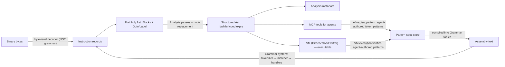

# Experiment: Grammar-Driven ISA Lifting → Poly.Ast → Agent Decompiler

**Date:** 2026-08-11
**Status:** **Speculative** — research memory only. Not committed, not on any roadmap. May be promoted to `docs/plans/` if a slice becomes active.
**Home:** `docs/experiments/` (speculative design memory).

---

## Research charter

### Problem

Today Poly's pipeline is **lowering-only**: Domain → AST → analysis → VM. There is no path to bring *foreign* executable artifacts (binary code, assembly) into the symbolic core. If we want agents to analyze, query, and run *existing* programs — not just domain-authored ones — we need a **lifting** path that lands on the same AST, the same analysis pipeline, and the same VM, rather than a parallel IR.

### Hypothesis

The **grammar engine** (`Poly/Grammar/`) plus the **analysis + node-replacement pipeline** can lift an ISA into `Poly.Ast` nodes, and that lifted artifact — serializable, analyzable, VM-executable — is the right substrate for a **decompilation tool for agents**.

The key claim: *parsing* is grammar-table-driven reuse (like the DSL and C99 integration paths), and *structuring/typing* is ordinary analysis-pass work (like `ConstantFoldingPass` node replacement). Neither requires a new engine.

A second claim: the grammar is a **data table**, so agents can *author the tool itself* —
discovering the asm → higher-level pattern reversals and contributing them as token patterns
through MCP tools, with the VM verifying each contribution **by execution rather than by review**.
The decompiler is not a fixed tool agents consume; it is a **knowledge store agents grow**.

### The two-leg split (the important distinction)

| Leg | What it is | Is the grammar system the right tool? |
|-----|-----------|--------------------------------------|
| **Binary decode** | bytes → instruction records (variable-width opcode tables, ModRM/SIB, prefixes) | **No.** The engine is token-shaped (`IToken<TTokenKind>` over a `TokenStream`), not byte/bit-shaped. A byte decoder is a separate concern with its own tables. |
| **Assembly text → instruction records** | `mov reg, r/m` → structured instruction | **Yes, ideal fit.** Exactly the DSL pipeline shape: tokenizer owns decoding (`BufferedTokenReader.ScanNextToken`), matcher owns recognition (pattern table, longest-match), handlers own meaning. |

The instruction record is an **input artifact** (analogous to token streams / match results), never a product IR. The AST stays the symbolic primary (CORE hard line).

---

## Why the fit is good

### 1. The grammar engine has its third consumer lined up

Built for the `.poly` DSL, then proven reusable by the hand-rolled C99 + Arithmetic integration tests
(`Poly.Tests/Integration/C99ParserInterpreterTests.cs`). An ISA grammar is a *real* third consumer —
exactly the "second real use forces sharing" situation AGENTS.md §6 says to look for.

Assembly text is a language-shaped stream. An x86/RISC-V subset grammar is a
`Grammar<AsmToken, AsmTokenKind>` with patterns like:

```text
mov reg, r/m        →  Value(Reg).Kind(Comma).Predicate(IsRm)
mov r/m, imm        →  Predicate(IsRm).Kind(Comma).Predicate(IsImm)
jmp rel             →  Kind(Rel)
jcc cc, rel         →  ...
```

**Longest-match resolves overlapping operand forms** (`mov r/m64, imm32` vs `mov r64, imm64`)
the same way `DslGrammar`'s `expr` layer resolves `a + not b` — pattern table sorted + longest-match,
no hand-written disambiguation. `LeftAssoc` handles instruction-list chains; `Repeat` handles
operand lists; handlers build records from `match.Tokens`.

### 2. The AST already supports flat, unstructured IR

`GotoStatement` + `LabelDeclaration` exist. So the first lifting step produces **basic blocks with
gotos/labels** — valid, faithful, honest Poly.Ast with **no control-flow structuring required**.
This is the decompiler's version of "shipped capability over completeness": flat IR is a correct
artifact; structuring is a later pass.

### 3. Structuring and typing happen *in the pipeline* — the platform's strength

This is the most Poly-specific part. The analysis framework (`INodeAnalyzer` +
`context.SetNodeReplacement(node, replacement)`) is the platform rewrite mechanism:
write passes that rewrite

- `goto`-graphs → `IfStatement` / `WhileLoop` / `ForLoop` / `SwitchStatement`
- flat ops on registers → typed expressions (`Add`, `Multiply`, `BitwiseAnd`, `ShiftLeft`, `IndexAccess`, …)
- raw memory access → typed loads/stores where recoverable

`DirectVmAbiEmitter.CompileNode` and `LinqExpressionGenerator` honor replacements before dispatch —
**no emitter or ABI changes needed**. That is "extend the platform in the pipeline" applied in
reverse (lifting instead of lowering).

### 4. The AST surface is low-level enough

Already present: `BitwiseAnd/Or/Xor/Not`, `ShiftLeft/ShiftRight`, `PopCount`,
`StridedSetBits`, `TypeCast`, `TypeAs`, `IndexAccess`, `NewArray`, `Conditional`,
`UnaryMinus`, `Lambda`. And `Ast/Nodes/TypeDefinitions/` carries the full member model
(`MethodDefinitionNode`, `FieldDefinitionNode`, `NamedTypeReference`,
`PrimitiveTypeReference`, `UnionTypeReference`, …) so a decompiled function has a home.

### 5. The "for agents" payoff is the strongest argument

The lifted artifact is **not text for humans** — it is a symbolic, serializable,
VM-executable AST with analysis metadata attached. Agents get:

- **Executable understanding** — run a decompiled function in the VM (`DirectVmAbiEmitter`
  → `VmState`/`Heap`/`ValueStack`) to observe behavior, not just read it.
- **Semantic queries** — existing passes (types, scopes, CFG, side effects, folding) run on the
  result unchanged.
- **A clean MCP surface** — new tools over the existing session store
  (`decompile_isa`, `lift_assembly`, `structure_blocks`, …).

This is the neurosymbolic loop applied to foreign binaries: bytes become runnable symbolic artifacts.

### 6. Agents can author the tool itself — data-authored grammar knowledge

The grammar is a pattern table, and pattern tables are data. Today `Grammar<AsmToken, AsmTokenKind>`
is built via fluent C# (`.Define(...).Pattern(...)`), but a declarative pattern spec (JSON or a
mini-DSL) maps 1:1 onto that builder — and `Printer` already round-trips patterns, so a serialized
grammar is feasible. That makes the pattern set an **evolvable knowledge store** rather than
fixed source:

```text
Agent sees an instruction form the grammar rejects (fail-closed: unmatched → error)
  → define_isa_pattern { rule, elements: [reg, comma, rm] }
  → spec validated (kinds exist, refs resolve, no longest-match ambiguity vs existing patterns)
  → grammar recompiles
  → re-parse → lift → structure → run in VM
  → matches oracle? pattern is verified knowledge : agent revises
```

Agents are good at exactly the discovery part humans find tedious: enumerating instruction forms
from disassembly output and abstracting them into patterns ("here are 20 `mov` variants → here is
the pattern"). The VM is the validator — a contributed pattern is only "known" when a lifted
artifact executes to the same observable result as the original. **Run to verify, not read to review.**

#### MCP tool surface (sketch)

| Tool | Role |
|------|------|
| `define_isa_pattern` | Submit a validated pattern spec; recompiles the grammar; rejects specs that reference unknown token kinds or unresolvable rule refs (parse-time), and flags longest-match ambiguities against existing patterns (analyze-time) |
| `list_isa_patterns` / `describe_isa_pattern` | Inspect the current pattern set — the tool's knowledge is auditable and diffable |
| `verify_isa_pattern` | Execute the lifted artifact for a sample against an oracle; promotes a session-scoped pattern to checked-in knowledge |

Guardrails mirror the repo's existing DSL discipline:

- **Fail-closed everywhere** — unmatched instructions error; an agent cannot claim coverage the
  grammar does not have (no vacuous success).
- **Guide-synced surface** — a pattern-spec guide (analog of the DSL-guide sync rule in `AGENTS.md`)
  is the product-true reference for `define_isa_pattern`; agents do not invent lab syntax the
  tool rejects.
- **Honesty notes** — the MCP tools state what they do *not* enforce, same as `apply_dsl`.
- **Promotion path** — patterns start session-scoped/experimental; verification promotes them to
  checked-in grammar tables.

The structuring side is a second, *code-authored* surface: agents write structuring passes as
C# through the normal test-authoring loop (`test → smallest fix → generalize`), not through a
declarative pass-DSL. Data-authored knowledge (parse patterns) and code-authored knowledge
(structuring passes) are both agent-doable, with different guardrails.

---

## Proposed pipeline



The instruction records are an input artifact; the AST is the symbolic primary;
structuring/typing live in analysis. No parallel primitive IR (CORE hard line).

---

## What already exists to reuse

| Piece | Location |
|-------|----------|
| Pattern-table grammar engine | `Poly/Grammar/` — `IToken<TTokenKind>`, `BufferedTokenReader`, `Grammar<TToken,TTokenKind>.Define(...).Pattern(...)`, `Matcher` (longest-match), `Printer` |
| Grammar → AST → VM precedent | `Poly.Tests/Integration/C99ParserInterpreterTests.cs` (hand-rolled lexer → token reader → grammar → AST → VM) |
| Flat IR nodes | `Ast/Nodes/GotoStatement.cs`, `LabelDeclaration.cs` |
| Structured nodes | `IfStatement`, `WhileLoop`, `ForLoop`, `DoWhileLoop`, `SwitchStatement`, `TryCatchFinally` |
| Low-level expression nodes | `Bitwise*`, `ShiftLeft/Right`, `PopCount`, `StridedSetBits`, `TypeCast`, `IndexAccess`, `NewArray` |
| Member model | `Ast/Nodes/TypeDefinitions/` |
| Rewrite mechanism | `Analysis/NodeReplacementMetadata.cs` — `context.SetNodeReplacement` / `provider.GetNodeReplacement`; example producer: `ConstantFoldingPass` |
| Executor | `Interpretation/Vm/DirectVmAbiEmitter.cs`, `VmState`, `Heap`, `ValueStack` |
| Type model (for recovery) | `Introspection/` (platform-agnostic) |
| Agent surface | `Poly.Mcp/` session store + tools |
| Extensible-parse-form precedent | `Poly/DomainModeling/Parsing/ExpressionFormRegistry.cs` — the repo's existing runtime registry shape for open parse forms |

---

## Honest hard parts

1. **Type recovery is the research-grade problem, not the parsing.** Register-width inference,
   calling conventions, struct layout — this is where decompilers earn their difficulty.
   `Introspection` is the right seam, but expect multi-iteration effort. Do not underestimate this.
2. **Flags/registers are a modeling decision.** The C#-shaped AST has no `FLAGS` register.
   Options: model status flags as plain variables, model them as opaque calls, or leave them
   implicit in condition nodes. Memory is `IndexAccess` on a byte-array-shaped variable —
   faithful but noisy.
3. **Scope discipline (AGENTS.md §5).** Do not build "the decompiler." Build the thinnest slice
   that proves the capability (below).
4. **Byte decoding stays out of the grammar system.** If raw binaries are ever a goal, the
   decoder is separate machinery with its own tables; the grammar leg is the assembly-text path.
5. **There is no declarative grammar format today.** `Grammar` is built via fluent C#. A
   pattern-spec surface (JSON/mini-DSL) that compiles 1:1 to the builder is small new machinery,
   and `Printer` gives serialization precedent — but it must be built and guide-documented before
   agents can contribute patterns.

---

## Thinnest first slice (if this ever becomes active)

A **fixed-width ISA or a tiny x86 subset** — `mov`, arith (`add/sub/and/or`), `jcc`, `call`/`ret` —
parsed via the grammar → flat blocks with gotos → **one** structuring pass → run it in the VM.

That is a contained, weekend-shaped loop on the existing C99 test pattern, and it proves the
whole direction end-to-end (parse → lift → structure → execute). Everything after that
(more instructions, more passes, MCP tools, binary input) is additive.

### Suggested slice gates

| Gate | Signal |
|------|--------|
| **G1 Parse** | Assembly text for the subset parses via grammar tables → instruction records, with longest-match disambiguation pinned by tests |
| **G2 Flat lift** | Instruction records → Poly.Ast blocks + gotos/labels; round-trips through the printer; VM executes a trivial flat function |
| **G3 One structuring pass** | `goto`-graph → `if`/`while` for one canonical shape (e.g. straight-line + one conditional branch + one loop); replacement honored by the emitter |
| **G4 Executable semantics** | Decompiled structured function runs in the VM and produces the same observable result as the original (oracle = hand-written equivalent) |
| **G5 Agent-evolved knowledge** | One pattern contributed via `define_isa_pattern` (validated spec → recompiled grammar → previously-rejected instruction form now parses), verified by VM execution against an oracle |

---

## Non-goals (for this experiment, until rechartered)

- A byte-level decoder as part of the grammar system (separate concern)
- Full x86-64/ARM coverage, perfect type recovery, or decompiler-parity fidelity as v0
- A parallel primitive IR — the AST remains the symbolic primary
- The agent-authoring MCP surface before G1–G4 prove the pipeline (designed-in from the start, implemented after the core loop works)
- Unvalidated agent-authored patterns — every contribution is spec-validated and execution-verified; no trust-by-default
- Structuring passes as agent-authored *data* — parse patterns evolve as data via MCP; structuring passes evolve as agent-written C# through the normal test loop
- Active implementation while MCP dogfood / product slices are the current pick
