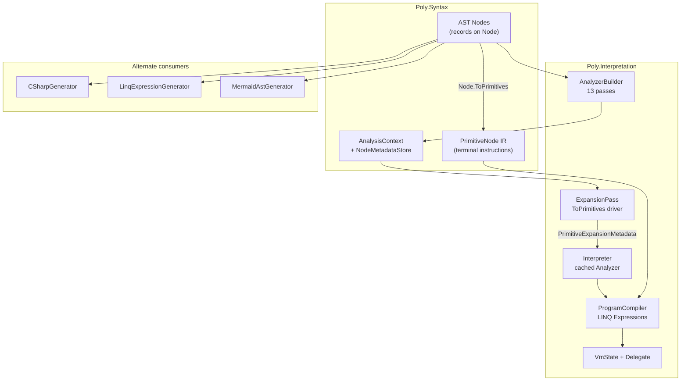

# Interpretation System — Architecture Review (Living Document)

**Created:** 2026-07-05  
**Status:** Active — iterative review in progress  
**Scope:** `Poly/Interpretation/`, `Poly/Syntax/` (nodes, primitives, analysis infrastructure), and backends that consume the interpretation pipeline.  
**Companion artifacts:** [`docs/plans/interpretation-system-issues.md`](plans/interpretation-system-issues.md) (task tracker), [`docs/decisions/`](decisions/) (ADRs), [`Poly/Interpretation/README.md`](../Poly/Interpretation/README.md) (module map).

---

## Agent preamble — continue this review

**Copy this section into your context when asked to evolve this document.**

You are extending a **living architecture review**, not implementing fixes and not maintaining the task tracker. Your job is to deepen system understanding and surface **contradictions** (intent ≠ reality) and **conceptual issues** (design risks) with evidence from the codebase.

### Mission

1. **Describe** each Interpretation component as it exists today (files, data flow, contracts).
2. **Compare** against ADRs in `docs/decisions/` and module READMEs — note drift.
3. **Register** findings in §5 (contradictions) or §6 (conceptual issues) with stable IDs.
4. **Do not** duplicate `docs/plans/interpretation-system-issues.md` — link to INT-/ANA- items when a finding already has a tracked task; add new register entries when the issue is architectural insight not yet captured.

### Required reading (in order)

| Order | Source | Why |
|-------|--------|-----|
| 1 | This document (full) | Current map, registers, open questions |
| 2 | `docs/decisions/README.md` + Interpretation ADRs (`vm-as-canonical-semantics`, `primitives-as-canonical-ir`, `domain-lowering-boundary`, `bytecode-serialization`, `vm-gap-analysis`) | Stated intent |
| 3 | `Poly/Interpretation/README.md`, `Poly/Interpretation/Analysis/README.md`, `Poly/Interpretation/Vm/README.md`, `Poly/Syntax/Primitives/README.md` | Operational truth |
| 4 | `Poly/Interpretation/Interpreter.cs` | Canonical pipeline assembly |
| 5 | Target subtree for this iteration (see §8 Recommended review iterations) | Depth |

Run `dotnet run --project Poly.Tests/Poly.Tests.csproj` if you change claims about behavior. Cite **file:line** or README sections for every new register entry.

### Per-session workflow

```
1. Pick one iteration focus from §8 (or user direction). State it in the revision log.
2. Read code + ADRs for that slice only — avoid drive-by refactors.
3. Update §3 component text if descriptions are wrong or incomplete.
4. Add/update §5 C-* or §6 K-* entries (do not renumber closed items; mark Status: resolved).
5. Update §7 health summary and §10 open questions if warranted.
6. Bump revision log (0.1 → 0.2); one-line summary of what changed.
7. If a contradiction is policy-level, note "needs ADR update" — do not edit ADRs unless asked.
```

### ID conventions

| Prefix | Section | Meaning | Example |
|--------|---------|---------|---------|
| `C-NNN` | §5 | Doc/ADR/code mismatch | C-002: tracker says INT-001 done, throw is no-op |
| `K-NNN` | §6 | Design risk or structural tension | K-001: untyped long stack ABI |
| `Rev 0.N` | Revision log | Document version | Increment by 0.1 per substantive pass |

New IDs: next free number in the section. When resolving: set `Status: resolved` + `Resolved: YYYY-MM-DD` + one-line note; keep the row for history.

### Entry template (copy for each new finding)

```markdown
| **C-0NN** | High/Med/Low | One-sentence contradiction | Evidence: `path:line` or ADR title vs code | Resolution direction (not implementation plan) |
```

```markdown
| **K-0NN** | Area | One-sentence conceptual issue | Why it matters for correctness, portability, or roadmap |
```

### Quality bar

- **Evidence required** — no speculative bugs without a code path or test reference.
- **Distinguish** contradiction (someone is wrong on paper) vs conceptual issue (tradeoff or latent risk).
- **Proportional edits** — one iteration = one slice (e.g. EH only, or catalog only); do not rewrite the whole doc.
- **Preserve tone** — descriptive and neutral; avoid sprint/task language in §3–§6.
- **Skip** style nits, formatting-only changes, and test-count bragging unless behavior changed.

### Do not

- Turn this into a duplicate of `interpretation-system-issues.md` (no INT-/SPRINT- task lists here).
- Mark architectural problems `done` because a test passes — tests prove behavior, not design coherence.
- Delete register rows; resolve in place.
- Implement code fixes in the same turn unless the user explicitly asks — this document is identification-first.

### Suggested prompts for the user

- *"Execute Rev 0.2: trace try/catch + using end-to-end; update §3.5 and §3.7."*
- *"Reconcile §5 against current tracker; close resolved C-* items."*
- *"Add backend parity matrix (Rev 0.4): VM vs Linq per node kind."*
- *"Deep-dive INT-019 path: catalog, CallSiteCompiler, serialization ADR — new C/K entries only."*

---

## How to use this document

This is a **holistic system review**, not a task list. Each revision should:

1. Describe what each component *is* and *does* in the current codebase.
2. State explicit design intent (from ADRs / READMEs).
3. Flag **contradictions** where intent, documentation, and implementation diverge.
4. Flag **conceptual issues** where the architecture creates latent bugs, duplication, or blocked roadmap work.

**Revision log**

| Rev | Date | Author | Summary |
|-----|------|--------|---------|
| 0.1 | 2026-07-05 | Architecture review pass | Initial component map, pipeline description, contradiction register after P0 sprint completion (1395/1395 tests green). |
| 0.1.1 | 2026-07-05 | Preamble added | Agent preamble for multi-model continuation (workflow, IDs, quality bar, do-not list). |
| 0.2 | 2026-07-05 | Value repr + TypeIs deep-dive | Traced ValueRepresentationPass → InterpretResult ABI; verified TypeIs correctness (TypeCheck + StaticTypeIsMatch); identified VM-path TypeIs test gap (K-015), TypeCheck CLR embedding (K-016), stale vm-gap-analysis priority (C-010), and misleading test name (C-011). |

---

## 1. System purpose

The Interpretation system is Poly's **canonical execution semantics** for AST programs. It:

1. **Analyzes** syntax trees (`Poly.Syntax.Nodes`) and attaches semantic metadata.
2. **Lowers** analyzed trees to a portable primitive IR (`Poly.Syntax.Primitives`).
3. **Compiles** primitives to a LINQ Expression delegate (`ProgramCompiler`).
4. **Executes** via the stack VM (`VmState`, `Vm.Execute` path through `Interpreter`).

Per [2026-06-08-vm-as-canonical-semantics.md](decisions/2026-06-08-vm-as-canonical-semantics.md), the VM is the **single source of truth** for behavior. `LinqExpressionGenerator` remains a secondary reference backend; the tree-walking interpreter is removed.

Per [2026-07-04-primitives-as-canonical-ir.md](decisions/2026-07-04-primitives-as-canonical-ir.md), **primitives are the canonical IR** — there is no separate `Poly/Ir/` module.

---

## 2. End-to-end architecture



**Canonical path (production):**

```
AST → Analyzer (13 passes) → PrimitiveExpansionMetadata
    → ProgramCompiler.CompilePrimitives → VmProgram
    → VmState → InterpretResult
```

**Non-canonical but present:**

- Direct `node.ToPrimitives(expansionCtx)` without full pipeline (tests, DEBUG fallback in `CompileCore`).
- `LinqExpressionGenerator` parallel lowering (~1,100 LOC per tracker INT-003).
- `CSharpGenerator` / `MermaidAstGenerator` for emission and visualization.

---

## 3. Component reference

### 3.1 AST layer (`Poly/Syntax/Nodes/`)

| Aspect | Description |
|--------|-------------|
| **Role** | Human- and domain-facing program representation. Records with `Children`, stable `NodeId`, structural equality. |
| **Lowering contract** | Each expression/statement implements `ToPrimitives(ExpansionContext)` — emits a **linear** primitive sequence. |
| **Analysis contract** | Passes stamp `IAnalysisMetadata` per node; some passes replace nodes (`GetNodeReplacement`). |
| **Key types** | `Block`, `Invoke`, `Member`, `Lambda`, `TryCatchFinally`, `UsingStatement`, control-flow nodes, operators. |

**Design intent:** AST stays rich for analysis and domain modeling; primitives stay portable for execution and serialization.

**Current state:** ~60 node types implement `ToPrimitives`. Lowering is **distributed** — each node encodes its own expansion logic, reading analysis metadata opportunistically.

---

### 3.2 Analysis infrastructure (`Poly/Syntax/Analysis/`)

| Component | Role |
|-----------|------|
| `Analyzer` | Runs ordered `INodeAnalyzer` passes; supports full and incremental re-analysis. |
| `AnalyzerBuilder` | Fluent registration of passes. |
| `AnalysisContext` | Per-run metadata store, diagnostics, type provider, settings. |
| `NodeMetadataStore` | Cloneable key/value store keyed by `Node?` (null key = module-level). |
| `IncrementalAnalysisAnalyzer` | Builds tree index; marks affected subtrees; gates `ShouldAnalyze`. |

**Design intent:** Passes are **stateless**; all mutable traversal state lives on `AnalysisContext` metadata (or should).

**Interpreter does not use incremental analysis** — `Interpreter._analyzer` always runs full analysis. `DomainModelAnalyzer` does use `.UseIncrementalAnalysis()` for domain graphs, not expression ASTs.

---

### 3.3 Analysis passes (`Poly/Interpretation/Analysis/`)

Standard pipeline (from `Interpreter.cs`, mirrored in `Analysis/README.md`):

| # | Pass | Primary metadata | Depends on |
|---|------|------------------|------------|
| 1 | `TypeAndMemberResolver` | Resolved types, members | — |
| 2 | `ScopeValidator` | `VariableAnalysisMetadata` | types |
| 3 | `SideEffectAnalyzer` | `SideEffectMetadata`, `ElisionMetadata` | scopes |
| 4 | `ThisReferenceContext` | `this` type on `ThisReference` | types |
| 5 | `JumpTargetAnalyzer` | `ResolvedJumpTarget` | — |
| 6 | `ControlFlowAnalysisPass` | `ControlFlowMetadata`, reachability | jump targets |
| 7 | `ValueRepresentationAnalyzer` | `ValueRepresentationMetadata` | types, CFG |
| 8 | `CallSiteCatalogAnalyzer` | `CallSiteCatalogMetadata`, `CallSiteIndexMetadata` | member resolution |
| 9 | `ConstantFoldingPass` | `ConstantValueMetadata`, replacements | CFG, side effects |
| 10 | `DefiniteAssignmentAnalyzer` | `DefiniteAssignmentMetadata` | CFG |
| 11 | `LambdaReturnTypeAnalyzer` | Lambda resolved types | types |
| 12 | `ExceptionRegionAnalyzer` | `ExceptionRegionMetadata`, `InProtectedRegionMetadata` | CFG |
| 13 | `ExpansionPass` | `PrimitiveExpansionMetadata`, `ExpansionContext` | all above |

**P0 sprint additions (2026-07-05):** passes 7, 8, 12 and their `ToPrimitives` consumers (`RootValueKind`, `CallExternal.SiteIndex`, EH placeholders).

**Pass 7 — `ValueRepresentationAnalyzer` detail:** Post-order traversal; classifies each node as `Void`, `StackScalar`, `Bool`, `HeapRef`, or `Unknown`. Block propagation: `ClassifyBlock` → `PropagateChild(context, block.Nodes[^1])` — last expression determines block's representation. `Coalesce`/`Conditional` check resolved type first, then fall back to child propagation. `ClassifyTypeDefinition` maps `IClrTypeDefinition` → `IsValueType`/`IsPrimitive` → scalar vs heap; non-CLR types default to `HeapRef` (conservative). Null constants explicitly return `StackScalar` (0L sentinel) to avoid heap-dereference in `InterpretResult` fallback.

---

### 3.4 Primitive IR (`Poly/Syntax/Primitives/`)

| Aspect | Description |
|--------|-------------|
| **Role** | Canonical intermediate representation — instruction set for VM and future serializers. |
| **Shape** | Flat `PrimitiveNode[]` with `StackEffect (pop, push)`; optional `InputSlots`/`ResultSlot` per ADR (mostly unused today). |
| **Linking** | `PrimitiveLinker` resolves `Label` → PC for `Goto`/`CondGoto`. |
| **SSA** | `Phi` primitive exists; emitted by `Conditional`/`IfStatement` convergence. `EmitPhi` in `ProgramCompiler` implements merge. |
| **EH placeholders** | `RegionMarker`, `ThrowProtected` — no-op in compiler until INT-018. |
| **Interop** | `CallExternal` — `MethodBase` target + optional `SiteIndex` into catalog. |

**ADR promise vs code:**

| ADR element | Documented | Implemented |
|-------------|------------|-------------|
| `ValueSlot` / explicit slots | Yes | Types exist; expansion rarely sets slots |
| `Phi` | Yes | Yes (partial — convergence only) |
| `Module` / `BasicBlock` container | Yes | **No** `Module.cs` in `Syntax/Primitives/` |
| `CompileModule()` | Yes | **No** — only `CompilePrimitives()` |

---

### 3.5 Expansion (`ExpansionPass` + `ExpansionContext`)

| Aspect | Description |
|--------|-------------|
| **Driver** | `ExpansionPass` calls `node.ToPrimitives(pCtx)` pre-order; stores result in `PrimitiveExpansionMetadata`. |
| **Shared state** | `ExpansionContext` on null metadata key: slot assignment, loop boundaries, pending lambda bodies. |
| **Lambdas** | `Lambda.ToPrimitives` creates child scope; registers pending functions; emits `AllocClosure`. |
| **Parameter binding** | Lambda parameters registered by name; body `Parameter` nodes with same name alias to declared slot. |

**Design tension:** Expansion is both a **pass** (runs in analyzer) and a **method on every node** (lowering logic). There is no separate "lowering visitor" — `ToPrimitives` *is* the lowering layer.

**TypeIs lowering pattern (representative):** `TypeIs.ToPrimitives` branches on `ValueRepresentationKind` from analysis:
- `HeapRef` → emits `TypeCheck(TargetType)` runtime check via `Type.IsInstanceOfType`.
- `StackScalar`/`Bool` → compile-time `StaticTypeIsMatch`, emits `PushConstant(1L|0L)` — correct by construction since analysis determines representation.
- `Unknown` → `PushConstant(0L)` — conservative fallback (no-analysis path).
This three-way branch pattern (runtime-check / static-resolved / fail-closed) is a model for how other nodes could consume value representation metadata.

---

### 3.6 Interpreter façade (`Poly/Interpretation/Interpreter.cs`)

| API | Behavior |
|-----|----------|
| `Analyze` | Cached 13-pass pipeline. |
| `Compile` | Analyze + `CompileCore`. |
| `Execute` | Compile + run delegate + `InterpretResult`. |
| `CompileCore` | Reads `PrimitiveExpansionMetadata`; extracts lambda bodies; stamps `RootValueKind`, `CallSites` on `VmProgram`. |

**Result ABI (`InterpretResult`):**

- Uses `VmProgram.RootValueKind` from `ValueRepresentationMetadata` on root when set.
- `StackScalar` / `Bool` → raw `long` on stack, no heap deref.
- `HeapRef` → dereference handle via `Heap.UnsafeGet`.
- Fallback heuristic when kind absent (void programs, custom pipelines).

**Block roots:** `ValueRepresentationAnalyzer` propagates last expression child — block-rooted VM tests get correct `RootValueKind`.

---

### 3.7 VM engine (`Poly/Interpretation/Vm/`)

| File | Role |
|------|------|
| `ProgramCompiler` | Primitive → LINQ Expression switch; ring allocation; `EmitCallExternalDirect`, `EmitPhi`, etc. |
| `CompilationContext` | Ring slots, labels, frame base, call-site catalog for indexed external calls. |
| `VmState` | Stack, heap, registers, PC, closures, trace, debug interrupt. |
| `VmProgram` | Delegate + `MaxActiveLocalsDepth` + optional `Functions[]` + `RootValueKind` + `CallSites`. |
| `CallSiteCompiler` | **Separate** path: compiles `MethodInfo` → `CallSiteDelegate` (stack manipulation). |
| `Heap` | Append + free-list; no tracing GC ([ADR](decisions/2026-06-08-heap-reclamation.md)). |

**Call model:**

- Top-level and lambda bodies: separate compiled `Action<VmState>` delegates in `VmProgram.Functions`.
- `Call` / `AllocClosure` dispatch to function table.
- `Return` in lambda body ends that delegate (jumps to `ExitLabel`) — not a full in-delegate frame return ([INT-005](plans/interpretation-system-issues.md)).

**Value representation on stack:**

- Primitives and small ints: raw `long` in `ValueStack.RawSlots`.
- Reference types: heap index as `long`.
- Bools: `0`/`1` as long.
- No tag bits on stack — **type knowledge is external** (analysis metadata or compile-time convention).

---

### 3.8 Alternate backends

| Backend | Consumes | Status |
|---------|----------|--------|
| `LinqExpressionGenerator` | AST directly | Secondary test reference; duplication risk (INT-003). |
| `CSharpGenerator` | AST | Code emission; not parity-tested against VM for all constructs. |
| `MermaidAstGenerator` | AST | Visualization only. |

**Design intent:** VM is canonical; others must converge or be deprecated.

---

## 4. Cross-cutting concerns

### 4.1 Metadata ownership

```
Node-level:     ValueRepresentation, CallSiteIndex, InProtectedRegion, PrimitiveExpansion, ...
Module-level:   CallSiteCatalog, ExceptionRegions, ExpansionContext (null key)
Pass-internal:  CallSiteCatalogState, ExceptionRegionState, ExpansionPassState (null key, transient)
```

**Rule:** Module-level metadata on `null` key must be rebuilt consistently on incremental runs. Catalog and EH passes seed from prior catalog on incremental entry; `ExpansionPass` creates fresh `ExpansionContext` at root.

### 4.2 CLR embedding in IR

| Mechanism | Portable? | Notes |
|-----------|-----------|-------|
| `CallExternal.Target` (`MethodBase`) | No | Direct CLR reference in primitive |
| `CallExternal.SiteIndex` | Yes (with catalog table) | INT-019 target |
| `PushConstant` / `LoadHeapConstant` | Partial | Object identity not portable |
| `TypeCheck.TargetType` | No | `System.Type` in primitive (see K-016) |

**Contradiction:** ADR [bytecode-serialization](decisions/2026-06-08-bytecode-serialization.md) assumes portable call-site tuples + `CallSiteCompiler` at load time, while the hot path still embeds `MethodBase` in `CallExternal` and uses `ProgramCompiler.EmitCallExternalDirect` — `CallSiteCompiler` is parallel infrastructure, not the main compile path.

### 4.3 Exception handling

| Layer | State |
|-------|-------|
| Analysis | `ExceptionRegionMetadata` table; `InProtectedRegionMetadata` on throws in try. |
| Expansion | `RegionMarker`, `ThrowProtected` placeholders. |
| VM | **No-op** — `PrimThrow`/`PrimThrowProtected`/`RegionMarker` emit nothing. |

**Conceptual gap:** EH is modeled three times (analysis, IR markers, VM) but only analysis is real. `vm-gap-analysis.md` §4 still applies: CLR faults inside opcodes bypass IR exception regions.

### 4.4 Domain modeling boundary

Per [domain-lowering-boundary](decisions/2026-06-08-domain-lowering-boundary.md): domain concepts lower to **generic** VM opcodes — no domain-specific instructions.

`DomainModelAnalyzer` is a **separate** analysis universe (structural/semantic domain passes on `Domain` graphs). It does not share the expression pipeline. Domain actions eventually lower to AST → primitives via `DomainLoweringGenerator`, but the VM has no entity/policy/event opcodes ([vm-gap-analysis](decisions/vm-gap-analysis.md) §3).

---

## 5. Contradiction register

Issues where **documentation, ADR, or stated intent** conflicts with **code or operational reality**.

| ID | Severity | Contradiction | Evidence | Resolution direction |
|----|----------|---------------|----------|-------------------|
| **C-001** | High | Primitives ADR promises `Module`, `BasicBlock`, `CompileModule()` | ADR 2026-07-04 consequences; no `Module.cs`; only flat `CompilePrimitives` | Update ADR status to "partial" or implement `Module.Build()` + compiler path |
| **C-002** | High | INT-001 marked `done` but `PrimThrow` is compiler no-op | Tracker vs `ProgramCompiler` `PrimThrow => null` | Reopen INT-001; align with INT-018 EH implementation |
| **C-003** | Medium | INT-002 marked `open` in tracker; ANA-001/`RootValueKind` fixes standard path | Tracker stale; integration tests pass | Close INT-002 for standard pipeline; document fallback path |
| | | **→ Status: resolved 2026-07-05** — `Interpreter.CompileCore` stamps `RootValueKind` from `ValueRepresentationMetadata`; `InterpretResult` branches correctly. `StandardPipeline_SetsRootValueKind` test covers scalar/heap/bool. Fallback heuristic (`handle >= 2`) retained for Void/Unknown paths (ANA-FIX-020). |
| **C-004** | Medium | `Poly/Interpretation/README.md` omits passes 7–12 | README pass table ends at `UsePrimitiveExpansion` only in extensions list; pipeline section incomplete | Sync README with `Analysis/README.md` |
| **C-005** | Medium | `docs/decisions/README.md` vision bullet still says "tree-walker interpreter" | Index line 26 vs VM ADR | Fix index wording |
| **C-006** | Medium | Two external-call compilation paths | `ProgramCompiler.EmitCallExternalDirect` vs `CallSiteCompiler.Compile` | Document when each is used; converge on catalog + one emitter for INT-019 |
| **C-007** | Medium | `vm-gap-analysis.md` TypeIs section obsolete | Claims `IsNotNull` only; `TypeCheck` + static scalar match exist | Archive or revise §4 fidelity section |
| | | **→ Status: resolved 2026-07-05** — TypeIs now correctly uses `TypeCheck` primitive for heap-ref operands and `StaticTypeIsMatch` for scalar/bool. See K-015 for remaining VM-path test gap. |
| **C-008** | Low | `CallSite` catalog indexes `Member` property getters but not `ClrMethod` members | `ProcessMember` only handles `ClrTypeProperty` | Extend catalog or document intentional omission |
| **C-009** | Low | Sprint tracker W6 section still shows pre-closure ❌ rows | `interpretation-system-issues.md` §SPRINT-W6 vs header "complete" | Tracker hygiene pass |
| **C-010** | Medium | `vm-gap-analysis.md` priority list still ranks "Fix TypeIs" #1, but TypeIs is already correct | `vm-gap-analysis.md` line 177 vs `TypeIs.ToPrimitives` (`TypeCheck` + `StaticTypeIsMatch`) and `ProgramCompiler.EmitTypeCheckOp` | Revise priority list; move TypeIs row to "resolved" and reorder remaining gaps |
| **C-011** | Low | `PrimitiveExpandTests.Expand_TypeIs_StringRefType` test name implies correctness check, but actually tests no-analysis fallback (Unknown → 0L — "fails closed") | `Poly.Tests/Interpretation/PrimitiveExpandTests.cs:96` — `ExecExpand` creates fresh `ExpansionContext` without analysis pipeline, so `GetValueRepresentation` returns `Unknown` and `ToPrimitives` emits `PushConstant(0L)` | Rename test to `Expand_TypeIs_WithoutAnalysis_FailsClosed`; add separate VM-path test with full pipeline |

---

## 6. Conceptual issue register

Issues that are **internally consistent** but create **design risk, duplication, or roadmap friction**.

| ID | Area | Issue | Why it matters |
|----|------|-------|----------------|
| **K-001** | Value ABI | Stack slots are untyped `long`; heap handles and scalars share representation | Every consumer needs analysis or convention; bugs like INT-002 recur at API boundaries |
| **K-002** | Lowering | `ToPrimitives` on nodes reads analysis metadata ad hoc | No single "lowering contract" document; easy to emit IR inconsistent with analysis (EH, catalog) |
| **K-003** | IR maturity | `InputSlots`/`ResultSlot` unused in expansion | ADR SSA path incomplete; ring simulation remains sole dataflow model |
| **K-004** | Closures | One delegate per lambda body; `Return` ends program | Works today; blocks single-module multi-function bytecode ([INT-005](plans/interpretation-system-issues.md)) |
| **K-005** | Incremental | Expression pipeline supports incremental infra but `Interpreter` doesn't use it | Domain model gets incremental analysis; expression re-analysis is untested in production entry point |
| **K-006** | EH | Three-layer placeholder (analysis → markers → VM) without VM consumer | Risk of analysis/IR drift until INT-018; tests verify expansion shape only |
| **K-007** | TypeIs | Static scalar `is` uses compile-time type match (`StaticTypeIsMatch`); heap-ref `is` uses runtime `TypeCheck` primitive | Static path is correct by construction (representation determines lowering — analysis is source of truth). `Unknown` path fails closed (0L). The `TypeCheck` path is end-to-end untested through VM compile+execute — see K-015. The `System.Type` embedding blocks portable serialization — see K-016. |
| **K-008** | Memory | No GC; heap grows with synthesis loops | Documented in vm-gap-analysis; blocks long-running neurosymbolic evolution |
| **K-009** | Dual semantics | LinqExpressionGenerator still used in tests | Undermines "VM is canonical" until INT-003 migration |
| **K-010** | Phi | `Phi` emitted without explicit slot operands | `EmitPhi` uses ring merge logic; fragile at nested convergence (known fuzz test bug documented in `VmCorrectnessTests`) |
| **K-011** | Serialization | Catalog + `SiteIndex` partial; `MethodBase` still in IR | INT-019 requires compiler to use index-only path and drop embedded targets |
| **K-012** | Sandboxing | ADR describes permission table at `CallExternal` entry | Not wired in `ProgramCompiler` emission path |
| **K-013** | Peephole optimizer | ADR exists for post-lowering folds | No `PrimitiveOptimizer` in core path today |
| **K-014** | Domain | No VM opcodes for entity/policy/event | Expected per domain-lowering ADR, but neurosymbolic vision requires eventual lowering proof |
| **K-015** | TypeIs | No VM-path end-to-end test exercises `TypeCheck` primitive for heap-ref `is` | `PrimitiveExpandTests` skip analysis pipeline (Unknown → 0L); `ExpansionIntegrationTests` only verify expansion shape, not execution; `TypeCastTests` use `LinqExpressionGenerator`, not VM. The `TypeCheck` primitive emitted for `HeapRef` operands has no VM-path test that compiles and executes through the full `Interpreter` pipeline. Introduces regression risk when `EmitTypeCheckOp` changes. |
| **K-016** | Serialization | `TypeCheck.TargetType` embeds `System.Type` directly (same CLR coupling as `CallExternal.Target`) | `Poly/Syntax/Primitives/TypeCheck.cs:9` — `System.Type TargetType`. Blocks portable bytecode serialization of `TypeIs` in the primitive IR (INT-019 scope). Same class of issue as K-011 for `CallExternal`. |

---

## 7. Component health summary (2026-07-05)

| Component | Maturity | Test coverage | Notes |
|-----------|----------|---------------|-------|
| Type/member resolution | Strong | High | Foundation for all passes |
| CFG / constant folding | Strong | High | Elision integrated |
| Value representation | Good | Good | Block propagation via `ClassifyBlock` → last child. `NullConstant` returns `StackScalar` (0L sentinel, no `ClrType`). |
| TypeIs correctness | Good | Weak (VM-path) | Static scalar path correct (`StaticTypeIsMatch`). Heap-ref path (`TypeCheck` primitive) has no end-to-end VM test — see K-015. `TypeCheck.TargetType` embeds `System.Type` — see K-016. |
| Call site catalog | Good | Good | Constructors via `ClrConstructor`; `Member` methods gap |
| Exception regions (analysis) | Good | Good | CFG-unreachable catches still emitted (ANA-FIX-008 blocked) |
| EH (VM) | Absent | Placeholder only | INT-018 |
| Primitive expansion | Good | Mixed | Integration tests verify shape; many nodes only smoke-tested |
| ProgramCompiler | Good | `VmCorrectnessTests`, fuzz | `MaxActiveLocalsDepth` hardcoded 32 (INT-006) |
| InterpretResult ABI | Good | Integration tests | Fallback heuristic still present |
| Portable IR / serialization | Early | Minimal | INT-019 |
| Linq backend | Legacy | Broad | INT-003 deprecation |

---

## 8. Recommended review iterations

| Iteration | Focus | Output |
|-----------|-------|--------|
| **Rev 0.2** | ~~Trace one program end-to-end~~ Value repr + TypeIs deep-dive | **Done** — see revision log |
| **Rev 0.3** | ADR reconciliation pass | Update stale ADRs (vision index, vm-gap priority list, INT-001/002 tracker) |
| **Rev 0.4** | Backend parity matrix | VM vs Linq vs C# per node kind |
| **Rev 0.5** | INT-018/019 design chapter | EH + serialization architecture section in this doc |
| **Rev 0.6** | Domain lowering bridge | How `DomainLoweringGenerator` AST reaches `Interpreter` |
| **Rev 0.7** | TypeIs VM-path coverage gap | Add end-to-end VM tests for heap-ref `TypeIs` (TypeCheck primitive); verify emit + execute; validate static scalar path through full pipeline |

---

## 9. Related documents

| Document | Relationship |
|----------|--------------|
| [interpretation-system-issues.md](plans/interpretation-system-issues.md) | Actionable tracker (INT-*, ANA-*) |
| [vm-gap-analysis.md](decisions/vm-gap-analysis.md) | 2026-06 gap inventory — partially stale |
| [2026-07-04-primitives-as-canonical-ir.md](decisions/2026-07-04-primitives-as-canonical-ir.md) | IR authority |
| [2026-06-08-vm-as-canonical-semantics.md](decisions/2026-06-08-vm-as-canonical-semantics.md) | VM authority |
| [ARCHITECTURE.md](ARCHITECTURE.md) | Broader Poly architecture (includes VM notes) |
| [Poly/Interpretation/Analysis/README.md](../Poly/Interpretation/Analysis/README.md) | Pass registry (most current) |

---

## 10. Open questions

1. **Should `Module`/`BasicBlock` be implemented** or should the ADR be revised to "flat primitives + linker suffice"?
2. **When does `CallSiteCompiler` get retired** in favor of catalog-only `ProgramCompiler`?
3. **Is `LinqExpressionGenerator` still needed** for any correctness path, or only historical tests?
4. **Should `Interpreter` expose incremental analysis** as first-class API (INT-007 overlap)?
5. **Where does sandbox permission checking live** — compile time, `EmitCallExternalDirect` prologue, or a wrapper delegate?
6. **Should `TypeCheck` be serialized as a `System.Type` string** (e.g. assembly-qualified name) for portability, or should it use the same call-site catalog mechanism as `CallExternal`?
7. **Does the fallback heuristic in `InterpretResult` (`handle >= 2 && handle < heap.Count`) need to remain** for any production path, or can it be eliminated once all compile paths set `RootValueKind`?

---

*Next edit: bump revision log, add §3 walkthrough with concrete file:line anchors per pass, expand contradiction register as issues close.*