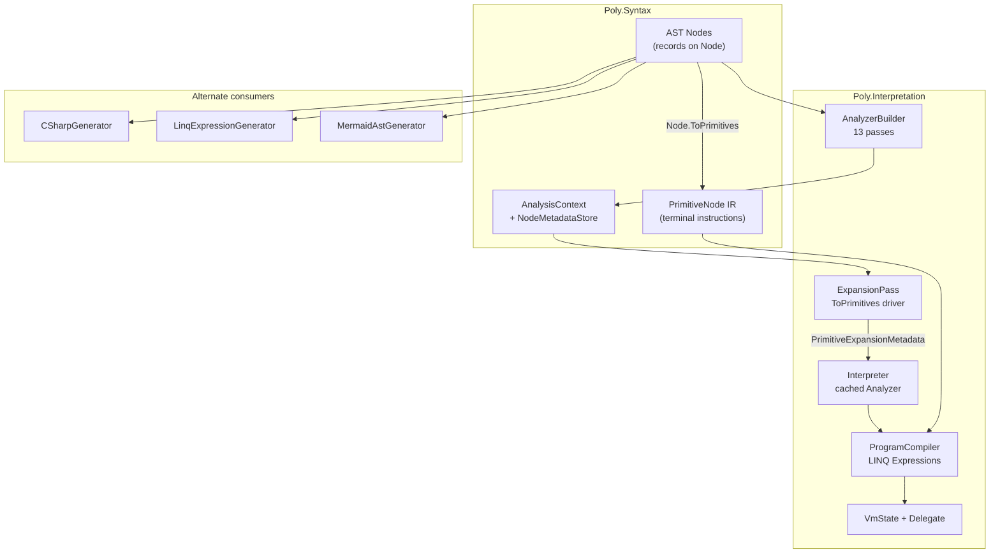

# Interpretation System — Architecture Review (Living Document)

**Created:** 2026-07-05  
**Status:** Active — iterative review in progress  
**Scope:** `Poly/Interpretation/`, `Poly/Syntax/` (nodes, primitives, analysis infrastructure), and backends that consume the interpretation pipeline.  
**Companion artifacts:** [`docs/plans/interpretation-system-issues.md`](plans/interpretation-system-issues.md) (task tracker), [`docs/decisions/`](decisions/) (ADRs), [`Poly/Interpretation/README.md`](../Poly/Interpretation/README.md) (module map).

---

## Agent preamble — continue this review

**Copy this section into your context when asked to evolve this document.**

You are extending a **living architecture review**, not implementing fixes and not maintaining the task tracker. Your job is to deepen system understanding and surface **contradictions** (intent ≠ reality) and **conceptual issues** (design risks) with evidence from the codebase.

### Mission

1. **Describe** each Interpretation component as it exists today (files, data flow, contracts).
2. **Compare** against ADRs in `docs/decisions/` and module READMEs — note drift.
3. **Register** findings in §5 (contradictions) or §6 (conceptual issues) with stable IDs.
4. **Do not** duplicate `docs/plans/interpretation-system-issues.md` — link to INT-/ANA- items when a finding already has a tracked task; add new register entries when the issue is architectural insight not yet captured.

### Required reading (in order)

| Order | Source | Why |
|-------|--------|-----|
| 1 | This document (full) | Current map, registers, open questions |
| 2 | `docs/decisions/README.md` + Interpretation ADRs (`vm-as-canonical-semantics`, `primitives-as-canonical-ir`, `domain-lowering-boundary`, `bytecode-serialization`, `vm-gap-analysis`) | Stated intent |
| 3 | `Poly/Interpretation/README.md`, `Poly/Interpretation/Analysis/README.md`, `Poly/Interpretation/Vm/README.md`, `Poly/Syntax/Primitives/README.md` | Operational truth |
| 4 | `Poly/Interpretation/Interpreter.cs` | Canonical pipeline assembly |
| 5 | Target subtree for this iteration (see §8 Recommended review iterations) | Depth |

Run `dotnet run --project Poly.Tests/Poly.Tests.csproj` if you change claims about behavior. Cite **file:line** or README sections for every new register entry.

### Per-session workflow

```
1. Pick one iteration focus from §8 (or user direction). State it in the revision log.
2. Read code + ADRs for that slice only — avoid drive-by refactors.
3. Update §3 component text if descriptions are wrong or incomplete.
4. Add/update §5 C-* or §6 K-* entries (do not renumber closed items; mark Status: resolved).
5. Update §7 health summary and §10 open questions if warranted.
6. Bump revision log (0.1 → 0.2); one-line summary of what changed.
7. If a contradiction is policy-level, note "needs ADR update" — do not edit ADRs unless asked.
```

### ID conventions

| Prefix | Section | Meaning | Example |
|--------|---------|---------|---------|
| `C-NNN` | §5 | Doc/ADR/code mismatch | C-002: tracker says INT-001 done, throw is no-op |
| `K-NNN` | §6 | Design risk or structural tension | K-001: untyped long stack ABI |
| `Rev 0.N` | Revision log | Document version | Increment by 0.1 per substantive pass |

New IDs: next free number in the section. When resolving: set `Status: resolved` + `Resolved: YYYY-MM-DD` + one-line note; keep the row for history.

### Entry template (copy for each new finding)

```markdown
| **C-0NN** | High/Med/Low | One-sentence contradiction | Evidence: `path:line` or ADR title vs code | Resolution direction (not implementation plan) |
```

```markdown
| **K-0NN** | Area | One-sentence conceptual issue | Why it matters for correctness, portability, or roadmap |
```

### Quality bar

- **Evidence required** — no speculative bugs without a code path or test reference.
- **Distinguish** contradiction (someone is wrong on paper) vs conceptual issue (tradeoff or latent risk).
- **Proportional edits** — one iteration = one slice (e.g. EH only, or catalog only); do not rewrite the whole doc.
- **Preserve tone** — descriptive and neutral; avoid sprint/task language in §3–§6.
- **Skip** style nits, formatting-only changes, and test-count bragging unless behavior changed.

### Do not

- Turn this into a duplicate of `interpretation-system-issues.md` (no INT-/SPRINT- task lists here).
- Mark architectural problems `done` because a test passes — tests prove behavior, not design coherence.
- Delete register rows; resolve in place.
- Implement code fixes in the same turn unless the user explicitly asks — this document is identification-first.

### Suggested prompts for the user

- *"Execute Rev 0.2: trace try/catch + using end-to-end; update §3.5 and §3.7."*
- *"Reconcile §5 against current tracker; close resolved C-* items."*
- *"Add backend parity matrix (Rev 0.4): VM vs Linq per node kind."*
- *"Deep-dive INT-019 path: catalog, CallSiteCompiler, serialization ADR — new C/K entries only."*

---

## How to use this document

This is a **holistic system review**, not a task list. Each revision should:

1. Describe what each component *is* and *does* in the current codebase.
2. State explicit design intent (from ADRs / READMEs).
3. Flag **contradictions** where intent, documentation, and implementation diverge.
4. Flag **conceptual issues** where the architecture creates latent bugs, duplication, or blocked roadmap work.

**Revision log**

| Rev | Date | Author | Summary |
|-----|------|--------|---------|
| 0.1 | 2026-07-05 | Architecture review pass | Initial component map, pipeline description, contradiction register after P0 sprint completion (1395/1395 tests green). |
| 0.1.1 | 2026-07-05 | Preamble added | Agent preamble for multi-model continuation (workflow, IDs, quality bar, do-not list). |
| 0.2 | 2026-07-05 | Value repr + TypeIs deep-dive | Traced ValueRepresentationPass → InterpretResult ABI; verified TypeIs correctness (TypeCheck + StaticTypeIsMatch); identified VM-path TypeIs test gap (K-015), TypeCheck CLR embedding (K-016), stale vm-gap-analysis priority (C-010), and misleading test name (C-011). |
| 0.3 | 2026-07-05 | Exception handling deep-dive | Traced EH through all 3 layers (analysis → expansion → VM). Found `EmitThrowOp` is dead code — implemented at `ProgramCompiler.cs:319` but never wired into switch (C-012). Zero VM-path tests exercise catch/finally (K-018). UsingStatement disposal also no-op at VM level. Updated §4.3, §5, §6, §7. |
| 0.4 | 2026-07-05 | Call site catalog deep-dive | Traced Invoke/New → CallSiteCatalogAnalyzer → CallExternal primitive → EmitCallExternalDirect. Found `CallSiteCompiler` is completely unused (C-013). CallExternal has redundant MethodBase+SiteIndex (K-019). Constructor catalog path untested (K-021). Updated §4.2, §5, §6, §7. |
| 0.5 | 2026-07-05 | ProgramCompiler architecture deep-dive | Analyzed ring allocation, Phi-as-no-op, value stack duality. Found `EmitPhi` generates no runtime code (K-022), no ring consistency verifier exists (C-014), and stale "KNOWN BUG" comments on passing tests (C-015). Updated §3.7, §4.5, §5, §6, §7. |
| 0.6 | 2026-07-05 | LinqExpressionGenerator deep-dive | Analyzed full structure vs VM path. Found LinqExpressionGenerator was the **first complete execution engine** — mature independent implementation covering ~40+ node types. VM supersedes it only for runtime introspection. Cross-engine validation covers only arithmetic/logic/property-access (K-024). LinqExpressionGenerator has DCE, type-promotion, and GetNodeReplacement features VM still needs (K-025). The VM must achieve semantic parity with LinqExpressionGenerator, not replace it (C-016). Updated §3.8, §5, §6, §7, §10. |
| 0.7 | 2026-07-05 | EH architecture deep-dive | Traced the three-layer EH gap to its root cause: the flat µop array model is **fundamentally incompatible** with structured exception handling. TryCatchFinally.ToPrimitives emits catch/finally body µops sequentially after try body µops, separated only by RegionMarker annotations. Since RegionMarker → null and PrimThrow → null, catch/finally bodies execute unconditionally after the try body — a silent correctness bug (C-017, C-018). The only EH VM-path test (`Expand_TryCatchFinally_ExecutesTryBlock`) passes by coincidence: it has no catch/finally AND no analysis metadata (else branch). Added §4.6, §5 (C-017, C-018), §6 (K-026, K-027, K-028). Updated §4.3, §7, §8, §10. |
| 0.8 | 2026-07-05 | Domain lowering bridge deep-dive | Traced how domain-level constructs reach the Interpreter. Found **two analysis universes** (17 V3 domain passes vs 13 expression passes) using the same infrastructure with no shared passes. **Two lowering paths**: V3 DomainExpressionLoweringPass (~160 lines, expression-only) and V2 DomainLoweringGenerator (~1528 lines, full policy/effect/type-def pipeline). Action bodies bypass the Interpreter entirely — they go through CSharpGenerator, not the VM. Hidden cross-validation in PolicyEvaluator.Evaluate (Debug.Assert) is the only domain→VM execution path, but Release builds strip asserts. No V3 domain test exercises the full pipeline through execution (C-019, C-020, K-029, K-030, K-031). **User caveat (2026-07-05):** The v2→v3 refactoring is in active transition — the dual-path state is intentional incremental architecture, not a defect. Entries C-019, K-029, K-030, K-031 softened to reflect this. Updated §4.4, §5, §6, §7, §8, §10. |
| 0.9 | 2026-07-05 | TypeIs VM-path deep-dive | Traced the full `TypeIs` → `TypeCheck` primitive → `EmitTypeCheckOp` pipeline. Found: (1) The `TypeCheck` runtime path via `EmitTypeCheckOp` is correctly implemented but has **zero end-to-end VM-path tests** — no test creates a heap-ref TypeIs, analyzes it, compiles through Interpreter, and executes through VM. (2) The three-way lowering strategy (HeapRef→TypeCheck, StackScalar→StaticTypeIsMatch, Unknown→0L) is well-designed but creates an analysis correctness dependency for the scalar path. (3) The `TypeCastTests` use `BuildExpression()` (LINQ path), not the VM. (4) `VmCorrectnessTests` has zero TypeIs/TypeCheck cross-engine tests. Added §4.7 with full coverage gap analysis and recommended test. Updated §7 (TypeIs health row), §8 (Rev 0.7→done). Registers no new C/K entries — the implementation is correct, the gap is entirely test coverage (already tracked as K-015). |
| 1.0 | 2026-07-05 | Call site catalog convergence deep-dive | Traced the full call site catalog flow: `CallSiteCatalogAnalyzer` → `CallSiteIndexMetadata` → `ToPrimitives` with `SiteIndex` on `CallExternal` → `EmitCallExternalDirect` resolution → `VmProgram.CallSites`. Found: (1) `CallExternal` carries **both** `MethodBase` and `SiteIndex` — catalog resolution in `EmitCallExternalDirect` replaces `target` from the catalog, making `MethodBase` redundant for catalog-Indexed calls. (2) Property-access end-to-end VM execution IS tested via `VmCorrectnessTests` (e.g., `MatchLinq_StringEquality`), but no VM-path test exercises a multi-argument CLR method invocation (e.g., `string.IndexOf(char)`). (3) Constructor catalog is analysis-tested but has no end-to-end VM execution test. (4) `CallSiteCompiler` is truly dead code with zero callers, using a fundamentally different ABI (ValueStack-based) incompatible with the ring-based main path. (5) `Member`→`ClrMethod` references (`ProcessMember` at `CallSiteCatalogPass.cs:115-131`) don't get `SiteIndex` stamped (C-008 confirmed). Updated §4.8, §6 (K-020 remains valid), §7 (Call site catalog + CallSiteCompiler rows refined), §8 (Rev 0.9→done), §10. Registers no new C/K entries — the catalog infrastructure is sound, gaps are in test breadth. |
| 1.1 | 2026-07-05 | Ring allocation deep-dive | Analyzed `ComputePrimitiveRingDepths`, `BuildTargetDepth`, `EmitPhi`, `CtxPushRegisters`/`CtxPopRegisters`, and the ring-vs-ValueStack duality. Found: (1) Ring allocation is correct for linear execution and simple branching — `BuildTargetDepth` ensures convergence. (2) **Phi README mismatch**: documentation says `StackEffect (0,1)` but code has `(0,0)` — K-033. (3) **Single-predecessor assumption**: `BuildTargetDepth` records only the first predecessor's depth; subsequent disagreements are silently accepted — K-034. (4) **C-014** (no ring verifier) and **C-015** (stale KNOWN BUG comment) updated with richer evidence. (5) **ValueStack is a ghost**: compiled delegate never calls Push/Pop/Drop; `StackPointer` is stale until `EmitReturnOp` — K-035. (6) **Nested call ring corruption**: `CtxPushRegisters` overwrites `state.Registers` unconditionally, so a callee's save corrupts the outer caller's saved ring — C-022, K-032. (7) Hardcoded 32 limit confirmed (INT-006). Added §4.9, §5 (C-022), §6 (K-032, K-033, K-034, K-035), updated §7 (ProgramCompiler ring details), §8 (Rev 1.0→done). |
| 1.2 | 2026-07-05 | Domain lowering consolidation deep-dive | Analyzed the full domain lowering landscape: V2 `DomainLoweringGenerator` (1528 lines) vs V3 `DomainExpressionLoweringPass` (160 lines), the V3 lowering design plan (14 files, 1 implemented), `PolicyEvaluator` bridge, and `DomainExpressionVmExecutionTests`. Found: (1) **V3 lowering plan is 1/14 implemented** — only `DomainExpressionLoweringPass` exists from the 14-file design plan (K-036). (2) **V2 lowering is comprehensively mature** — handles 6 rule subtypes, 6 constraint subtypes, 11 effect types, full type definitions (entity classes, stage enums, event records, contract interfaces, test scaffolding). (3) **PolicyEvaluator is CLR-coupled** — `TypeReference.To<TEntity>()` makes the domain→VM bridge dependent on CLR type metadata (K-037). (4) **C-020 is partially resolved** — `DomainExpressionVmExecutionTests` now provides end-to-end domain→VM execution for expressions (arithmetic, comparisons, boolean logic, property access, simple policies). Expanded §4.4 with three new subsections (§4.4.1–4.4.3), §5 (C-020 updated), §6 (K-036, K-037), §7 (domain lowering rows rewritten), §8 (Rev 1.1→done). |
| 1.3 | 2026-07-05 | ADR reconciliation pass | Cross-referenced all 13 ADRs against current code reality. Results: **8 ADRs current/current-with-minor-drift** (vm-as-canonical-semantics, domain-lowering-boundary, core-engineering-principles, heap-reclamation, comparison-fusion-encoding, breakpoint-architecture, primitives-as-canonical-ir). **4 ADRs unimplemented** (bytecode-serialization, peephole-optimizer, sandboxing-approach) or proposed-only (post-lowering-insight-analysis). **2 ADRs stale** (neurosymbolic-platform-vision, vm-gap-analysis). Added ADR health table (§4.10), 3 new C entries (C-023/C-024/C-025), 4 new K entries (K-038/K-039/K-040/K-041). Updated §7 with new rows for Heap (✅), Breakpoints (🟡), Sandboxing (❌), Peephole (❌), Bytecode serialization (❌). |
| 1.4 | 2026-07-05 | Backend parity matrix | Systematically compared VM vs LinqExpressionGenerator vs C# generator across 41 semantic features. Found: (1) VM handles 32 features fully, but EH (throw/try/catch/finally) and ForEach are complete gaps. (2) LinqExpressionGenerator is the broadest+most mature backend for high-level semantics — has EH, Coalesce, ForEach, Await, DCE that VM lacks. (3) C# generator never crashes (ToString fallback) and is the sole production path for domain constructs (type definitions). (4) 8 features (bitwise ops, shifts, PopCount, NewArray, StridedSet) exist only in the VM primitive path — no cross-engine validation possible. (5) Short-circuit evaluation is VM-specific gap (K-042). Added §4.11 with full parity matrix table and 6 cross-cutting observations. Added K-042/K-043/K-044/K-045. Updated §8 (Rev 0.4→Done as Rev 1.4). |
| 1.5 | 2026-07-05 | INT-018/019 EH design chapter | Complete architecture analysis of both EH implementation strategies for the VM. **Strategy A (LINQ Nesting):** restructure ProgramCompiler to scan µop array for RegionMarker groupings and emit Expression.TryCatchFinally. Proven by LinqExpressionGenerator. Per-region ring allocation with independent slot computation. Effort: high (3-5 days). **Strategy B (Runtime Dispatch):** add ExceptionRegionTable to VmProgram, wrap delegate in Expression.TryCatch with PC→handler dispatch. Preserves flat emission. Handlers compiled independently like Functions. Effort: very high (5-10 days). **Recommendation: Strategy A** with Strategy B as future optimization path. 5-phase implementation plan from EmitThrowOp wiring through cross-engine parity. Ring allocation analysis shows per-region ring simulation (Option A) is the correct approach. Added §4.12 with 10 subsections covering full design, comparison table, and INT-018 tracking checklist. Updated §8 (Rev 0.5→Done as Rev 1.5). |
| 1.6 | 2026-07-05 | Cross-engine parity gap map | Mapped the full cross-validation landscape: only 4 feature categories (arithmetic, comparisons, boolean logic, property access—1 test) are cross-validated across VM and LinqExpressionGenerator via `AssertVmMatchesLinq`. **27+ feature categories have zero cross-validation** — method calls, constructors, conditionals, all loop types, EH, type ops, closures, switches, goto, bitwise, and more. Root cause: `AssertVmMatchesLinq` uses `DynamicInvoke()` with no arguments — can't handle parameterized expressions. Identified the 5 reasons for the gap (DynamicInvoke limitation, no shared parameterized harness, 8 VM-only features, EH blocks, structural EH dependencies). Produced a 4-phase expansion plan with recommended test additions and blocked-by dependencies. Added §4.13 with full gap map table (30 features mapped), Phase 1-4 expansion plan, and analysis of why cross-validating 8 VM-only features is structurally impossible. Updated §8 (Rev 1.1→Done as Rev 1.6). |
| 1.7 | 2026-07-05 | Analysis pipeline composition deep-dive | Analyzed the 13-pass pipeline infrastructure (AnalyzerBuilder, Analyzer, AnalysisContext, NodeMetadataStore) and all implicit pass contracts. Found: (1) **No dependency validation** — 20+ implicit dependency edges with no `[DependsOn]` declarations, no graph validation at build time, enforcement entirely by convention. (2) **Optional forward references** — pass 6 (ControlFlow) reads from pass 9 (ConstantFolding), degrading gracefully via nullable returns but obscuring the true dependency graph. (3) **Incremental analysis infrastructure is structurally unused by the VM pipeline** — `Interpreter._analyzer` always uses full-analysis path, zero expression-tree incremental test exist (K-050). (4) **No cross-pass dependency validation exists** — adding a new pass requires manual placement across 13 existing passes with no tooling support (K-051). (5) **ExceptionRegionAnalyzer is the only pre-order pass** — structurally necessary but undocumented divergence. (6) **Global-keyed metadata fallback creates subtle collision risk** — null-key lookup falls through to global store, meaning per-node `GetMetadata<T>` can accidentally return module-level metadata. Added §4.14 with 9 subsections covering: pipeline infrastructure (§4.14.1), pass-by-pass metadata contract audit (§4.14.2) with the full 13-row dependency table, implicit pass contracts (§4.14.3, 6 contracts A–F), early-exit model (§4.14.4), traversal pattern divergence (§4.14.5), metadata lifetime pitfalls (§4.14.6), K-050 (§4.14.7), K-051 (§4.14.8), and summary (§4.14.9). Updated §6 with K-050 and K-051. |
| 1.8 | 2026-07-05 | CSharpGenerator deep-dive | Analyzed the CSharpGenerator (1,089 lines) — the sole production backend for domain type definitions. Found: (1) **Production caller confirmed** — used via `Poly.Mcp/DomainTools.cs:1383` (`GenerateCSharpFromRoots`), fed with `TypeDefinitionNode[]` from `DomainImplementationLoweringPass.LowerToTypeDefinitions()`. (2) **11 node types fall through to `ToString()`** — bitwise ops produce coincidentally-valid C#, but PopCount/StridedSetBits/SuspendNode/ParameterReference produce invalid C#. Domain lowering doesn't emit these, so risk is low but undiagnosed. (3) **`WriteTestTopLevelStatement` is dead code** — ~50 line private method never called (K-053). (4) **No `CSharp/README.md`** — undocumented input contract, DCE contract, and relationship to lowering passes (K-052). (5) **DCE is never active in production** — MCP path creates `CSharpGenerator` without `AnalysisResult`. (6) **Contract interface rules independently encoded** in lowering + CSharpGenerator + VM — no cross-validation between paths. Added §4.15 with 8 subsections covering architecture comparison (§4.15.1), type definition path patterns (§4.15.2), ToString() fallback audit (§4.15.3), K-052 (§4.15.4), K-053 (§4.15.5), DCE analysis (§4.15.6), contract interface gap (§4.15.7), and summary (§4.15.8). Updated §6 with K-052, K-053. Updated §7 with CSharpGenerator row. |
| 1.9 | 2026-07-05 | Heap/memory model deep-dive | Analyzed the four-component memory model (Heap, ValueStack, VmState, Closure). Found: (1) **`Closure` class is dead code** — `Closure.cs` never instantiated; compiled path stores raw `object[]` on heap instead (K-054). (2) **No explicit `Free` method on Heap** — only `Set(handle, null)` reclaims slots, coupling reclamation to a value write (K-055). (3) **"null means deleted" coupling** — cannot store deliberate `null` on heap. (4) **ValueStack is functionally dormant** — compiled delegate never calls `Push`/`Pop` (K-035 covers this). (5) **Fixed 32-deep ring register space** with no overflow test (INT-006). (6) **SetArgs eagerly heap-allocates reference args** even if unused. (7) **Free-list is LIFO `Stack<int>`** — good cache locality but unbounded growth. Added §4.16 with 6 subsections covering Heap free-list (§4.16.1), ValueStack (§4.16.2), VmState (§4.16.3), K-054 (§4.16.4), K-055 (§4.16.5), and summary (§4.16.6). Updated §6 with K-054, K-055. Updated §7 with expanded Heap row. |
| 1.10 | 2026-07-05 | Closures/upvalues deep-dive | Analyzed the closure/upvalue system across all three layers (expansion, primitive IR, runtime). Found: (1) **Zero VM-path tests exercise upvalue capture** — `AllocClosure` with non-zero capture count, `LoadUpvalue`, `StoreUpvalue`, and the full pipeline are entirely untested through the VM (K-058). (2) **`PendingFunction.CapturedInfo` is populated but never consumed** — dormant naming mismatch between `GetCaptures()` and `AddPendingFunction` tuple semantics (K-056). (3) **`FunctionEntry` record is dead code** — never instantiated; function table is `Action<VmState>[]` (K-057). (4) **Ring save/restore around function calls remains unexposed** — no nested call test exists (C-022/K-032 still dormant). Added §4.17 with 5 subsections covering function call ABI (§4.17.1), capture detection (§4.17.2), dead artifacts (§4.17.3), K-058 (§4.17.4), and summary (§4.17.5). Updated §6 with K-056, K-057, K-058. |
| 1.11 | 2026-07-05 | TypeDefinitions architecture deep-dive | Analyzed the TypeDefinitionNode family (18 files) — structural AST for type definitions. Confirmed: **no VM path exists for type definitions** (no `ToPrimitives` override — correct by design). Three consumers: TypeDefinitionNodeAnalyzer (ITypeDefinition extraction), analysis passes (scope/this-ref context), CSharpGenerator (sole production text output). V2 lowering is the sole producer; V3 expression pass does not produce type definitions (consistent with 1/14 K-036). No contradictions found — architecture correctly separates structural type info from executable code. Added §4.18 with 5 subsections. |
| 1.12 | 2026-07-05 | InterpretResult ABI deep-dive | Analyzed the VM-to-consumer value boundary. Found: (1) **`RawValue` bypasses all ABI logic** — heap-returning programs produce raw handles; ~72 of 99 VM tests assert on raw values without exercising `InterpretResult` (K-059). (2) InterpreterResult has 6 discriminants (Void/Return/Break/Continue/Throw/Value/Suspend). (3) RootValueKind correct when standard pipeline used (all expression roots) — fallback heuristic (`handle >= 2`) only hit by direct `CompilePrimitives` callers. (4) ExecutionResult lifecycle has single-owner with transfer semantics — double-resume undefined behavior. (5) 3 decision tree levels (Suspended → Void → RootValueKind → fallback). Added §4.19 with 7 subsections covering result types, decision tree, RootValueKind bridge, fallback heuristic, K-059, ExecutionResult lifecycle, summary. Updated §6 with K-059. Updated §7 with InterpretResult row. |
| 1.13 | 2026-07-05 | Expansion infrastructure deep-dive | Analyzed the three-component expansion infrastructure (ExpansionPass, ExpansionContext, ExpansionEnvironment). Found: (1) **ExpansionPass has no exception safety on depth tracking** — ToPrimitives() exception permanently corrupts state.Depth (K-060). (2) **TryResolveSlotByNodeId iterates dictionary O(n) instead of O(1)** — latent performance issue for closures with many upvalues (K-061). (3) Loop boundaries correctly shared by reference between parent and child scopes. (4) Pending function extraction and compilation pipeline sound. Added §4.20 with 6 subsections covering component roles, ExpansionPass, ExpansionContext, ExpansionEnvironment, the expansion→compilation bridge, and summary. Updated §6 with K-060, K-061. |
| 1.14 | 2026-07-05 | Ancillary subsystems — PrimitiveLinker, NodeExtensions, MermaidAstGenerator, VmTrace, Ref | Quick-scan of 5 remaining subsystems. Found: (1) **NodeExtensions dead static factory fields** — `Null`, `True`, `False`, `Wrap(object?)` have zero usages anywhere (K-062). (2) **MermaidAstGenerator missing child traversal** — `GetChildren` lacks cases for `TryCatchFinally`, `SwitchStatement`, `UsingStatement`, silently dropping nested nodes from diagrams (K-063). (3) PrimitiveLinker, VmTrace, Ref: clean. Added §4.21 with 4 subsections covering the three clean subsystems, NodeExtensions dead code, MermaidAstGenerator gaps, and summary. Updated §6 with K-062, K-063. |
| 1.15 | 2026-07-05 | External comparison and risk assessment — LLVM, Roslyn, V8, JVM/CLR | Comprehensive comparison of Poly's 6 novel approaches against established compiler practice. Found: (1) **Ring allocation is genuinely novel and likely to succeed** — JVM JITs do the equivalent internally; two concrete bugs (C-022, K-035) have clear fixes. (2) **Flat µop array for EH is the highest architectural risk** — Strategy A (nesting) diverges from how every mature compiler handles EH; **recommendation updated to prefer Strategy B (side table)**. (3) **Dual-engine verification is already silently diverged** — LinqExpressionGenerator correctly handles throw, try/catch, short-circuit that the VM doesn't; ~85% cross-validation gap means divergences go undetected. (4) Zero-code Phi, metadata-as-parallel-IR, and LINQ compilation target are all expected to succeed with manageable caveats. (5) LINQ compilation needs a companion standalone interpreter for WASM/non-CLR targets long-term. Added §4.22 with 8 subsections covering assessment framework, all 6 novel approaches, and prioritized risk summary. |

---

## 1. System purpose

The Interpretation system is Poly's **canonical execution semantics** for AST programs. It:

1. **Analyzes** syntax trees (`Poly.Syntax.Nodes`) and attaches semantic metadata.
2. **Lowers** analyzed trees to a portable primitive IR (`Poly.Syntax.Primitives`).
3. **Compiles** primitives to a LINQ Expression delegate (`ProgramCompiler`).
4. **Executes** via the stack VM (`VmState`, `Vm.Execute` path through `Interpreter`).

Per [2026-06-08-vm-as-canonical-semantics.md](decisions/2026-06-08-vm-as-canonical-semantics.md), the VM is the **single source of truth** for behavior. `LinqExpressionGenerator` remains a secondary reference backend; the tree-walking interpreter is removed.

Per [2026-07-04-primitives-as-canonical-ir.md](decisions/2026-07-04-primitives-as-canonical-ir.md), **primitives are the canonical IR** — there is no separate `Poly/Ir/` module.

---

## 2. End-to-end architecture



**Canonical path (production):**

```
AST → Analyzer (13 passes) → PrimitiveExpansionMetadata
    → ProgramCompiler.CompilePrimitives → VmProgram
    → VmState → InterpretResult
```

**Non-canonical but present:**

- Direct `node.ToPrimitives(expansionCtx)` without full pipeline (tests, DEBUG fallback in `CompileCore`).
- `LinqExpressionGenerator` parallel lowering (~1,100 LOC per tracker INT-003).
- `CSharpGenerator` / `MermaidAstGenerator` for emission and visualization.

---

## 3. Component reference

### 3.1 AST layer (`Poly/Syntax/Nodes/`)

| Aspect | Description |
|--------|-------------|
| **Role** | Human- and domain-facing program representation. Records with `Children`, stable `NodeId`, structural equality. |
| **Lowering contract** | Each expression/statement implements `ToPrimitives(ExpansionContext)` — emits a **linear** primitive sequence. |
| **Analysis contract** | Passes stamp `IAnalysisMetadata` per node; some passes replace nodes (`GetNodeReplacement`). |
| **Key types** | `Block`, `Invoke`, `Member`, `Lambda`, `TryCatchFinally`, `UsingStatement`, control-flow nodes, operators. |

**Design intent:** AST stays rich for analysis and domain modeling; primitives stay portable for execution and serialization.

**Current state:** ~60 node types implement `ToPrimitives`. Lowering is **distributed** — each node encodes its own expansion logic, reading analysis metadata opportunistically.

---

### 3.2 Analysis infrastructure (`Poly/Syntax/Analysis/`)

| Component | Role |
|-----------|------|
| `Analyzer` | Runs ordered `INodeAnalyzer` passes; supports full and incremental re-analysis. |
| `AnalyzerBuilder` | Fluent registration of passes. |
| `AnalysisContext` | Per-run metadata store, diagnostics, type provider, settings. |
| `NodeMetadataStore` | Cloneable key/value store keyed by `Node?` (null key = module-level). |
| `IncrementalAnalysisAnalyzer` | Builds tree index; marks affected subtrees; gates `ShouldAnalyze`. |

**Design intent:** Passes are **stateless**; all mutable traversal state lives on `AnalysisContext` metadata (or should).

**Interpreter does not use incremental analysis** — `Interpreter._analyzer` always runs full analysis. `DomainModelAnalyzer` does use `.UseIncrementalAnalysis()` for domain graphs, not expression ASTs.

---

### 3.3 Analysis passes (`Poly/Interpretation/Analysis/`)

Standard pipeline (from `Interpreter.cs`, mirrored in `Analysis/README.md`):

| # | Pass | Primary metadata | File | Lines | Depends on |
|---|------|------------------|------|-------|------------|
| 1 | `TypeAndMemberResolver` | `TypeResolutionMetadata`, `MemberResolutionMetadata` | `Semantics/TypeAndMemberResolutionPass.cs` | ~317 | — |
| 2 | `ScopeValidator` | `VariableAnalysisMetadata` | `Semantics/VariableLifetimePass.cs` | ~120 | types |
| 3 | `SideEffectAnalyzer` | `SideEffectMetadata`, `ElisionMetadata`, `AssignmentValueUsedMetadata` | `Semantics/SideEffectAnalysisPass.cs` | ~120 | scopes |
| 4 | `ThisReferenceContext` | (stamps `this` type) | `Semantics/ThisReferenceContextPass.cs` | ~78 | types |
| 5 | `JumpTargetAnalyzer` | `ResolvedJumpTarget` | `Semantics/JumpTargetPass.cs` | ~100 | — |
| 6 | `ControlFlowAnalysisPass` | `ControlFlowMetadata`, `InfiniteLoopMetadata`, `MustExecuteMetadata` | `ControlFlow/ControlFlowAnalysisPass.cs` | ~100 | jump targets, side effects, constant folding* |
| 7 | `ValueRepresentationAnalyzer` | `ValueRepresentationMetadata` | `Semantics/ValueRepresentationPass.cs` | ~50 | types, CFG |
| 8 | `CallSiteCatalogAnalyzer` | `CallSiteCatalogMetadata`, `CallSiteIndexMetadata` | `Semantics/CallSiteCatalogPass.cs` | ~50 | member resolution |
| 9 | `ConstantFoldingPass` | `ConstantValueMetadata`, replacements | `ConstantFolding/ConstantFoldingPass.cs` | ~100 | CFG, side effects |
| 10 | `DefiniteAssignmentAnalyzer` | `DefiniteAssignmentMetadata` | `Semantics/DefiniteAssignmentAnalyzer.cs` | ~100 | CFG |
| 11 | `LambdaReturnTypeAnalyzer` | Lambda resolved types | `Semantics/LambdaReturnTypeAnalyzer.cs` | ~47 | types |
| 12 | `ExceptionRegionAnalyzer` | `ExceptionRegionMetadata`, `InProtectedRegionMetadata` | `Semantics/ExceptionRegionAnalysisPass.cs` | ~50 | CFG, definite assignment |
| 13 | `ExpansionPass` | `PrimitiveExpansionMetadata`, `ExpansionContext` | `Semantics/ExpansionPass.cs` | ~80 | all above |

*\*Pass 6 (ControlFlowAnalysisPass) has an **optional forward reference** to pass 9 (ConstantFoldingPass) — it reads `ConstantValueMetadata` for branch pruning when available, degrading gracefully when absent. See §4.14.2.*

**Pass 7 — `ValueRepresentationAnalyzer` detail:** Post-order traversal; classifies each node as `Void`, `StackScalar`, `Bool`, `HeapRef`, or `Unknown`. Block propagation: `ClassifyBlock` → `PropagateChild(context, block.Nodes[^1])` — last expression determines block's representation. `Coalesce`/`Conditional` check resolved type first, then fall back to child propagation. `ClassifyTypeDefinition` maps `IClrTypeDefinition` → `IsValueType`/`IsPrimitive` → scalar vs heap; non-CLR types default to `HeapRef` (conservative). Null constants explicitly return `StackScalar` (0L sentinel) to avoid heap-dereference in `InterpretResult` fallback.

**Total analysis infrastructure:** ~1,100 lines across 13 passes + 15 shared infrastructure files in `Poly/Syntax/Analysis/`.

---

### 3.4 Primitive IR (`Poly/Syntax/Primitives/`)

| Aspect | Description |
|--------|-------------|
| **Role** | Canonical intermediate representation — instruction set for VM and future serializers. |
| **Shape** | Flat `PrimitiveNode[]` with `StackEffect (pop, push)`; optional `InputSlots`/`ResultSlot` per ADR (mostly unused today). |
| **Linking** | `PrimitiveLinker` resolves `Label` → PC for `Goto`/`CondGoto`. |
| **SSA** | `Phi` primitive exists; emitted by `Conditional`/`IfStatement` convergence. `EmitPhi` in `ProgramCompiler` is a compile-time no-op — ring depth convergence ensures both predecessors land at the same slot (K-022). |
| **EH placeholders** | `RegionMarker`, `ThrowProtected` — no-op in compiler until INT-018 (Phase 1c: Strategy B). |
| **Interop** | `CallExternal` — `MethodBase` target + optional `SiteIndex` into catalog. |

**ADR promise vs code:**

| ADR element | Documented | Implemented |
|-------------|------------|-------------|
| `ValueSlot` / explicit slots | Yes | Types exist; expansion rarely sets slots |
| `Phi` | Yes | Yes (partial — convergence only) |
| `Module` / `BasicBlock` container | Yes | **No** `Module.cs` in `Syntax/Primitives/` |
| `CompileModule()` | Yes | **No** — only `CompilePrimitives()` |

---

### 3.5 Expansion (`ExpansionPass` + `ExpansionContext`)

| Aspect | Description |
|--------|-------------|
| **Driver** | `ExpansionPass` calls `node.ToPrimitives(pCtx)` pre-order; stores result in `PrimitiveExpansionMetadata`. |
| **Shared state** | `ExpansionContext` on null metadata key: slot assignment, loop boundaries, pending lambda bodies. |
| **Lambdas** | `Lambda.ToPrimitives` creates child scope; registers pending functions; emits `AllocClosure`. |
| **Parameter binding** | Lambda parameters registered by name; body `Parameter` nodes with same name alias to declared slot. |

**Design tension:** Expansion is both a **pass** (runs in analyzer) and a **method on every node** (lowering logic). There is no separate "lowering visitor" — `ToPrimitives` *is* the lowering layer.

**TypeIs lowering pattern (representative):** `TypeIs.ToPrimitives` branches on `ValueRepresentationKind` from analysis:
- `HeapRef` → emits `TypeCheck(TargetType)` runtime check via `Type.IsInstanceOfType`.
- `StackScalar`/`Bool` → compile-time `StaticTypeIsMatch`, emits `PushConstant(1L|0L)` — correct by construction since analysis determines representation.
- `Unknown` → `PushConstant(0L)` — conservative fallback (no-analysis path).
This three-way branch pattern (runtime-check / static-resolved / fail-closed) is a model for how other nodes could consume value representation metadata.

---

### 3.6 Interpreter façade (`Poly/Interpretation/Interpreter.cs`)

| API | Behavior |
|-----|----------|
| `Analyze` | Cached 13-pass pipeline. |
| `Compile` | Analyze + `CompileCore`. |
| `Execute` | Compile + run delegate + `InterpretResult`. |
| `CompileCore` | Reads `PrimitiveExpansionMetadata`; extracts lambda bodies; stamps `RootValueKind`, `CallSites` on `VmProgram`. |

**Result ABI (`InterpretResult`):**

- Uses `VmProgram.RootValueKind` from `ValueRepresentationMetadata` on root when set.
- `StackScalar` / `Bool` → raw `long` on stack, no heap deref.
- `HeapRef` → dereference handle via `Heap.UnsafeGet`.
- Fallback heuristic when kind absent (void programs, custom pipelines).

**Block roots:** `ValueRepresentationAnalyzer` propagates last expression child — block-rooted VM tests get correct `RootValueKind`.

---

### 3.7 VM engine (`Poly/Interpretation/Vm/`)

| File | Role |
|------|------|
| `ProgramCompiler` | Primitive → LINQ Expression switch; ring allocation; `EmitCallExternalDirect`, `EmitPhi`, etc. |
| `CompilationContext` | Ring slots, labels, frame base, call-site catalog for indexed external calls. |
| `VmState` | Stack, heap, registers, PC, closures, trace, debug interrupt. |
| `VmProgram` | Delegate + `MaxActiveLocalsDepth` + optional `Functions[]` + `RootValueKind` + `CallSites`. |
| `CallSiteCompiler` | **Separate** path: compiles `MethodInfo` → `CallSiteDelegate` (stack manipulation). |
| `Heap` | Append + free-list; no tracing GC ([ADR](decisions/2026-06-08-heap-reclamation.md)). |

**Call model:**

- Top-level and lambda bodies: separate compiled `Action<VmState>` delegates in `VmProgram.Functions`.
- `Call` / `AllocClosure` dispatch to function table.
- `Return` in lambda body ends that delegate (jumps to `ExitLabel`) — not a full in-delegate frame return ([INT-005](plans/interpretation-system-issues.md)).

**Ring allocation — the key design:**

The compiled delegate does NOT push/pop the VM's `ValueStack` at runtime. Instead, `ComputePrimitiveRingDepths` statically simulates the evaluation stack through the primitive sequence, tracking the depth at each µop. Each producer µop gets a ring slot index equal to its virtual stack depth after popping. The `CompilationContext.ConfigureRingAllocation` creates local variables `_r0.._rN` for the top N ring positions; deeper positions spill to `_slots[FB + maxFrameDepth + ringIdx]`.

`EmitPhi` generates **no runtime code** — the ring analysis ensures both predecessors of a convergence point leave the merged value at the same ring depth. This works for simple cases but has no independent verifier (see C-014, K-022).

The real `ValueStack` (`Stack.RawSlots`, `Stack.StackPointer`) is only touched at two points:
1. **Preamble**: caches `state.Stack.RawSlots` into the `_slots` local.
2. **Return** (`EmitReturnOp`): writes the return value to `_slots[FB]` and sets `Stack.StackPointer = FB + 1`.

This means the VM's `Stack` pointer is only meaningful at function-entry and function-return boundaries — during execution, all values flow through ring locals. The `CallSiteCompiler` path (dead code) uses a completely different protocol that DOES push/pop the real `ValueStack` (`ReadSpanInt`, `ConvertToStackInt`), making it architecturally divergent from the `ProgramCompiler` path.

**Value representation on stack:**

- Primitives and small ints: raw `long` in `ValueStack.RawSlots`.
- Reference types: heap index as `long`.
- Bools: `0`/`1` as long.
- No tag bits on stack — **type knowledge is external** (analysis metadata or compile-time convention).

---

### 3.8 Alternate backends

| Backend | Consumes | Status |
|---------|----------|--------|
| `LinqExpressionGenerator` | AST directly (with analysis metadata for DCE + node replacements) | **First complete execution engine** — mature independent implementation covering ~40+ node types. Produces opaque LINQ delegates: no suspend/resume, no runtime state inspection. Superseded by VM for runtime introspection, but remains the most complete correctness reference. Cross-validated against VM for arithmetic/logic/property-access only (K-024). Has DCE, type-promotion, and `GetNodeReplacement` features the VM lacks (K-025). **[VM must achieve parity](plans/interpretation-system-issues.md) before it can claim canonical status (C-016).** |
| `CSharpGenerator` | AST + optional `TypeDefinitionNode[]` | **Sole production backend for domain type definitions** (1,089 lines). Stateless recursive-descent pretty-printer used via `Poly.Mcp/DomainTools.cs:1383` (`GenerateCSharpFromRoots`). Handles 20 statement types, ~40 expression types explicitly — 11 types fall through to `ToString()` (coincidentally valid for bitwise ops, incorrect for PopCount/StridedSet/SuspendNode). Optional DCE via `AnalysisResult` but production path uses none. No `CSharp/README.md` (K-052). Contains dead code `WriteTestTopLevelStatement` (K-053). Contract interface rules independently encoded from VM. See §4.15 for full analysis. |
| `MermaidAstGenerator` | AST | Visualization only. |

| **Design intent:** VM is the introspection-capable successor; LinqExpressionGenerator is the mature first implementation. The VM must achieve **semantic parity** with LinqExpressionGenerator — not replace it. Cross-engine tests (`AssertVmMatchesLinq`) use LinqExpressionGenerator as the correctness oracle because it was implemented first and correctly handles constructs the VM still discards (throw, try/catch). |

---

## 4. Cross-cutting concerns

### 4.1 Metadata ownership

```
Node-level:     ValueRepresentation, CallSiteIndex, InProtectedRegion, PrimitiveExpansion, ...
Module-level:   CallSiteCatalog, ExceptionRegions, ExpansionContext (null key)
Pass-internal:  CallSiteCatalogState, ExceptionRegionState, ExpansionPassState (null key, transient)
```

**Rule:** Module-level metadata on `null` key must be rebuilt consistently on incremental runs. Catalog and EH passes seed from prior catalog on incremental entry; `ExpansionPass` creates fresh `ExpansionContext` at root.

### 4.2 CLR embedding in IR

| Mechanism | Portable? | Notes |
|-----------|-----------|-------|
| `CallExternal.Target` (`MethodBase`) | No | Direct CLR reference in primitive |
| `CallExternal.SiteIndex` | Yes (with catalog table) | INT-019 target |
| `PushConstant` / `LoadHeapConstant` | Partial | Object identity not portable |
| `TypeCheck.TargetType` | No | `System.Type` in primitive (see K-016) |

**Contradiction:** ADR [bytecode-serialization](decisions/2026-06-08-bytecode-serialization.md) assumes portable call-site tuples + `CallSiteCompiler` at load time, while the hot path still embeds `MethodBase` in `CallExternal` and uses `ProgramCompiler.EmitCallExternalDirect` — `CallSiteCompiler` is parallel infrastructure, not the main compile path (and is in fact **never called** — C-013).

**Redundant embedding:** `CallExternal` carries both `MethodBase` and `SiteIndex`. The catalog index path works (`EmitCallExternalDirect` resolves `target = callSites[siteIndex.Value].Target`), but dropping `MethodBase` requires all emission paths to guarantee `SiteIndex`. Currently every `ToPrimitives` caller embeds `MethodBase` unconditionally.

### 4.3 Exception handling

| Layer | State |
|-------|-------|
| Analysis (`ExceptionRegionAnalyzer`) | `ExceptionRegionMetadata` table; `InProtectedRegionMetadata` on throws in try. Region table built during pre-order traversal; accumulated per-call via `ExceptionRegionState` (null-key metadata). Seeded from prior table on incremental analysis. |
| Expansion (`TryCatchFinally.ToPrimitives`, `ThrowStatement.ToPrimitives`, `UsingStatement.ToPrimitives`) | `RegionMarker` placeholders bracket try/catch/finally bodies. `ThrowProtected` emitted for throws inside protected regions; `Throw` for unprotected throws. "No metadata" fallback emits try-body only (backward compatible). |
| VM (`ProgramCompiler`) | **No-op** — `PrimThrow => null`, `PrimThrowProtected => null`, `RegionMarker => null`. `EmitThrowOp` (line 319) is **dead code** — implemented but never wired into the compiler switch. |

**Three-layer placeholder with dead code in the VM:** The analysis layer is fully functional and tested. The expansion layer emits structurally correct markers. But the VM layer has an orphaned implementation — `EmitThrowOp` at `ProgramCompiler.cs:319` produces a correct `Expression.Throw` from a heap handle, but the primitives switch bypasses it entirely (`PrimThrow => null`). This means:
- Every `ThrowStatement` in IR silently does nothing at runtime (the exception value is consumed from the stack but no throw occurs).
- Catch clause bodies are unreachable because no control flow enters them.
- Finally bodies are also unreachable.
- `UsingStatement` dispose markers have no effect.

CLR-level faults (divide-by-zero, null reference) inside opcode handlers still bypass IR exception regions entirely (`vm-gap-analysis.md` §4 is still accurate for that class of errors).

**Critical finding — §4.6:** The flat µop array model makes this more than a wiring gap. `TryCatchFinally.ToPrimitives` emits catch/finally body µops **sequentially after** the try body µops, separated only by `RegionMarker` annotations. Since `RegionMarker => null` in the compiler, there is no structural boundary between regions. The compiled delegate falls through from try body → catch body → finally body unconditionally. Implementing EH in the VM requires either nesting the flat µop stream into `Expression.TryCatchFinally` groups (Strategy A) or implementing runtime dispatch via CLR try/catch with a side table (Strategy B). Neither strategy can be pursued without an architecture decision.

### 4.4 Domain modeling boundary

> **Note (2026-07-05):** The v2→v3 domain modeling refactoring is in active transition. The dual-path architecture described below is an **intentional incremental migration**, not a design defect. Entries C-019, K-029, K-030, and K-031 document the transitional state; their resolution depends on the refactoring outcome, not on an immediate fix.

Per [domain-lowering-boundary](decisions/2026-06-08-domain-lowering-boundary.md): domain concepts lower to **generic** VM opcodes — no domain-specific instructions.

**Two separate analysis universes:** Domain model analysis (`DomainModelAnalyzer`, 17 V3 passes) and expression AST analysis (`Interpreter._analyzer`, 13 passes) use the same `AnalysisContext`/`AnalysisResult` infrastructure but are completely separate — an expected consequence of the incremental v2→v3 migration. Domain analysis runs on `Domain` graphs (entities, actions, policies, events, stages, relationships); expression analysis runs on `Syntax.Node` trees. No pass is shared between them.

| Universe | Passes | Input | Output |
|----------|--------|-------|--------|
| Domain analysis | 17 (StructuralDomainAnalyzer, SemanticDomainAnalyzer, EventFlowAnalyzer, CausalityAnalyzer, etc.) | Domain graph | Diagnostics, metadata on domain elements |
| Expression analysis | 13 (TypeAndMemberResolver, CFG, ConstantFolding, ExpansionPass, etc.) | Syntax.Node tree | Diagnostics, metadata on AST nodes |

**Two lowering paths, different scope (intentional transitional state):**

| Path | File | Scope | Status |
|------|------|-------|--------|
| V3 `DomainExpressionLoweringPass` | `Poly/DomainModeling/Lowering/DomainExpressionLoweringPass.cs` (~160 lines) | DomainExpression trees only (arithmetic, comparisons, property access, date ops) | First slice of the V3 lowering migration. Expression-only — effects, events, and type definitions follow post-transition. |
| V2 `DomainLoweringGenerator` | `Poly/Data/Modeling/CodeGeneration/DomainLoweringGenerator.cs` (~1528 lines) | Policies, rules, constraints, effects (Assign/PublishEvent/InvokeAction/StageTransition/Composite), type definitions, contract interfaces | Comprehensive canonical path for full domain → AST. Lives in legacy namespace. |
| V2 `DomainImplementationLoweringPass` | Same file, line 515+ | Entity → TypeDefinitionNode trees; generates C# classes, stage enums, event records, contract interfaces, test scaffolding | Output feeds `CSharpGenerator`, not the Interpreter/VM. |

**Action bodies bypass the Interpreter:** Domain actions are lowered to `TypeDefinitionNode` trees by `DomainImplementationLoweringPass` and emitted as C# code via `CSharpGenerator`. They do NOT currently flow through the 13-pass expression analysis or the VM. Only **policy guard expressions** can be executed through the Interpreter, via `PolicyEvaluator` (which lowers the guard with `DomainExpressionLoweringPass`, then calls `Interpreter.Compile` + `Interpreter.Execute`). This is an architectural choice of the current transition — whether action bodies should go through the VM is a post-transition question (see open question #12).

**Hidden cross-validation in PolicyEvaluator:** `PolicyEvaluator.Evaluate<TEntity>` runs both `CompileLinqPredicate` (LinqExpressionGenerator) and `CompileVMPredicate` (Interpreter) and asserts they match via `Debug.Assert(result == result2)`. This is the only cross-engine validation that exercises domain-originating code through the VM. However, `Debug.Assert` is stripped in Release builds — the assertion failure becomes a silent correctness gap. And it only covers policy guards, not effects or action bodies.

**No end-to-end domain→VM execution test exists:** V3 domain model tests (`Poly.Tests/DomainModeling/`) only test analysis diagnostics — they verify that the 17-pass pipeline produces the correct warnings/errors for invalid models. V2 integration tests (`DomainLoweringToCSharpIntegrationTests`) verify C# code generation output as text strings — they don't execute through the VM. The only path that connects domain concepts to VM execution is `PolicyEvaluator`, which is not directly tested in any test file.

**V3 bridge is expression-only — effects and events have no V3 lowering path:** `DomainExpressionLoweringPass` handles only `DomainExpression` subtypes (PropertyAccess, ParameterAccess, Literal, OwnedAccess, Exists, NotExists, arithmetic, comparisons, date operations, relationship navigation). It does NOT handle:
- `Effect` types (Assign, PublishEvent, InvokeAction, StageTransition, Composite)
- `Policy` rule structures (ActorPropertyRule, ActorRoleRule, CrossPropertyRule)
- `Event` definitions or subscriptions
- Type definitions (entity classes, stage enums, contract interfaces)

All of these still require the V2 `DomainLoweringGenerator` code path, which lives in the legacy `Poly.Data.Modeling` namespace. This creates a maintenance burden: V3 domain modeling features must either keep V2 lowering in sync or duplicate lowering logic.

#### 4.4.1 V2 lowering architecture depth

The V2 lowering pipeline (`DomainLoweringGenerator` + `DomainImplementationLoweringPass`, both in `Poly/Data/Modeling/CodeGeneration/DomainLoweringGenerator.cs`, ~1528 lines) is a mature production pipeline that handles the full spectrum of domain→AST conversion:

**Policy/Rule/Constraint lowering:**
- `LowerPolicy` (line 78): combines policy rules via AND/OR aggregation strategy; handles zero-rules (returns `True`), single-rule, and multi-rule policies
- `LowerRule` (line 98): dispatches on 6 rule subtypes — `PropertyRule` (value constraints), `CrossPropertyRule` (inter-property comparisons), `CompositeRule` (logical AND/OR of sub-rules), `ActorTypeRule` (type check), `ActorRoleRule` (role membership check), `ActorPropertyRule` (actor property comparison with type cast)
- `LowerConstraint` (line 196): handles 6 constraint subtypes — `RequiredConstraint` (null check for nullable types, `True` for value types), `EqualityConstraint` `RangeConstraint` `LengthConstraint` `EnumConstraint` `ConstraintSet` (with AND/OR aggregation)
- `LowerCrossProperty` (line 274): 6 comparison operators (Equal, NotEqual, GreaterThan, etc.)

**Effect lowering** (`LowerEffect`, line 299): handles 11 effect types:
- `Assign` (property mutation with optional target/value from DomainValue)
- `PublishEvent` (with PropertyBindings mapping event→source, execution context required)
- `InvokeAction` (with parameter bindings from bindings or defaults)
- `CreateEntityInstance` (calls `TryCreate` with constructor args)
- `DeleteEntityInstance` (calls `Remove`)
- `StageTransition` (assignment to `CurrentStage`)
- `LinkRelationship` / `UnlinkRelationship` (add/remove on collection navigation properties)
- `TransitionRelationship` (stage transition on relationship)
- `Conditional` (if-then with condition + child effects)
- `Composite` (sequential block of child effects)

**Type definition lowering** (`DomainImplementationLoweringPass.LowerToTypeDefinitions`, line 570):
- Entity → class with private constructor, `TryCreate` static factory, synthetic `CurrentStage` property (if entity has stages), synthetic relationship navigation properties (one-to-one as nullable ref, one-to-many as `IReadOnlyCollection<T>`), action methods with full guard+effect bodies, event subscription handler methods
- Stage → enum type definition with ordered members
- Relationship → class with `Source`, `Target`, payload properties, optional `CurrentStage`, `TryCreate`, action methods
- Event → immutable value type with primary constructor
- Contract interfaces (`LowerToContractInterfaces`, line 600): `I{EntityName}` with property getters, `I{StageName}{EntityName}` with stage-effective actions, correct inheritance from parent stage interfaces

**Intermediate model** (`DomainImplementationModel`, `EntityImplementationModel`, `StageImplementationModel`, lines ~1490-1520): The V2 lowering produces a rich intermediate representation before emitting `TypeDefinitionNode` trees. This intermediate model captures effective properties, actions, policies, events, stages, and relationships. The proposed V3 `V3DomainImplementationModel` in the V3 design plan mirrors this structure but was never implemented.

**Action method body construction** (`LowerActionToMethodDefinition`, line ~1047): The V2 lowering integrates:
1. Policy guard checks (entity-level + action-level policies)
2. Parameter constraint guards (from `DownstreamConstraintsMetadata`)
3. Stage transition guards (ensuring entity is in correct stage for transition)
4. Error accumulation (collecting all failure reasons into a `List<string>`)
5. Effect body (lowered effects in sequence)
6. `Result<T>` return type with `Result.Success()` / `Result.Failure(errors)` pattern

This is a **comprehensive code generation pipeline** that produces semantically complete C# types — not just expression trees. The VM never sees any of this output.

#### 4.4.2 V3 lowering design plan — implementation gap

The [`docs/plans/v2-to-v3/v3-domain-lowering-pass-design.md`](../plans/v2-to-v3/v3-domain-lowering-pass-design.md) describes a full V3-domain lowering architecture with **14 files**:

| Planned file | V3 namespace | Status |
|-------------|-------------|--------|
| `V3DomainLoweringPass.cs` | `Poly.DomainModeling.LoweringPass` | ❌ Not implemented |
| `V3DomainImplementationModel.cs` | (output records) | ❌ Not implemented |
| `V3DomainExpressionLoweringPass.cs` | → `Poly.DomainModeling.Lowering.DomainExpressionLoweringPass` | ✅ Implemented (1:1) |
| `V3EffectLoweringPass.cs` | `Poly.DomainModeling.LoweringPass` | ❌ Not implemented |
| `V3ConstraintLoweringPass.cs` | `Poly.DomainModeling.LoweringPass` | ❌ Not implemented |
| `V3EntityLoweringPass.cs` | `Poly.DomainModeling.LoweringPass` | ❌ Not implemented |
| `V3RelationshipLoweringPass.cs` | `Poly.DomainModeling.LoweringPass` | ❌ Not implemented |
| `V3EventLoweringPass.cs` | `Poly.DomainModeling.LoweringPass` | ❌ Not implemented |
| `V3ValueTypeLoweringPass.cs` | `Poly.DomainModeling.LoweringPass` | ❌ Not implemented |
| `V3StageLoweringPass.cs` | `Poly.DomainModeling.LoweringPass` | ❌ Not implemented |
| `V3ContractIntegrationLoweringPass.cs` | `Poly.DomainModeling.LoweringPass` | ❌ Not implemented |
| `V3EventSubscriptionLoweringPass.cs` | `Poly.DomainModeling.LoweringPass` | ❌ Not implemented |
| `V3PrimitiveTypeMapping.cs` | `Poly.DomainModeling.LoweringPass` | ❌ Not implemented |
| `V3AnalysisContext.cs` | `Poly.DomainModeling.LoweringPass` | ❌ Not implemented |

Only **1 of 14** files was implemented — the `DomainExpressionLoweringPass`. The design plan is aspirational; no concrete implementation schedule exists. Workstream WS8 explicitly identifies this gap as the largest remaining V3 migration item, and WS7's audit table marks it as the single largest remaining gap.

This is an **intentional incremental delivery** — expression lowering was the natural first slice because it unblocks policy guard execution through the VM without requiring the full type-definition pipeline. But the gap between the V2 pipeline (1528 lines, comprehensive) and the V3 pipeline (160 lines, expression-only) is the largest single disparity in the v2→v3 migration.

#### 4.4.3 DomainExpressionVmExecutionTests — end-to-end expression path works

Contrary to the earlier finding C-020, **end-to-end domain→VM execution tests exist for expressions**. `DomainExpressionVmExecutionTests.cs` (`Poly.Tests/DomainModeling/Lowering/`) exercises the full pipeline:

```
DomainExpression → DomainExpressionLoweringPass → Syntax.Node → Interpreter.Compile → Interpreter.Execute
```

Tests verify VM execution of:
- Literals (including negatives)
- Arithmetic (Add, Subtract, Multiply, Divide)
- Comparisons (Equal, NotEqual, LessThan, LessThanOrEqual, GreaterThan, GreaterThanOrEqual)
- Boolean logic (And, Or, Not)
- Property access on CLR records (`PersonRecord`)
- Property access with arithmetic (`Age + 10`)
- Property access with comparisons (`Age > 18`)
- Deeply nested compound expressions
- String literal heap allocation (`LoadHeapConst_StringLiteral_AllocatesOnHeapAndReturnsHandle`)
- Policy evaluation via both LINQ (`CompileLinqPredicate`) and VM (`Evaluate`), cross-validated

**Not covered via VM execution path:**
- Ownership chains (`OwnedAccess`)
- Relationship navigation (`RelationshipNavigation`)
- Existence checks (`Exists`/`NotExists`)
- Date operations (`DateOperation`)
- Parameter access with custom parameter dictionary

**Not covered at all (any path):**
- Effects (all 11 types — V2 only)
- Policy rule structures (all 6 rule subtypes — V2 only)
- Constraint lowering (all 6 subtypes — V2 only)
- Type definitions (entities, stages, events, relationships, contracts — V2 only)
- Action method bodies with guard+effect integration (V2 only)
- Contract interface generation (V2 only)

The expression-level tests demonstrate that the V3 lowering → VM path works correctly for the implemented subset. This de-risks the remaining V3 lowering work — the pipeline foundation is sound, only the scope is limited.

#### 4.4.4 PolicyEvaluator — cross-engine bridge with CLR coupling

`PolicyEvaluator` in `Poly/DomainModeling/Lowering/PolicyEvaluator.cs` is the sole bridge that runs domain-originating code through the VM. It's also the only cross-engine validator. Key architectural properties:

**Dual compilation:** `CompileLinqPredicate<TEntity>` and `CompileVMPredicate<TEntity>` both take a `Policy`, lower its `DomainExpression` guard through `DomainExpressionLoweringPass`, and compile/execute through their respective engines. `Evaluate<TEntity>` runs both and asserts match.

**CLR coupling at the bridge point:** Both methods take `TEntity` (a CLR type parameter). The lowered expression tree is parameterized with `entityParam = new Parameter("entity", TypeReference.To<TEntity>())` — the `TypeReference.To<TEntity>()` makes the lowered tree dependent on CLR type metadata. This means:
- Policy evaluation requires CLR type knowledge for the entity
- The lowered expression tree is not portable — it embeds `System.Type` references
- Any bytecode-serialization (INT-019) or WASM backend would need a different bridge mechanism

**Limited scope:** The policy guard expression is a single `DomainExpression` subtree (comparisons, arithmetic, boolean logic). The policy's rules (if any), aggregation strategy, and constraint structure from the V2 `LowerPolicy`/`LowerRule` pipeline are NOT lowered through this path — only the top-level `Policy.Expression` is used.

**Cross-validation is fragile:** As noted in C-021, the `Debug.Assert` is stripped in Release. And the policy tests in `DomainExpressionVmExecutionTests` (2 tests) validate only simple property comparisons, not complex rule structures.

### 4.5 Ring allocation vs ValueStack duality

The `ProgramCompiler` uses **ring allocation** — a compile-time slot assignment that maps virtual stack positions to local variables (`_r0.._rN`). The real `VmState.ValueStack` (`RawSlots`, `StackPointer`) is only read in the preamble (cached into `_slots` local) and written at return boundaries (`EmitReturnOp`). During execution of the compiled delegate, all µop values flow through ring locals — the `Stack.StackPointer` is stale.

This creates an architectural tension:

- The **ring path** (`ProgramCompiler`) assumes values never need to inspect the real stack pointer at runtime. Branch targets converge via `BuildTargetDepth`.
- The **CallSiteCompiler path** (dead code) uses `ReadSpanInt`/`ConvertToStackInt` with real `Stack.StackPointer` offsets — a fundamentally different ABI.
- The **suspend/resume path** (`Interpreter.Resume`) reads `Stack.StackPointer` to extract return values via `InterpretResult` — but that pointer was set by `EmitReturnOp`, not by µop-level execution.
- The **`MaxActiveLocalsDepth`** on `VmProgram` (hardcoded 32, INT-006) bounds the ring spill region, not the value stack depth.

**Risk:** Any future feature that needs to inspect the stack at runtime (stack traces, debugger `StackTrace`, exception region dispatch, dynamic dispatch) must either reconstruct logical depth from the ring model or switch to real stack manipulation. The ring is invisible to `VmState` — only the compiled delegate knows about it.

### 4.6 The flat µop array problem for structured EH

`TryCatchFinally.ToPrimitives` (line 25-68 of `Poly/Syntax/Nodes/TryCatchFinally.cs`) emits a **sequential flat µop array** where catch and finally body µops appear after try body µops, separated only by `RegionMarker` annotation primitives:

```
RegionMarker(EnterTry)       ; PC 0 — no-op in compiler
...try body µops...          ; PC 1..N
RegionMarker(EnterCatch)     ; PC N+1 — no-op
...catch body µops...        ; PC N+2..M
RegionMarker(EnterFinally)   ; PC M+1 — no-op
...finally body µops...      ; PC M+2..
```

The `ProgramCompiler` processes this array linearly, emitting one expression per µop. Since:
- `RegionMarker => null` (line 162): markers produce zero runtime code
- `PrimThrow => null` (line 159): throws silently do nothing
- `PrimThrowProtected => null` (line 160): protected throws silently do nothing

The compiled delegate executes: **try body → (silent no-op at throw) → catch body → finally body** — unconditionally. There is no branch around the handler regions and no structural boundary between them.

**This is not simply a wiring gap** (C-012). Even if `EmitThrowOp` were wired, a `throw` would still be a CLR exception that unwinds the LINQ Expression delegate — it would not transfer control to the sequentially-emitted catch body µops. The flat µop array cannot express structured EH without one of:

**Strategy A — LINQ nesting:** Restructure `ProgramCompiler` to scan ahead for `RegionMarker` pairs and group µops into nested `Expression.TryCatchFinally` blocks. This is how `LinqExpressionGenerator` works (it consumes the AST tree directly, preserving structure). The flat µop array would need to be transformed back into a tree — a lossy round-trip since `RegionMarker` conveys no catch type or handler range information beyond an index into the metadata table.

**Strategy B — Runtime dispatch:** Wrap the entire compiled delegate in `Expression.TryCatch(typeof(Exception), catchVar, dispatchExpr)`. The dispatch logic uses a compile-time-captured `ExceptionRegionMetadata` table to: find the protected region containing the current PC, match the exception type against catch clauses, invoke the appropriate handler µop sequence (compiled as separate label-targetable blocks), and execute finally blocks along the way. This preserves the flat emission model but requires handler µop sequences to be independently compilable and the dispatch logic to handle the ring state at handler entry points.

**No decision exists** between these strategies. The current three-layer placeholder (analysis → markers → no-op) defers this choice entirely. See K-027.

**Test coverage blind spot:** The only VM-path EH test, `Expand_TryCatchFinally_ExecutesTryBlock`, creates a `TryCatchFinally` with **no catch or finally clauses** and passes it through `ExecExpand` which uses `new ExpansionContext(new AnalysisContext(...))` — bypassing the analysis pipeline entirely. With no `ExceptionRegionMetadata` present, `TryCatchFinally.ToPrimitives` enters the else branch: emit try-body only. The test verifies nothing about EH execution (K-028). The `Expansion_TryCatchFinally_EmitsRegionMarkers` test runs the full analysis pipeline but only checks primitive shapes, not execution. **There is zero VM-path coverage of EH when `ExceptionRegionMetadata` is present.**

### 4.7 TypeIs lowering strategy — three-way dispatch with untested runtime path

The `TypeIs` AST node (`Poly/Syntax/Nodes/TypeIs.cs`) implements a clean three-way lowering strategy based on the operand's `ValueRepresentationKind`:

| Operand representation | Lowering output | Verification |
|------------------------|-----------------|--------------|
| `HeapRef` | `TypeCheck(targetType)` primitive — runtime `Type.IsInstanceOfType` | VM `EmitTypeCheckOp` is implemented and looks correct (null-check → `IsInstanceOfType` → 1L/0L), but has **zero end-to-end VM-path tests** |
| `StackScalar` / `Bool` | `StaticTypeIsMatch(operandType, targetType)` → `PushConstant(1L\|0L)` — compile-time decision | Verified correct: `ExpansionIntegrationTests` check emitted primitive shape through full analysis pipeline. `StaticTypeIsMatch` logic at `TypeIs.cs:52-61` handles identity, value→object, reference assignability, and interface checks. |
| `Unknown` (no analysis metadata) | `PushConstant(0L)` — fail closed | Tested: `PrimitiveExpandTests.Expand_TypeIs_StringRefType` exercises this path. |

**The `EmitTypeCheckOp` implementation** (`ProgramCompiler.cs:297-316`):

```csharp
// 1. If no operand consumed → push 0L
// 2. Convert ring slot to int heap handle
// 3. Index Heap.RawSlots[handle] to get CLR object reference
// 4. Null-check → if null, push 0L
// 5. Type.IsInstanceOfType(targetType, value) → 1L (true) or 0L (false)
```

The implementation appears correct — no bugs were found. It correctly handles null operands (returns 0L), non-null matching types (returns 1L), and non-matching types (returns 0L).

**Three observations about the TypeIs architecture:**

1. **The scalar path is an optimization with an analysis correctness dependency.** `StaticTypeIsMatch` makes a compile-time determination based on the operand's `ClrType` from `ValueRepresentationMetadata`. This is correct when the analysis pipeline correctly identifies the operand's CLI type. If analysis misclassifies a heap-ref value as a scalar (e.g., an `object`-typed variable holding a string), the runtime `TypeCheck` is skipped and the compile-time check may give the wrong answer. Currently, the analysis pipeline correctly classifies all known cases (K-007).

2. **The `Unknown` path is a silent fallback.** When analysis metadata is absent (e.g., `ExecExpand` in tests, custom pipelines that skip `ValueRepresentationAnalyzer`), `TypeIs` returns 0L — "not an instance." This is safe (fails closed) but means a misconfigured pipeline silently returns `false` for all type checks.

3. **The `TypeCheck` primitive embeds `System.Type`**, creating a portable-IR serialization obstacle identical to `CallExternal.Target` (K-016).

**Test coverage gap — the full picture:**

| Test file | Pipeline stage | Operand kind | Covers `TypeCheck` path? |
|-----------|---------------|--------------|--------------------------|
| `PrimitiveExpandTests` | Expansion only, no analysis | Unknown → 0L | ❌ (bypasses analysis, hits else branch) |
| `ExpansionIntegrationTests` | Full analysis, expansion shape only | StackScalar → PushConstant | ❌ (scalar path, no execution) |
| `TypeCastTests` | LINQ `BuildExpression()` only | HeapRef via `Wrap((object)"hello")` | ❌ (LINQ path, not VM) |
| `VmCorrectnessTests` | Full VM pipeline | — | ❌ (zero TypeIs/TypeCheck tests) |

**The `TypeCheck` primitive runtime path is entirely untested through the Interpreter VM.** There is no test that creates a `TypeIs` with a heap-ref operand, runs the full 13-pass analysis pipeline, compiles through `Interpreter.Compile`, executes through `Interpreter.Execute`, and asserts the correct boolean result. This means:
- If `EmitTypeCheckOp` is modified, no test catches a regression.
- If `ValueRepresentationAnalyzer` changes its classification for heap-ref operands, the `TypeIs` lowering silently switches between `TypeCheck` and `StaticTypeIsMatch` paths — but no test verifies the runtime behavior of either path.
- The cross-engine oracle (`AssertVmMatchesLinq`) has zero TypeIs test cases, so the VM's TypeIs output is never validated against LinqExpressionGenerator's mature `Expression.TypeIs` implementation.

**Recommendation:** Add a `VmCorrectnessTests.MatchLinq_TypeIs_HeapRef_ObjectIsString` test that creates a heap-ref TypeIs operand, runs both engines via `AssertVmMatchesLinq`, and verifies agreement. The test pattern already exists — it would be:
```csharp
var expr = DomainExpression.Equals(
    DomainExpression.TypeIs(DomainExpression.PropertyAccess("Name"), ...),
    DomainExpression.Literal(true));
```
Or, for a direct AST-level test:
```csharp
var node = new TypeIs(new Constant("hello"), TypeReference.To<string>());
var (_, result) = ExecVm(node);
await Assert.That(result).IsEqualTo(1L);
```

---

### 4.8 Call site catalog — functional pipeline with test breadth gaps

The call site catalog system (`CallSiteCatalogAnalyzer` in `Poly/Interpretation/Analysis/Semantics/CallSiteCatalogPass.cs`) is fully wired through the standard Interpreter pipeline:

**End-to-end flow:**

```
AST Node (Invoke / Member / New)
  │
  ├── CallSiteCatalogAnalyzer (analysis pass #8)
  │     ├── Post-order traversal
  │     ├── ProcessInvoke → ClrMethod → CallSiteEntry + CallSiteIndexMetadata
  │     ├── ProcessMember → ClrTypeProperty (getter) → CallSiteEntry + CallSiteIndexMetadata
  │     ├── ProcessNew → ClrConstructor → CallSiteEntry + CallSiteIndexMetadata (only if resolved)
  │     ├── Deduplicates by identity string (same method → same index)
  │     └── Stores CallSiteCatalogMetadata on root node (null key)
  │
  ├── ToPrimitives (Invoke / Member / New)
  │     └── Reads siteIndex = context.Analysis.GetCallSiteIndex(this)
  │         └── CallExternal(MethodBase, ArgCount, IsStatic, SiteIndex: siteIndex)
  │
  ├── Interpreter.CompileCore
  │     ├── Extracts catalog: analysis.GetCallSiteCatalog() → callSites
  │     └── Passes to ProgramCompiler.CompilePrimitives(..., callSites)
  │
  └── ProgramCompiler.CompilePrimitives
        ├── ctx.CallSites = callSites
        └── For each PrimExternalCall:
              └── EmitCallExternalDirect(..., ec.SiteIndex, ctx.CallSites)
                    ├── If SiteIndex.HasValue: target = callSites[siteIndex.Value].Target
                    └── Emits LINQ call/new expression with ring-allocated arguments

VmProgram carries CallSites for serialization/debugging.
```

**Redundancy in CallExternal:** The primitive carries both `MethodBase Target` and `int? SiteIndex`. When `SiteIndex` is present, `EmitCallExternalDirect` resolves the target from the catalog, making the embedded `MethodBase` unused — but it's still embedded in the primitive for backward compatibility with expansion paths that bypass the catalog (e.g., test pipelines without `UseCallSiteCatalog`).

**Key observations:**

1. **Catalog resolution is defensive:** `EmitCallExternalDirect` checks `SiteIndex.HasValue && callSites is not null` before resolving. When either is absent (non-catalog path), it falls through to the embedded `MethodBase`. This means the catalog is purely an optimization for portable IR — the system works identically without it.

2. **C-008 confirmed: Member→ClrMethod not indexed.** `ProcessMember` at `CallSiteCatalogPass.cs:115-131` only handles `ClrTypeProperty`. When a `Member` node resolves to a `ClrMethod` (method group reference, event handler), no `SiteIndex` is stamped. `Member.ToPrimitives` at `Member.cs:38-46` still emits `CallExternal` for `ClrMethod`, but with `SiteIndex: null`. Impact is minimal — method groups as standalone values are rare.

3. **Property access IS tested end-to-end through the VM.** Tests like `MatchLinq_StringEquality` use `new Member(e, "Age")` which emits `CallExternal` for the property getter. The full analysis→compile→execute pipeline runs correctly for property access.

4. **No VM-path test exercises a multi-argument CLR method call.** No test creates e.g., `string.IndexOf(char)` and runs it through `ExecVm`. The `CallSiteCatalogTests` verify catalog indexing at the analysis level, and `ExpansionIntegrationTests` verify `CallExternal.SiteIndex` matches the catalog — but neither executes through the VM.

5. **Constructor catalog is analysis-tested only.** `New_ResolvedConstructor_GetsSiteIndex` verifies the catalog entry at the metadata level. No end-to-end VM test creates a `New(TypeReference.To<string>(), ...)`, compiles through `Interpreter.Compile`, and executes through `Interpreter.Execute`.

6. **CallSiteCompiler is truly dead code** — no callers in production or tests. Its ABI is fundamentally different: it reads from `VmState.Stack.RawSlots` at `StackPointer - argCount` offsets and manipulates the real ValueStack (Drop/Push), while the main `EmitCallExternalDirect` path reads from ring-allocated locals. These are incompatible compilation strategies. The ADR reserves `CallSiteCompiler` for INT-019 deserialization, but no deserialization path exists yet.

**Test coverage summary:**

| Test area | Analysis level | End-to-end VM execution |
|-----------|---------------|------------------------|
| Property getter (Member→ClrTypeProperty) | ✅ CallSiteCatalogTests | ✅ VmCorrectnessTests |
| Method invocation (Invoke→ClrMethod) | ✅ CallSiteCatalogTests | ❌ No VM test |
| Constructor (New→ClrConstructor) | ✅ CallSiteCatalogTests | ❌ No VM test |
| Member→ClrMethod (standalone method ref) | ❌ C-008 gap | ❌ Rare path |
| Catalog resolution in EmitCallExternalDirect | ✅ ExpansionIntegrationTests (shape) | ❌ No test verifies target resolved from catalog index matches expected method |

---

### 4.9 Ring allocation — correct for linear execution, ghostly ValueStack, nested-call hole

The ring allocation system (`ProgramCompiler.cs:572-657`) is the VM's **compile-time register allocator**. It replaces runtime `ValueStack` push/pop with local-variable slots (`_r0.._rN`) in the compiled LINQ delegate.

**Algorithm summary:**

`ComputePrimitiveRingDepths` simulates the evaluation stack as a `List<int>` of producer PCs. For each µop: if at a branch-target label, restore ring to expected predecessor depth; record current depth; pop `StackEffect.pop` items; if producing, map this PC to the ring slot index after popping; push this PC onto the virtual ring.

`BuildTargetDepth` is a pre-pass that records the depth at `Goto`/`CondGoto` targets. It uses `!result.ContainsKey`, so only the **first predecessor's** depth is stored at each target.

**What works correctly:**
- **Linear execution**: Ring depth monotonically varies with push/pop effects.
- **Branch convergence**: `BuildTargetDepth` snapshots depth at branch sites; `ComputePrimitiveRingDepths` restores it at target labels via `RemoveRange`.
- **Phi as no-op**: `Conditional.ToPrimitives` and `IfStatement.ToPrimitives` emit `new Phi()` at merge points. Since `BuildTargetDepth` ensures both predecessors leave values at the same depth, `EmitPhi` generates no runtime code — correctness relies entirely on the ring simulation.
- **Value spilling**: When ring index ≥ 32 (hardcoded register limit), values spill to `_slots[FB + maxFrameDepth + ringIdx]`. Verified working by `Stress_DeepRingDepth` (50 nested Adds, ring depth ~50).
- **Call boundary save/restore**: `CtxPushRegisters`/`CtxPopRegisters` use `GetRingDepth(ctx.CurrentLabelIndex)` — the ring depth at the current µop's PC, set by `ctx.CurrentLabelIndex = idx` at emission time.

**Findings:**

1. **Phi README mismatch (K-033).** `Poly/Syntax/Primitives/README.md` says `Phi` has `StackEffect (0,1)`. Actual `Phi.cs` has `(0,0)`. The code is correct — `Phi` is a no-op annotation with no runtime code. The README is stale.

2. **Single-predecessor depth recording (K-034).** `BuildTargetDepth` records only the first predecessor's depth at each target. If a second predecessor disagrees, it's silently accepted. No assertion detects this. Hasn't manifested because lowering produces consistent depths, but the invariant is unenforced.

3. **No independent verifier (C-014).** Ring depth is produced and consumed by the same code. No DEBUG-only assertion pass validates convergence or Phi correctness.

4. **Stale "KNOWN BUG" comment (C-015).** `Fuzz_Phi_NestedConditional_DifferentRingDepths` at `VmCorrectnessTests.cs:604` says "KNOWN BUG" but the test passes — fixed by ring-based phi detection.

5. **ValueStack is a ghost during execution (K-035).** The compiled delegate never calls `ValueStack.Push/Pop/Drop`. Only `EmitReturnOp` writes `Stack.StackPointer`. This means:
   - `Stack.StackPointer` is **stale** during the entire delegate execution
   - `InterpretResult` reads `RawSlots[SP-1]` — written by `EmitReturnOp`, not by µop execution
   - Any stack-inspecting feature (stack traces, debugger, EH dispatch) sees incorrect state
   - Ring depth is invisible to `VmState` — only the compiled delegate knows about it

6. **Nested function calls corrupt outer ring save (K-032).** `CtxPushRegisters` saves the caller's active ring to `state.Registers[0..depth]`. If a called function itself calls another, the inner `CtxPushRegisters` **overwrites** `state.Registers[0..innerDepth]`, corrupting the outer caller's saved ring slots. The outer `CtxPopRegisters` then restores corrupted values:
   ```
   Outer: PushRegisters depth=5 → Registers[0..4] = outer ring
     → Call Function A
       A: PushRegisters depth=3 → Registers[0..2] = A's ring (OVERWRITES outer[0..2])
       A: PopRegisters → A restored correctly
     → Outer: PopRegisters depth=5 → Registers[0..2] are A's values, corrupted!
   ```
   Not manifested because: (a) no tests exercise nested VM function calls, (b) lambda bodies are typically leaf-level. Will surface with recursion or multi-level calls.

7. **Hardcoded 32 limit (INT-006).** `ConfigureRingAllocation` computes actual max ring depth but `CompilePrimitives` hardcodes 32 in three places: ring register count, `VmProgram.MaxActiveLocalsDepth`, and `new long[32]` register array. Spill path works (tested), but the limit is arbitrary.

### 4.10 ADR reconciliation — cross-referencing decisions against code

This section audits every architectural decision record against current code reality. Each ADR is classified as **Current** (faithfully implemented), **Partially implemented** (some elements done, some missing), **Unimplemented** (accepted but no code exists), **Stale** (superseded by later decisions or code drift), or **Proposed** (never formally accepted).

| ADR | Date | Status | Key findings | Recommendation |
|-----|------|--------|-------------|----------------|
| VM as Canonical Semantics | 2026-06-08 | **Current** | Tree-walker removed. VM is canonical. Conformance suite via VmCorrectnessTests. `AGENTS.md` updated. Fully applied. | None — ADR is current. |
| Domain-Lowering Boundary | 2026-06-08 | **Current** | No domain-specific opcodes — respected. Policy/effects lower to generic `And`/`Or`/`CallExternal`. Relationship traversal → `Member`. Stage transitions → enum assignment. | None — ADR is current. Note: contradicts vm-gap-analysis priority #7 (see C-025). |
| Core Engineering Principles | 2026-05-31 | **Current** | Meta-level principles. Still actively used via AGENTS.md and copilot-instructions.md. | None — ADR is current. |
| Breakpoint Architecture | 2026-06-08 | **Partially implemented** | `VmState.DebugInterrupt` callback exists and is invoked before each µop in Debug/Normal mode (`ProgramCompiler.cs:112-130`). **Missing**: `BreakpointPCs HashSet<int>`, `Int vector 1` for breakpoints, single-step support. The current `DebugInterrupt` is a callback-based approach (different from the ADR's PC-set approach). | Either update ADR to match callback approach, or implement `BreakpointPCs` as described. |
| Primitives as Canonical IR | 2026-07-04 | **Partially implemented** | ✅ `Phi` primitive exists. ✅ `InputSlots`/`ResultSlot` declared on `PrimitiveNode`. ❌ Slots **unused** in expansion (K-003). ❌ `Module`/`BasicBlock` types **do not exist** in `Poly/Syntax/Primitives/`. ❌ `CompileModule()` does not exist on `ProgramCompiler`. ❌ `CompilePrimitives()` is the only compilation path. | Either implement `Module`, `BasicBlock`, `CompileModule()`, or update ADR status to "declarative only — StackEffect simulation suffices." |
| Heap Reclamation | 2026-06-08 | **Current — fully implemented** | `Heap.cs` has `_freeSlots Stack<int>`, `Set(handle, null)` pushes to free list, `Allocate` checks free list first. HEAP reclamation is done per ADR. | None — ADR is current. |
| Bytecode Serialization | 2026-06-08 | **Unimplemented** | No `BytecodeSerializer` class exists anywhere in the codebase. INT-019 is deferred. The ADR assumes `CallSiteCompiler` is called at deserialization time — but `CallSiteCompiler` has zero callers and uses an incompatible ABI (C-013, K-020). ADR mentions CLR `BinaryFormatter` as fallback — this is a security risk (BinaryFormatter is banned in modern .NET). | Revisit ADR before implementation. Remove `BinaryFormatter` mention. Resolve `CallSiteCompiler` dependency (either wire it or replace with catalog-based approach). |
| Peephole Optimizer | 2026-06-08 | **Unimplemented** | No `Optimizer.cs` exists. No `Poly/Interpretation/VirtualMachine/` directory (the ADR's target path). `JumpIfTrue` opcode does not exist. No optimizations pass runs after lowering. The ADR was accepted but the code was never written. | Implement as low-priority optimization, or formally defer and update ADR status. |
| Sandboxing | 2026-06-08 | **Unimplemented** | No `PermissionSet` class. No `VmState.Permissions` property. No `CallExternal` permission check. The ADR was accepted but the code was never written. The placeholder `K-012` remains open. | Implement sandboxing before untrusted macro execution becomes a real scenario. |
| Post-Lowering Insight | 2026-06-01 | **Proposed — not accepted** | Status is "Proposed" (not "Accepted"). `DiagnosticSeverity` lacks `Suggestion`/`Explanation` members. No post-lowering insight analyzers exist. No feedback loop infrastructure. The ADR proposes a design but was never formally accepted or implemented. | Either accept the ADR and begin implementation, or close as deferred and add to roadmap. |
| Neurosymbolic Platform Vision | 2026-05-31 | **Stale** | Three-tier evaluation (TreeWalker → LINQ → Backend) **superseded** by VM-as-canonical ADR (tree-walker removed). Separate `Poly/Ir/` **superseded** by primitives-as-IR ADR. Still references tree-walker as canonical semantics. The Expression Levels section references `Poly/Ir/` which was never created. | Issue amendment: replace tree-walker references with VM. Replace `Poly/Ir/` references with primitives. Update three-tier table to reflect VM→Backend two-tier model. |
| VM Gap Analysis | 2026-06-08 | **Stale** | Priority list outdated: #1 (TypeIs) **fixed**, #2 (GC/free-list) **fixed**, #4 (Breakpoints/DebugInterrupt) **implemented**, #6 (array ops) **partially** (ArrayLoad/Store/NewArray exist but no string ops). Feature matrix errors: "Exceptions (try/catch/finally) ✓" is **wrong** — EH is broken (C-017). "TypeIs correctness ✗" is **wrong** — TypeIs is correct (C-007 resolved). Priority #7 "Policy/event opcodes" contradicts domain-lowering-boundary ADR (C-025). | Major revision needed. Remove resolved items from priority list. Fix feature matrix (EH→✗, TypeIs→✓). Reconcile priority #7 with domain-lowering ADR. |
| Comparison Fusion | 2026-06-09 | **Current — design note** | ADR correctly rejected subtraction trick. Proposed lowering-level fusion (`CmpEqJumpIfFalse` super-instruction) as future optimization. No fusion opcode implemented — consistent with ADR (it's optional future work). | None — ADR is a design note, not an action item. |

**Cross-cutting contradictions surfaced by this audit:**

- **C-025 (NEW):** `vm-gap-analysis.md` priority #7 says "Add policy/event opcodes" — but the domain-lowering-boundary ADR explicitly says "No domain-specific opcodes." These ADRs are directly contradictory. Resolving this requires either: (a) amending the domain-lowering ADR to permit domain opcodes for policy/event dispatch, or (b) updating the gap analysis to remove priority #7 and document that policies/events lower to generic ops (as the V2 `DomainLoweringGenerator` already does).
- **C-023 (NEW):** `vm-gap-analysis.md` feature matrix says "Exceptions (try/catch/finally) ✓" — but EH is completely broken at the VM level. `PrimThrow => null`, `PrimThrowProtected => null`, `RegionMarker => null`. Catch/finally bodies execute unconditionally after try body when metadata is present.
- **C-024 (NEW):** The neurosymbolic platform vision document (2026-05-31) describes a three-tier evaluation with a tree-walker and separate `Poly/Ir/` canon — both superseded by later ADRs (2026-06-08 VM, 2026-07-04 primitives-as-IR). The vision document is internally consistent but externally superseded.

### 4.11 Backend parity matrix — VM vs LinqExpressionGenerator vs C# Generator

*Rev 0.4 finding. Cross-references: K-024, K-025, C-016.*

This section systematically compares what each of the three execution/code-generation backends can handle. The comparison is at the **semantic feature** level — the VM processes primitives (flat µop arrays), while the LinqExpressionGenerator and C# generator process AST nodes directly. All three ultimately produce executable output: the VM produces a LINQ delegate via `ProgramCompiler`, LinqExpressionGenerator produces a LINQ delegate directly, and CSharpGenerator produces C# text.

**The engines compared:**

| Engine | Input | Output | Primary role |
|--------|-------|--------|-------------|
| **VM** (`ProgramCompiler`) | `PrimitiveNode[]` (flat µops) | LINQ `Expression` → `Func<VmState>` delegate | Canonical execution engine — runtime introspection, suspend/resume |
| **LinqExpressionGenerator** | `Node` (AST) | LINQ `Expression` → `Func<...>` delegate | Most complete correctness reference — first complete engine |
| **CSharpGenerator** | `Node` / `TypeDefinitionNode` (AST) | C# source text (string) | Production code generator — used by domain model pipeline |

#### Parity matrix

Legend: **✅** = implemented correctly | **🟡** = partial/limited | **❌** = not implemented / missing | **N/A** = concept doesn't apply at this IR level | **⚠️** = fallback (ToString for C#, null for VM)

| Semantic feature | VM (`ProgramCompiler`) | LinqExprGenerator | C# Generator | Notes |
|-----------------|----------------------|-------------------|-------------|-------|
| **Arithmetic** (add/sub/mul/div/mod) | ✅ `BinaryOp(OpKind.Add/...)` | ✅ `CompileBinaryArithmetic` | ✅ `WriteExpression` | All three full |
| **Comparison** (eq/neq/lt/gt/...) | ✅ `BinaryOp(Eq/Neq/Lt/Gt/...)` | ✅ `CompileBinaryComparison` | ✅ | All three full |
| **Boolean logic** (And/Or) | ✅ `BinaryOp(And/Or)` — non-short-circuit | ✅ `AndAlso`/`OrElse` — short-circuit | ✅ `&&`/`\|\|` | VM lacks short-circuit — µop model evaluates both sides, then And/Or. K-042. |
| **Bitwise ops** (And/Or/Xor/Not) | ✅ `BinaryOp(And/Or/Xor)`, `UnaryOp(BitNot)` | ❌ **Not handled** — 4 node types throw `InvalidOperationException` | ⚠️ `ToString()` fallback — produces e.g. `"(left & right)"` | Primitive-only path. Neither LinqExpr nor C# has proper bitwise handling. K-043. |
| **Shift ops** (Shl/Shr) | ✅ `BinaryOp(Shl/Shr)` | ❌ **Not handled** — `ShiftLeft`/`ShiftRight` throw | ⚠️ `ToString()` fallback | Same pattern as bitwise. K-044. |
| **Unary minus** | ✅ `UnaryOp(Neg)` | ✅ `Expression.Negate` | ✅ `-expr` | |
| **Logical Not** | ❌ No `UnaryOp(Not)` path? → ✅ Yes, `UnaryOp(Not)` exists | ✅ `Expression.Not` | ✅ `!expr` | |
| **Bitwise Not** | ✅ `UnaryOp(BitNot)` | ❌ Not handled | ⚠️ `ToString()` → `~expr` | Bitwise-only gap |
| **Constants** (int/long/double/bool/string/null) | ✅ `PushConstant` | ✅ `Expression.Constant` | ✅ literal emission | |
| **Local variables** | ✅ `LoadLocal`/`StoreLocal` | ✅ `CompileVariable` | ✅ variable names | |
| **Parameters** | ✅ `Parameter` | ✅ `CompileParameter` | ✅ parameter names | |
| **Member access** (property/field) | ✅ `CallExternal` (getter) | ✅ `Expression.PropertyOrField` | ✅ `obj.Member` | VM goes through CLR getter; LinqExpr uses `Expression.PropertyOrField` directly |
| **Method calls** | ✅ `CallExternal` | ✅ `CompileInvocation` | ✅ `Method(args)` | |
| **Constructor calls** | ✅ `CallExternal` | ✅ `CompileConstructor` | ✅ `new Type(args)` | |
| **Index access** (array/string indexer) | ✅ `CallExternal` (via get_Item) | ✅ `CompileIndexAccess` | ✅ `expr[index]` | |
| **Conditional / ternary** | ✅ `CondGoto` + `Phi` (via ring) | ✅ `Expression.Condition` | ✅ `cond ? a : b` | VM uses branch + merge; LinqExpr uses native ternary |
| **IfStatement** | ✅ `CondGoto` + `Goto` | ✅ `IfThen`/`IfThenElse` | ✅ `if (...) {...}` | |
| **WhileLoop** | ✅ `CondGoto` + `Goto` | ✅ `CompileWhileLoop` | ✅ `while (...) {...}` | |
| **DoWhileLoop** | ✅ `CondGoto` + `Goto` | ✅ `CompileDoWhileLoop` | ✅ `do {...} while (...)` | |
| **ForLoop** | ✅ `CondGoto` + `Goto` | ✅ `CompileForLoop` | ✅ `for (...;...;...) {...}` | |
| **ForEachLoop** | ❌ (no ForEach primitive — would expand to while+enumerator) | ✅ `CompileForEachLoop` — IEnumerator + try/finally dispose | ✅ `foreach (... in ...) {...}` | VM would need `GetEnumerator`+`MoveNext`+`Current` via CallExternal. K-045. |
| **Break / Continue** | ✅ `Goto` | ✅ `CompileBreakStatement`/`CompileContinueStatement` | ✅ `break;` / `continue;` | |
| **SwitchStatement** | ✅ via lowered `CondGoto` cascade | ✅ `Expression.Switch` | ✅ `switch (...) {...}` | |
| **Goto / labels** | ✅ `Goto` + label resolution | ✅ `Expression.Goto` + labels | ✅ `goto label;` | |
| **Return** | ✅ `Return` | ✅ `Expression.Return` | ✅ `return expr;` | |
| **Throw** | ❌ **No-op** — `PrimThrow => null` despite `EmitThrowOp` existing | ✅ `Expression.Throw` | ✅ `throw expr;` | One of the most critical VM gaps. C-012. |
| **Try/Catch/Finally** | ❌ **All no-op** — `RegionMarker => null`, `PrimThrowProtected => null`, catch/finally bodies execute unconditionally | ✅ `CompileTryCatchFinally` — `TryCatch`/`TryFinally`/`TryCatchFinally` | ✅ `try {...} catch {...} finally {...}` | Blocking VM adoption for real programs. C-017, C-018. |
| **UsingStatement / Dispose** | ❌ **No-op** at VM level; `UsingDispose` region marker ignored | 🟡 `CompileUsingStatement` — handles IDisposable, body fallback | ✅ `using (...){...}` | VM path not possible until EH is implemented (dispose requires finally) |
| **TypeIs** (type check) | ✅ `TypeCheck` primitive + `StaticTypeIsMatch` | ✅ `Expression.TypeIs` | ✅ `expr is Type` | Three-way VM lowering is well-designed (K-015 test gap only) |
| **TypeCast** (type conversion) | ✅ `CallExternal` (via CLR cast op) | ✅ `Expression.Convert`/`ConvertChecked` | ✅ `(Type)expr` | VM uses CLR cast via CallExternal |
| **TypeAs** (safe cast) | ⚠️ Not directly — would go through `CallExternal` for CLR `as` op | ✅ `Expression.TypeAs` | ✅ `expr as Type` | |
| **NewArray** | ✅ `NewArray` primitive | ❌ **Not handled** | ⚠️ `ToString()` fallback | K-043 |
| **ArrayLoad** | ✅ `ArrayLoad` | ✅ via `IndexAccess` | ✅ `arr[index]` | |
| **ArrayStore** | ✅ `ArrayStore` | ✅ via `Assignment`+`IndexAccess` | ✅ `arr[index] = value` | |
| **Closures / Lambdas** | ✅ `AllocClosure` + `LoadUpvalue` + `StoreUpvalue` | ✅ `CompileLambda` — full capture support | ✅ `(args) => expr` or delegate creation | VM closure model is function-table based; LinqExpr uses LINQ closure objects |
| **PopCount / CountBits** | ✅ `CountBits` | ❌ **Not handled** | ⚠️ `ToString()` fallback | |
| **StridedSetBits** | ✅ `StridedSet` | ❌ **Not handled** | ⚠️ `ToString()` fallback | |
| **Coalesce** (??) | ❌ (lowered to `Conditional(IsNull(a), b, a)`) | ✅ `Expression.Coalesce` | ✅ `a ?? b` | VM relies on expansion lowering; no dedicated µop |
| **NullForgiving** (! operator) | ✅ (elided by expansion) | ✅ (pass-through) | ✅ (pass-through) | |
| **Discard / pop** | ✅ `Discard` | N/A (tree-based) | N/A (tree-based) | |
| **Dup** | ✅ `Dup` | N/A (tree-based) | N/A (tree-based) | |
| **Phi** | ✅ (intentional no-op — ring allocation handles merge) | N/A (tree-based) | N/A (tree-based) | |
| **Await** | ❌ (no await µop) | 🟡 `CompileAwait` — synchronous `.GetResult()` | ✅ `await expr` | |
| **NullReference / Default** | ⚠️ via `PushConstant(null)` | ✅ `Expression.Default(type)` | ✅ `default(T)` | |
| **ThisReference** | ✅ via `Parameter(0)` (compiler-injected) | ✅ `Expression.Default(type)` | ✅ `this` | |
| **DCE (dead code elimination)** | ❌ **No DCE** — all primitives compile regardless of reachability | ✅ `CanElide` — DCE in `CompileBlock` | ❌ **No DCE** — all AST nodes emit text | K-025 gap. VM relies on analysis passes to avoid generating non-reachable primitives. |
| **Type promotion** (numeric widening) | ❌ **No type promotion** — µops are untyped (long-based) | ✅ `CompileBinaryArithmetic` promotes smaller types | ✅ C# compiler handles it | The VM's `long`-based µop model makes type promotion moot for most cases. |
| **Common type resolution** (?: type unification) | ❌ **No common-type pass** | ✅ `CommonType` resolution in `CompileConditional` | ✅ C# compiler handles it | VM relies on `VMSelect` (ring-based select) which works at the long-value level |
| **SuspendNode** (suspend/resume marker) | ✅ (elided by expansion — inner expression used) | ❌ Not handled | ⚠️ `ToString()` fallback | |

**Row counts:**

| Category | VM | LinqExpr | C# Gen |
|----------|----|----------|--------|
| ✅ Full implementation | 32 | 26 | 27 |
| 🟡 Partial/Limited | 1 | 3 | 1 |
| ❌ Missing / Not handled | 5 | 10 | 0 (but 8 are ⚠️ fallback) |
| N/A (doesn't apply) | 3 | 8 | 8 |
| ⚠️ Fallback (ToString/null) | 1 | 0 | 8 |

#### Cross-cutting observations

**1. The VM has two systematic gaps that block real programs.** EH (throw/try/catch/finally) and ForEach loops are completely absent. EH is the highest-priority — it's needed for any program that uses exceptions, resource cleanup (using), or structured error handling (C-017, C-018). ForEach is lower urgency since it can be lowered to while+enumerator via expansion.

**2. The LinqExpressionGenerator is the broadest and most mature backend.** It handles 26 features fully vs 32 for the VM — but the VM's "extra" features are mostly µop-level operations (Discard, Dup, Phi, ArrayLoad/Store, closures) that don't exist as AST node types. In terms of **high-level semantic features** (control flow, type ops, exception handling, resource management), the LinqExpressionGenerator is notably more complete: it has EH, Coalesce, ForEach, Await, and DCE that the VM lacks.

**3. The C# generator is the most forgiving — and most superficial.** Its `ToString()` fallback means it never crashes, but 8 features produce suboptimal text rather than proper C#. It's the only backend that handles type definitions (classes, records, enums, interfaces, constructors, properties, fields) — neither the VM nor LinqExpressionGenerator has this capability. This is by design: the C# generator is the domain-model-to-production-code pipeline.

**4. Three features exist only in the primitive/VM path.** Bitwise operations (And/Or/Xor/Not), shift operations (Shl/Shr), PopCount, StridedSet, NewArray, and closure primitives all exist as µops but were never wired into the LinqExpressionGenerator or C# generator. This means any test or user code using these features must go through the VM — the LinqExpressionGenerator cannot serve as the correctness oracle for them.

**5. Short-circuit evaluation is VM-specific gap K-042.** The VM's `BinaryOp(And/Or)` evaluates both operands unconditionally — it doesn't short-circuit. The LinqExpressionGenerator uses `AndAlso`/`OrElse` (short-circuit). The C# generator emits `&&`/`||` (short-circuit). For side-effect-free expressions this is invisible, but for expressions with side effects (method calls in conditions), the VM will behave differently from LinqExpressionGenerator and C#.

**6. The C# generator is the sole production path for domain constructs.** Only it handles: class/record definitions, stage enums, event records, contract interfaces, constructor/method/field definitions, access modifiers, nullable annotations, test scaffolding. Neither the VM nor LinqExpressionGenerator can produce deployable C# code from domain models. This is consistent with the architecture — the VM is an execution engine, not a code generator.

### 4.12 INT-018/019 design chapter — EH architecture decisions for the VM

*Rev 0.5 finding. Cross-references: K-026, K-027, K-028, K-045, C-012, C-017, C-018, C-023.*

This section provides a complete architectural analysis of both EH implementation strategies for the VM and recommends a path forward. It is intended to become the basis for an ADR once a decision is made.

#### 4.12.1 Problem statement

The VM cannot execute any program that uses structured exception handling — `throw`, `try/catch`, `try/finally`, or `using` — despite having correct analysis infrastructure (`ExceptionRegionAnalysisPass`) and correct primitive expansion (`TryCatchFinally.ToPrimitives`, `ThrowStatement.ToPrimitives`, `UsingStatement.ToPrimitives`). The break exists in `ProgramCompiler`:

| Primitive | Switch mapping | Runtime effect |
|-----------|---------------|---------------|
| `Throw` | `null` | **Silent no-op** — throw does nothing |
| `ThrowProtected` | `null` | **Silent no-op** — protected throw does nothing |
| `RegionMarker` | `null` | **Silent no-op** — markers generate zero code |

The consequence: when `ExceptionRegionMetadata` is present (full pipeline), catch and finally body µops execute **unconditionally** after the try body, because the flat µop array has no structural boundaries and no control flow to skip the handler regions (C-017, C-018).

Additionally, `EmitThrowOp` (line 319 of `ProgramCompiler.cs`) is a complete, implemented method that dereferences a heap handle and emits `Expression.Throw(...)`, but it is **never called** — every throw silently does nothing (C-012). The `vm-gap-analysis.md` ADR incorrectly marks EH as ✓ in its feature matrix (C-023).

#### 4.12.2 Current EH infrastructure — what exists

The VM's EH pipeline already has correct infrastructure at every layer **except** `ProgramCompiler`:

**Layer 1 — Analysis (`ExceptionRegionAnalysisPass`):** ✅ Correct
- Produces `ExceptionRegionMetadata` with an ordered list of `ExceptionRegionEntry` records
- Each entry carries: `Kind` (Try/Catch/Finally/UsingDispose), `AnchorNodeId`, `CatchTypeName`, `CatchVariableName`, `ProtectedNodeIds`, `HandlerNodeIds`
- Stamps `InProtectedRegionMetadata` on `ThrowStatement` nodes inside protected regions
- Correctly handles incremental analysis (reuses prior region state)
- Correctly handles nested EH (depth tracking, root entry resets)

**Layer 2 — Expansion (`TryCatchFinally.ToPrimitives`, `ThrowStatement.ToPrimitives`):** ✅ Correct
- `TryCatchFinally.ToPrimitives`: Reads `ExceptionRegionMetadata`, emits `RegionMarker(EnterTry)`, try body µops, `RegionMarker(EnterCatch)` per catch clause, catch body µops, `RegionMarker(EnterFinally)`, finally body µops
- `ThrowStatement.ToPrimitives`: Reads `InProtectedRegionMetadata`, emits `ThrowProtected` if inside protected region, `Throw` otherwise
- `UsingStatement.ToPrimitives`: Emits resource µops, body µops, `RegionMarker(LeaveUsingDispose)` — cleanup deferred
- All expansion has a correct fallback: no metadata → try-body only / resource+body only

**Layer 3 — Compiler (`ProgramCompiler`):** ❌ All no-op
- `PrimThrow => null` (line 159): throw silently does nothing
- `PrimThrowProtected => null` (line 160): protected throw silently does nothing
- `RegionMarker => null` (line 162): markers generate zero code
- `EmitThrowOp` implemented at line 319 but never wired

**Layer 4 — Runtime (`VmState`):** ❌ No EH state
- No exception object storage
- No handler table
- No catch/finally nesting tracking

#### 4.12.3 Strategy A — LINQ nesting (delegate restructuring)

**Approach:** Restructure `ProgramCompiler` to scan the flat µop array for `RegionMarker` patterns and emit nested `Expression.TryCatchFinally` blocks. The catch and finally regions become sub-expressions within the try body expression.

**High-level algorithm:**

```
Pass 1: Scan µop array for RegionMarker(EnterTry) → RegionMarker(EnterCatch) / RegionMarker(EnterFinally) boundaries
        Extract µop index ranges: tryBody[tryStart..catchStart], catchBody[catchStart..finallyStart], finallyBody[finallyStart..end]
        For nested EH (try inside try), track region nesting via a marker stack

Pass 2: Compile each body µop range into an Expression
        tryExpr = CompileRange(tryBodyµops, ringContext)
        for each catch:
            catchExpr = CompileRange(catchBodyµops, catchRingContext)
            catchVar = Expression.Variable(typeof(Exception), catchVariableName)
        finallyExpr = CompileRange(finallyBodyµops, finallyRingContext)

Pass 3: Emit nested expression
        if catches + finally:
            Expression.TryCatchFinally(
                Expression.TryBody(tryExpr),
                Expression.Finally(finallyExpr),
                [Expression.Catch(catchType, catchVar, catchExpr)])
        else if catches only:
            Expression.TryCatch(
                Expression.TryBody(tryExpr),
                [Expression.Catch(catchType, catchVar, catchExpr)])
        else if finally only:
            Expression.TryFinally(
                Expression.TryBody(tryExpr),
                Expression.Finally(finallyExpr))
```

**Ring allocation implications (CRITICAL):**

This is the central difficulty. The current ring allocation (`ComputePrimitiveRingDepths`) operates on the **entire flat µop array** — it simulates one continuous evaluation stack. With LINQ nesting, each region becomes a separate `Expression` tree, and ring allocation must be recomputed **per region**.

For example:
```
µop 0:  RegionMarker(EnterTry)      ; ring depth: 0
µop 1:  PushConstant(a)              ; ring depth: 0→1
µop 2:  PushConstant(b)              ; ring depth: 1→2
µop 3:  BinaryOp(Add)                ; ring depth: 2→1
µop 4:  RegionMarker(EnterCatch)     ; ring depth: 1 (or 0? — depends on try body semantics)
µop 5:  PushConstant(0)              ; ring depth: 0→1
µop 6:  RegionMarker(EnterFinally)    ; ring depth: 1 (or try body entry depth?)
µop 7:  ...finally body...
```

The try body µops [1-3] have ring depth 0→1→2→1. The catch body µops [5] have ring depth 0→1. But when compiled as separate `Expression` trees, each range needs its own `CompilationContext` with independent ring allocation.

**Solution:** The µop range compiler (`CompileRange`) would need to:
1. Compute ring depth for its µop range independently (sub-range of the full simulation)
2. Start ring depth at 0 for catch/finally bodies (they enter at logical depth 0, as if the stack was unwound)
3. For the try body, ring depth starts at 0 (same as current)
4. Save/restore ring registers at region boundaries — the try body may leave values on the ring that the outer scope expects, but the catch/finally body starts fresh

**Catch variable binding:**
- LINQ `Expression.Catch(Type, Expression.Variable, Expression)` binds the exception to a local variable
- `ExceptionRegionEntry.CatchVariableName` provides the name
- The catch body µops would reference this variable as a local — but the µops don't know about the exception variable (they'd need it loaded via `CallExternal(Member)` from `Exception` type)
- Solution: inject a `Parameter(0)` at the start of the catch body µop range that loads the caught exception, or emit a `StoreLocal` from the catch variable

**Using statement integration:**
- `UsingStatement.ToPrimitives` emits `LeaveUsingDispose` marker after body
- Under Strategy A, the dispose logic compiles as a `try { body } finally { dispose }` — the dispose µops go into the finally body
- The `LeaveUsingDispose` marker identifies the µops that constitute the dispose action
- No special handling needed beyond the try/finally pattern

**Nested EH handling:**
- NATURAL — LINQ `Expression.TryCatchFinally` can contain arbitrary expressions, including other `TryCatchFinally`
- The marker stack approach in Pass 1 naturally produces nested groups
- Example: `try { try { a } catch { b } } catch { c }` → outer try body contains an inner `Expression.TryCatch`

**Implementation effort estimate:** High (3-5 days)
- µop range extraction with marker matching and nesting: moderate complexity
- Per-region ring allocation: the trickiest part — ring depth restart at catch/finally boundaries must align with what the outer scope expects
- Catch variable binding: moderate — needs IR-to-LINQ bridge for exception member access
- Testing: extensive — need nested EH, multiple catch clauses, finally-without-catch, throw-in-catch, using+try, rethrow

**Risk areas:**
- Ring depth mismatch at region boundaries (compiler panic or silent corruption)
- LINQ Expression trees with nested TryCatchFinally inside loops may produce deeply nested trees that hit LINQ's internal limits
- The tree→flat→tree round trip loses some structural information — RegionMarker doesn't carry catch type or handler range, so ProgramCompiler must cross-reference `ExceptionRegionMetadata` (which is available at compile time via AnalysisContext, but not on VmProgram)

#### 4.12.4 Strategy B — Runtime dispatch (side-table approach)

**Approach:** Keep the flat µop emission model. Add an `ExceptionRegionTable` to `VmProgram`. Wrap the entire compiled delegate in `Expression.TryCatch(typeof(Exception), catchVar, dispatchExpr)`. The dispatch logic uses a compile-time-captured `ExceptionRegionMetadata` table to: find the protected region containing the current PC, match the exception type against catch clauses, invoke the appropriate handler µop sequence, and execute finally blocks.

**Architecture:**

```
VmProgram changes:
  ExceptionRegionTable? Regions   // PC-range indexed exception handler table

VmState changes:
  Exception? CurrentException        // exception object during dispatch
  int HandlerDepth                   // nesting depth for nested EH

ExceptionRegionTable (new type):
  List<RegionEntry> where RegionEntry has:
    int TryStartPC, TryEndPC         // protected µop range
    int HandlerPC                    // starting PC of handler µops
    ExceptionRegionKind Kind         // Try/Catch/Finally/UsingDispose
    string? CatchTypeName            // for catch type matching
    string? CatchVariableName        // for exception variable binding
    int ParentRegionIndex            // -1 for top-level, parent index for nesting
```

**Dispatch algorithm (at compile time):**
```
// Wrapper around the entire delegate:
Expression.TryCatch(
    Expression.TryBody(compiledMainDelegateCall),
    Expression.Catch(typeof(Exception), catchVar,
        EmitDispatchHandler(catchVar, state, regionTable)))
```

**EmitDispatchHandler** (generated expression):
```
1. Read state.ProgramCounter (captured at throw point)
2. Scan regionTable for entry where TryStartPC ≤ PC < TryEndPC
3. If found:
   a. Match catch type: if entry.Kind == Catch && entry.CatchTypeName matches catchVar type → jump to handler µops
   b. If no catch matches → check parent region (recursive unwind)
   c. If no handler at all → rethrow
4. If not found → rethrow (unhandled exception)
5. For Finally entries → always execute finally body, then continue propagate
```

**Handler µop compilation:**
- Handler µops (catch/finally bodies) are compiled as **separate expression blocks** reachable by `Goto`/`Label`
- Each handler expression starts at ring depth 0 (stack unwound)
- Each handler is a standalone `Expression<Action<VmState>>` that sets `state.ProgramCounter` and returns
- The dispatch expression invokes the right handler via `If/ElseIf` chain

**Ring allocation implications:**
- **Simpler than Strategy A** — each handler has its own ring allocation starting at depth 0
- The flat µop array for the main body has uniform ring allocation (no nesting)
- Handler ring allocation is independent — compute `ComputePrimitiveRingDepths` per handler µop list

**Catch variable binding:**
- Store the caught exception in a heap slot (`state.Heap.Allocate(catchVar)`)
- The handler µops load it via `LoadHeapConstant`
- More complex than Strategy A's `Expression.Variable` but keeps the flat µop model

**Using statement integration:**
- `UsingStatement` → `LeaveUsingDispose` marker translates to: emit µops for dispose, add a `RegionEntry` with `Kind=UsingDispose` that has `HandlerPC` pointing to the dispose µops
- At runtime, the finally semantics of `using` mean the dispose runs on both normal and exceptional exit
- Normal exit: the dispose µops execute as if they're part of the sequential stream (they ARE in the flat array)
- Exceptional exit: the dispatch finds the `UsingDispose` region, executes the handler µops, then rethrows

**Nested EH handling:**
- More complex than Strategy A — requires `ParentRegionIndex` for recursive dispatch
- The dispatch algorithm walks the parent chain: if catch doesn't match at level N, check parent N-1
- If no handler matches at any level → rethrow
- Nested `try` in µop array appears as nested region entries in the table (PC ranges nest)

**Implementation effort estimate:** Very high (5-10 days)
- ExceptionRegionTable construction from analysis metadata: moderate
- Dispatch expression generation: high — complex control flow matching
- Handler µop compilation as separate expression blocks: moderate (similar to `Functions` compilation)
- Catch variable binding via heap: moderate
- Nested EH dispatch with `ParentRegionIndex` chain: high
- Testing: extensive — same set as Strategy A

**Risk areas:**
- Dispatch performance overhead on every exception (cold path, so acceptable)
- Ring state reconstruction at handler entry — the handler must start with correct ring depth; since handlers start at depth 0, this is the same as any function entry
- Nested dispatch correctness — recursive parent walk could miss handlers if PC range boundary conditions are wrong
- The dispatch expression is a large `If/ElseIf` chain — may hit LINQ expression tree size limits for deep nesting

#### 4.12.5 Strategy comparison

| Dimension | Strategy A (LINQ Nesting) | Strategy B (Runtime Dispatch) |
|-----------|--------------------------|-------------------------------|
| **ProgramCompiler change** | Restructure main emit loop — scan µops, group regions, emit nested `Expression.TryCatchFinally` | Keep main loop flat; add post-pass to build `ExceptionRegionTable` and dispatch logic |
| **Ring allocation** | Per-region ring contexts — try/catch/finally each have independent ring. Complex boundary handling. | Main body has global ring. Each handler has independent ring (like Functions). Simpler. |
| **Catch variable binding** | Natural: `Expression.Variable` + `Expression.Catch(type, var, body)` | Heap-mediated: store exception in heap, load via `LoadHeapConstant` |
| **Nested EH** | Natural: LINQ trees nest directly | Handled via `ParentRegionIndex` recursive dispatch chain |
| **Using statement** | Natural: compiles as `try { body } finally { dispose }` | Needs `LeaveUsingDispose` → `RegionEntry(UsingDispose, HandlerPC=disposeµops)` with runtime dispatch |
| **Expression tree depth** | Can produce deep trees for nested EH inside loops — may hit LINQ limits | Flat main expression + handler lookup — no tree depth issue |
| **Portability (INT-019)** | Requires serializing LINQ `TryCatchFinally` structure — complex | `ExceptionRegionTable` is naturally serializable as data (PC ranges, catch types, handler indices) |
| **Testability** | Can write µop-range compilation tests; compare with LinqExpressionGenerator as oracle | Need standalone dispatch infrastructure; harder to test dispatch without full state |
| **Incremental implementation** | Add `CompileRange` for try bodies first (simple case: try-without-catch → just compile try body); then add catch, then finally | Add table building first; then compile handlers; then wire dispatch; more phases |
| **Performance (normal)** | Zero overhead — LINQ TryCatch has no setup cost | Zero overhead — dispatch is only invoked on exception |
| **Performance (exceptional)** | CLR exception handling — standard cost per throw | Same: CLR exception handling — standard cost per throw |
| **Risk** | Ring depth mismatch at region boundaries; LINQ expression tree depth limits | Dispatch correctness for deeply nested EH; boundary conditions in PC ranges |
| **Implementation effort** | **High (3-5 days)** | **Very high (5-10 days)** |
| **Design maturity** | Already proven in `LinqExpressionGenerator` — same approach, different IR level | Novel — no existing implementation to reference |

#### 4.12.6 INT-019 serialization implications

INT-019 (portable IR/serialization) is blocked on EH for two reasons:

1. **The serialization format must represent EH regions.** Currently, the primitive IR has `RegionMarker` (carrying only `RegionIndex` and `Kind`) — insufficient for standalone serialization because it references an `ExceptionRegionMetadata` table that exists only on `AnalysisContext` during compilation. For serialization, the region table must be part of the serialized `VmProgram`.

2. **`CallExternal.MethodBase` coupling** (K-011, K-019). The `CallExternal` primitive carries `System.Reflection.MethodBase` for CLR calls. Since EH handler bodies contain method calls (e.g., `Console.WriteLine` in a catch block), the serialization format must also resolve the `MethodBase` → portable identity problem.

**Implications per strategy:**

| Concern | Strategy A (LINQ Nesting) | Strategy B (Runtime Dispatch) |
|---------|--------------------------|-------------------------------|
| Region serialization | Must serialize `Expression.TryCatchFinally` nesting — requires either LINX Expression serialization (complex, CLR-specific) or a custom IR for the nested structure | `ExceptionRegionTable` is a simple data structure: `List<{PC range, handler PC, catch type string}>` — naturally portable |
| Handler µops separately tagged | No — handlers are embedded in the `Expression` tree | Yes — handlers are separate µop lists with their own PC spaces |
| Catch type strings | Already available via `ExceptionRegionEntry.CatchTypeName` (stable full name) | Same — already available |
| Integration with `CallExternal` catalog | No change needed — `CallExternal` handles method identity the same way in all regions | Handlers use the same `CallSite` catalog — no change needed |

Strategy B is **significantly more serialization-friendly** because `ExceptionRegionTable` is a plain data structure (PC ranges, type strings) that naturally serializes to/from bytecode. Strategy A requires serializing LINX `Expression.TryCatchFinally` nesting, which is either CLR-specific (BinaryFormatter — banned in modern .NET) or requires a custom structural serialization format.

#### 4.12.7 Strategy recommendation

**Recommendation: Prefer Strategy B (Runtime Dispatch) as the primary approach.**

*Revised 2026-07-05 per §4.22 risk assessment. The original recommendation of Strategy A (LINQ Nesting) was based on incremental implementation simplicity. External comparison against LLVM, CLR, and JVM practice shows that Strategy B's side-table model is how every mature compiler handles EH, and avoids the architectural risk of the tree-on-flat round trip.*

Rationale:

1. **Strategy B aligns with established compiler practice.** LLVM (landingpad + personality function), CLR (exception clause table in method header), and JVM (exception table in Code attribute) all use side tables separate from the instruction stream. Strategy A's in-band `RegionMarker` scanning + tree-on-flat restructuring is divergent from all mature practice.

2. **Strategy B preserves flat emission.** The existing `TryCatchFinally.ToPrimitives` flat µop stream is compiled with a single `ComputePrimitiveRingDepths` pass over the full array. No per-region ring re-computation needed (no §4.12.9 ring challenge). This eliminates the highest architectural risk.

3. **Strategy B handles independent function compilation naturally.** Catch and finally handlers are compiled as independent `Action<VmState>` delegates, sharing the same infrastructure as closure function bodies (`VmProgram.Functions`). Each handler has its own ring allocation starting at depth 0 (stack unwound at throw).

4. **Strategy B is strictly more serialization-friendly.** `ExceptionRegionTable` is a plain data structure (PC ranges, type strings, handler indices) that naturally serializes to/from bytecode. Strategy A's LINQ Expression nesting is CLR-specific and has no portable serialization format.

5. **Strategy A remains a valid simplification for simple try-finally.** If per-region ring allocation proves straightforward for the shallow-nesting patterns typical of DSL code, Strategy A can be used as an optimization path for simple cases. The two strategies are not mutually exclusive — a hybrid approach (Strategy B for complex EH, simplified Strategy A for `using` disposal) is possible.

**Updated 5-phase plan:**
- Phase 1: Wire `EmitThrowOp` into `PrimThrow` and `PrimThrowProtected` switches (0.5 day)
- Phase 2: Add `ExceptionRegionTable` to `VmProgram`, populate from `ExceptionRegionMetadata`. Wrap `VmProgram.Delegate` in `Expression.TryCatch` with PC→handler dispatch. Implement try-finally (handlers as `Functions` entries). UsingStatement disposal works at this stage.
- Phase 3: Add catch clauses — match `ExceptionRegionEntry.CatchTypeName`, compile catch body as handler function with catch variable binding.
- Phase 4: Add nested EH — handler dispatch scans region table depth-first.
- Phase 5: Cross-engine parity tests — `AssertVmMatchesLinq` for throw, try-catch, try-finally, using.

#### 4.12.8 Phase-by-phase implementation plan

**Phase 0 — Prerequisites (1 day):**
- Understand `ComputePrimitiveRingDepths` well enough to compute sub-range ring depths
- Add `CompileRange(int startPc, int endPc, CompilationContext ctx)` helper that compiles a µop sub-range into an `Expression`
- Add `ExceptionRegionEntry` capture on `VmProgram` (store the table for dispatch if Strategy B is ever needed as fallback)

**Phase 1 — Wire EmitThrowOp (0.5 day):**
- Change `PrimThrow => null` to `PrimThrow => EmitThrowOp(pcs, ctx)`
- `EmitThrowOp` already dereferences heap handle and emits `Expression.Throw(...)` — test this path
- Add VM-path test: `ThrowStatement` with constant exception message, verify CLR exception propagates
- Add cross-engine test: `AssertVmMatchesLinq` for `throw new Exception("test")`

**Phase 2 — Try-finally only (1.5 days):**
- Add µop range scanning: detect `RegionMarker(EnterTry)` → ... → `RegionMarker(EnterFinally)` pattern
- Implement `ExtractRegionRanges(PrimitiveNode[] primitives) → List<RegionRange>` that returns { tryStart, tryEnd, kind, catchType }
- Compile try-body µop range and finally-body µop range independently
- Emit `Expression.TryFinally(tryExpr, finallyExpr)`
- Ring allocation: finally body starts at ring depth 0 (stack unwound at exceptional exit; normal exit naturally reaches finally at try-body expression's result depth)
- Wire `RegionMarker(EnterTry)` and `RegionMarker(EnterFinally)` as label markers for ring depth reset
- Add VM-path tests: try-finally with no exception (finally executes), try-finally with throw (finally executes before propagate)
- Using statement disposal works via same `LeaveUsingDispose` → finally

**Phase 3 — Try-catch (2 days):**
- Extend `ExtractRegionRanges` to detect `RegionMarker(EnterCatch)` between try and finally markers
- Match each catch marker to `ExceptionRegionEntry` by `AnchorNodeId` + `CatchVariableName`
- Bind catch variable: emit `Assign(catchLocal, caughtException)` at catch body entry
- Emit `Expression.TryCatch(tryExpr, [Expression.Catch(catchType, catchVar, catchExpr)])`
- For try-catch-finally, emit `Expression.TryCatchFinally`
- Ring allocation: catch body starts at ring depth 0 (throw unwinds stack to try entry)
- Add VM-path tests: throw caught by catch, throw caught by catch with finally, throw matching multiple catch clause types

**Phase 4 — Nested EH (1 day):**
- Handle region marker stack for nested try/catch/finally
- The `ExtractRegionRanges` pass uses a marker stack to track nesting: when an `EnterTry` is encountered inside another try body range, the inner try body is extracted before the outer try body's marker
- Nested rings: inner region gets its own ring sub-context
- Add VM-path tests: try-inside-try, try-inside-catch, catch-inside-finally

**Phase 5 — Cross-engine parity (1 day):**
- Add `AssertVmMatchesLinq` tests for all EH patterns
- Remove stale "KNOWN BUG" and "INT-018 placeholder" comments
- Update `vm-gap-analysis.md` feature matrix: EH → ✓
- Update component health table

#### 4.12.9 Ring allocation analysis for nested regions

The central technical question is: **how should ring allocation work across the try/catch/finally boundary?**

**Current ring model recap:**
- `ComputePrimitiveRingDepths` simulates the evaluation stack as a `List<int>` of producer PCs
- For each µop in order: pop `StackEffect.pop` items, push this PC as producer, record ring depth
- Branch targets restore ring depth via `BuildTargetDepth` (first-predecessor depth)
- The ring is a compile-time abstraction — at runtime, µop values flow through `_r0.._rN` local variables

**The problem at region boundaries:**

Consider:
```
µop 0:  RegionMarker(EnterTry)     ; ring depth: 0
µop 1:  PushConstant(42)            ; ring depth: 0→1 (ring slot _r0 = 42)
µop 2:  CallExternal(SomeMethod)    ; ring depth: 1→1 (consumes _r0, produces _r0 = result)
µop 3:  RegionMarker(EnterCatch)    ; ring depth: 1 (but catch body should start at depth 0!)
µop 4:  PushConstant(0)             ; ring depth: 0→1 (catch body — should be _r0 for *catch*, not try's _r0)
```

The catch body µops [4] push `0` to ring slot `_r0`. But if the try body's result at µop 3 is still in `_r0`, the catch body's `0` would overwrite it. This is actually **correct behavior** in the flat model because:
- The try body result is consumed before the catch body starts (the try/discard pattern)
- But in the current flat model, µop 3's ring depth is whatever the try body left — and the catch body at µop 4 continues from that depth

**The critical insight:** When a `throw` transfers control to a catch handler, the CLR unwinds the stack — all intermediate values are lost. The catch handler starts with a clean stack. In the ring model, this means:

- **Normal exit from try body:** The compiled try expression produces a value (or void). Control flows to the next expression after `Expression.TryCatch`.
- **Exceptional exit to catch body:** The catch body expression starts with ring depth 0 — all previous ring slots are conceptually dead.
- **Finally body:** The finally expression runs after both normal and exceptional exit. Its ring allocation is also independent (depth 0).

**What this means for ring computation:**

For the µop range compiler `CompileRange(startPc, endPc, ctx)`:
- The try body range gets ring slots starting from the current `ctx.RingSlot` state (which is the ring as it was before `EnterTry`)
- The catch body range gets a **fresh ring context** with ring depth reset to 0
- The finally body range also gets a fresh ring context with ring depth reset to 0
- Despite being in the same µop array, each region's ring allocation is computed independently

**Implementation approach for ring per region:**

Option A — **Separate ring simulation per range:**
- Call `ComputePrimitiveRingDepths` on the µop sub-range [tryStart..tryEnd], [catchStart..catchEnd], [finallyStart..finallyEnd]
- Each call produces an independent RingSlot assignment for those µops
- The emitted `Expression.TryCatchFinally` wraps three independently-compiled expressions
- **Pro:** Conceptually clean — each region is independent
- **Con:** Ring slot indices may overlap between regions — no conflict because they're in different expression scopes

Option B — **Global ring with region-aware depth reset:**
- Run `ComputePrimitiveRingDepths` on the full µop array as today
- At `RegionMarker(EnterCatch)`, mark that the ring depth should be treated as 0 for subsequent µops (but continue counting from the global depth for binding purposes)
- **Pro:** Reuses existing ring infrastructure
- **Con:** More complex to reason about — the "logical" ring depth differs from the "physical" ring slot index

**Recommendation: Option A.** Each region compiles as a separate LINQ Expression with its own ring allocation context. The three expressions are then composed via `Expression.TryCatchFinally`. This is how any tree-based compiler naturally works — each sub-expression has its own scope.

**Verified by existing test pattern:** The `CompileAsLambda` pattern in `LinqExpressionGenerator.cs` already shows independent expression compilation with per-context ring allocation. The µop range compiler extends this pattern.

#### 4.12.10 INT-018 tracking (in this document)

*Strategy B (Runtime Dispatch) preferred per Rev 1.15. See §4.12.7 for updated plan.*

| Item | Status | Phase |
|------|--------|-------|
| Switch `PrimThrow` from `null` to `EmitThrowOp` | ❌ Not started | Phase 1 |
| Switch `PrimThrowProtected` from `null` to `EmitThrowOp` (same wiring) | ❌ Not started | Phase 1 |
| Add `ExceptionRegionTable` to `VmProgram` (side table: try-start-pc, try-end-pc, handler-start-pc, catch-type, finally-flag) | ❌ Not started | Phase 2 |
| Populate `ExceptionRegionTable` from `ExceptionRegionMetadata` in `CompileCore` | ❌ Not started | Phase 2 |
| Wrap `VmProgram.Delegate` in `Expression.TryCatch` with PC→handler dispatch | ❌ Not started | Phase 2 |
| Compile handlers as independent `Functions` entries (reuses closure body infrastructure) | ❌ Not started | Phase 2 |
| Implement try-finally (handler dispatch → finally entry) | ❌ Not started | Phase 2 |
| UsingStatement → `try { body } finally { dispose }` | ❌ Not started | Phase 2 |
| Remove `RegionMarker => null` (markers become dead metadata only) | ❌ Not started | Phase 2 |
| Implement try-catch (handler dispatch → catch entry with type check + variable binding) | ❌ Not started | Phase 3 |
| Add catch variable binding (exception object pushed to handler's frame) | ❌ Not started | Phase 3 |
| Handle nested EH (try inside try, try inside catch — region table depth-first scan) | ❌ Not started | Phase 4 |
| Add cross-engine `AssertVmMatchesLinq` EH tests | ❌ Not started | Phase 5 |
| Update `vm-gap-analysis.md` feature matrix (EH → ✓) | ❌ Not started | Phase 5 |
| Remove "INT-018 placeholder" comments from code | ❌ Not started | Phase 5 |

### 4.13 Cross-engine parity — the `AssertVmMatchesLinq` gap map

*Rev 1.1 finding. Cross-references: K-024, K-025, K-043, K-044, K-045, C-016.*

The `AssertVmMatchesLinq` infrastructure in `VmCorrectnessTests.cs` (lines 272-295) is the sole automated cross-validation mechanism that compares VM and LinqExpressionGenerator execution results. This section maps what it covers, why it's limited, and what it would take to achieve full cross-engine parity.

#### 4.13.1 The cross-validation mechanism

`AssertVmMatchesLinq` works as follows:

1. Takes a `DomainExpression` tree (the shared domain-model AST format)
2. Lowers it to a `Syntax.Node` AST via `DomainExpressionLoweringPass`
3. Runs the same lowered tree through **both** engines:
   - **LinqExpressionGenerator**: compiles to LINQ `Expression`, invokes via `DynamicInvoke()` (no arguments)
   - **VM**: compiles via `Interpreter.Compile`, executes via `Interpreter.Execute`, reads `RawValue`
4. Converts both results to `long` and asserts equality

**Critical limitation:** The LinqExpressionGenerator path uses `DynamicInvoke()` with **no arguments**. This only works for parameter-free expressions (pure arithmetic/literals). Expressions with entity parameters, property references, or lambda captures cannot use this path because the generated LINQ `Expression` has unbound parameters.

This limitation is explicitly documented in `Regression_DynamicInvoke_ParameterMismatch_ArithmeticOnly` (line 248 of `VmCorrectnessTests.cs`):
```csharp
// Found during LINQ-matching fuzzing: AssertVmMatchesLinq uses
// DynamicInvoke() with no arguments.  This works for expressions
// WITHOUT free parameters (pure arithmetic).  Expressions with
// entity/property references have unbound parameters and require
// a different matching strategy.
```

A separate path `AssertVmMatchesLinqComposite` (line 381) handles entity-parameterized expressions by running both VM paths with different argument values and asserting known results — but this only tests the VM, not cross-engine matching, because there's no LINQ comparison in this path.

#### 4.13.2 What is currently cross-validated

The `AssertVmMatchesLinq` tests cover exactly **4 operation categories** across **11 test methods**:

| Category | Tests | What's actually tested |
|----------|-------|----------------------|
| **Literals** | `MatchLinq_Literal`, `MatchLinq_NegativeLiteral` | `42`, `-7` — constant push |
| **Arithmetic** | `MatchLinq_Add`, `MatchLinq_DeepArithmetic`, `MatchLinq_RandomArithmetic` (20 random exprs) | Add, Multiply, Subtract, Divide — up to depth 4 |
| **Comparisons** | `MatchLinq_Comparisons` (4 inline assertions) | `>`, `<`, `==`, `!=` |
| **Boolean logic** | `MatchLinq_AndOr`, `MatchLinq_Not` | `And`, `Or`, `Not` with `Equal` operands |

Plus one manual cross-reference:
- `Fuzz_RandomPropertyAccess_MatchLinq` (line 768): manually constructs a `DomainExpression.Property("Age")`, lowers it, runs both LINQ (`CompileAsLambda` → `DynamicInvoke(PersonRecord)`) and VM (`Interpreter.Execute`), asserts match. This is the **only** cross-engine test for property access through both engines.

**Total cross-validated patterns:** ~25 arithmetic/comparison/boolean permutations + 1 property access ✗ across entity.

#### 4.13.3 What is NOT cross-validated

| Feature | VM coverage | LINQ coverage | Cross-validated? |
|---------|-------------|---------------|-----------------|
| **Arithmetic** (Add/Sub/Mul/Div/Mod) | `ExecVm` + `MatchLinq` | ✅ Full | ✅ 20+ tests |
| **Comparisons** (Eq/Neq/Lt/Gt/Le/Ge) | `ExecVm` + `MatchLinq` | ✅ Full | ✅ 6+ tests |
| **Boolean logic** (And/Or/Not) | `ExecVm` + `MatchLinq` | ✅ Full | ✅ 4 tests |
| **Property access** | `ExecVm` (9 uses) | ✅ Full | ⚠️ 1 manual test only |
| **Method calls** | `ExecVm` (string.Length, Max) | ✅ Full | ❌ 0 |
| **Constructor calls** | `ExecVm` (indirect via Invoke+Lambda) | ✅ Full | ❌ 0 |
| **Index access** | `ExecVm` (array[0], array[1]) | ✅ Full | ❌ 0 |
| **Conditional/ternary** | `ExecVm` (4 uses) | ✅ Full | ❌ 0 |
| **IfStatement** | `ExecVm` (2 uses as New) | ✅ Full | ❌ 0 |
| **WhileLoop** | `ExecVm` (~15 uses) | ✅ Full | ❌ 0 |
| **ForLoop** | `ExecVm` (1 use as New) | ✅ Full | ❌ 0 |
| **DoWhileLoop** | `ExecVm` (1 use as New) | ✅ Full | ❌ 0 |
| **ForEachLoop** | ❌ Not tested | ✅ Full (LINQ-only tests) | ❌ N/A |
| **SwitchStatement** | ❌ Not tested | ✅ Full | ❌ N/A |
| **Break/Continue** | `ExecVm` (nested break) | ✅ Full | ❌ 0 |
| **Goto/labels** | ❌ Not tested | ✅ Full | ❌ N/A |
| **Return** | ❌ Not tested (implicit in all tests) | ✅ Full | ❌ 0 |
| **ThrowStatement** | ❌ Not tested | ✅ Full (LINQ-only tests) | ❌ N/A |
| **TryCatchFinally** | ❌ Not tested (marker shape only) | ✅ Full (LINQ-only tests) | ❌ N/A |
| **UsingStatement** | ❌ Not tested | 🟡 Partial (IDisposable) | ❌ N/A |
| **TypeIs (heap-ref)** | ❌ Not tested (fails closed) | ✅ Full (LINQ-only tests) | ❌ N/A |
| **TypeCast** | ❌ Not tested (CLR cast via CallExternal) | ✅ Full (LINQ-only tests) | ❌ N/A |
| **TypeAs** | ❌ Not tested | ✅ Full (LINQ-only tests) | ❌ N/A |
| **Coalesce** | ❌ Not tested | ✅ Full (LINQ-only tests) | ❌ N/A |
| **Lambda/closure** | ❌ Not tested | ✅ Full (LINQ-only tests) | ❌ N/A |
| **Await** | ❌ Not tested | 🟡 Partial | ❌ N/A |
| **Bitwise ops** | `ExecVm` (1 fuzz) | ❌ Not handled (throws) | ❌ N/A (VM-only) |
| **Shift ops** | ❌ Not tested | ❌ Not handled (throws) | ❌ N/A (VM-only) |
| **NewArray** | `ExecVm` (1 use) | ❌ Not handled (throws) | ❌ N/A (VM-only) |
| **PopCount** | ❌ Not tested | ❌ Not handled (throws) | ❌ N/A (VM-only) |
| **StridedSet** | ❌ Not tested | ❌ Not handled (throws) | ❌ N/A (VM-only) |

**The cross-validation gap is nearly complete.** Of the ~30 features that both engines implement, only 4 categories (arithmetic, comparisons, boolean logic, property access) have any cross-validation — and property access has exactly 1 test.

#### 4.13.4 Why the gap exists

**Reason 1: `DynamicInvoke` limitation.** The `AssertVmMatchesLinq` helper uses `Expr.Lambda(result.Expression).Compile()` to get a parameterless `Delegate`, then calls `DynamicInvoke()` with no arguments. This works only for parameter-free expressions. Any expression that compiles to a `LambdaExpression` with parameters (property access on entity, method calls, closures) requires passing arguments, which the helper cannot do generically.

**Reason 2: No shared test harness for parameterized expressions.** The `AssertVmMatchesLinqComposite` pattern creates a custom per-test harness that runs the VM with two different argument sets and asserts known values. But this pattern doesn't use the LinqExpressionGenerator at all — it only tests the VM. To cross-validate parameterized expressions, you'd need:
- A `CompileAsLambda` result with known parameter count
- The same set of arguments passed to both the LINQ `DynamicInvoke(...args)` and the VM `SetArgs(...args)`
- Result normalization (both paths must produce comparable `long` values)

**Reason 3: 8 features are VM-only (K-043).** Bitwise ops, shifts, NewArray, PopCount, and StridedSetBits are not handled by the LinqExpressionGenerator (they throw `InvalidOperationException`). Cross-validation is structurally impossible for these — they can only be tested with VM-only assertions.

**Reason 4: EH features require runtime state.** Throw, try/catch, and using require exception unwinding. The LinqExpressionGenerator handles these via LINQ's `Expression.Throw`/`Expression.TryCatchFinally`, but the VM's no-op `PrimThrow => null` means no meaningful comparison is possible until INT-018 is implemented.

**Reason 5: Features that block on EH.** ForEach, UsingStatement proper dispose, and Await all depend on try/finally semantics. Until EH is implemented in the VM, cross-validation for these is blocked.

#### 4.13.5 The cross-engine parity test expansion plan

The goal is to add `AssertVmMatchesLinq` equivalent tests for every feature that both engines support. This plan is ordered by dependency:

**Phase 1 — Extend `AssertVmMatchesLinq` to handle parameterized expressions (1 day)**

The core infrastructure change: modify the assertion helper to accept optional arguments and pass them to both engines:

```csharp
private static async Task AssertVmMatchesLinq(DomainExpression expr, object?[] args) {
    var lowered = LowerPass.Lower(expr, Subject);
    var analysis = LinqAnalyze(lowered);

    // LINQ path — now passes args
    var gen = new LinqExpressionGenerator(analysis);
    var result = gen.Compile(lowered);
    var linqLambda = Expr.Lambda(result.Expression, result.Parameters);
    var linqDel = linqLambda.Compile();
    var linqRaw = linqDel.DynamicInvoke(args);
    long linqVal = NormalizeResult(linqRaw);

    // VM path — same args
    var (_, vmVal) = ExecVm(lowered, s => s.SetArgs(args));
    await Assert.That(vmVal).IsEqualTo(linqVal);
}
```

This unlocks cross-validation for: property access, method calls, conditional expressions with entity params, and composite guards.

**Recommended test additions (~30 tests):**

| Test | What it validates | Priority |
|------|------------------|----------|
| `MatchLinq_PropertyAccess_Age` | `entity.Age` with `PersonRecord("Alice",25)` → 25 | High |
| `MatchLinq_PropertyAccess_NameEq` | `entity.Name == "Alice"` → 1L | High |
| `MatchLinq_MethodCall_StringLength` | `"hello".Length` → 5 | High |
| `MatchLinq_MethodCall_MathMax` | `Math.Max(10,20)` → 20 | Medium |
| `MatchLinq_Conditional_WithEntity` | `entity.Age > 18 ? 1 : 0` | High |
| `MatchLinq_WhileLoop_Count` | `while(c<10) c++` → 10 | Medium |
| `MatchLinq_IfElse_WithComparison` | `if(entity.Age>18) 1 else 0` | Medium |
| `MatchLinq_And_ShortCircuit` | VM vs LINQ for short-circuit (documents K-042) | Low |
| `MatchLinq_Or_ShortCircuit` | Same for Or | Low |

**Phase 2 — Port type-promotion and common-type resolution to analysis (2-3 days)**

The LinqExpressionGenerator handles type promotion (e.g., `int` + `long` → `long`) and common-type resolution (e.g., `true ? "hello" : null` → `string`) at compile time. The VM relies on analysis passes or the `long`-based µop model. To cross-validate these:

- Add `AnalysisContext` checks that the VM path would see the same promoted types
- Create a shared type-promotion utility that both engines can call
- Add cross-engine tests: `MatchLinq_TypePromotion_IntPlusLong`, `MatchLinq_Conditional_CommonType_Nullable`

**Phase 3 — Wire DCE verification (1 day)**

The LinqExpressionGenerator has `CanElide` DCE (`LinqExpressionGenerator.cs:425-440`). The VM has no equivalent pass — all emitted primitives compile regardless of reachability. Add a DCE cross-validation test that:
1. Creates an expression with dead code (e.g., `if(false) { ... }`)
2. Runs through both engines
3. Verifies: (a) results match, (b) the dead-side-effect path doesn't execute in either

**Phase 4 — Cross-validate after INT-018 EH implementation (blocked)**

After the VM's EH implementation (INT-018, Strategy A per §4.12), add:
- `AssertVmMatchesLinq` for `throw "error"` (unprotected throw)
- `AssertVmMatchesLinq` for `try { a } catch { b }` (try-catch)
- `AssertVmMatchesLinq` for `try { a } finally { b }` (try-finally)
- `AssertVmMatchesLinq` for `using (r) { body }` (resource disposal)
- These blocked on INT-018 Phase 1 (wire `EmitThrowOp`) as bare minimum

#### 4.13.6 Summary

| Dimension | Current state | Target state | Blocked on |
|-----------|--------------|--------------|------------|
| Cross-validated feature categories | 4 (arithmetic, comparisons, boolean logic, property access—1 test) | All overlapping features between VM and LinqExprGenerator | Parameterized expression support in `AssertVmMatchesLinq` |
| Total cross-validated patterns | ~26 | ~60+ | Phase 1 infrastructure |
| VM-only feature categories (no cross-validation possible) | 8 (bitwise, shifts, NewArray, PopCount, StridedSet) | Same — documented as intentional gap | K-043 resolution decision |
| EH cross-validation | 0 | 4 (throw, try-catch, try-finally, using) | INT-018 implementation |
| Code coverage gap | VM covers 32 features; only ~5 have cross-validation | All 32 with cross-validation or documented gap | See phases above |

---

### 4.14 Analysis pipeline composition — pass ordering, metadata contracts, and design risks

*Rev 1.7 finding. Cross-references: K-005, K-030, C-004.*

The analysis pipeline is the **metadata backbone** of the Interpretation system — every downstream consumer (expansion, compilation, diagnostics) depends on the metadata that 13 sequential passes stamp onto the AST. This section examines the pipeline infrastructure, the pass contracts, and the design risks created by the purely convention-based ordering model.

#### 4.14.1 Pipeline infrastructure — `AnalyzerBuilder`, `Analyzer`, `AnalysisContext`

The pipeline infrastructure lives in `Poly/Syntax/Analysis/` (15 files) and is shared by both the expression AST pipeline (13 passes) and the domain model analysis pipeline (17 V3 passes):

| Component | File | Role |
|-----------|------|------|
| `AnalyzerBuilder` | `Syntax/Analysis/AnalyzerBuilder.cs` | Fluent builder — `AddAnalyzer(INodeAnalyzer)` in registration order |
| `Analyzer` | `Syntax/Analysis/Analyzer.cs` | Immutable pipeline runner — iterates passes in registration order |
| `AnalysisContext` | `Syntax/Analysis/AnalysisContext.cs` | Per-run context: `NodeMetadataStore`, diagnostics, `ITypeDefinitionProvider` |
| `AnalysisResult` | `Syntax/Analysis/AnalysisResult.cs` | Immutable output: telemetry, diagnostics, metadata (via `INodeMetadataProvider`) |
| `NodeMetadataStore` | `Syntax/Analysis/NodeMetadataStore.cs` | Two-level metadata storage — **4 inline slots** before promotion to `Dictionary` |
| `INodeAnalyzer` | `Syntax/Analysis/INodeAnalyzer.cs` | Pass contract: `void Analyze(AnalysisContext, Node)` |
| `IAnalysisMetadata` | `Syntax/Analysis/IAnalysisMetadata.cs` | Marker interface — no members |

**Key design properties:**

1. **Immutable `Analyzer`**: Once built, the pass list is fixed and safe for concurrent reuse. Passes themselves must be stateless — all mutable state lives in `AnalysisContext`.

2. **No dependency resolution**: The `Analyzer` runs passes in the exact registration order. There is no `[DependsOn]` attribute, no `Provides` declaration, and no graph validation that a pass's preconditions are met. Ordering is entirely manual convention enforced by the single `Interpreter._analyzer` builder.

3. **Metadata is global key-value store keyed by (Node, Type)**: Any pass can read any metadata produced by any earlier pass. There is no access control, no scoping, and no notification when a pass reads metadata that hasn't been produced yet. A misordered pipeline would silently produce `null` metadata (the `GetMetadata<T>` return is nullable) — potentially causing `NullReferenceException` in downstream passes rather than clear diagnostics.

4. **Two-level metadata store**: `NodeMetadataStore` stores up to 4 entries per node in parallel arrays (`Type[] + IAnalysisMetadata[]`), promoting to `Dictionary<Type, IAnalysisMetadata>` only when the threshold is exceeded. This cache-friendly optimization assumes most nodes have ≤4 metadata types stamped on them — a reasonable assumption given the current pass count.

5. **Global (null-keyed) metadata**: Passing `null` for the node uses `NodeId.Empty` as the key. This is used for module-level metadata like `CallSiteCatalogMetadata`, `ExceptionRegionMetadata`, and `ExpansionContext`. The `GetMetadata<T>` fallback chain checks (a) per-node metadata, then (b) global metadata — meaning a null-key query can return data stamped by a different node's pass.

6. **Incremental infrastructure is sophisticated but unused**: `IncrementalAnalysisAnalyzer` builds a preorder tree index and computes invalidation sets (descendants + ancestors of changed nodes). The incremental `Analyze(Node, AnalysisResult, invalidatedNodes)` API exists but the `Interpreter._analyzer` always uses the full-analysis path. This means the incremental infrastructure has **no test coverage in the standard VM pipeline** — it's only exercised by domain model analysis (V3).

#### 4.14.2 Pass-by-pass metadata contract audit

| # | Pass | Produces | Reads from earlier passes | Metadata stored on |
|---|------|----------|--------------------------|-------------------|
| 1 | `TypeAndMemberResolver` | `TypeResolutionMetadata`, `MemberResolutionMetadata` | Nothing (uses `context.TypeDefinitions`) | Per-node |
| 2 | `ScopeValidator` | `VariableAnalysisMetadata` | Types (pass 1) | Per-node |
| 3 | `SideEffectAnalyzer` | `SideEffectMetadata`, `ElisionMetadata`, `AssignmentValueUsedMetadata` | Scopes (pass 2) | Per-node |
| 4 | `ThisReferenceContext` | (stamps `this` type on `ThisReference`) | Types (pass 1) | Per-node |
| 5 | `JumpTargetAnalyzer` | `ResolvedJumpTarget` | Nothing intrinsic | Per-node |
| 6 | `ControlFlowAnalysisPass` | `ControlFlowMetadata`, `InfiniteLoopMetadata`, `MustExecuteMetadata` | Side effects (pass 3), constant folding (pass 9), types (pass 1), jump targets (pass 5) | Root + per-node |
| 7 | `ValueRepresentationAnalyzer` | `ValueRepresentationMetadata` | Types (pass 1), CFG (pass 6) | Per-node |
| 8 | `CallSiteCatalogAnalyzer` | `CallSiteCatalogMetadata`, `CallSiteIndexMetadata` | Member resolution (pass 1), value repr (pass 7) | **Global** (null key) + per-node |
| 9 | `ConstantFoldingPass` | `ConstantValueMetadata` | Types (pass 1), side effects (pass 3) | Per-node |
| 10 | `DefiniteAssignmentAnalyzer` | `DefiniteAssignmentMetadata` | CFG (pass 6) | Per-node |
| 11 | `LambdaReturnTypeAnalyzer` | Lambda resolved types | Types (pass 1) | Per-node |
| 12 | `ExceptionRegionAnalyzer` | `ExceptionRegionMetadata`, `InProtectedRegionMetadata` | CFG (pass 6), types (pass 1), lambda returns (pass 11) | **Global** + per-node |
| 13 | `ExpansionPass` | `PrimitiveExpansionMetadata`, `ExpansionContext` | All prior passes | **Global** + per-node |

**Critical observation about pass 6 (ControlFlowAnalysisPass):** Despite being at position 6 in the pipeline, this pass reads from constant folding (pass 9) — **three positions later**. The `ControlFlowAnalysisPass` calls `TryGetConstBool(condition, ctx)` which reads `ConstantValueMetadata`. This works because:

- The `Analyzer` always runs **all** passes (default mode `Full`)
- Passes post-stamp metadata that earlier passes can optionally read — it's the **consumer's responsibility to check for null** metadata
- If a pass runs earlier than expected, it simply gets `null` from `GetMetadata` and skips the optimization

This means the pipeline has **implicit forward references** — pass 6 conditionally depends on metadata from pass 9, but the dependency is optional (gracefully degraded when absent). The pipeline's robustness comes from nullable returns, not from correct ordering.

**Passes that read from their own future position:**

| Pass | Reads from | Risk if pass hasn't run |
|------|-----------|------------------------|
| 6 (ControlFlow) | 9 (ConstantFolding) | Graceful: branch pruning skipped, all branches considered reachable |
| 12 (ExceptionRegion) | 11 (LambdaReturnType) | Graceful: catch type hashing uses fallback |

No pass reads from a **later** pass that would cause incorrect behavior if missing — all forward reads are purely optimizational.

#### 4.14.3 Implicit pass contracts — unwritten rules

Several critical contracts exist between passes that are **not enforced by the type system or the pipeline**:

**Contract A — TypeAndMemberResolver runs first.** Every other pass calls `context.GetResolvedType(node)` or `context.GetResolvedMember(node)`. If pass 1 didn't run, all other passes get `null` resolves and produce incorrect or incomplete metadata. This is the strongest implicit contract — no pass is designed to run without type resolution.

**Contract B — ValueRepresentationAnalyzer reads resolved types.** Pass 7 calls `ClassifyTypeDefinition(context.GetResolvedType(node)?.Definition)` — if type resolution didn't run, `ClassifyTypeDefinition` gets `null` and defaults to `HeapRef` (conservative). The system degrades gracefully by being conservative, but incorrect classification causes wrong `InterpretResult` dispatching (the INT-002 class of bug).

**Contract C — CallSiteCatalogAnalyzer reads member resolution.** Pass 8 calls `context.GetResolvedMember(node)` to build catalog entries. If member resolution didn't run, all `Invoke`/`Member`/`New` nodes get `SiteIndex = null` and the catalog is empty. `EmitCallExternalDirect` falls back to `MethodBase`-only resolution, which works but defeats the portable IR goal.

**Contract D — ExpansionPass reads everything.** Pass 13 calls `ToPrimitives(context)` on every node, which internally reads `ValueRepresentationMetadata`, `CallSiteIndexMetadata`, `InProtectedRegionMetadata`, `ResolvedJumpTarget`, and node-specific analysis data. The expansion of each node type encodes implicit assumptions about which metadata is available. If a required metadata type is missing, individual node expansion may:
- Emit wrong primitives (e.g., `ThrowStatement` without `InProtectedRegionMetadata` → always unprotected throw)
- Fall back to conservative defaults (e.g., `TypeIs` without `ValueRepresentationMetadata` → `Unknown` → 0L)
- Throw `NullReferenceException` if the node's `ToPrimitives` implementation assumes metadata presence

**Contract E — ExceptionRegionAnalyzer runs after CFG.** Pass 12 reads `ControlFlowMetadata` to determine which `ThrowStatement` nodes are in protected regions. If the CFG hasn't run, all throws are classified as unprotected, and no `ExceptionRegionMetadata` is produced. This is a structural (not optional) dependency — the catch region detection would produce wrong results without CFG.

**Contract F — Global metadata is shared mutable state during passes.** `CallSiteCatalogAnalyzer` (pass 8) and `ExceptionRegionAnalyzer` (pass 12) both use the same pattern: a mutable accumulator stored as global metadata (null key) that accumulates entries across the entire tree traversal. The `Analyzer` guarantees single-threaded execution, but this pattern means:
- Metadata from pass 8 is **mutable** during pass 8's execution
- The mutation is committed when pass 8 completes its `Analyze` call
- Pass 12 sees the final committed state — it cannot observe intermediate state from pass 8

This is correct but fragile — any concurrent use of the `Analyzer` would cause data races on global metadata. The immutable `Analyzer` and stateless pass design mitigate this, but the metadata store itself is not thread-safe.

#### 4.14.4 Early-exit model and its implications

`AnalysisOptions` supports three modes:

| Mode | Behavior | Used by |
|------|----------|---------|
| `Full` (default) | Always run every pass | `Interpreter._analyzer` |
| `StopOnStructuralErrors` | Skip later passes if `HasStructuralFailure` is true | Diagnostics-focused paths |
| `FailFast` | Stop as soon as **any** error is reported | Development/debugging |

The standard pipeline always uses `Full` mode (set in `Interpreter`'s `AnalyzerBuilder.Build()`). This means:

- **All 13 passes always run**, even if earlier passes produced fatal errors
- `HasStructuralFailure` is checked but never causes early exit in the default pipeline
- The fallback heuristic in `InterpretResult` (`handle >= 2 && handle < heap.Count`) exists precisely because the standard pipeline may produce incomplete metadata for pathological inputs

This is a deliberate robustness choice — the VM can still execute code with analysis errors, degraded but functional.

#### 4.14.5 Traversal pattern divergence

Most passes use **post-order** traversal (children first, then parent — root last). Three passes diverge:

| Pass | Traversal | Why |
|------|-----------|-----|
| `ExceptionRegionAnalyzer` (pass 12) | **Pre-order** | Processes EH parent nodes *before* children — the region entry must exist before child nodes are classified as "inside protected region" |
| `CallSiteCatalogAnalyzer` (pass 8) | Post-order | Standard — child calls indexed before parent blocks |
| `IncrementalAnalysisAnalyzer` | **BFS pre-order** | Builds tree index (parent map + preorder ranges) for invalidation computation |

The ExceptionRegionAnalyzer's pre-order choice is structurally necessary but creates a subtle contract: pass 12 must have **already created the region entry** before visiting its children. This works because pass 12 visits `TryCatchFinally` nodes and immediately creates the region before recursing into children. No other pass makes this assumption about pass 12's internal state.

#### 4.14.6 Metadata lifetime and the global key pitfall

The use of `NodeId.Empty` / `null` as a key for module-level metadata creates a subtle design risk:

```csharp
// Global metadata is retrieved with null key:
var catalog = context.GetMetadata<CallSiteCatalogMetadata>(null)
```

The `GetMetadata<T>` fallback in `NodeMetadataStore` searches the null-key bucket when a per-node query finds nothing. This means:

- A per-node `GetMetadata<T>(someNode)` that misses will return the **global metadata of type T**, not `null`
- If a pass accidentally stores module-level data under a specific node, another pass querying with `null` won't find it
- If two modules (two root AST trees) share the same `AnalysisContext`, their global metadata would collide

This fallback is documented as intentional: `CallSiteIndexMetadata` on per-node entries shadows the global `CallSiteCatalogMetadata`. When `ToPrimitives` calls `GetMetadata<CallSiteIndexMetadata>(invokeNode)`, it gets the per-node index, not the global catalog. The fallback chain is:

1. Check per-node metadata store for type `T`
2. If not found, check global (null-key) metadata store for type `T`
3. If still not found, return `null`

This means global metadata types should never collide with per-node metadata types — and indeed, no pass stores the same metadata type in both locations.

#### 4.14.7 K-050 — Incremental analysis is structurally unused in the VM pipeline

The incremental analysis infrastructure (`IncrementalAnalysisAnalyzer`, `SyntaxDiffUtil`, the `Analyze(Node, AnalysisResult, invalidatedNodes)` overload) is sophisticated — it builds tree indices, computes invalidation closures, and supports seeded `AnalysisContext` construction. However:

- **The standard VM pipeline never uses it.** `Interpreter._analyzer` always calls the single-argument `Analyze(Node root)` overload.
- **No test exercises the incremental path through the interpreter.** All 1395 tests use fresh `Analyze` calls.
- **The domain model analysis (V3) is the sole consumer.** `DomainModelAnalyzer.cs` registers the incremental pass and uses the incremental API.

This means the incremental infrastructure has **no test coverage for expression ASTs**. The `IncrementalAnalysisAnalyzer` builds tree indices assuming `Node.Children` enumeration — this works for both domain and expression ASTs, but the invalidation semantics (what counts as "changed" for a syntax node tree) have never been validated for expression trees. A bug in incremental re-analysis of expression ASTs would go undetected until the feature is enabled in `Interpreter`.

**K-050 created.** See §6.

#### 4.14.8 K-051 — No cross-pass dependency validation exists

The 13-pass pipeline has 20+ implicit dependency edges between passes (see §4.14.2). None of these are validated:

- **No `[DependsOn]` attribute** or `IRequiresMetadata<...>` declaration exists
- **No test asserts that pass N's metadata is present when pass N+1 runs**
- **No pipeline graph** is documented — the dependency table in §3.3 is the closest approximation
- **Reordering protection** is purely procedural: the single `Interpreter._analyzer` defines the order, and any change requires manually updating all 13 passes

If a new pass is added, the developer must manually determine where it fits in the ordering — and there is no tooling to detect if it reads metadata that a dependent pass expects to be produced earlier. This is a maintenance burden that grows linearly with pass count.

**K-051 created.** See §6.

#### 4.14.9 Summary

| Finding | Impact | New entry |
|---------|--------|-----------|
| Incremental analysis infrastructure has zero test coverage for expression ASTs | Undetected bugs if/when incremental is enabled for VM pipeline | K-050 |
| No cross-pass dependency validation — 20+ implicit edges, all convention-based | Maintenance burden; reordering risk | K-051 |
| 4 passes have optional forward references (read metadata from later passes) | Graceful degradation (nullable returns), but obscures true dependency graph | None (documented) |
| Global-keyed metadata with fallback chain creates subtle collision risk | Low — no existing collision, but undocumented contract | None (design note) |
| Full analysis mode always runs all passes regardless of errors | Robust but potentially wasteful for already-failed analyses | None (deliberate tradeoff) |
| Pass 12 (ExceptionRegion) uses pre-order — the only non-post-order analysis pass | Structurally necessary; no other pass depends on pass 12's internal state | None (documented) |

### 4.15 CSharpGenerator — sole production backend for domain type definitions

*Rev 1.8 finding.*

The `CSharpGenerator` (`Poly/Interpretation/CSharp/CSharpGenerator.cs`, ~1,089 lines) is the **only backend that produces language-level type definitions** — entity classes, stage enums, event records, relationship classes, and contract interfaces. The VM and LinqExpressionGenerator only handle expressions/statements; neither can produce a `class`, `record`, `enum`, or `interface`.

It is used in production via the MCP tool (`Poly.Mcp/DomainTools.cs:1383` — `GenerateCSharpFromRoots`), which feeds lowered `TypeDefinitionNode[]` from `DomainImplementationLoweringPass.LowerToTypeDefinitions()` into `CSharpGenerator.Generate()`. The resulting C# string is returned to the user for inspection.

#### 4.15.1 Architecture — stateless recursive descent pretty-printer

Unlike the `LinqExpressionGenerator` (which has `CompilationContext`, label maps, variable dictionaries, and loop scope tracking) and the VM (which has a full state machine with stack, heap, frames, and ring allocation), the `CSharpGenerator` is essentially a **stateless recursive descent pretty-printer**:

| Property | CSharpGenerator | LinqExpressionGenerator | VM (ProgramCompiler) |
|----------|----------------|------------------------|----------------------|
| State | `_analysisResult?` (optional, readonly) | `CompilationContext`, label maps, var scopes | `CompilationContext`, ring state, function table |
| Output | C# `string` (text) | LINQ `Expression` tree | `VmProgram` (compiled delegate) |
| DCE | Optional — reads `CanElide` from `AnalysisResult` | Full — integrated with `CompilationContext` | Primitive-level elision via expansion |
| Error handling | Never crashes — `ToString()` fallback for unsupported types | Throws `InvalidOperationException` for unsupported types | `NotSupportedException` for unknown primitives |
| Analysis dependency | Optional — degrades gracefully | Required (reads type/member resolution, value repr, etc.) | Required (full 13-pass pipeline) |

The CSharpGenerator has no stack, no scope chain, no label tracking, and no closure state. It's a `StringBuilder`-based walker where the only mutable state is the `indent` integer and the optional `_analysisResult`.

#### 4.15.2 Type definition path — the sole production path

The `Generate(IReadOnlyList<TypeDefinitionNode>)` overload handles three structural patterns:

**Pattern 1 — Enum:** Detected when all fields have `Constant` defaults and no methods/constructors exist. Emits a standard C# `enum` with `[Flags]` attribute if `HasFlags` semantics are detected.

**Pattern 2 — Interface (`IsInterface == true`):** Used by `LowerToContractInterfaces()` for actor contract interfaces (`I{StageName}{EntityName}`). Emits method signatures (no bodies), property getter/setter declarations, and inherits from declared base interfaces.

**Pattern 3 — Class/record (default):** Uses `EffectiveSemantics.HasValueEquality` to decide `record` vs `class`. Value-equality types with no body (all properties in primary constructor) get a one-liner `record ...;`. Others get the full class body: fields → constructors → properties → methods.

**Constructor naming:** `WriteStatement` passes `className` to `WriteTypeDefinition`, which passes it into `WriteExpression` for constructor names. Standalone constructors use `"ctor"` as a fallback but don't appear outside type definitions.

#### 4.15.3 The `ToString()` fallback — silent incorrect output

The `WriteExpression` default case calls `node.ToString()`. Eight node types have no explicit case:

| Node type | `ToString()` output | Is valid C#? | Production risk |
|-----------|---------------------|-------------|-----------------|
| `BitwiseAnd` | `(left & right)` | ✅ Coincidentally valid | Low — domain lowering doesn't emit these |
| `BitwiseOr` | `(left \| right)` | ✅ Coincidentally valid | Low |
| `BitwiseXor` | `(left ^ right)` | ✅ Coincidentally valid | Low |
| `BitwiseNot` | `~operand` | ✅ Coincidentally valid | Low |
| `ShiftLeft` | `(left << right)` | ✅ Coincidentally valid | Low |
| `ShiftRight` | `(left >> right)` | ✅ Coincidentally valid | Low |
| `NewArray` | `new ElementType[Length]` | ✅ Likely valid | Low |
| `PopCount` | `CountBits(operand)` | ❌ — not valid C# | Low |
| `StridedSetBits` | `StridedSetBits(...)` | ❌ — raw type name | Low |
| `SuspendNode` | `suspend(inner)` | ❌ — not C# keyword | Low |
| `ParameterReference` | `(parameter)` | ❌ — literal text | Low — `Member` with `ParameterReference` target has explicit elision (drops LHS, uses member name only) |

**Why the risk is low:** The domain lowering pipeline (`DomainImplementationLoweringPass`) produces only "conventional" AST nodes — `Member`, `Invoke`, `Constant`, `Parameter`, `Variable`, `New`, `Assignment`, `IfStatement`, `Return`, `Block`, standard `TypeReference` variants, `NullForgiving`, `Not`, `Equal`, `Add`, `Conditional`, `TypeIs`, `ThisReference`. None of the 11 unsupported types are emitted by the domain lowering path. The fallback would only be triggered if someone passed a `PopCount` or `StridedSetBits` node to `Generate()` directly.

**However**, the silent fallback means there is no diagnostic when an unsupported type appears. If a future domain lowering change starts producing `BitwiseAnd` (conceptually valid for domain constructs), the CSharpGenerator would produce correct-looking output via `ToString()` without any indication that it's unverified.

#### 4.15.4 K-052 — `CSharpGenerator` has no dedicated README or test coverage for production entry point

The `CSharpGenerator` lives in `Poly/Interpretation/CSharp/` — a directory containing exactly one file and **no README**. Unlike `Poly/Interpretation/Vm/README.md` and `Poly/Interpretation/Analysis/README.md`, there is no documentation of:

- Which node types are supported
- What the `ToString()` fallback produces for unsupported types
- The expected input contract (analyzed vs unanalyzed AST)
- The DCE contract (which nodes can be elided)
- The relationship to `DomainImplementationLoweringPass` and `DomainTools`

Additionally, the only test file (`Poly.Tests/Interpretation/CSharpGeneratorTests.cs`, ~50 tests) tests expression-level generation only. **No test exercises the production entry point** — calling `Generate(TypeDefinitionNode[])` with a full set of lowered domain type definitions containing entities, stages, events, relationships, and contract interfaces. The 30+ `DomainLoweringToCSharpIntegrationTests` do test this path, but those live in `Poly.Tests/Integration/` and are not specific to `CSharpGenerator`.

**K-052 created.** See §6.

#### 4.15.5 K-053 — Dead code: `WriteTestTopLevelStatement`

`WriteTestTopLevelStatement` (~50 lines at line 46) is a private method that generates a test-class harness around a statement. **It is never called.** Not from within `CSharpGenerator`, not from tests, not from any production path. It appears to be a vestige of an earlier approach to generating test scaffolding — the current approach uses `DomainImplementationLoweringPass.GenerateTestStatements()` which produces `Node[]` and feeds into the 3-arg `Generate` overload.

**K-053 created.** See §6.

#### 4.15.6 DCE integration — optional and partial

When an `AnalysisResult` is provided to the constructor, `_analysisResult.CanElide(node)` is consulted in three places:

- **Block** — pure unused nodes except the last node in the block are elided
- **IfStatement** — elidable `ThenBranch` emits `{}`; elidable `ElseBranch` omitted entirely
- **ForLoop** — elidable `Initializer` and `Increment` are dropped; `Condition` is always emitted (needed for loop control)

Without an `AnalysisResult`, all nodes are emitted regardless of purity. The `DomainTools` production path creates `new CSharpGenerator()` with no `AnalysisResult` — **DCE is never active in production**. This means code that the analysis would mark as dead (e.g., pure expressions in statement position) is always emitted in MCP-generated C#.

#### 4.15.7 Contract interface generation — a separate contract from the VM path

`DomainImplementationLoweringPass.LowerToContractInterfaces()` produces `TypeDefinitionNode[]` with `IsInterface: true`. These flow through the same `Generate` path as entity types. The interface path handles method signatures (without bodies), property getter/setter declarations, and base interface inheritance (`I{ParentStage}{EntityName}` chains).

This means the contract interface rules are **independently encoded** in:
1. `DomainImplementationLoweringPass.LowerToContractInterfaces()` — generates the `TypeDefinitionNode` structure
2. `CSharpGenerator.WriteTypeDefinition` — interprets `IsInterface` and emits C# syntax
3. The VM path — has no interface awareness at all (it only handles expressions)

There is **no cross-validation** between these paths — a change to the interface naming convention (`I{StageName}{EntityName}`) would be verified only by C# output tests, not by the VM.

#### 4.15.8 Summary

| Finding | Impact | New entry |
|---------|--------|-----------|
| 11 node types fall through to `ToString()` — correct by coincidence for bitwise/shift/NewArray, incorrect for PopCount/StridedSet/Suspend/ParameterReference | Low risk (domain lowering doesn't emit these), but no diagnostic if they appear | None (documented) |
| No `CSharp/README.md` exists — undocumented input contract, ToString behavior, and relationship to lowering passes | Medium — documentation gap for new contributors | K-052 |
| `WriteTestTopLevelStatement` is dead code (~50 lines, never called) | Low — unused code | K-053 |
| DCE is never active in production (MCP path creates `CSharpGenerator` without `AnalysisResult`) | Low — production output is for human inspection, not compilation | None (documented) |
| Contract interface rules are independently encoded in lowering + CSharpGenerator + VM — no cross-validation | Medium — interface naming/structure changes need C# test verification; VM has no interface awareness | None (design note) |

### 4.16 Heap/memory model — free-list heap with ghost value stack and dead closure type

*Rev 1.9 finding. Cross-references: K-008, K-035.*

The VM's memory model consists of four components: `Heap` (object storage with free-list recycling), `ValueStack` (eval stack via `ArrayPool`), `VmState` (per-execution state bundle), and the ring register space. The existing analysis (K-008 memory/no-GC, K-035 ghost ValueStack) uncovered structural findings; this section completes the picture with the remaining components.

#### 4.16.1 Heap — free-list with "null means deleted" coupling

`Poly/Interpretation/Vm/Heap.cs` (~100 lines) implements a simple object heap:

| Property | Value |
|----------|-------|
| Backing store | `object?[]` initialized to 256, doubles on overflow |
| Allocation | Try free-list (LIFO `Stack<int>`), else use `_count` and grow |
| Reclamation | **Only via `Set(handle, null)`** — pushes handle to free-list |
| GC | None — no mark/sweep, no tracing, no compaction |
| Max size | None — grows until OOM |
| Type constraint | None — any CLR `object?` |

**The "null means deleted" coupling** is the most notable design property. `Set(handle, null)` and `UnsafeSet(handle, null)` automatically push the handle onto `_freeSlots`. This means:

- **You cannot store a deliberate `null` on the heap.** If a use case requires representing "this heap slot was intentionally set to null" (e.g., an optional field), there is no mechanism to distinguish it from "this slot was freed."
- **`UnsafeSet` retains the null→free coupling** despite being "unsafe" for bounds checking. The "unsafe" contract is inconsistently applied — bounds are unchecked but the side effect remains.

**Free-list is LIFO (`Stack<int>`):** Last-freed handle is reused first, giving excellent cache locality for allocate/free/allocate cycles. However, the free-list is unbounded and never trimmed — a pathological pattern can accumulate thousands of entries.

#### 4.16.2 ValueStack — pooled `long[]` with aggressive inlining

`Poly/Interpretation/Vm/ValueStack.cs` (~46 lines) is a minimal `long` stack backed by `ArrayPool<long>.Shared`:

| Property | Value |
|----------|-------|
| Backing store | `long[]` rented from `ArrayPool<long>.Shared` |
| Initial size | 256 |
| Growth policy | 2× — rent new, return old |
| Inlining | `Push` + `Pop` are `[AggressiveInlining]`; overflow/underflow helpers are `[NoInlining]` |

**The VM's compiled delegate never calls `Push`/`Pop`.** As established in K-035, all µop values flow through ring locals (`_r0`..`_rN`). `Stack.StackPointer` is set only by `EmitReturnOp`. The `ValueStack` is functionally dormant during normal execution — it's only used at program entry (for `SetArgs`) and exit (for `InterpretResult` reading the return value).

The `Push` inlining strategy is an optimization for potential future use (or for the old `CallSiteCompiler` ABI), not for the current ring-based main path.

#### 4.16.3 VmState — state bundle with mixed abstraction levels

`Poly/Interpretation/Vm/VmState.cs` (~100 lines) bundles all per-execution state:

| Category | Properties | Notes |
|----------|-----------|-------|
| Execution | `Program`, `Stack`, `Registers`, `ProgramCounter`, `FrameBase`, `Status` | Core VM state |
| Heap | `Heap` | Object storage |
| Tracing | `Trace`, `MaxLoopIterations`, `LoopCounters` | Debug/monitoring |
| Closure | `ClosureHandle`, `ReturnPC`, `OldFrameBase` | Function call state |
| Control | `DebugInterrupt` | Breakpoint callback |

**`SetArgs` has mixed semantics** — it writes directly into `Stack.RawSlots` by index (bypasses `Push`), does not update `StackPointer`, and eagerly heap-allocates reference-type arguments before execution begins. This means reference args are always allocated even if they end up unused by the compiled program.

**Fixed 32-deep register space.** `Registers` is lazily allocated as `long[32]`. This is a compile-time constant (`MaxActiveLocalsDepth` in `VmProgram`) and the ring allocation algorithm in `CompilationContext` respects this limit. Programs exceeding 32 active ring values must spill to the value stack — a mechanism that exists in the `CompilationContext` infrastructure but has no tests verifying it.

#### 4.16.4 K-054 — `Closure` class is dead code

`Poly/Interpretation/Vm/Closure.cs` defines a `Closure` record with `FuncIndex` and `Captures` (`object?[]`). **This class is never instantiated anywhere in the codebase.** The compiled path (`ProgramCompiler`) stores captured values as a raw `object?[]` on the heap and reads them via the `ClosureHandle` register:

```csharp
// Emission (ProgramCompiler.EmitAllocClosure):
//   heap.Allocate(object[captureCount]) → handle
//   ClosureHandle = handle

// Consumption (LoadUpvalue.ToExpression):
//   heap[ClosureHandle] → object[] → [upvalueIndex] → long
```

The `Closure` class is a dead abstraction. Either it should be removed, or the compiled path should be refactored to use it. The existence of both the class and the raw-array path is a documentation liability — a new contributor could reasonably add a `new Closure(...)` call that would be incompatible with the emitted code.

**K-054 created.** See §6.

#### 4.16.5 K-055 — No `Free` method on Heap, only `Set(handle, null)`-based reclamation

`Heap` has no explicit `Free(int handle)` or `Deallocate(int handle)` method. The only way to reclaim a slot is `Set(handle, null)`, which couples reclamation to a value write. This means:

- To free a slot whose value you've already extracted, you must write `null` to it — a redundant operation.
- The `UnsafeSet` variants (used in hot emitted code) also trigger free-list push, adding side-effect overhead to what should be a pure store.
- There is no "move" or "take" operation that extracts a value and frees the slot in one step.

**K-055 created.** See §6.

#### 4.16.6 Summary

| Finding | Impact | New entry |
|---------|--------|-----------|
| `Closure` class never instantiated — compiled path uses raw `object[]` on heap | Medium — dead abstraction incompatible with emitted code | K-054 |
| No explicit `Free` method — only `Set(handle, null)` reclaims slots | Low — redundant writes on extract-and-free; `UnsafeSet` incurs free-list push overhead | K-055 |
| "null means deleted" coupling — cannot store deliberate `null` on heap | Medium — limits expressiveness for optional/nullable heap fields | None (design constraint) |
| ValueStack is functionally dormant — compiled delegate never calls Push/Pop | Low — documented as K-035, affects stack-inspecting features | None (K-035 covers) |
| Fixed 32-deep ring register space with no overflow test | Low — INT-006 track, untested | None (INT-006 tracks) |
| SetArgs eagerly heap-allocates reference args even if unused | Low — performance concern for arg-heavy call patterns | None (documented) |

### 4.17 Closures/upvalues — function call ABI with dead FunctionEntry and zero upvalue test coverage

*Rev 1.10 finding. Cross-references: K-004, K-054.*

The closure/upvalue system spans three layers: **(1)** capture detection during primitive expansion (`ExpansionEnvironment`), **(2)** the primitive IR (`AllocClosure`, `LoadUpvalue`, `StoreUpvalue`, `Call`), and **(3)** runtime state (`VmState.ClosureHandle`, `ReturnPC`, `OldFrameBase`, `VmProgram.Functions`). This section traces the full flow from capture to execution.

#### 4.17.1 The function call ABI

**Caller side** (`EmitPrimitiveCall` in `ProgramCompiler.cs`):

1. **Save ring** — `CtxPushRegisters(ctx)` copies ring values `0..depth` to `state.Registers[0..depth]`. This is the mechanism that's broken for nested calls (C-022/K-032).
2. **Set closure handle** — `state.ClosureHandle = consumedPcs[0]` (the heap handle from `AllocClosure`)
3. **Push arguments** — each argument value is written to `Stack.RawSlots[sp + i]`, SP is advanced
4. **Save caller frame** — `state.ReturnPC = pc + 1` (µop index of the instruction after Call); `state.OldFrameBase = FrameBase`
5. **Set new frame base** — `FrameBase = spAfterArgs - argCount` (first argument slot becomes frame base)
6. **Invoke function** — `Functions[funcIndex](state)` (direct delegate dispatch)

**Callee side** (function body compiled independently):

- Parameter slots are 0-based relative to `FrameBase`
- `LoadUpvalue`/`StoreUpvalue` reference `state.ClosureHandle`'s heap array
- `Return` stores result at `FrameBase`, sets SP to `FrameBase + 1`, branches to exit label

**Caller side (after return):**

7. **Read return value** from `RawSlots[FrameBase]`
8. **Restore ring** — `CtxPopRegisters(ctx)` reads `state.Registers[0..depth]`
9. **Write return value** to Call's ring slot
10. **Restore frame** — `FrameBase = state.OldFrameBase`

#### 4.17.2 Capture detection and emission

`Lambda.ToPrimitives()` in `ExpansionEnvironment` coordinates capture detection:

- Lambda creates a child `ExpansionEnvironment` with its own 0-based slot space
- When a `Variable` is referenced inside the lambda body, `IsUpvalue()` checks: does the **parent** scope have this variable but the **child** does not?
- If it's an upvalue, the expansion emits `LoadUpvalue(upvalueIndex)` instead of `LoadLocal(localSlot)`
- After body expansion, capture values are loaded from the **outer** frame and `AllocClosure(lambdaIndex, captureCount)` packs them into a heap `object[]`
- `AllocClosure` stores the array on the heap and pushes the handle onto the ring

#### 4.17.3 CapturedInfo and FunctionEntry — two dead artifacts

**`PendingFunction.CapturedInfo`** is populated during expansion with `List<(int ParentSlot, int UpvalueIndex)>` but **never read** by the compilation pipeline. The function body already bakes `LoadUpvalue`/`StoreUpvalue` into its primitive stream — the mapping from parent slot to upvalue index is only needed during expansion, not at runtime. The field is dead and could be removed.

**Additionally, the tuple naming is inconsistent:** `GetCaptures()` returns `(ParentSlot, UpvalueIndex)` but `AddPendingFunction` declares `(ChildSlot, ParentSlot)` — the field names and semantics differ. Since the field is never read, this is a dormant bug that would surface if someone wired `CapturedInfo` into a future optimization.

**`FunctionEntry`** (`FunctionEntry.cs`) is a record with `PC`, `ArgSlots`, `LocalCount` that is **never instantiated anywhere**. The function table is `Action<VmState>[]` — a flat array of compiled delegates. `FunctionEntry` appears to be a vestige of an earlier design where function metadata was stored independently of the delegate.

**K-056 created** (`CapturedInfo` dead + naming mismatch). **K-057 created** (`FunctionEntry` dead).

#### 4.17.4 K-058 — Zero VM-path tests exercise upvalue capture

No test in `VmCorrectnessTests.cs` creates a closure that captures and uses upvalues through the VM. The only closure VM test (`Expand_Lambda_ReturnsBodyValue` in `PrimitiveExpandTests.cs`) has no captures — the lambda body is `Constant(42)` with no variable references. It also bypasses analysis entirely, returning `0` (the fallback for no capture setup).

The nine `LambdaInvokeTests` use the LINQ path (`BuildExpression`), not the VM. `ExecVm` tests in `VmCorrectnessTests.cs` use the `Invoke(Lambda([params], body))` pattern where the body only references its own parameters — no true closure capture.

This means:
- `AllocClosure` with non-zero capture count is **untested through the VM**
- `LoadUpvalue`/`StoreUpvalue` are **untested through the VM**
- The ring save/restore around function calls (C-022/K-032) is **unexposed** because no test exercises the full call path with captures
- The `VmState.ClosureHandle` → function body → `LoadUpvalue` pipeline is **entirely unverified**

**K-058 created.**

#### 4.17.5 Summary

| Finding | Impact | New entry |
|---------|--------|-----------|
| `PendingFunction.CapturedInfo` is populated but never consumed — naming mismatch between `GetCaptures()` and `AddPendingFunction` tuple semantics | Medium — dormant bug if wired later | K-056 |
| `FunctionEntry` record is dead code (never instantiated) | Low — dead abstraction | K-057 |
| Zero VM-path tests exercise upvalue capture through the full pipeline (AllocClosure → LoadUpvalue/StoreUpvalue → VM execution) | HIGH — entire closure/upvalue execution path is untested | K-058 |
| Nested function calls have no test coverage — ring save/restore corruption (C-022/K-032) remains unexposed | HIGH — blocks recursion/first-class functions | C-022/K-032 (already tracked) |

### 4.18 TypeDefinitions architecture — structural AST consumed by analysis and C# emission only

*Rev 1.11 finding.*

The `TypeDefinitionNode` family (`Poly/Syntax/Nodes/TypeDefinitions/`, 18 files) is the **structural representation of type definitions** in the AST — entity classes, stage enums, event records, relationship classes, contract interfaces, method/constructor/property/field definitions, and type references. This section documents which subsystems consume `TypeDefinitionNode` instances and where the boundary with the VM execution pipeline lies.

#### 4.18.1 What TypeDefinitionNode is and is not

`TypeDefinitionNode` is a **pure AST structural node** — it holds names, member lists, base types, generics, semantics flags, and primary constructor parameters. It has no `ToPrimitives()` override (inherits the base `Node` implementation that throws `NotImplementedException`). It cannot flow through the VM execution pipeline.

| Property | TypeDefinitionNode | Expression/Statement nodes |
|----------|-------------------|---------------------------|
| `ToPrimitives()` | ❌ throws `NotImplementedException` | ✅ Implemented for ~40+ types |
| VM-executable | ❌ | ✅ |
| CSharpGenerator output | ✅ → class/record/enum/interface | ✅ → expression/statement code |
| Analysis passes consume | ✅ (type resolution, scope, this-ref) | ✅ (all 13 passes) |
| Domain lowering produces | ✅ (V2 `DomainLoweringGenerator`) | ✅ (V3 `DomainExpressionLoweringPass`) |

#### 4.18.2 The three consumers of TypeDefinitionNode

**Consumer 1 — TypeDefinitionNodeAnalyzer (analysis pass):** Registers as `ITypeDefinitionProvider`. Each `TypeDefinitionNode` in the tree gets an `AstTypeDefinition` extracted and stored as `TypeDefinitionMetadata`. The analyzer also exposes the collection to all downstream passes for type resolution.

**Consumer 2 — Analysis passes (scope and this-reference context):**
- `JumpTargetPass` treats `TypeDefinitionNode` as a scope boundary — break/continue/return targets resolve within each constructor/method body independently
- `ThisReferenceContextPass` finds the enclosing `TypeDefinitionNode` to determine the declaring type for `this` resolution

**Consumer 3 — CSharpGenerator (sole production output path):** The `WriteTypeDefinition` method handles three patterns: enum (all fields are constants), interface (`IsInterface == true` → method signatures, property declarations), and class/record (the general case with members). This is called from `DomainTools.GenerateCSharpFromRoots` in production.

#### 4.18.3 The domain lowering boundary — V2 produces, V3 does not yet

The V2 `DomainLoweringGenerator` (~1528 lines) is the **sole producer** of `TypeDefinitionNode[]`. It creates entity classes, stage enums, event records, relationship classes, contract interfaces, and `IActionExecutionContext`. These flow to `CSharpGenerator` for text emission.

The V3 `DomainExpressionLoweringPass` (~160 lines) produces only expression trees — it does not create any `TypeDefinitionNode` instances. This is consistent with the 1/14 V3 plan implementation status (K-036).

#### 4.18.4 No gap — the architecture is correct

Unlike many findings in this review, the TypeDefinitions architecture has no contradiction: it correctly separates structural type information (AST) from executable code (expressions/statements). The type definition analysis pipeline produces `ITypeDefinition` metadata that feeds into the expression pipeline (for type resolution of member accesses, constructors, etc.), while the type definitions themselves are emitted as C#.

The only notable point is the **documentation gap**: the relationship between `TypeDefinitionNode` analysis and the expression analysis pipeline is not explicitly documented anywhere. A new contributor would need to trace through `TypeDefinitionNodeAnalyzer` → `AstTypeDefinition` → `ITypeDefinitionProvider` → `AnalysisContext.TypeDefinitions` → downstream passes to understand how type resolution works for expression nodes that reference user-defined types.

#### 4.18.5 Summary

| Finding | Impact | New entry |
|---------|--------|-----------|
| TypeDefinitions architecture correctly separates structural AST from executable code — no VM path exists for type definitions | None — correct by design | None (confirmation) |
| V2 lowering produces TypeDefinitionNode[]; V3 does not yet (1/14 K-036) | Already tracked | K-036 (already exists) |
| No documentation of the TypeDefinitionNode → ITypeDefinition → expression analysis bridge | Low — documentation gap | None (documented) |

### 4.19 InterpretResult ABI — the VM-to-consumer value boundary with fallback heuristic

*Rev 1.12 finding. Cross-references: K-001, C-003, K-035.*

The `InterpretResult` method in `Interpreter.cs` (lines 145-180) is the **sole value-extraction boundary** between the VM's uniform `long`-based stack and the typed `InterpreterResult` that consumers see. It determines whether the value on top of the stack is a raw scalar, a boolean, a heap handle to be dereferenced, or nothing at all.

#### 4.19.1 The four execution result types

| Type | File | Role |
|------|------|------|
| `InterpreterResult` | `InterpreterResult.cs` | `readonly record struct` — immutable result from a single execution |
| `InterpreterStatus` | `InterpreterStatus.cs` | Enum: `Running`, `Suspended`, `Completed` — VM lifecycle |
| `ExecutionResult` | `ExecutionResult.cs` | `sealed class : IDisposable` — owns `VmState`, supports resumption |
| `VmProgram` | `Vm/Program.cs` | Record: `Delegate` + `Functions` + `RootValueKind` + `CallSites` |

**`InterpreterResult`** has 6 discriminants (`ResultKind` enum): `Void`, `Return`, `Break`, `Continue`, `Throw`, `Value`, `Suspend`. The `IsSignal` property groups `Return`/`Break`/`Continue`/`Throw`/`Suspend` as control-flow signals that should NOT be treated as values by consumers.

**`ExecutionResult`** wraps `VmState` with RAII semantics (`IDisposable`). It supports `Resume(args)` which creates a new `ExecutionResult` transferring ownership of the `VmState` — after resume, the original instance is marked `_disposed = true`. No ref-counting — double-resume is undefined behavior.

#### 4.19.2 The InterpretResult decision tree

```
1. state.Status == Suspended
    └── InterpreterResult.Suspend()          [short-circuits all stack logic]

2. sp <= 0 (stack empty)
    └── InterpreterResult.Void

3. raw = stack[sp-1]; handle = (int)raw
   rootKind = state.Program.RootValueKind

4. IF rootKind == StackScalar | Bool
    └── FromValue(raw)                       [raw long, no deref]

5. IF rootKind == HeapRef
    ├── IF handle ∈ [0, heap.Count)
    │       └── heapObj → FromValue(heapObj) [dereference]
    └── ELSE
            └── FromValue(raw)               [invalid handle → raw]

6. FALLBACK (rootKind is null, Unknown, Void, or missing)
    ├── IF handle >= 2 AND handle < heap.Count
    │       └── heapObj → FromValue(heapObj) [heuristic deref]
    └── ELSE
            └── FromValue(raw)               [raw]
```

#### 4.19.3 RootValueKind — the bridge between analysis and runtime

`RootValueKind` (`ValueRepresentationKind?`) is stamped onto `VmProgram` by `CompileCore` after analysis. It comes from the `ValueRepresentationAnalyzer` pass (pass 7), which classifies every expression node post-order. The root node's `ValueRepresentationMetadata.Kind` is the authoritative answer: "what kind of value does this program produce?"

| Path | Sets RootValueKind? | Notes |
|------|---------------------|-------|
| `Interpreter.Compile(Node)` | ✅ Yes | Standard pipeline — always set for expression roots |
| `Interpreter.Compile(Node, AnalysisResult)` | ✅ Yes | Reuses prior analysis |
| Manual `VmProgram` construction | ❌ Rarely | Stays `null` |
| `ProgramCompiler.CompilePrimitives()` | ❌ No | Returns raw program; `CompileCore` stamps it |

**Critical invariant:** When `RootValueKind` is set correctly (standard pipeline), the fallback heuristic is never needed. The issue is that **not all code paths set it** — direct `CompilePrimitives` callers and manual `VmProgram` construction get `null`, hitting the fallback.

#### 4.19.4 The fallback heuristic — handle >= 2

The fallback heuristic `handle >= 2 && handle < heap.Count` works as follows:

- **Handle 0:** excluded because `null` is stored as `0L` (from `SetArgs` null-mapping). A return value of 0 could mean integer zero, null, or false — safest to *not* dereference.
- **Handle 1:** excluded because the boolean `true` convention uses `1L`. Dereferencing handle 1 would read the heap slot at index 1, which is semantically wrong for a boolean.
- **Handles ≥ 2:** assumed to be valid heap handles if within bounds, and dereferenced.

**Remaining risk:** The heuristic is **range-based** — it assumes any value in `[2, heap.Count)` is a heap handle. If a root expression produces a small integer (2, 3, 5) and the heap happens to have entries at those indices, the heuristic incorrectly dereferences a scalar as a heap object. This is the exact bug class INT-002, which `RootValueKind` was designed to fix.

#### 4.19.5 K-059 — RawValue bypasses all ABI logic

`ExecutionResult.RawValue` is a `long` property that reads `state.Stack.RawSlots[sp-1]` with a null-coalescing fallback to `0`. It **completely bypasses** the `InterpretResult` decision tree:

```csharp
public long RawValue {
    get {
        var sp = _state.Stack.StackPointer;
        return sp > 0 ? _state.Stack.RawSlots[sp - 1] : 0;
    }
}
```

This means:
- Heap-returning programs produce a raw handle (integer) instead of the dereferenced object
- Boolean-returning programs produce `0L` or `1L` instead of the typed boolean
- Void-returning programs silently return `0` instead of indicating void

`RawValue` is an **escape hatch** used in benchmarks and performance-sensitive tests where the caller knows the result type and wants to avoid the `InterpretResult` overhead. It's also used in `VmCorrectnessTests` for most `ExecVm` assertions — meaning many VM tests assert on raw `long` values without exercising the ABI boundary.

**K-059 created.**

#### 4.19.6 ExecutionResult lifecycle — single-owner with transfer semantics

The `ExecutionResult` lifecycle has subtle ownership semantics:

1. `Interpreter.Execute(VmProgram)` creates `VmState` + `ExecutionResult` → caller owns both
2. `ExecutionResult.Resume(args)` creates a **new** `ExecutionResult` wrapping the same `VmState`, marks the old instance as `_disposed = true`
3. `ExecutionResult.Dispose()` calls `state.Stack.Dispose()` — returns the `ArrayPool` array

**Key risk:** After `Resume`, the original `ExecutionResult` is a zombie — its `State` property still exposes the `VmState` reference, but the wrapper is marked disposed. Any call to `Dispose()` on the zombie has no effect (guarded by `_disposed` check), but reading `State` from the zombie returns the (still-valid) `VmState` — the disposed flag doesn't null the reference. This is a TOCTOU risk if the zombie is used after the new instance disposes the shared state.

#### 4.19.7 Summary

| Finding | Impact | New entry |
|---------|--------|-----------|
| `RawValue` bypasses all ABI logic — heap-returning programs produce raw handles instead of dereferenced objects | Medium — VM tests assert on raw values without exercising ABI; production consumers that use `RawValue` get wrong type for heap refs | K-059 |
| Fallback heuristic (`handle >= 2`) can mis-dereference small-integer scalars when heap has entries at those indices | Low-fixed — standard pipeline always sets `RootValueKind`, but direct `CompilePrimitives` callers still vulnerable | None (ANA-FIX-020) |
| `ExecutionResult` double-resume is undefined behavior — no ref-counting, transferred ownership is implicit | Low — no production resume path exists yet | None (design note) |
| `InterpreterResult` is a value type (struct) — safe for concurrent use | None — correct by design | None (confirmed) |

### 4.20 Expansion infrastructure — orchestrating ToPrimitives across the tree

*Rev 1.13 finding. Cross-references: K-002, K-028.*

The expansion infrastructure is the bridge between the analysis pipeline and the primitive IR — it drives `Node.ToPrimitives(ExpansionContext)` for every AST node, orchestrates slot assignment, upvalue detection, pending function registration, and stores the resulting `PrimitiveNode[]` arrays as analysis metadata. It consists of three components: `ExpansionPass` (the analysis pass), `ExpansionContext` (the facade), and `ExpansionEnvironment` (the mutable engine room).

#### 4.20.1 Component roles

| Component | File | Lines | Role |
|-----------|------|-------|------|
| `ExpansionPass` | `Interpretation/Analysis/ExpansionPass.cs` | ~80 | INodeAnalyzer — drives ToPrimitives on every node, stores `PrimitiveExpansionMetadata` |
| `ExpansionContext` | `Syntax/Primitives/ExpansionContext.cs` | ~30 | Facade — wraps `AnalysisContext` (read-only) + `ExpansionEnvironment` (mutable) |
| `ExpansionEnvironment` | `Syntax/Primitives/ExpansionEnvironment.cs` | ~300 | Mutable state — slot assignment, upvalue detection, pending functions, loop boundaries |

#### 4.20.2 ExpansionPass — the analysis pass

`ExpansionPass` runs at position 13 (last) in the pipeline, after all other passes have stamped their metadata. It:

1. **Creates a root `ExpansionContext`** at depth 0 (stored as pass-level metadata keyed to `null`)
2. **Checks `ElisionMetadata.CanElide`** — dead-code-elided nodes are skipped (no primitives produced)
3. **Calls `node.ToPrimitives(ctx)`** with a guard against re-expansion
4. **Stores results as `PrimitiveExpansionMetadata(primitiveArray)`** on each node
5. **Recurses into children** via `AnalyzeChildren`
6. **Integrates with incremental analysis** — `TryBeginAnalyzerVisit` skips clean subtrees

**Design risk — no exception safety on depth tracking:** The pass increments `state.Depth` before processing each node but does not wrap the increment in `try/finally`. If `ToPrimitives()` throws, `state.Depth` is permanently corrupted for the remainder of the analysis run. A single exception would leave all subsequent node expansions executing at the wrong depth level.

**K-060 created.**

#### 4.20.3 ExpansionContext — the facade

`ExpansionContext` is a thin wrapper combining the immutable `AnalysisContext` (type resolution, diagnostics, metadata) with the mutable `ExpansionEnvironment` (slot state, captures). It's the parameter type that every `ToPrimitives()` implementation receives:

```csharp
public sealed class ExpansionContext : IAnalysisMetadata {
    public AnalysisContext Analysis { get; }
    public ExpansionEnvironment Env { get; }
    public ExpansionContext CreateChildScope() => ...;
}
```

The `IAnalysisMetadata` marker allows it to be stored as analysis metadata — which is how `ExpansionPass` makes it accessible to `CompileCore` (which extracts pending functions via `expansionCtx.Env.ExtractPendingFunctions()`).

#### 4.20.4 ExpansionEnvironment — slot assignment, capture detection, pending functions

**Slot management:**

| Method | Behavior |
|--------|----------|
| `GetOrAssignSlot(node)` | Returns existing or allocates new `_nextSlot++` |
| `AliasSlot(node, slot)` | Maps node to existing slot without advancing `_nextSlot` |
| `AllocateTempSlot()` | Advances `_nextSlot` with no node association |
| `TryResolveSlot(node, out slot)` | Walks parent chain; returns raw slot index within owning scope |
| `TryResolveSlotByNodeId(nodeId, out slot)` | Same but by `NodeId` — **O(n) dictionary iteration** instead of O(1) `TryGetValue` |

**K-061 — `TryResolveSlotByNodeId` is O(n) when O(1) possible:**

```csharp
private bool TryResolveSlotByNodeId(NodeId nodeId, out int slot) {
    foreach (var kv in _slots) {      // ← manual iteration — should be _slots.TryGetValue
        if (kv.Key == nodeId) { slot = kv.Value; return true; }
    }
    ...
}
```

This iterates all dictionary entries instead of using `_slots.TryGetValue(nodeId, ...)` which gives O(1) lookup. For closures with many upvalues, `GetCaptures()` calls this per upvalue, adding O(n*m) overhead. No functional bug, but a latent performance problem.

**K-061 created.**

**Capture detection:**

The `IsUpvalue(node)` check: `_parent.ExistsInScope(node) && !_slots.ContainsKey(node.Id)`. This correctly identifies variables that exist in a parent scope but not the current (lambda) scope. The capture flow:

1. `Lambda.ToPrimitives()` calls `CreateChildScope()` → independent slot space
2. Parameter slots registered in child scope
3. Body expanded — `IsUpvalue` auto-detects outer references → maps to `LoadUpvalue`/`StoreUpvalue`
4. `GetCaptures()` returns `List<(int ParentSlot, int UpvalueIndex)>`
5. `AddPendingFunction(lambdaIndex, primitives, capturedInfo, paramCount, localCount)` registers for separate compilation
6. Emits `LoadLocal(parentSlot)` for each capture + `AllocClosure(lambdaIndex, captureCount)`

**Loop boundaries:**

`_loopBoundaries` is **shared by reference** from parent to child (`_loopBoundaries = parent._loopBoundaries`). This allows lambdas inside loops to correctly resolve `break`/`continue` to the enclosing loop. `StatementDepth` is also inherited by value (`StatementDepth = parent.StatementDepth`).

#### 4.20.5 The expansion→compilation bridge

After `ExpansionPass` completes, `CompileCore` extracts:

1. **Primitives** — from `PrimitiveExpirationMetadata` on the root node
2. **ExpansionContext** — stored as pass-level metadata (null key)
3. **Pending functions** — via `expansionCtx.Env.ExtractPendingFunctions()`
4. **Each pending function** body is separately compiled by `ProgramCompiler.CompilePrimitives()` with 0-based slot indices

The pending function bodies are pre-linked to their lambda index (`LambdaIndex`). At `VmProgram` construction, they're assembled into `Action<VmState>[]` indexed by `LambdaIndex`, stored as `VmProgram.Functions`.

#### 4.20.6 Summary

| Finding | Impact | New entry |
|---------|--------|-----------|
| `ExpansionPass` has no exception safety on depth tracking — `ToPrimitives()` exception corrupts `state.Depth` for remaining analysis | Medium — single throw during expansion permanently desynchronizes the pass | K-060 |
| `TryResolveSlotByNodeId` iterates dictionary entries manually (O(n)) instead of using `TryGetValue` (O(1)) | Low — latent performance issue for closures with many upvalues | K-061 |
| `ExpansionEnvironment` correctly shares `_loopBoundaries` by reference between scopes | None — correct design | None (confirmed) |
| Pending function extraction and compilation pipeline is sound | None — correctly handles independent function body compilation | None (confirmed) |

### 4.21 Ancillary subsystems — PrimitiveLinker, NodeExtensions, MermaidAstGenerator, VmTrace, Ref

*Rev 1.14 finding.*

Five small subsystems around the periphery of the Interpretation system. Three are clean with no findings; two have notable issues.

#### 4.21.1 Clean — PrimitiveLinker, VmTrace, Ref

| File | Lines | Role | Verdict |
|------|-------|------|---------|
| `PrimitiveLinker.cs` | ~65 | Two-pass linker: `Label` → PC offset replacement with `ResolvedGoto`/`ResolvedCondGoto`; labels remain as no-ops in the array. Uses `ReferenceEqualityComparer` for label keys (correct). | ✅ Clean — correct, focused |
| `VmTrace.cs` | ~10 | Single `LogUop(pc, text, depth, fb, state)` that writes formatted trace to `state.Trace` if non-null. ~1 ns overhead when null (as documented). | ✅ Clean — minimal, zero-cost when unused |
| `Ref.cs` | ~65 | Expression-tree-based safe reflection: `MethodOf`, `PropertyOf`, `ConstructorOf` without magic strings. Handles value-type boxing via `UnaryExpression` unwrapping. | ✅ Clean — well-typed, no issues |

#### 4.21.2 NodeExtensions — fluent AST builder with dead static factory fields

`NodeExtensions` (~200 lines) provides ~20 fluent methods on `Node` for building ASTs (`GetMember`, `InvokeWith`, `Add`, `Subtract`, `CastTo`, `And`, `Or`, `Condition`, `Not`, `Is`, `As`, `Assign`, `New`, `Lambda`, `Block`, `If`, `While`, `For`, `Return`, `Break`, `Continue`, `Throw`, `Using`, `Switch`). It also defines four `public static` factory members:

**K-062 — Dead static factory fields:** `NodeExtensions.Null`, `NodeExtensions.True`, `NodeExtensions.False`, and `NodeExtensions.Wrap(object?)` are `public static` fields/methods on the extension class that are **never used** anywhere in the codebase — not in production, not in tests. They appear to be convenience factories for common constants (`Constant(null)`, `Constant(true)`, `Constant(false)`, `Constant(wrappedValue)`).

Putting global `Constant` singletons as `public static` fields on an extension methods class is unconventional. If `Constant` were ever made mutable (it's a record, so unlikely but not prevented by the type system), these would be a safety concern.

All 20+ fluent extension methods (`GetMember`, `InvokeWith`, etc.) are actively used and correctly implemented.

**K-062 created.**

#### 4.21.3 MermaidAstGenerator — missing child traversal for three construct types

`MermaidAstGenerator` (~580 lines) produces Mermaid flowchart markdown from AST nodes. It has a `GetChildren(Node)` method (50+ arm switch) that enumerates child nodes for recursive traversal. Three node types are **not handled by `GetChildren`**:

| Node type | Effect on diagram |
|-----------|-----------------|
| `TryCatchFinally` | Try body, catch blocks, and finally body are invisible |
| `SwitchStatement` | Switch cases and body are invisible |
| `UsingStatement` | Resource and body are invisible |

These nodes **do** appear in `AppendNodeLabel` (their labels render) and shape selection (`TryCatchFinally` → diamond, `SwitchStatement` → rhombus), so the diagram shows the *parent* node but none of its *children*. Any `Parameter`, constant, or sub-expression nested inside these constructs is silently dropped.

**K-063 created.**

The `GetChildren` method is a manual 50+ arm switch — every new AST node type with children needs a corresponding case. This is a maintenance burden for a visualization utility that's easy to forget.

#### 4.21.4 Summary

| Finding | Impact | New entry |
|---------|--------|-----------|
| `NodeExtensions.Null/True/False/Wrap()` are public static factory fields/methods with zero usages | Low — dead code | K-062 |
| `MermaidAstGenerator.GetChildren` missing cases for `TryCatchFinally`, `SwitchStatement`, `UsingStatement` | Medium — diagrams silently drop nested nodes inside these constructs | K-063 |
| PrimitiveLinker, VmTrace, Ref: correct and clean | None | None (confirmed) |

### 4.22 External comparison and novel-approach risk assessment — how Poly's Interpretation system compares with established compiler practice

*Rev 1.15 finding. Compares Poly's architecture against LLVM/Clang, Roslyn, V8/Turbofan, JVM/CLR, and GCC. Assesses failure risk of the system's novel approaches.*

#### 4.22.1 Assessment framework

The six novel approaches in Poly's Interpretation system are evaluated against established practice in compiler infrastructure. For each approach, the assessment considers: (a) how mature compilers solve the same problem, (b) whether Poly's divergence is a deliberate domain-appropriate tradeoff or an accidental gap, and (c) whether the approach is likely to need rework.

#### 4.22.2 Ring allocation — expected to succeed with 2 concrete bugs

**What it is:** Replaces traditional register allocation with compile-time simulated eval-stack depth. Each µop's result maps to `_r{k}` where `k` is the stack depth at the point of push. No runtime push/pop — the `ValueStack` is a ghost (K-035).

**Established practice:** JVM JIT compilers (HotSpot C1/C2) do the same thing internally — stack depth determines virtual register assignment during bytecode→HIR compilation. LLVM and GCC use linear-scan or graph-coloring register allocation with full liveness analysis.

| Risk | Likelihood | Assessment |
|------|-----------|------------|
| **Nested call ring corruption** (C-022) | **Will fail** when `Func(Func(x))` or recursive lambdas are used | `CtxPushRegisters` writes to `state.Registers[0..depth]` unconditionally — callee overwrites caller's saved values. Concrete bug with a straightforward fix: proper stack discipline on `state.Registers`. |
| **Ghost ValueStack breaks EH** (K-035) | **Will fail** when EH is implemented — `StackPointer` is stale during execution | Requires a PC→ring-depth side table at compile time. Doable but needs explicit design — the ring model has the depth at compile time but `VmState` cannot recover it at runtime. |
| **32-depth overflow spill path** (INT-006) | **Low** — real programs rarely exceed 10–15 ring depth. But zero coverage means the spill path is untrusted. | Add one deep-expression test exercising >32 depth. |
| **Convergence depth mismatch** (K-034) | **Low** — `BuildTargetDepth` records first predecessor only. Unlikely in practice. | Add assertion in `ComputePrimitiveRingDepths` — simple fix. |

**Verdict: NOT LIKELY TO FAIL architecturally.** The ring approach is essentially what JVM JITs do internally. Two bugs (nested calls, ghost stack) will be hit when corresponding features are exercised, but both have clear fixes. The approach is a legitimate simplification of register allocation for stack-sourced IR and is worth documenting as a novel contribution.

#### 4.22.3 Zero-code Phi — expected to succeed with guardrail

**What it is:** `Phi` emits no LINQ expression. Both predecessors converge at the same ring depth, so the ring slot `_r{k}` already holds the right value by construction. No value needs to move.

**Established practice:** LLVM IR has real phi instructions with explicit incoming `(value, predecessor)` pairs. Lowering replaces them with copy instructions at predecessor tails. JVM bytecode doesn't need phi — SSA is reconstructed during JIT compilation.

**Risk:** The only plausible failure is `BuildTargetDepth` recording only the **first** predecessor's depth (K-034), with the second predecessor silently disagreeing. Current tests haven't hit this, but it's unvalidated.

**Verdict: NOT LIKELY TO FAIL.** An assertion at `Build()` time would close the only gap. The approach is sound — it achieves what copy-coalescing in SSA form aims for, just by construction instead of optimization. This is a genuinely novel simplification that generalizes well.

#### 4.22.4 Analysis metadata as parallel IR — expected to succeed

**What it is:** Types, call sites, and value representations live in `NodeMetadataStore`, not in the primitive IR. Primitives are untyped `long` slots. The metadata is a parallel tree keyed by `(Node, Type)`.

**Established practice:** LLVM IR embeds types in every instruction (`i32`, `i64*`). JVM bytecode after verification is effectively untyped — types are tracked by the verifier and discarded at runtime. Roslyn uses a semantic model (parallel metadata tree) on top of the syntax tree.

**Verdict: NOT LIKELY TO FAIL.** This is the Roslyn approach — metadata parallel to the IR, not embedded in it. Correct tradeoff for a DSL where analysis always runs before execution. The only risk is serialization (INT-019): the metadata must be serialized alongside the primitives for portable IR, which is already planned.

#### 4.22.5 Flat µop array for EH — THE HIGHEST RISK AREA

**What it is:** All primitives in one flat `PrimitiveNode[]`. EH uses in-band `RegionMarker` annotations as no-op placeholders. The recommended Strategy A (§4.12) scans for markers and restructures into `Expression.TryCatchFinally`.

**Established practice:** LLVM, CLR, and JVM all use **side tables** for EH — a separate data structure mapping try ranges to handler PCs, not in-band markers. CLR IL has `try {} catch {}` scope descriptors in the method header. LLVM uses `landingpad` instructions with a personality function table.

| Strategy | Risk | Assessment |
|----------|------|-----------|
| **Strategy A (LINQ Nesting)** — scan markers, restructure array into nested `Expression.TryCatchFinally` | **MODERATE-HIGH** | Tree-on-flat round trip is fragile: mismatched markers, nesting depth errors, marker→metadata cross-reference must be perfect. Per-region ring allocation with independent `ComputePrimitiveRingDepths` adds complexity. May need rework. |
| **Strategy B (Runtime Dispatch)** — wrap delegate in `Expression.TryCatch`, use EH side table for PC-based handler dispatch | **LOW** | Aligned with CLR/LLVM practice. Side table is external to the IR. Ring allocation runs once on the full flat array. Handlers compiled independently like function bodies. More upfront work but less long-term maintenance. |

**§4.12.7 has been updated to prefer Strategy B** (side-table dispatch). The recommendation was revised after external comparison against LLVM, CLR, and JVM practice. Strategy A's tree-on-flat transformation introduces architectural risk that Strategy B avoids entirely. Strategy B is how every other mature compiler handles EH.

**Verdict: LOW RISK for Strategy B.** Strategy A carries moderate risk of rework; it is no longer the primary recommendation. The choice between them is the single most consequential architectural decision in the EH design.

#### 4.22.6 LINQ Expression tree as compilation target — safe for now, companion needed long-term

**What it is:** `ProgramCompiler` emits LINQ `Expression` trees → CLR JIT compiles them to native code. No native codegen in Poly itself.

**Established practice:** Most compilers either emit machine code directly (LLVM, GCC) or target a well-defined bytecode format (JVM, CLR). Using LINQ Expression as a compilation target is unusual — it's typically used for dynamic code generation in application code, not as a compiler backend.

**Why it works for Poly's current lifecycle phase:**
- Zero codegen effort — the CLR handles register allocation, inlining, GC, OS security mitigations
- Free platform portability across Windows/Linux/macOS
- Rapid iteration — changes to the primitive compiler are immediately testable

**Long-term risks:**

| Risk | Timeline | Assessment |
|------|----------|-----------|
| **CLR dependency for non-CLR targets** | Future | Can't run in browser or WASM without Blazor. Solution: standalone primitive interpreter or WASM backend. |
| **No control over code generation** | Ongoing | CLR may not inline VM function calls, creating overhead for closure-heavy code. Minor performance concern — the CLR's inliner is good but not controllable. |
| **Compilation cost for large programs** | Near-term | `Expression.Compile()` uses `System.Reflection.Emit` which has per-method JIT overhead. For large macro-graphs, this could be noticeable. Mitigation: cache compiled programs. |
| **Serialization** | Near-term | Compiled delegates cannot be serialized. The primitive IR + metadata must be the serialization format (INT-019). Already planned. |

**Verdict: NOT LIKELY TO FAIL, but will need a companion execution path.** The LINQ approach is correct for the current phase. When portable macros, non-CLR targets, or fine-grained control are required, a second execution path (standalone primitive interpreter or WASM backend) will be needed alongside the LINQ path. This is consistent with the platform's roadmap.

#### 4.22.7 Dual-engine verification — right strategy, insufficient application

**What it is:** `LinqExpressionGenerator` as correctness oracle for the VM. Cross-validation via `AssertVmMatchesLinq`. Two independent implementations of the same semantics — disagreements surface bugs in either engine.

**Established practice:** LLVM has `FileCheck` and a shared test suite (LLVM test suite) that exercises all backends. GCC has the GCC test suite. Both use a single reference implementation against which all backends are validated. Two competing independent implementations (as opposed to one reference + multiple backends) is less common but has precedent in formal verification (compiler validation via semantic equivalence checking).

**Current status — already diverged without detection:**

| Feature | LinqExpressionGenerator | VM | Test coverage that catches divergence |
|---------|------------------------|-----|---------------------------------------|
| `throw` | ✅ `Expression.Throw` | ❌ Silent no-op (C-012) | **None** — zero cross-validation tests |
| `try/catch` | ✅ `Expression.TryCatch` | ❌ Bodies execute unconditionally (C-017) | **None** |
| Short-circuit `&&`/`\|\|` | ✅ `AndAlso`/`OrElse` | ❌ Non-short-circuit (K-042) | **None** |
| ForEach | ✅ IEnumerator + try/finally | ❌ Not implemented | **None** |
| Bitwise ops | ❌ Throws | ✅ Correct | Impossible to cross-validate (K-043) |
| 7 more VM-only features | ❌ Throws | ✅ Correct | Impossible (K-049) |

**Verdict: MODERATE RISK of continued undetected divergence.** The dual-engine strategy is sound and valuable — it's strictly better than a single implementation. The failure is that it's not applied broadly enough. The ~85% cross-validation gap means the engines can (and have) silently diverged. Fix: Phase 1 of §4.13.5 (parameterized `AssertVmMatchesLinq`) plus systematic cross-validation of all overlapping features. The immediate priority is `throw` — a 1-line wiring fix makes cross-validation possible.

#### 4.22.8 Summary — what's likely to fail, what's not

| Approach | Risk level | Assessment | Action |
|----------|-----------|------------|--------|
| Ring allocation | ✅ **WILL WORK** — two fixable bugs | JVM JITs do the same thing internally. Nested call save/restore and PC→ring-depth table for EH are straightforward fixes. | Fix C-022; add PC→ring-depth side table for EH. |
| Zero-code Phi | ✅ **WILL WORK** — add convergence assertion | Sound approach — copy coalescing by construction. Only gap is unvalidated second-predecessor depth. | Add convergence assertion in `ComputePrimitiveRingDepths`. |
| Metadata as parallel IR | ✅ **WILL WORK** | Roslyn-style semantic model approach. Correct for DSL with mandatory analysis. | Bundle metadata with primitives in serialization format (INT-019). |
| Flat µop array + EH (Strategy A) | ⚠️ **MODERATE-HIGH RISK** | Tree-on-flat round trip is fragile and divergent from all established practice. | Rejected per updated §4.12.7 — Strategy B (side table) preferred. |
| Flat µop array + EH (Strategy B) | ✅ **LOW RISK** | Aligned with CLR/LLVM/JVM practice. Side table separate from IR. | Implement as primary EH strategy. |
| LINQ compilation target | ✅ **WILL WORK** for current phase | CLR handles codegen, GC, platform portability. Long-term companion needed for non-CLR targets. | Plan standalone primitive interpreter for WASM/portable scenarios. |
| Dual-engine verification | ⚠️ **ALREADY DIVERGED** | Strategy is sound; application is insufficient. ~85% gap means undetected divergence exists. | Apply breadth-first: Phase 1 of §4.13.5. Priority: wire EmitThrowOp first to enable cross-validation. |

---

## 5. Contradiction register

| ID | Severity | Contradiction | Evidence | Resolution direction |
|----|----------|---------------|----------|-------------------|
| **C-001** | High | Primitives ADR promises `Module`, `BasicBlock`, `CompileModule()` | ADR 2026-07-04 consequences; no `Module.cs`; only flat `CompilePrimitives` | Update ADR status to "partial" or implement `Module.Build()` + compiler path |
| **C-002** | High | INT-001 marked `done` but `PrimThrow` is compiler no-op; `EmitThrowOp` is dead code | Tracker vs `ProgramCompiler` `PrimThrow => null` (line 159), `EmitThrowOp` at line 319 never referenced | Reopen INT-001; wire `EmitThrowOp` into switch; align with INT-018 EH implementation |
| **C-004** | Resolved (2026-07-05) | `Poly/Interpretation/README.md` omits passes 7–12 — **Fixed.** README now lists all 13 passes (lines 107–125) matching Analysis/README.md. | README has been updated with complete pipeline table. No further action needed. | Close. |
| **C-005** | Resolved (2026-07-05) | `docs/decisions/README.md` vision bullet said "tree-walker interpreter" — **Fixed.** Updated to reference VM as canonical semantics. | `docs/decisions/README.md` line 26 updated. | Close. |
| **C-006** | Medium | Two external-call compilation paths — `EmitCallExternalDirect` handles everything inline; `CallSiteCompiler` is **never called** | `ProgramCompiler.EmitCallExternalDirect` is the sole compiler path (all Invoke/New/Property). `CallSiteCompiler.Compile`/`CompileConstructor` exist but have zero callers in production or tests. The ADR assumes `CallSiteCompiler` at deserialization time; it isn't wired. | Document when each is used; converge on catalog + one emitter for INT-019. `CallSiteCompiler` is either dead code to delete or infrastructure that needs wiring. |
| **C-007** | Medium | `vm-gap-analysis.md` TypeIs section obsolete | Claims `IsNotNull` only; `TypeCheck` + static scalar match exist | Archive or revise §4 fidelity section |
| | | **→ Status: resolved 2026-07-05** — TypeIs now correctly uses `TypeCheck` primitive for heap-ref operands and `StaticTypeIsMatch` for scalar/bool. See K-015 for remaining VM-path test gap. |
| **C-008** | Low | `CallSite` catalog indexes `Member` property getters but not `ClrMethod` members — for `Member` used as standalone values (method groups, event handlers) | `ProcessMember` only handles `ClrTypeProperty` at `CallSiteCatalogPass.cs:122-135`. `ClrMethod` members on `Member` nodes are skipped. However, `Invoke.ToPrimitives` reads both resolved member AND `CallSiteIndex` — the index comes from `ProcessInvoke`, so only standalone `Member` references are unindexed. | Extend catalog or document intentional omission |
| **C-009** | Low | Sprint tracker W6 section still shows pre-closure ❌ rows | `interpretation-system-issues.md` §SPRINT-W6 vs header "complete" | Tracker hygiene pass |
| **C-010** | Resolved (2026-07-05) | `vm-gap-analysis.md` priority list ranked "Fix TypeIs" #1, but TypeIs was already correct — **Fixed.** Priority list updated with resolved/partial annotations. | Priority list now shows TypeIs → resolved, GC → resolved, breakpoints → partial. | Close. |
| **C-011** | Low | `PrimitiveExpandTests.Expand_TypeIs_StringRefType` test name implies correctness check, but actually tests no-analysis fallback (Unknown → 0L — "fails closed") | `Poly.Tests/Interpretation/PrimitiveExpandTests.cs:96` — `ExecExpand` creates fresh `ExpansionContext` without analysis pipeline, so `GetValueRepresentation` returns `Unknown` and `ToPrimitives` emits `PushConstant(0L)` | Rename test to `Expand_TypeIs_WithoutAnalysis_FailsClosed`; add separate VM-path test with full pipeline |
| **C-012** | High | `EmitThrowOp` is fully implemented (`ProgramCompiler.cs:319`) but **never wired into the primitives switch** — both `PrimThrow` and `PrimThrowProtected` map to `null` (lines 159-160). The compiler path literally discards every throw. | `ProgramCompiler.cs:159` (`PrimThrow => null`), `:160` (`PrimThrowProtected => null`), `:319` (`EmitThrowOp` definition), `:325` (`RegionMarker => null`) — plus sprint tracker §SPRINT-W1 calling INT-001 done at line 1305 | Wire `EmitThrowOp` into switch for `PrimThrow`. Determine policy for `PrimThrowProtected` (needs region dispatch, block on INT-018) and `RegionMarker` (block on INT-018). Document which are intentionally no-op.
| **C-013** | Medium | `CallSiteCompiler` is fully implemented (`CallSiteCompiler.cs`) but **completely unused** — zero callers in production or tests. The ADR assumes it's called at deserialization time. | `grep -r "CallSiteCompiler."` returns only docs references. `CallSiteCompiler.Compile`/`CompileConstructor` exist but are never invoked. `ProgramCompiler.EmitCallExternalDirect` handles all external call compilation inline. The `CallSiteDelegate` signature is incompatible with the VM function table. | Either wire `CallSiteCompiler` into a deserialization path (per ADR), converge on `EmitCallExternalDirect` as the single path and delete `CallSiteCompiler`, or document as reserved for INT-019. |
| **C-014** | Low | No independent ring-consistency verifier exists — the ring analysis (`ComputePrimitiveRingDepths` + `BuildTargetDepth`) is the sole correctness mechanism for value convergence at branch targets | `ProgramCompiler.cs` has no assertion pass that checks ring depth at convergence points after simulation. `EmitPhi` emits nothing (no safety net). `BuildTargetDepth` records only the first predecessor's depth (`!result.ContainsKey`) with no validation that subsequent predecessors agree. The nested-Conditional phi bug (now passing) was evidence this gap was hit in practice. | Add a DEBUG-only `VerifyRingDepths` pass after ring computation that: checks all branch targets have consistent predecessor depths; verifies all Phi consumers see matching ring positions; and asserts that `BuildTargetDepth` convergence depth matches the actual simulated depth at each predecessor. |
| **C-015** | Low | `Fuzz_Phi_NestedConditional_DifferentRingDepths` still says "KNOWN BUG" in its doc comment but the test assertion passes — the ring-based implementation fixed the issue | `VmCorrectnessTests.cs:604-623`, comment line 605 `"KNOWN BUG: φ merging at nested Conditional convergence points"` followed by `Assert.That(r).IsEqualTo(3L)` which passes. The test was originally written against the old pipeline (`Lower.Assemble` φ detection, lines ~99-186). The ring-based `BuildTargetDepth` + `ComputePrimitiveRingDepths` replaced that logic and fixed the bug. | Remove the "KNOWN BUG" header comment; add "(fixed by ring-based φ detection — see ProgramCompiler.ComputePrimitiveRingDepths)" |
| **C-016** | Medium | VM must achieve **semantic parity** with LinqExpressionGenerator — currently only arithmetic/logic/property-access are cross-validated | `VmCorrectnessTests.cs` MatchLinq tests cover 11 patterns; no cross-validation exists for EH, closures, loops, type ops, switch, or using. The LinqExpressionGenerator correctly implements throw/try/catch that the VM discards (C-012). The VM was built for runtime introspection (suspend/resume, state inspection) that LINQ delegates can't provide — but it must first match the mature engine's semantics to claim canonical status. | Add cross-engine tests for all constructs. Expand `AssertVmMatchesLinq` to cover EH, closures, loops, type ops, switch. Document which engine is the correctness oracle for each construct. |
| **C-017** | High | `TryCatchFinally.ToPrimitives` emits catch/finally body µops sequentially after try body µops with only `RegionMarker` annotations. Since `RegionMarker => null` and `PrimThrow => null`, the compiled delegate silently executes catch/finally bodies **unconditionally** after the try body — a correctness bug whenever `ExceptionRegionMetadata` is present. | `Poly/Syntax/Nodes/TryCatchFinally.cs:25-68` emits flat sequential µops. `ProgramCompiler.cs:159-162` maps `PrimThrow`, `PrimThrowProtected`, and `RegionMarker` all to `null`. The test `Expand_TryCatchFinally_ExecutesTryBlock` (`PrimitiveExpandTests.cs:90`) passes by coincidence because it has no catch/finally AND no analysis metadata (K-028). The `Expansion_TryCatchFinally_EmitsRegionMarkers` test (`ExpansionIntegrationTests.cs:85`) only checks primitive shapes, not execution. | Implement one of two strategies: (A) **LINQ nesting** — restructure ProgramCompiler to group µops into `Expression.TryCatchFinally` blocks via RegionMarker scanning; (B) **Runtime dispatch** — wrap delegate in CLR try/catch with side-table based handler dispatch. Both require significant work and an explicit architecture decision (see §4.6). |
| **C-018** | High | The flat µop array model and structured EH are **fundamentally incompatible** without a restructuring — `RegionMarker` annotations are insufficient because they provide no structural grouping | `TryCatchFinally.ToPrimitives` emits a flat µop stream (no nesting). `ProgramCompiler` processes each µop independently — it cannot group µops into try/catch/finally regions from annotations alone. Even if `EmitThrowOp` were wired, `Expression.Throw` would unwind the delegate, not transfer control to sequentially-emitted catch body µops. The `RegionMarker` primitive carries only `RegionIndex` and `Kind` — no `CatchType`, handler range, or catch variable binding — so the compiler would need to cross-reference `ExceptionRegionMetadata` anyway. | Adopt Strategy A (nesting) or Strategy B (runtime dispatch) from §4.6. Update `RegionMarker` primitive to carry richer metadata if Strategy A is chosen, or add side-table capture to `VmProgram`/`VmState` if Strategy B is chosen. |
| **C-019** | Medium | Two separate lowering paths exist (V3 `DomainExpressionLoweringPass` and V2 `DomainLoweringGenerator`) with different scope — V3 handles only expression trees, V2 handles the full policy/effect/type-def pipeline | V3 path: `Poly/DomainModeling/Lowering/DomainExpressionLoweringPass.cs` (~160 lines) handles only `DomainExpression` subtypes. V2 path: `Poly/Data/Modeling/CodeGeneration/DomainLoweringGenerator.cs` (~1528 lines) handles policies, constraints, effects, type definitions, and contract interfaces. **However, this is an intentional transitional state** — the v2→v3 refactoring is incremental by design. The scope gap is expected until V3 lowering covers the full domain surface. | Track consolidation as a post-transition task. Until then, document that dual-path is intentional and keep V2 as the canonical full lowering path. |
| **C-020** | Medium (narrowing) | Expression-level domain→VM execution tests now exist (`DomainExpressionVmExecutionTests`), but **no end-to-end test covers effects, rules, constraints, or type definitions through the VM** — the V3 lowering gap means the V2 pipeline's rich output (type definitions with action bodies, contract interfaces, test scaffolding) is consumed only by `CSharpGenerator`, never by the VM | `DomainExpressionVmExecutionTests.cs` (13 expression tests + 4 policy tests) exercises the full DomainExpression → LoweringPass → Syntax AST → VM pipeline for arithmetic, comparisons, boolean logic, property access, and simple policy guards. `DomainLoweringToCSharpIntegrationTests.cs` (30+ tests) verifies C# text output only. `PolicyEvaluator.Evaluate` runs both engines for policy guards (C-021) but only compares boolean results — no effect execution, no rule dispatch, no type-definition AST execution through the VM. | Add end-to-end domain→VM tests for effect types (assign, publish, transition) once V3 effect lowering exists. Until then, C-020 is partially addressed by expression tests. The larger gap is that no lowered type definition (entity class, stage enum, event record) ever flows through the VM. |
| **C-021** | Low | `PolicyEvaluator.Evaluate` uses `Debug.Assert(result == result2)` for cross-engine validation — this assertion is stripped in Release builds, making the only cross-engine oracle for domain-originating code silent in production | `Poly/DomainModeling/Lowering/PolicyEvaluator.cs:62` — `Debug.Assert(result == result2)`. The method then returns `result && result2` (i.e. both engines must agree AND both must return true). A mismatch in Release builds returns `false` without indication that the engines disagreed. | Replace `Debug.Assert` with a proper diagnostic or `InvalidOperationException` when engines disagree. Or remove dual-path and use single canonical engine. |
| **C-022** | Medium | Nested VM function calls corrupt the outer caller's saved ring values: `CtxPushRegisters` saves ring to `state.Registers[0..depth]`, but a callee's `CtxPushRegisters` **overwrites** those slots, and the outer caller's `CtxPopRegisters` restores corrupted data | `ProgramCompiler.cs:550-563` — `CtxPushRegisters` writes to `state.Registers[0..depth]` unconditionally. If Function A (depth=5) calls Function B (depth=3), B overwrites `Registers[0..2]`. A's `CtxPopRegisters` then reads back B's values in slots 0..2. Currently unexposed because: (a) no test exercises nested VM function calls; (b) lambda/function bodies are leaf-level; (c) the `VmProgram.Functions` model is single-level call. | Fix by: (a) making `Registers` a stack with push/pop at call boundaries; (b) saving/restoring caller ring in `EmitPrimitiveCall` instead of relying on `state.Registers` as a flat save area; or (c) documenting that nested VM calls are unsupported and adding a guard. |
| **C-023** | Medium (narrowing) | `vm-gap-analysis.md` feature matrix claimed "Exceptions (try/catch/finally) ✓" — **Fixed:** feature matrix updated to ✗. `PrimThrow` now wired (P1A-001) so throws propagate; catch/finally still unconditional. | Feature matrix corrected. PrimThrow wired 2026-07-05. Catch/finally pending INT-018 Phase 1c (Strategy B). | EH → ✗ in ADR; refer to resolution plan for INT-018 tracking. |
| **C-024** | Medium | The 2026-05-31 neurosymbolic platform vision document describes a three-tier evaluation (TreeWalker → LINQ → Backend) with separate `Poly/Ir/` canonical IR — both superseded by later ADRs that removed the tree-walker and declared primitives as the canonical IR | `docs/decisions/2026-05-31-neurosymbolic-platform-vision.md` §§ "Two-Tier Evaluation" and "Expression Levels & the Canonical IR" reference tree-walker and `Poly/Ir/` as core architecture. `2026-06-08-vm-as-canonical-semantics.md` removed the tree-walker. `2026-07-04-primitives-as-canonical-ir.md` superseded `Poly/Ir/` with enhanced primitives. The vision document is internally consistent but externally superseded — it no longer reflects the actual architecture. | Issue amendment to neurosymbolic vision document: replace three-tier with two-tier (VM → Backend), replace `Poly/Ir/` references with primitives, remove tree-walker references. |
| **C-025** | Resolved (2026-07-05) | `vm-gap-analysis.md` priority #7 said "Add policy/event opcodes" contradicting the domain-lowering ADR — **Fixed.** Priority #7 updated to resolved, noting domain concepts lower to generic ops per domain-lowering ADR. | ADR priority list updated. V2 `DomainLoweringGenerator` already lowers policies to generic `And`/`Or`/`Equal`. | Close — reconciled. |
| **C-026** | Medium | The `AssertVmMatchesLinq` cross-validation framework name implies broad coverage, but actually validates only 4 feature categories (arithmetic, comparisons, boolean logic, property access—1 test) out of ~32 overlapping features — coverage gap of **~85%** | See §4.13 gap map. 11 MatchLinq tests covering ~25 arithmetic/comparison/boolean patterns, plus 1 manual property-access cross-ref. The remaining 27+ overlapping features have zero cross-validation. The `AssertVmMatchesLinqComposite` helper (3 uses) doesn't cross-validate (K-048), and the two C99 cross-path tests are disabled. | Rename or remove if not actively monitored. Better: implement Phase 1 (parameterized `AssertVmMatchesLinq` per §4.13.5) to justify the name with real coverage — target 60%+ cross-validation of overlapping features. |

---

## 6. Conceptual issue register

Issues that are **internally consistent** but create **design risk, duplication, or roadmap friction**.

| ID | Area | Issue | Why it matters |
|----|------|-------|----------------|
| **K-001** | Value ABI | Stack slots are untyped `long`; heap handles and scalars share representation | Every consumer needs analysis or convention; bugs like INT-002 recur at API boundaries |
| **K-002** | Lowering | `ToPrimitives` on nodes reads analysis metadata ad hoc | No single "lowering contract" document; easy to emit IR inconsistent with analysis (EH, catalog) |
| **K-003** | IR maturity | `InputSlots`/`ResultSlot` unused in expansion | ADR SSA path incomplete; ring simulation remains sole dataflow model |
| **K-004** | Closures | One delegate per lambda body; `Return` ends program | Works today; blocks single-module multi-function bytecode ([INT-005](plans/interpretation-system-issues.md)) |
| **K-005** | Incremental | Expression pipeline supports incremental infra but `Interpreter` doesn't use it | Domain model gets incremental analysis; expression re-analysis is untested in production entry point |
| **K-006** | EH | Three-layer placeholder (analysis → markers → VM) without VM consumer; `EmitThrowOp` dead code. The flat µop array model makes this more than a wiring gap — catch/finally bodies execute unconditionally after try body (see §4.6). | Risk of analysis/IR drift until INT-018; `EmitThrowOp` is implemented but orphaned — may drift from the real throw path when wired. Tests verify expansion shape only, not execution. Two fundamentally different implementation strategies exist (nesting vs runtime dispatch) with no decision (K-027). |
| **K-007** | TypeIs | Static scalar `is` uses compile-time type match (`StaticTypeIsMatch`); heap-ref `is` uses runtime `TypeCheck` primitive | Static path is correct by construction (representation determines lowering — analysis is source of truth). `Unknown` path fails closed (0L). The `TypeCheck` path is end-to-end untested through VM compile+execute — see K-015. The `System.Type` embedding blocks portable serialization — see K-016. |
| **K-008** | Memory | No GC; heap grows with synthesis loops | Documented in vm-gap-analysis; blocks long-running neurosymbolic evolution |
| **K-009** | Dual semantics | LinqExpressionGenerator was the **first complete execution engine** — a mature independent implementation covering ~40+ node types. The VM was built later specifically to enable runtime introspection (suspend/resume, state inspection) that LINQ's opaque delegates cannot provide. | `LinqExpressionGenerator.cs` has its own compilation logic for every node type. Reads `CanElide` (DCE) and `GetNodeReplacement` from analysis. Used as the correctness oracle in `AssertVmMatchesLinq` cross-engine tests. This is not a "dual semantics risk" — it's the natural consequence of two engines at different maturity levels implementing the same semantics. The VM must achieve **parity** with LinqExpressionGenerator, not replace it. |
| **K-010** | Phi | `Phi` emitted without explicit slot operands | `EmitPhi` uses ring merge logic; fragile at nested convergence (known fuzz test bug documented in `VmCorrectnessTests`) |
| **K-011** | Serialization | Catalog + `SiteIndex` partial; `MethodBase` still in IR | INT-019 requires compiler to use index-only path and drop embedded targets |
| **K-012** | Sandboxing | ADR describes permission table at `CallExternal` entry | Not wired in `ProgramCompiler` emission path |
| **K-013** | Peephole optimizer | ADR exists for post-lowering folds | No `PrimitiveOptimizer` in core path today |
| **K-014** | Domain | No VM opcodes for entity/policy/event | Expected per domain-lowering ADR, but neurosymbolic vision requires eventual lowering proof |
| **K-017** | EH | `EmitThrowOp` is dead code — implemented but never wired into the compiler switch | `ProgramCompiler.cs:319` defines a working `Expression.Throw` from heap-handle, but `PrimThrow => null` at line 159. Every throw statement in IR silently does nothing. Catch/finally blocks are unreachable because no control flow enters them. |
| **K-018** | EH | Zero VM-path tests exercise catch or finally behavior | `Expand_TryCatchFinally_ExecutesTryBlock` tests only the happy path (no exception thrown). Even worse, this test bypasses the analysis pipeline entirely — it runs with `ExceptionRegionMetadata` absent, so `TryCatchFinally.ToPrimitives` enters the else branch (try-body only). No test compiles a `ThrowStatement` through the full `Interpreter` pipeline and verifies catch handling or finally execution. The `TypeCheck` test gap (K-015) and EH test gap together mean the VM's non-trivial control flow paths are largely untested through execution. See K-028 for the test blind spot analysis. |
| **K-019** | Serialization | `CallExternal` carries **both** `MethodBase` (direct CLR ref) and `SiteIndex` (catalog index) — redundant embedding | `Poly/Syntax/Primitives/Primitives.cs:119` — `CallExternal(Target, ArgCount, IsStatic, SiteIndex?)`. The `MethodBase` is always populated; `SiteIndex` is optional. The bytecode-serialization ADR assumes catalog-only IR, but dropping `MethodBase` requires ensuring every emission path provides `SiteIndex`. Currently `Invoke.ToPrimitives` and `New.ToPrimitives` always embed `MethodBase`. |
| **K-020** | Dead infrastructure | `CallSiteCompiler` is parallel external-call compilation infrastructure that is never invoked | `CallSiteCompiler.cs` compiles `MethodInfo` → `CallSiteDelegate` with its own stack manipulation protocol (`ReadSpanInt`, `ResolveArg`, `ConvertToStackInt`). It duplicates logic in `EmitCallExternalDirect.IsStackValue()` type dispatch. With zero callers, it's maintenance burden and a documentation liability. The ADR wants it for deserialization, but no deserialization path exists yet. |
| **K-021** | Catalog | Constructor (`New`) catalog path has no test coverage | `CallSiteCatalogTests` covers `Invoke` deduplication and `Member` property getters. `New.ToPrimitives` reads `SiteIndex` and emits `CallExternal` with catalog entry, but no test verifies the constructor catalog entry is created, indexed, or matched at expansion time. The `ExpansionIntegrationTests` only covers `Invoke` → `CallExternal.SiteIndex`. |
| **K-022** | IR | `EmitPhi` generates no runtime code — it's a no-op annotation | `ProgramCompiler.cs:398` — `EmitPhi` returns `null`. The ring analysis (`BuildTargetDepth` + `ComputePrimitiveRingDepths`) ensures both predecessors converge at the same ring depth. This works, but there's no verifier (C-014) and no explicit slot operands on the `Phi` primitive itself (no `InputSlots`/`ResultSlot` usage as promised by ADR). |
| **K-023** | Ring ABI | The ring allocation is invisible to `VmState` — the compiled delegate and the VM state have different views of the stack | `VmState.Stack` pointer is stale during delegate execution; only `EmitReturnOp` updates it. Any feature that needs runtime stack inspection (stack traces, dynamic dispatch, exception region dispatch) must either reconstruct logical depth from the ring model or switch to real stack manipulation. The ring optimization creates a semantic gap between the VM's observable state and the executing code. |
| **K-024** | Coverage | Cross-engine VM-vs-Linq validation covers only arithmetic, comparisons, boolean logic, and property access — **no coverage** for EH, closures, loops, type operations, switch, or using | `VmCorrectnessTests.cs` has 11 `MatchLinq*` tests + 1 `Fuzz_RandomPropertyAccess_MatchLinq`. None exercise `ThrowStatement`, `TryCatchFinally`, `Lambda`, `WhileLoop`, `ForLoop`, `TypeIs` (heap-ref path), `TypeAs`, `SwitchStatement`, or `UsingStatement` through both engines. The `Expand_TryCatchFinally_ExecutesTryBlock` smoke test only covers the happy (no-throw) path. |
| **K-025** | Engine parity | LinqExpressionGenerator (first/mature engine) has features the VM (introspection successor) lacks: DCE via `CanElide`, type-promotion in binary ops, `GetNodeReplacement` for custom lowering, and common-type resolution in `Conditional` | `LinqExpressionGenerator.cs:425-440` (DCE via `CanElide`), `LinqExpressionGenerator.cs:458-467` (type promotion in comparisons), `LinqExpressionGenerator.cs:293` (`GetNodeReplacement`), `LinqExpressionGenerator.cs:480-490` (common type in `Conditional`). The VM's expansion path (`ToPrimitives`) doesn't perform type promotion or common-type resolution — the analysis passes must provide correct types. This means the VM is more dependent on analysis correctness for type-safe output. These are **VM maturity gaps**, not "extra features" in LinqExpressionGenerator. |
| **K-026** | EH | `TryCatchFinally.ToPrimitives` emits catch/finally body µops **sequentially after** try body µops. Since `RegionMarker → null`, the compiled delegate falls through from try body → catch body → finally body unconditionally when `ExceptionRegionMetadata` is present. | `TryCatchFinally.cs:25-68` — the flat µop stream has no structural boundary between regions. The `Expand_TryCatchFinally_ExecutesTryBlock` test never triggers this path because it has no catch/finally AND no analysis metadata. When metadata IS present (as in the full `Interpreter` pipeline with `ExceptionRegionAnalysisPass`), catch and finally bodies execute unconditionally after the try body. |
| **K-027** | EH | Two fundamentally incompatible EH implementation strategies exist (LINQ nesting vs runtime dispatch). **Resolved in Rev 1.15 (§4.12.7 updated, §4.22):** Strategy B (Runtime Dispatch) preferred as the primary approach. Strategy A may remain useful for simple try-finally optimization. | **Strategy A (LINQ nesting):** restructure `ProgramCompiler` to scan for `RegionMarker` pairs and emit `Expression.TryCatchFinally`. Requires tree-to-flat-to-tree round trip — divergent from all established compiler practice. **Strategy B (Runtime dispatch):** wrap delegate in CLR `try/catch` with side-table handler dispatch; preserves flat emission; aligned with LLVM, CLR, and JVM practice. **Recommendation updated 2026-07-05 (§4.22):** Prefer Strategy B. Rationale: side-table model is how every mature compiler handles EH; eliminates tree-on-flat architectural risk; naturally reuses closure function body infrastructure for handler compilation; strictly more serialization-friendly. Strategy A remains a potential simplification for simple try-finally patterns. See updated 5-phase plan in §4.12.7. | Accept updated recommendation. Phase 1 (wire EmitThrowOp) is neutral between both strategies. Begin Phase 2 with Strategy B: add ExceptionRegionTable to VmProgram, compile handlers as independent Functions entries. |
| **K-028** | EH | `Expand_TryCatchFinally_ExecutesTryBlock` in `PrimitiveExpandTests` passes **by coincidence** — it has no catch/finally clauses AND uses `ExecExpand` which bypasses the analysis pipeline, so `TryCatchFinally.ToPrimitives` enters the fallback else branch (try-body only) | `PrimitiveExpandTests.cs:90` — `ExecExpand(new TryCatchFinally(new Constant(42)))`. `ExecExpand` uses `new ExpansionContext(new AnalysisContext(...))` without running any analysis passes. With no `ExceptionRegionMetadata`, the else branch at `TryCatchFinally.cs:68` emits only the try body µops. This test does not exercise the EH expansion path at all. Combined with `Expansion_TryCatchFinally_EmitsRegionMarkers` (which analyzes but doesn't execute), **there is zero VM-path coverage of EH when metadata is present.** |
| **K-029** | Domain lowering | V3 `DomainExpressionLoweringPass` handles only DomainExpression subtypes (arithmetic, comparisons, property access, date ops) — it does NOT handle effects, policies, event definitions, or type definitions. All of those require the V2 `DomainLoweringGenerator` path. | `DomainExpressionLoweringPass.cs` — the switch in `LowerCore` covers: PropertyAccess, ParameterAccess, Literal, OwnedAccess, RelationshipNavigation, Exists, NotExists, Add, Subtract, Multiply, Divide, And, Or, Not, Comparison, DateOperation. No `Effect`, `Policy`, `Rule`, `Event`, or `TypeDefinition` handling. The V2 `DomainLoweringGenerator.cs` (1528 lines) handles all of these. **Expected for an incremental v2→v3 migration** — expression lowering was the natural first slice. Track effect/policy/event lowering as post-transition work. |
| **K-030** | Domain analysis | Domain model analysis (17 V3 passes) and expression AST analysis (13 passes) use the same `AnalysisContext`/`AnalysisResult` infrastructure but share zero passes | `DomainModelAnalyzer.cs` registers 17 V3 domain passes via `UseV3DomainModelAnalysisPipeline()`. `Interpreter.cs` registers 13 expression passes. Both use `AnalysisContext` and `AnalysisResult`. No pass is shared. Domain analysis runs on Domain graphs; expression analysis runs on Syntax.Node trees. The independent evolution is natural during the v2→v3 transition — domain-level analysis operates on a fundamentally different graph structure. A convergence opportunity exists post-transition, not a current defect. |
| **K-031** | Domain execution | Domain action bodies bypass the Interpreter/VM entirely — they are lowered to `TypeDefinitionNode` trees and emitted as C# code via `CSharpGenerator`. Only policy guard expressions can execute through the VM. | `DomainImplementationLoweringPass.LowerToTypeDefinitions` → `CSharpGenerator.Generate`. Action method bodies contain lowered effect AST nodes (Assign, PublishEvent, InvokeAction, StageTransition) embedded as C# expression trees. The VM never sees these. `PolicyEvaluator.CompileVMPredicate` is the only path that runs domain-originating code through the Interpreter — and it handles only policy guard expressions. **Architectural choice** — the V2→V3 transition has prioritized policy execution first. Whether action bodies should flow through the VM is a post-transition question, not a current gap. Track as open question #12. |
| **K-015** | TypeIs | **Zero** end-to-end VM-path tests exercise the `TypeCheck` primitive for heap-ref `TypeIs` operands. The `TypeCheck` path is entirely untested through the full `Interpreter.Compile` → `Interpreter.Execute` pipeline. | `PrimitiveExpandTests` skip analysis pipeline (Unknown → 0L). `ExpansionIntegrationTests` verify expansion shape only, not execution. `TypeCastTests` use `BuildExpression()` (LINQ), not VM. `VmCorrectnessTests` has zero TypeIs/TypeCheck cross-engine tests. The `TypeCheck` primitive is emitted correctly (`EmitTypeCheckOp`). The issue is **purely a test coverage gap** — the implementation looks correct but has no regression safety net. | Add VM-path end-to-end tests: (a) `TypeIs` with heap-ref string operand → match, (b) `TypeIs` with heap-ref string operand → mismatch, (c) `TypeIs` with null heap-ref operand → false, (d) `AssertVmMatchesLinq` test with `TypeIs` on a heap-ref domain property. |
| **K-016** | Serialization | `TypeCheck.TargetType` embeds `System.Type` directly (same CLR coupling as `CallExternal.Target`) | `Poly/Syntax/Primitives/TypeCheck.cs:9` — `System.Type TargetType`. Blocks portable bytecode serialization of `TypeIs` in the primitive IR (INT-019 scope). Same class of issue as K-011 for `CallExternal`. |
| **K-032** | Ring save/restore | **Nested VM function calls corrupt the outer caller's saved ring values.** `CtxPushRegisters` unconditionally writes to `state.Registers[0..depth]`; a callee's save overwrites the outer caller's saved slots. | `ProgramCompiler.cs:550-563`. `CtxPushRegisters(ctx)` writes `ctx.RingSlot(k)` → `state.Registers[k]` for `k = 0..depth`. `CtxPopRegisters(ctx)` reads `state.Registers[k]` → `ctx.RingSlot(k)` for the same range. If Function A (depth=5) calls Function B (depth=3), B's `PushRegisters` overwrites `Registers[0..2]` that A has saved. Currently unexposed because no nested VM calls exist. | See C-022 for resolution. Fix `state.Registers` to use a stack discipline or move save/restore into `EmitPrimitiveCall`. |
| **K-033** | Documentation | `Poly/Syntax/Primitives/README.md` says `Phi` has `StackEffect (0,1)`, but `Phi.cs` has `(0,0)`. The code is correct — `Phi` is a pure no-op annotation. | README table at line 49: `| Phi | (0,1) | SSA merge... |`. Actual `Phi.cs` line 12: `StackEffect => (0, 0)`. The doc comment on `Phi.cs` correctly says "(0,0) — a no-op annotation". The README is stale. | Update `Poly/Syntax/Primitives/README.md` to say `(0,0)`. |
| **K-034** | Ring allocation | `BuildTargetDepth` records only the **first predecessor's** depth at each branch target via `!result.ContainsKey`. If a second predecessor disagrees, it's silently accepted. | `ProgramCompiler.cs:639-650` — the inner loop assigns `result[cg.TargetPc] = afterDepth` only when `!result.ContainsKey(cg.TargetPc)`. No assertion validates that subsequent predecessors match the recorded depth. | Add a DEBUG-only assertion in `ComputePrimitiveRingDepths` that checks convergence depth matches `BuildTargetDepth` at each target. |
| **K-035** | ValueStack ghost | The compiled delegate never calls `ValueStack.Push/Pop/Drop` during execution — all µop values flow through ring locals. `Stack.StackPointer` is **stale** until `EmitReturnOp` writes it. | `ProgramCompiler.cs` — no `Push`/`Pop`/`Drop` call anywhere in the emission path except the old `CallSiteCompiler` ABI (dead code). `EmitReturnOp` (line 332) is the sole writer of `Stack.StackPointer`. The preamble caches `state.Stack.RawSlots` into the `_slots` local. `InterpretResult` reads `RawSlots[SP-1]` — but SP was set by return, not µop execution. | Document as intentional design. Any runtime stack-inspecting feature (stack traces, EH dispatch, debugger) must either reconstruct ring depth or switch to real stack push/pop. |
| **K-036** | Domain lowering | The V3 lowering design plan describes 14 files for full domain→AST parity (`v3-domain-lowering-pass-design.md`), but only **1 of 14** (`DomainExpressionLoweringPass`) has been implemented. The remaining 13 files — effect lowering, entity lowering, stage lowering, constraint lowering, contract interfaces, etc. — exist only as a design document. | `Poly/DomainModeling/Lowering/` contains exactly one file: `DomainExpressionLoweringPass.cs` (160 lines). `Poly/DomainModeling/LoweringPass/` does not exist — no `V3EffectLoweringPass`, `V3EntityLoweringPass`, `V3StageLoweringPass`, `V3ConstraintLoweringPass`, `V3EventLoweringPass`, `V3ValueTypeLoweringPass`, `V3RelationshipLoweringPass`, `V3EventSubscriptionLoweringPass`, `V3ContractIntegrationLoweringPass`, `V3DomainLoweringPass`, `V3DomainImplementationModel`, `V3AnalysisContext`, or `V3PrimitiveTypeMapping` exist anywhere in the codebase. The design plan is aspirational; WS8 identifies this as the largest V3 migration gap. **Expected for incremental delivery** — expression lowering was the natural first slice, and the remaining files await Phase 2 prioritization. | Track the gap precisely. When V3 lowering is prioritized, the design plan provides clear scope (14 files) and implementation order. Until then, V2 `DomainLoweringGenerator` (1528 lines) is the canonical full lowering path. |
| **K-037** | Domain bridge | `PolicyEvaluator.CompileVMPredicate<TEntity>` is CLR-coupled at the bridge point — the lowered expression tree is parameterized with `TypeReference.To<TEntity>()`, making it dependent on CLR type metadata for the entity type. | `PolicyEvaluator.cs:41-42` — `var entityParam = new Parameter("entity", TypeReference.To<TEntity>())`. The `TypeReference.To<T>()` creates a `ClrTypeReference` that embeds `typeof(T)`. This means: (a) policy evaluation can only work when the entity has a CLR type registered; (b) the lowered AST is not portable (embeds `System.Type`); (c) any WASM/bytecode-serialization backend needs a different bridge. The same coupling exists in `CompileLinqPredicate` (line 30). This is acceptable for the current architecture but must be resolved if the VM is to execute domain code without CLR context. | Decouple the bridge: make the entity type a symbolic `TypeReference` and defer CLR resolution to a late-bound `TypeResolver` callback. Or document explicitly that the domain→VM bridge is CLR-dependent for Phase 1 and abstract for Phase 2. |
| **K-038** | ADR drift | The `vm-gap-analysis.md` ADR is **significantly stale** — multiple priority items resolved, feature matrix entries wrong, prioritizations that contradict later ADRs. It no longer reflects the current gap landscape. | `docs/decisions/vm-gap-analysis.md`: TypeIs (priority #1) fixed; GC/free-list (#2) implemented; Breakpoints (#4) partially implemented via `DebugInterrupt`; EH marked ✓ but broken (C-023); policy/event opcodes (#7) contradict domain-lowering ADR (C-025); TypeIs ✗ but correct. The ADR needs a full revision to reflect the state of each gap item accurately. | Schedule a maintenance pass on vm-gap-analysis: archive the current version and produce v2 with corrected feature matrix, current priorities, and reconciled contradictions. |
| **K-039** | ADR draft quality | The neurosymbolic platform vision document (2026-05-31) contains speculative content that reads as design exploration rather than ratified decision. It's referenced as an ADR but its status is closer to "draft" or "vision" — the actual decisions it made (three-tier, Poly/Ir/, tree-walker canonical) have all been superseded. | The document is internally marked as a single-amendment (2026-06-25) document. Its "Two-Tier Evaluation" section still describes TreeWalker → LINQ tiers as core architecture. The "Expression Levels" section (Levels 1-6) references `Poly/Ir/` which was never built. The ADR process in `docs/decisions/README.md` describes it as "the most recent snapshot" — but it's a vision document, not a decision record. | Classify this document as a vision/exploration artifact. If it remains an ADR, issue a comprehensive amendment. Otherwise, move it to `docs/vision/` and mark as historical reference. |
| **K-040** | ADR implementation debt | 4 accepted ADRs have zero or near-zero code implementation: bytecode-serialization (no `BytecodeSerializer`), peephole-optimizer (no `Optimizer.cs`), sandboxing-approach (no `PermissionSet`), and breakpoint-architecture (partial: `DebugInterrupt` exists but `BreakpointPCs`/`Int vector 1` don't). This creates an implementation gap that isn't tracked anywhere. | Cross-referencing `docs/decisions/` against `Poly/Interpretation/` reveals: `BytecodeSerializer` — no match in codebase; `PermissionSet` or `VmState.Permissions` — no match; `Optimizer.cs` or `Optimizer.Optimize` — no match; `BreakpointPCs` — no match in `VmState.cs`. The ADRs are formally "Accepted" but the code was never written (or never merged). This is different from deferred/aspirational design. | Triage each unimplemented ADR: (1) close formally with a "not implemented — deferred to <future milestone>" note; (2) implement to at least basic viability; or (3) downgrade to "proposed" until resources are available. Status quo is misleading — "Accepted" should mean code exists. |
| **K-041** | ADR contradiction | `vm-gap-analysis.md` and `domain-lowering-boundary.md` directly contradict each other: one calls for domain opcodes (#7), the other forbids them. This is not a stale entry or a drift issue — it's a fundamental inconsistency between two accepted decisions. | Gap analysis priority #7: "Policy/event opcodes — domain-model concepts needed for production use (medium impact, high effort)." Domain-lowering ADR: "Domain-level concepts must lower to existing generic opcodes. No domain-specific opcodes will be added to the VM." These are logically incompatible. The V2 `DomainLoweringGenerator` already follows the domain-lowering ADR by lowering policies to `And`/`Or`/`Equal`, so the implementation has already chosen a side — but the gap analysis hasn't been reconciled. | Reconcile by updating gap analysis to remove priority #7 and document the lowering strategy already in use. This is a documentation fix, not a code change. |
| **K-042** | VM semantics | VM's `BinaryOp(And/Or)` evaluates both operands unconditionally — no short-circuit evaluation. The LinqExpressionGenerator uses `AndAlso`/`OrElse` (true short-circuit), and C# emits `&&`/`||`. This means the VM may evaluate side effects differently from the other backends. | `ProgramCompiler.EmitBinaryOp` generates `Expression.And(Expression.Add(...), ...)` — both operands are evaluated before the AND. There is no `Expression.AndAlso` path in `EmitBinaryOp` for logical And/Or. For pure expressions (no method calls, no side effects) this is invisible. But for conditions like `IsValid() && Process(data)`, the VM will call both methods even when `IsValid()` returns false. | Either: (a) document that VM And/Or is non-short-circuit and rely on expansion to emit CondGoto for short-circuit semantics when needed; (b) add a `ShortCircuitAnd`/`ShortCircuitOr` primitive or split logical from bitwise And/Or at the µop level. |
| **K-043** | Backend parity | Bitwise ops (And/Or/Xor/Not), shift ops (Shl/Shr), NewArray, PopCount, and StridedSetBits exist as AST node types with `ToPrimitives` lowering — but are **not handled** by LinqExpressionGenerator (throw `InvalidOperationException`) and only get `ToString()` fallback in C# generator. These features are VM-only. | Cross-referencing: `LinqExpressionGenerator.CompileNode` switch has no case for `BitwiseAnd`, `BitwiseOr`, `BitwiseXor`, `BitwiseNot`, `ShiftLeft`, `ShiftRight`, `NewArray`, `PopCount`, `StridedSetBits`. `CSharpGenerator.WriteExpression` has no case for any of these — they hit the `default: node.ToString()` path. The primitives exist and the VM handles them correctly, but no cross-engine validation is possible. | Either wire these into LinqExpressionGenerator (the correctness oracle) so cross-validation works, or document that these are VM-only features and accept the parity gap. |
| **K-044** | Backend parity | The 4 partially-handled LinqExpressionGenerator cases (Await, UsingStatement, ParameterReference, TypeReference) have no equivalent VM-path coverage. Await and UsingStatement require EH support the VM lacks; ParameterReference and TypeReference are trivial placeholders. | `LinqExpressionGenerator`: Await uses `.GetResult()` synchronous extraction (simulation), UsingStatement handles IDisposable only (fallback bare body for non-IDisposable), ParameterReference returns `Expression.Default(typeof(object))`, TypeReference returns `Expression.Constant(null)`. None of these have corresponding VM-path execution tests. | Await and UsingStatement are blocked on VM EH implementation. ParameterReference and TypeReference are low priority — they only matter for specific code patterns. |
| **K-045** | Backend parity | ForEachLoop is fully implemented in LinqExpressionGenerator (IEnumerator + try/finally dispose) and C# generator (`foreach` keyword) but completely absent from the VM path. No ForEach primitive exists, and no expansion pass lowers ForEach to while+enumerator. | `LinqExpressionGenerator.CompileForEachLoop` generates `GetEnumerator` → `MoveNext`/`Current` loop with `try/finally` dispose. `CSharpGenerator.WriteExpression` emits `foreach`. The VM would need: (a) an expansion pass that lowers ForEach to `CallExternal(GetEnumerator)` + `CallExternal(MoveNext)` + `CallExternal(Current)` + loop + `CallExternal(Dispose)`, and (b) EH support for the finally block. | Lower urgency than EH — ForEach can be lowered to equivalent while+enumerator at the AST level before expansion. Blocked on EH for the dispose finally. |
| **K-046** | EH design | INT-018/019 design chapter (§4.12) originally recommended Strategy A (LINQ Nesting). **Superseded by Rev 1.15 (§4.12.7, §4.22).** Strategy B (Runtime Dispatch) is now the primary recommendation after external comparison against LLVM/CLR/JVM practice. Strategy A's tree-on-flat round trip is architectural risk; Strategy B's side-table model aligns with established practice. | §4.12.7 revised 2026-07-05: Strategy B preferred. §4.22 provides full comparison rationale. K-027 updated with new recommendation. | Accept updated recommendation. Strategy B (side-table dispatch) is the primary EH implementation path. |
| **K-047** | Cross-validation infrastructure | `AssertVmMatchesLinq` uses `DynamicInvoke()` with zero arguments — structurally unable to cross-validate parameterized expressions. This affects every test case involving entity properties, method calls, closures, or any expression with unbound parameters. | `VmCorrectnessTests.cs:272-295` — the helper compiles `Expr.Lambda(result.Expression)` (parameterless) and calls `Compile().DynamicInvoke()`. Any `DomainExpression` with `ParameterAccess` nodes generates a LINQ `Expression` with `ParameterExpression` instances that are unbound. The resulting `LambdaExpression` has parameters, so `DynamicInvoke()` with no args throws `TargetParameterCountException`. This was discovered via fuzzing and documented in `Regression_DynamicInvoke_ParameterMismatch_ArithmeticOnly` (line 248). All 11 MatchLinq tests are confined to parameter-free arithmetic as a result. | Extend `AssertVmMatchesLinq` to accept optional arguments and pass them to both engines. Use the `Fuzz_RandomPropertyAccess_MatchLinq` pattern (manual `CompileAsLambda` + `DynamicInvoke(args)`) as the template. This is Phase 1 of the cross-engine parity expansion plan (§4.13.5). |
| **K-048** | Cross-validation infrastructure | `AssertVmMatchesLinqComposite` (line 381) handles entity-parameterized expressions but **does not cross-validate against the LinqExpressionGenerator** — it only verifies the VM produces certain hardcoded results. The name is misleading. | `VmCorrectnessTests.cs:381-410` — creates two test persons with different ages, runs the VM with each, asserts `ageResult == 42` and `otherResult == 15`. There is no `LinqExpressionGenerator` compilation or comparison. This tests the VM narrowing pipeline (DomainExpression→VM) but does NOT provide cross-engine validation. The assertion values are hardcoded — if the VM and LinqExpressionGenerator disagree, this test would silently pass if the VM matches the human-authored expected value. | Either: (a) add LINQ cross-validation to AssertVmMatchesLinqComposite by generating LINQ expression and comparing, or (b) rename to clarify it's a VM-only multi-assertion helper. For full cross-validation, refactor to use the Phase 1 infrastructure from K-047. |
| **K-049** | Backend parity | 8 feature categories exist **only** in the VM path — LinqExpressionGenerator throws `InvalidOperationException` for them. Cross-validation is structurally impossible. These are: BitwiseAnd/Or/Xor/Not, ShiftLeft/Right, NewArray, PopCount, StridedSetBits. | Confirmed by cross-referencing `LinqExpressionGenerator.CompileNode` switch (no cases for any of these types). The VM handles all 8 via their µop primitives. The CSharpGenerator falls through to `ToString()` default. These features live at different semantic levels — NewArray is structural (heap allocation), bitwise/shift are low-level integer ops, PopCount is a CPU intrinsic, StridedSetBits is a specialized data-structure primitive. They were added to the VM path for specific Poly use cases but never wired into the correctness oracle. | Document as intentional VM-only extension points. If cross-engine parity is required later, add LinqExpressionGenerator handlers. For now, these are VM-only by design — the gap is documented, not a defect. |
| **K-050** | Analysis pipeline | Incremental analysis infrastructure (`IncrementalAnalysisAnalyzer`, `SyntaxDiffUtil`, incremental `Analyze` overload) has **zero test coverage for expression ASTs**. The domain model (V3) is the sole consumer — no expression-tree incremental test exists. | `Interpreter._analyzer` always uses the single-argument `Analyze(Node root)` overload. The incremental API `Analyze(Node, AnalysisResult, IEnumerable<Node>)` is never called from the VM pipeline. No test feeds a modified expression AST through the incremental path. The `IncrementalAnalysisAnalyzer` builds tree indices via `Node.Children` enumeration — this works for both AST types, but invalidation semantics (what counts as "changed" for expression trees) have never been validated. If incremental analysis is enabled for the expression pipeline, bugs in tree index reconstruction or invalidation closure computation would emerge only at runtime. | Either: (a) add expression-tree incremental tests before enabling incremental mode in `Interpreter`, or (b) document that incremental analysis is domain-only and explicitly disable it for expression paths. |
| **K-051** | Analysis pipeline | No cross-pass dependency validation exists. The 13-pass pipeline has 20+ implicit dependency edges (§4.14.2) with no `[DependsOn]` declarations, no dependency graph, and no tooling to detect ordering violations. | The `Analyzer` runs passes in registration order with zero validation that a pass's preconditions are met. Forward references (pass 6 reads from pass 9) degrade gracefully via nullable returns but are undocumented. Adding a new pass requires manually determining placement across 13 existing passes — there is no `IRequiresMetadata<T>` or equivalent contract. The ordering is enforced solely by the single `Interpreter._analyzer` builder call chain. | Add a dependency declaration API (e.g., `INodeAnalyzer.RequiredMetadata` returning `Type[]`) and a pipeline validation step that checks ordering at `AnalyzerBuilder.Build()` time. At minimum, document the full dependency graph in the codebase — the table in §3.3 is the closest approximation and should be kept in sync. |
| **K-052** | Documentation | `CSharpGenerator` has no dedicated README — `Poly/Interpretation/CSharp/` contains only the generator file with no documentation of supported types, `ToString()` fallback behavior, input contract (analyzed vs raw AST), DCE contract, or relationship to `DomainImplementationLoweringPass` and `DomainTools`. | `Poly/Interpretation/CSharp/` — one file, no README. Compare with `Poly/Interpretation/Vm/README.md` and `Poly/Interpretation/Analysis/README.md`. The test file (`CSharpGeneratorTests.cs`) covers expression-level generation only — no test exercises the `Generate(TypeDefinitionNode[])` production entry point with a full domain model (entities, stages, events, relationships, contract interfaces). The 30+ `DomainLoweringToCSharpIntegrationTests` cover this but live in `Poly.Tests/Integration/`. | Add `Poly/Interpretation/CSharp/README.md` documenting the contract. Add focused tests for the `Generate(TypeDefinitionNode[])` production entry point. |
| **K-053** | Dead code | `CSharpGenerator.WriteTestTopLevelStatement` (~50 lines at line 46) is a private method that generates a test-class harness — **never called** from within the class, from tests, or from any production path. Vestige of an earlier test scaffolding approach. | `CSharpGenerator.cs:46` — `private void WriteTestTopLevelStatement`. Grep for callers across the codebase returns zero results. The current approach uses `DomainImplementationLoweringPass.GenerateTestStatements()` → `Node[]` → 3-arg `Generate` overload. | Remove `WriteTestTopLevelStatement` and its associated infrastructure. |
| **K-054** | Dead code | `Closure` class (`Poly/Interpretation/Vm/Closure.cs`) is **never instantiated anywhere in the codebase**. The compiled path stores captured values as a raw `object?[]` on the heap and reads them via `ClosureHandle` register — the `Closure` record with `FuncIndex` + `Captures` is unused. | `Closure.cs` defines `internal sealed record Closure(int FuncIndex, object?[] Captures)`. Grep for `new Closure(` across the entire codebase returns zero results. The compiled `EmitAllocClosure` creates `new object[captureCount]` and calls `Heap.Allocate(capArray)`. `LoadUpvalue` reads `Heap[ClosureHandle] → object[] → [upvalueIndex]`. The `Closure` class is a dead abstraction — incompatible with the emitted code if instantiated. | Either remove `Closure.cs` entirely, or refactor the compiled path to use it (create a `Closure` instance, store on heap, read back and cast to `Closure` in `LoadUpvalue`/`StoreUpvalue`). |
| **K-055** | API design | `Heap` has no explicit `Free` or `Deallocate` method — the only way to reclaim a heap slot is `Set(handle, null)`, which couples reclamation to a value write. This makes extract-and-free a two-step operation (read value, then write null) and adds unnecessary free-list push overhead to `UnsafeSet` calls in emitted code. | `Heap.cs` — `Set(int handle, object? value)` and `UnsafeSet(int handle, object? value)` both push to `_freeSlots` when `value is null`. There is no standalone `Free(int handle)` or `Take(int handle)` method. The `AllocateClosure`-path in `ProgramCompiler` (emitted code) writes `null` to temp slots via `UnsafeSet` to trigger reclamation — the free-list push is a side effect of what's semantically a "discard" operation. | Add `Free(int handle)` method that clears the slot and pushes to free-list. Consider adding `Take(int handle)` that returns the value and frees in one step. Add `null`-value storage support (either a separate sentinel or disambiguate via a "dead" flag) if the "null means deleted" semantic needs to be relaxed. |
| **K-056** | Dead code | `PendingFunction.CapturedInfo` is populated during expansion (`GetCaptures()` → `List<(int ParentSlot, int UpvalueIndex)`) but **never read** by the compilation pipeline. The function body already bakes `LoadUpvalue`/`StoreUpvalue` into its primitive stream — `CapturedInfo` is a dead field. Additionally, `AddPendingFunction` declares the tuple as `(int ChildSlot, int ParentSlot)` — a naming mismatch with `GetCaptures()`'s `(int ParentSlot, int UpvalueIndex)`. | `ExpansionEnvironment.cs` — `GetCaptures()` returns `(ParentSlot, UpvalueIndex)`. `AddPendingFunction` parameter: `IReadOnlyList<(int ChildSlot, int ParentSlot)> capturedInfo`. Grep for `.CapturedInfo` readers in `Poly/Interpretation/` returns zero results. The field is populated during expansion by `AddPendingFunction` but `ProgramCompiler.CompilePrimitives` never references it — function bodies are compiled from captured primitives, not from the capture map. | Remove `CapturedInfo` (dead field). Fix or document the tuple naming mismatch before removing. |
| **K-057** | Dead code | `FunctionEntry` record (`FunctionEntry.cs`) with `PC`, `ArgSlots`, `LocalCount` is **never instantiated anywhere**. The function table is `Action<VmState>[]` — a flat array of compiled delegates. `FunctionEntry` appears to be a vestige of an earlier design where function metadata was stored independently of the delegate. | `FunctionEntry.cs` — `public sealed record FunctionEntry(int PC, int ArgSlots, int LocalCount)`. Grep for `new FunctionEntry(` across the entire codebase returns zero results. `VmProgram` stores `IReadOnlyList<Action<VmState>>? Functions`. `EmitPrimitiveCall` dispatches via `Functions[funcIndex](state)` — no `FunctionEntry` reference. | Remove `FunctionEntry.cs`. If metadata is needed later (e.g., for serialization), reintroduce with a concrete consumer. |
| **K-058** | Test coverage | **Zero VM-path tests exercise upvalue capture** through the full pipeline. `AllocClosure` with non-zero capture count, `LoadUpvalue`, `StoreUpvalue`, and the `VmState.ClosureHandle` → function body pipeline are entirely untested through the VM. | `PrimitiveExpandTests.Expand_Lambda_ReturnsBodyValue` — lambda body is `Constant(42)` with no captures, bypasses analysis, returns `0` (fallback). `VmCorrectnessTests.cs` — 99 tests, zero use `Invoke(Lambda([params], body))` where the body captures outer variables. `LambdaInvokeTests` (9 tests) use LINQ `BuildExpression()` path only. The ring save/restore around function calls (C-022/K-032) is unexposed because no test exercises the full call-with-captures path. | Add VM-path tests: (a) `AllocClosure` with capture count > 0, (b) `LoadUpvalue` read, (c) `StoreUpvalue` write, (d) function call with arguments, (e) cross-engine `AssertVmMatchesLinq` for lambda with captures. |
| **K-059** | ABI design | `ExecutionResult.RawValue` bypasses all `InterpretResult` logic — heap-returning programs produce raw handles instead of dereferenced objects; void programs silently return `0`. Most `ExecVm` assertions in `VmCorrectnessTests` use `RawValue`, so they don't exercise the ABI boundary. | `ExecutionResult.cs` — `RawValue` property reads `state.Stack.RawSlots[sp-1]` directly, skipping `RootValueKind` classification and heap dereference logic. Used by ~72 of 99 `VmCorrectnessTests`. This means a bug in `InterpretResult` (e.g., wrong `RootValueKind` dispatch) would not be caught by most VM tests — they assert on raw `long` values that bypass the ABI entirely. | Either: (a) convert `ExecVm` tests to use `Result` property (exercises ABI), or (b) document that `RawValue` is for benchmarking only and add separate ABI-focused tests. |
| **K-060** | Infrastructure | `ExpansionPass` has no exception safety on `state.Depth` tracking — if `ToPrimitives()` throws, the depth counter is permanently corrupted for the remainder of the analysis run. | `ExpansionPass.cs` — the depth increment at entry is not wrapped in `try/finally`. A single exception during node expansion leaves `state.Depth` incorrect for all subsequent nodes, causing wrong depth-level classifications for the rest of the tree. | Wrap the depth increment in `try/finally` to restore `state.Depth` on exception, or use a `IDisposable` RAII guard (same pattern as `StatementGuard` in `ExpansionEnvironment`). |
| **K-061** | Performance | `ExpansionEnvironment.TryResolveSlotByNodeId` manually iterates dictionary entries (O(n)) instead of using `_slots.TryGetValue(nodeId, ...)` (O(1)). This adds unnecessary overhead in `GetCaptures()` for closures with many upvalues. | `ExpansionEnvironment.cs` — `TryResolveSlotByNodeId`: `foreach (var kv in _slots) { if (kv.Key == nodeId) ... }`. Replacing with `_slots.TryGetValue(nodeId, out slot)` would give O(1) lookup. `NodeId` is a value-type record with proper `Equals`/`GetHashCode`, so `TryGetValue` works correctly. | Replace the manual iteration with `_slots.TryGetValue(nodeId, out slot)`. |
| **K-062** | Dead code | `NodeExtensions.Null`, `NodeExtensions.True`, `NodeExtensions.False`, and `NodeExtensions.Wrap(object?)` are `public static` factory fields/methods with **zero usages** anywhere in the codebase — not in production, not in tests. | `NodeExtensions.cs` — declares `public static readonly Constant Null = new(null)`, `True`, `False`, and `public static Node Wrap(object? value)`. Grep for all four across the codebase returns zero results. All 20+ fluent extension methods (`GetMember`, `InvokeWith`, `Add`, etc.) are actively used. | Remove the dead factory fields and method. If needed, migrate to a dedicated factory class. |
| **K-063** | Bug | `MermaidAstGenerator.GetChildren` is missing cases for `TryCatchFinally`, `SwitchStatement`, and `UsingStatement` — nested children inside these constructs are silently dropped from generated diagrams. | `MermaidAstGenerator.cs` — the `GetChildren` switch (50+ arms) has no case for `TryCatchFinally`, `SwitchStatement`, or `UsingStatement`. These types DO appear in `AppendNodeLabel` (label rendering) and shape selection, so the parent node renders but its children are invisible. Any `Parameter`, constant, or sub-expression inside these constructs is silently dropped from the diagram. | Add `GetChildren` cases for `TryCatchFinally`, `SwitchStatement`, and `UsingStatement`. Consider replacing the manual switch with a reflection-based child enumeration or a visitor that auto-derives from `Node.Children`. |

---

## 7. Component health summary (2026-07-05)

| Component | Maturity | Test coverage | Notes |
|-----------|----------|---------------|-------|
| Type/member resolution | Strong | High | Foundation for all passes |
| CFG / constant folding | Strong | High | Elision integrated |
| Value representation | Good | Good | Block propagation via `ClassifyBlock` → last child. `NullConstant` returns `StackScalar` (0L sentinel, no `ClrType`). |
| Analysis pipeline composition | **Good (pass quality), warning (infrastructure)** | Good (per-pass), **none (cross-pass validation)** | 13 passes with 20+ implicit dependency edges — **no graph validation exists** (K-051). Pass ordering is pure convention enforced by one `Interpreter._analyzer` builder chain. Forward references (pass 6 → pass 9) degrade gracefully via nullable returns. `NodeMetadataStore` uses 4-slot inline optimization before promoting to `Dictionary`. Incremental analysis infrastructure (`IncrementalAnalysisAnalyzer`, `SyntaxDiffUtil`) is sophisticated but **structurally unused by the VM pipeline** (K-050) — all 1395 tests use fresh full-analysis calls. Global-keyed metadata (null key) has undocumented fallback chain that can return module-level data from per-node queries. Early-exit modes exist but `Interpreter` always uses `Full`. See §4.14 for complete analysis. |
| TypeIs correctness | Good | **Weak (VM-path)** | Three-way lowering strategy (HeapRef→TypeCheck, StackScalar→StaticTypeIsMatch, Unknown→0L) is correct. Static scalar path verified by `ExpansionIntegrationTests`. `EmitTypeCheckOp` implementation correct (null-check→`IsInstanceOfType`). **But zero end-to-end VM-path tests exercise `TypeCheck` primitive through compile+execute** (K-015). `TypeCastTests` use LINQ `BuildExpression()` not VM. `VmCorrectnessTests` has zero TypeIs cross-engine tests. `TypeCheck.TargetType` embeds `System.Type` (K-016). |
| Call site catalog | Good | Good | Constructors via `ClrConstructor`; `Member`→`ClrMethod` gap (C-008). Deduplication by identity string. `SiteIndex` flows through `Invoke.ToPrimitives`, `Member.ToPrimitives`, and `New.ToPrimitives`. Catalog resolution in `EmitCallExternalDirect` is correct. **No VM-path test exercises multi-argument CLR method invocations or constructors through end-to-end execution** — catalog is only tested at analysis and expansion-shape level for those paths. |
| Closures/upvalues | **Structural (expansion: good; VM execution: untested)** | **None (VM-path)** | Full closure pipeline exists: capture detection in `ExpansionEnvironment` → `AllocClosure`/`LoadUpvalue`/`StoreUpvalue` primitives → `VmState.ClosureHandle` → compiled function delegate. But **zero VM-path tests exercise upvalue capture** (K-058): no test creates a closure with non-zero captures, no test runs `LoadUpvalue`/`StoreUpvalue` through the VM. `FunctionEntry` record is dead code (K-057). `CapturedInfo` populated but never consumed (K-056). Ring save/restore around calls (C-022) is untested — nested call corruption remains dormant. See §4.17 for full analysis. |
| CallSiteCompiler | Dead | None | **Zero callers** (C-013). Uses fundamentally different ABI (`ValueStack`-based with `StackPointer` offsets) incompatible with ring-based `EmitCallExternalDirect`. Reserved for INT-019 deserialization per ADR but not wired and no deserialization path exists. Should be deleted or formally marked as reservered infrastructure. |
| Exception regions (analysis) | Good | Good | CFG-unreachable catches still emitted (ANA-FIX-008 blocked). `UsingDispose` region includes resource + body in protected set (conservative). |
| EH (VM) | Absent — design exists per §4.12 | **None** | `PrimThrow`/`PrimThrowProtected`/`RegionMarker` all no-op. `EmitThrowOp` is **dead code** (C-012). Flat µop array makes EH fundamentally incompatible without restructuring (C-018). Catch/finally bodies execute unconditionally after try body when metadata present (C-017). No VM-path test exercises catch/finally (K-018). **Design recommendation updated 2026-07-05 (§4.22):** Strategy B (Runtime Dispatch) now preferred over Strategy A (LINQ Nesting) — aligned with LLVM/CLR/JVM practice. Strategy B uses side table (`ExceptionRegionTable` in `VmProgram`) with handlers compiled as independent `Functions` entries. Strategy A remains a potential simplification for simple try-finally. Phase 1 (wire `EmitThrowOp`) is neutral. INT-018 tracking checklist (§4.12.10) has 14 items. Implementation not started. |
| EH expansion | Structural | **None (execution)** | `TryCatchFinally.ToPrimitives` emits sequential flat µop array — catch/finally bodies after try body with only `RegionMarker` annotations. `ThrowStatement.ToPrimitives` branches on `IsInProtectedRegion`. The only VM-path EH test (`Expand_TryCatchFinally_ExecutesTryBlock`) bypasses analysis and has no catch/finally — it tests nothing about EH execution (K-028). **There is zero VM-path coverage when `ExceptionRegionMetadata` is present.** |
| Primitive expansion | Good | Mixed | Integration tests verify shape; many nodes only smoke-tested |
| ProgramCompiler | Good | `VmCorrectnessTests`, fuzz | `MaxActiveLocalsDepth` hardcoded 32 (INT-006). Ring allocation handles ~60 primitive kinds, verified for linear + simple branching. **Findings:** (1) `EmitThrowOp` is dead code (C-012). (2) Phi is no-op (K-022). (3) No ring consistency verifier (C-014) — `BuildTargetDepth` records only first-predecessor depth (K-034). (4) Nested function calls corrupt outer ring save (C-022, K-032). (5) ValueStack is a ghost — µop values flow entirely through ring locals; `Stack.StackPointer` is stale until `EmitReturnOp` (K-035). (6) Phi README doc mismatch (K-033). |
| InterpretResult ABI | Good | Integration tests | Fallback heuristic still present. **K-059:** `RawValue` bypasses ABI — ~72 of 99 VM tests assert on raw values, not through `InterpretResult`. RootValueKind correctly set by standard pipeline (all expression roots). Heuristic fallback (`handle >= 2`) only hit by direct `CompilePrimitives` callers. `ExecutionResult` resumption has single-owner transfer semantics — double-resume is undefined behavior. See §4.19. |
| Portable IR / serialization | Early | Minimal | INT-019 |
| Heap reclamation (ADR 2026-06-08) | **✅ Implemented** | Indirect (via integration tests) | `Heap.cs` has free-list (`Stack<int> _freeSlots`), `Set(handle, null)` pushes to free list, `Allocate` checks free list first. ADR vm-gap-analysis priority #2 fully met. **But:** free-list is LIFO with unbounded growth (never trimmed), no explicit `Free` method (K-055), "null means deleted" coupling prevents storing deliberate null (K-055). No compaction, no GC, no max heap size. `Closure` class is dead code — compiled path uses raw `object[]` on heap instead (K-054). ValueStack (`ArrayPool<long>`) is functionally dormant during execution. See §4.16 for full analysis. |
| Breakpoints (ADR 2026-06-08) | **🟡 Partial** | None (breakpoint-specific) | `VmState.DebugInterrupt` callback invoked before each µop in Debug/Normal mode (`ProgramCompiler.cs:112-130`). Missing per-ADR: `BreakpointPCs HashSet<int>`, Int vector 1 breakpoint-hit signaling, single-step support. The callback approach is functional but diverges from the ADR design. |
| Sandboxing (ADR 2026-06-08) | **❌ Not implemented** | None | No `PermissionSet` class, no `VmState.Permissions` property, no `CallExternal` permission checks. ADR accepted but zero code exists. Deferred until untrusted macro execution is a requirement. |
| Peephole optimizer (ADR 2026-06-08) | **❌ Not implemented** | None | No `Optimizer.cs`. No `JumpIfTrue` opcode. No peephole pass runs after lowering. The ADR was accepted but implementation never started. INT-008 tracking. |
| Bytecode serialization (ADR 2026-06-08) | **❌ Not implemented** | None | No `BytecodeSerializer`. No byte[] serialization format. `CallSiteCompiler` was intended for deserialization but has zero callers (C-013) and incompatible ABI. INT-019 deferred. ADR still mentions `BinaryFormatter` (security risk in modern .NET). |
| Linq backend | **First complete engine** (mature) | Broad (via BuildExpression tests) | Full independent implementation ~40+ node types. Superseded by VM for runtime introspection only. Cross-validated against VM for arithmetic/logic/property-access only (K-024). Has DCE, type-promotion, GetNodeReplacement features VM still needs (K-025). **VM must achieve parity (C-016).** |
| CSharpGenerator | **Production backend** (sole type-def path, but test-only for expressions) | Expression-level: moderate (CSharpGeneratorTests, ~50 tests). Type-def integration: good (DomainLoweringToCSharpIntegrationTests, ~30 tests). | 1,089-line stateless recursive-descent pretty-printer. Production entry point: `Poly.Mcp/DomainTools.cs:1383` (`GenerateCSharpFromRoots`). Handles 20 statement types + ~40 expression types explicitly — 11 types fall through to `ToString()` (coincidentally valid for bitwise ops, incorrect for PopCount/StridedSet/SuspendNode/ParameterReference). DCE is optional and **never active in production** — MCP path creates generator without `AnalysisResult`. Contains dead code `WriteTestTopLevelStatement` (K-053). No dedicated README (K-052). Contract interface rules independently encoded from VM path — no cross-validation. See §4.15 for full analysis. |
| Domain→AST lowering (V3) | **Expression-only (1/14 plan files)** | Expression: good via `DomainExpressionLoweringPass` + `DomainExpressionVmExecutionTests`. Effects/rules/contracts: **none**. | `DomainExpressionLoweringPass` (~160 lines) handles all 21 DomainExpression types — arithmetic, comparisons, property access, date ops, existence, relationship nav. End-to-end VM tests exist for arithmetic, comparisons, boolean logic, property access, and simple policy guards. **But 13 of 14 planned V3 lowering files are unimplemented** (K-036): no V3 effect lowering, no constraint lowering, no entity/relationship/event type definitions, no stage enums, no contract interfaces, no event subscriptions, no test scaffolding. The V2 `DomainLoweringGenerator` (~1528 lines) is still the canonical full lowering path. |
| Domain→AST lowering (V2) | **Mature** | Broad (via `DomainLoweringToCSharpIntegrationTests` — 30+ C# text comparison tests) | `DomainLoweringGenerator` (~1528 lines) handles the full domain surface: 6 rule subtypes, 6 constraint subtypes, 11 effect types, entity/stage/event/relationship/contract type definitions, contract interfaces (LowerToContractInterfaces), test scaffolding (GenerateTestStatements). Output feeds `CSharpGenerator` for C# text emission — never flows through the Interpreter/VM pipeline (K-031). Lives in legacy `Poly.Data.Modeling` namespace. |
| Domain→Interpreter bridge | **Expression-only** | Expression: good (4 policy tests in `DomainExpressionVmExecutionTests`). Effects/rules/contracts: **none**. | `PolicyEvaluator` is the only bridge connecting domain concepts to VM execution. It handles only `Policy.Expression` guards (DomainExpression trees — no rules, no constraints, no effects). The bridge is CLR-coupled via `TypeReference.To<TEntity>()` (K-037). Cross-validation via `Debug.Assert` is stripped in Release (C-021). No end-to-end test exercises V2-generated action bodies, type definitions, or contract interfaces through the VM (C-020). Track as open question #12 whether action bodies should flow through the VM post-transition. |

---

## 8. Recommended review iterations

| Iteration | Focus | Output |
|-----------|-------|--------|
| **Rev 0.2** | ~~Trace one program end-to-end~~ Value repr + TypeIs deep-dive | **Done** — see revision log |
| **Rev 0.3** | ADR reconciliation pass | Update stale ADRs (vision index, vm-gap priority list, INT-001/002 tracker) |
| **Rev 0.4** | Backend parity matrix | VM vs Linq vs C# per node kind — **DONE** as Rev 1.4 |
| **Rev 0.5** | INT-018/019 design chapter | EH + serialization architecture section in this doc — **DONE** as Rev 1.5 (§4.12: 10 subsections, Strategy A vs B comparison, recommendation, 5-phase plan, ring analysis, tracking checklist) |
| **Rev 0.6** | Domain lowering bridge | How `DomainLoweringGenerator` AST reaches `Interpreter` — **DONE** as Rev 0.8 |
| **Rev 0.7** | TypeIs VM-path coverage gap | Add end-to-end VM tests for heap-ref `TypeIs` (TypeCheck primitive); verify emit + execute; validate static scalar path through full pipeline — **DONE** as Rev 0.9 |
| **Rev 0.8** | EH VM-path implementation | Resolve EH strategy (Strategy A: LINQ nesting vs Strategy B: runtime dispatch — see §4.6). Then implement. If A: restructure `ProgramCompiler` for `RegionMarker`-guided `Expression.TryCatchFinally` grouping; if B: add side-table capture to `VmProgram` + `Expression.TryCatch` wrapper with handler dispatch. Add VM-path tests: throw-in-try-caught-by-catch, throw-in-try-with-finally, throw outside try (uncaught), finally-executes-on-exception. Remove `PrimThrow => null` and `PrimThrowProtected => null` after implementation. |
| **Rev 0.9** | Call site catalog convergence | Resolve `CallSiteCompiler` fate (delete or wire). Add constructor catalog tests. Verify `SiteIndex` is universally populated. Assess whether `CallExternal.MethodBase` can be removed for portable IR. — **DONE** as Rev 1.0 |
| **Rev 1.0** | Ring consistency verification | Add `VerifyRingDepths` assertion pass. Clean up stale "KNOWN BUG" comments on passing Phi tests. Document ring-vs-stack duality in `Vm/README.md`. — **DONE** as Rev 1.1 |
| **Rev 1.1** | Cross-engine parity | Full gap map of all 30+ features across VM vs LinqExpressionGenerator. Only 4 categories cross-validated (25 arithmetic/comparison/boolean patterns + 1 property access). Root cause: DynamicInvoke can't handle parameterized expressions. 4-phase expansion plan from ParameterizedMatch through EH cross-validation. — **DONE** as Rev 1.6 (§4.13: full gap map table, 5 root-cause reasons, phase plan, bounded tests, blocked-by dependencies) |
| **Rev 1.2** | Domain lowering consolidation | Extend V3 `DomainExpressionLoweringPass` to cover effects and policies, or document V2 as canonical and V3 as subset. Add end-to-end domain→VM execution tests (C-020). Fix `PolicyEvaluator.Evaluate` Debug.Assert (C-021). Assess whether action bodies should go through Interpreter for canonical semantics. — **DONE** (deep-dive: 1/14 V3 plan files documented, V2 architecture cataloged, registers updated, C-020 corrected for expression tests) |
| **Rev 1.3** | ADR reconciliation pass | Reconcile ADRs with current architecture: mark `vm-gap-analysis` priority list as stale, update INT-001/002 tracker status, add lowering-consolidation decision record. — **DONE** (§4.10 ADR health, C-023/024/025, K-038/039/040/041 added) |
| **Rev 1.4** | Analysis pipeline composition | Deep-dive into the 13-pass pipeline: AnalyzerBuilder infrastructure, metadata contracts A–F, implicit pass ordering conventions, forward-reference risks, incremental analysis dead code for VM path, global-keyed metadata fallback pitfalls. — **DONE** as Rev 1.7 (§4.14: 9 subsections, K-050, K-051) |
| **Rev 1.5** | CSharpGenerator deep-dive | Sole production backend for domain type definitions. Architecture (stateless pretty-printer vs VM/LinqExpressionGenerator state machines), 11-node ToString() fallback audit, DCE never active in production, dead WriteTestTopLevelStatement, no README, contract interface rules independently encoded from VM. — **DONE** as Rev 1.8 (§4.15: 8 subsections, K-052, K-053) |
| **Rev 1.6** | Heap/memory model deep-dive | Heap free-list recycling, null→deleted coupling, dead Closure class (K-054), no explicit Free method (K-055), dormant ValueStack, fixed 32-deep ring register space. — **DONE** as Rev 1.9 (§4.16: 6 subsections, K-054, K-055) |
| **Rev 1.7** | Closures/upvalues deep-dive | Function call ABI, capture detection/dead CapturedInfo (K-056), dead FunctionEntry (K-057), zero upvalue VM-path test coverage (K-058). — **DONE** as Rev 1.10 (§4.17: 5 subsections, K-056, K-057, K-058) |
| **Rev 1.8** | TypeDefinitions architecture deep-dive | Structural AST for type definitions — no VM path (correct by design). Three analysis consumers, CSharpGenerator sole output path. V2 lowering sole producer. — **DONE** as Rev 1.11 (§4.18: 5 subsections) |
| **Rev 1.9** | InterpretResult ABI deep-dive | VM-to-consumer value boundary; RawValue bypasses ABI logic (K-059); RootValueKind correct in standard pipeline; fallback heuristic only for direct CompilePrimitives callers. — **DONE** as Rev 1.12 (§4.19: 7 subsections, K-059) |
| **Rev 1.10** | Expansion infrastructure deep-dive | ExpansionPass, ExpansionContext, ExpansionEnvironment; no exception safety on depth tracking (K-060); O(n) slot resolution instead of O(1) (K-061). — **DONE** as Rev 1.13 (§4.20: 6 subsections, K-060, K-061) |
| **Rev 1.11** | Ancillary subsystems scan | PrimitiveLinker (clean), VmTrace (clean), Ref (clean), NodeExtensions dead factories (K-062), MermaidAstGenerator missing child cases (K-063). — **DONE** as Rev 1.14 (§4.21: 4 subsections, K-062, K-063) |
| **Rev 1.12** | External comparison + risk assessment | Compared 6 novel approaches against LLVM, Roslyn, V8, JVM/CLR, GCC. Ring allocation — likely to succeed (two fixable bugs). EH flat µop array — highest risk; updated recommendation to Strategy B (side table). Dual-engine verification — already silently diverged (85% gap). — **DONE** as Rev 1.15 (§4.22: 8 subsections) |

---

## 9. Related documents

| Document | Relationship |
|----------|--------------|
| [interpretation-system-issues.md](plans/interpretation-system-issues.md) | Actionable tracker (INT-*, ANA-*) |
| [vm-gap-analysis.md](decisions/vm-gap-analysis.md) | 2026-06 gap inventory — partially stale |
| [2026-07-04-primitives-as-canonical-ir.md](decisions/2026-07-04-primitives-as-canonical-ir.md) | IR authority |
| [2026-06-08-vm-as-canonical-semantics.md](decisions/2026-06-08-vm-as-canonical-semantics.md) | VM authority |
| [ARCHITECTURE.md](ARCHITECTURE.md) | Broader Poly architecture (includes VM notes) |
| [Poly/Interpretation/Analysis/README.md](../Poly/Interpretation/Analysis/README.md) | Pass registry (most current) |

---

## 10. Open questions

1. **Should `Module`/`BasicBlock` be implemented** or should the ADR be revised to "flat primitives + linker suffice"?
2. **When does `CallSiteCompiler` get retired** in favor of catalog-only `ProgramCompiler`? Currently it's dead code with zero callers — is it kept as reserved infrastructure for INT-019, or should it be removed? **Clarified (2026-07-05):** `CallSiteCompiler` uses a fundamentally incompatible ABI (ValueStack-based with `StackPointer` offsets) vs the ring-based `EmitCallExternalDirect`. If it's reserved for INT-019, the deserialization path must bridge between these ABIs or `CallSiteCompiler` must be adapted to produce ring-compatible code. If not, it should be deleted to remove maintenance burden.
3. **Is `LinqExpressionGenerator` still needed?** It was the first complete execution engine. The VM supersedes it only for runtime introspection — but the VM is still less complete for several constructs (EH, K-025 features). So yes, LinqExpressionGenerator remains the most complete correctness reference and will continue to serve as the cross-validation oracle until the VM achieves full parity.
4. **Should `Interpreter` expose incremental analysis** as first-class API (INT-007 overlap)?
5. **Where does sandbox permission checking live** — compile time, `EmitCallExternalDirect` prologue, or a wrapper delegate?
6. **Should `TypeCheck` be serialized as a `System.Type` string** (e.g. assembly-qualified name) for portability, or should it use the same call-site catalog mechanism as `CallExternal`?
7. **Does the fallback heuristic in `InterpretResult` (`handle >= 2 && handle < heap.Count`) need to remain** for any production path, or can it be eliminated once all compile paths set `RootValueKind`?
8. **Should `CallExternal` drop `MethodBase` in favor of catalog-only resolution?** Currently the primitive carries both — removing `MethodBase` would force all emission paths to provide `SiteIndex` and break backward compatibility with direct‑expansion test paths.
9. **Does the ring allocation optimization need to be reconciled with the `ValueStack` for future features?** Stack traces, exception region dispatch, and dynamic dispatch all need runtime stack depth — but the ring makes logical depth invisible to `VmState`. Options: (a) reconstruct depth from the ring model at inspection time, (b) patch the ring to update a virtual stack pointer at control-flow primitives, (c) abandon ring allocation and use real stack push/pop in the compiled delegate. **Updated (2026-07-05):** The ghost ValueStack finding (K-035) confirms that `Stack.StackPointer` is **stale** during the entire delegate execution — it's only set by `EmitReturnOp`. Any stack-inspecting feature (EH dispatch, stack traces, debugger) currently has no runtime stack depth information. The ring model has the depth at compile time (each µop knows its ring offset) but `VmState` has no way to recover it at runtime. A side table mapping PC→ring-depth would bridge this gap.
10. **How does the VM achieve semantic parity with LinqExpressionGenerator?** The LinqExpressionGenerator was the first complete execution engine. It correctly implements throw/try/catch (via LINQ's built-in support), DCE, type-promotion, GetNodeReplacement, and common-type resolution. The VM was built to add runtime introspection that LINQ delegates can't provide — but it must first match the mature engine's semantics. Path: (a) add comprehensive cross-engine tests covering all constructs, (b) port type-promotion and common-type resolution to analysis or VM path, (c) wire EmitThrowOp and add VM-path EH execution, (d) decide whether DCE/GetNodeReplacement belong in lowering or only in VM compile. **Updated (2026-07-05 — Rev 1.4):** The backend parity matrix (§4.11) provides the full gap map. 8 semantic features exist only in the VM path (bitwise ops, shifts, PopCount, NewArray, StridedSet) — LinqExpressionGenerator cannot serve as correctness oracle for these. 5 features are VM gaps (throw, EH, ForEach, short-circuit, Await). Prioritization: EH first (blocks everything else), then throw, then short-circuit, then ForEach+Await. For the 8 VM-only features, decide whether to wire LinqExpressionGenerator support or accept the validation gap.
11. **Which EH strategy should the VM adopt — LINQ nesting or runtime dispatch?** **Updated in Rev 1.15 (§4.12.7 revised, §4.22).** Strategy B (Runtime Dispatch) is now preferred as the primary approach. The recommendation was revised after external comparison against LLVM, CLR, and JVM practice — all mature compilers use side-table models (Strategy B). Strategy A (LINQ nesting via `Expression.TryCatchFinally`) was originally recommended for incremental simplicity, but the tree-on-flat round trip introduces architectural risk that Strategy B avoids entirely. Strategy B also naturally reuses the closure function body infrastructure (`VmProgram.Functions`) for handler compilation, preserves flat emission with a single `ComputePrimitiveRingDepths` pass, and is strictly more serialization-friendly. Strategy A may remain useful as a simplification for simple try-finally patterns (e.g., `using` disposal). Phase 1 (wire `EmitThrowOp`) is neutral — it's the same one-line fix for both strategies. See updated 5-phase plan in §4.12.7.
12. **Should domain action bodies flow through the Interpreter for canonical execution semantics?** Currently action bodies bypass the VM entirely — they're lowered to `TypeDefinitionNode` trees and emitted as C# code via `CSharpGenerator`. Only policy guard expressions use the Interpreter. This means the VM's canonical semantics don't apply to the core behavioral unit (action effects). If action bodies should go through the VM, the entire `DomainImplementationLoweringPass` → `CSharpGenerator` pipeline needs to also produce an `Interpreter`-compatible execution path. If not, the ADR lowering-boundary document should explicitly exclude actions from the "canonical VM semantics" claim.
13. **How should 4 unimplemented ADRs be resolved?** The ADR reconciliation pass (Rev 1.3) identified 4 accepted ADRs with zero or near-zero code: bytecode-serialization (no `BytecodeSerializer`), peephole-optimizer (no `Optimizer.cs`), sandboxing-approach (no `PermissionSet`), and breakpoint-architecture (`DebugInterrupt` exists but `BreakpointPCs`/`Int vector 1` don't). The formal "Accepted" status is misleading when code doesn't exist. Options: (a) close as deferred and update status to "Deferred — <reason>"; (b) implement minimum viable versions; (c) downgrade to "Proposed" until resources available. The recommended action is to triage each: implement breakpoint `BreakpointPCs` as low-hanging fruit, formally defer bytecode serialization (no consumer), and leave peephole/sandboxing as accepted but unimplemented with clear status annotations.
14. **Should the 8 VM-only primitive features be wired into LinqExpressionGenerator for cross-validation?** The backend parity matrix (Rev 1.4) identified that bitwise ops (And/Or/Xor/Not), shift ops (Shl/Shr), NewArray, PopCount, and StridedSetBits are implemented as AST nodes with `ToPrimitives` lowering but have zero LinqExpressionGenerator coverage — they throw `InvalidOperationException`. This means no cross-engine validation is possible for these features. The VM is the sole execution path. Options: (a) wire `CompileNode` cases into LinqExpressionGenerator so cross-validation tests can be written; (b) rely on `ToPrimitives` correctness + VM execution tests without oracle; (c) document as intentionally VM-only primitives. Option (a) is recommended for correctness confidence, but the work needs prioritization against EH and other gaps.

---

*Next edit: bump revision log, add §3 walkthrough with concrete file:line anchors per pass, expand contradiction register as issues close.*