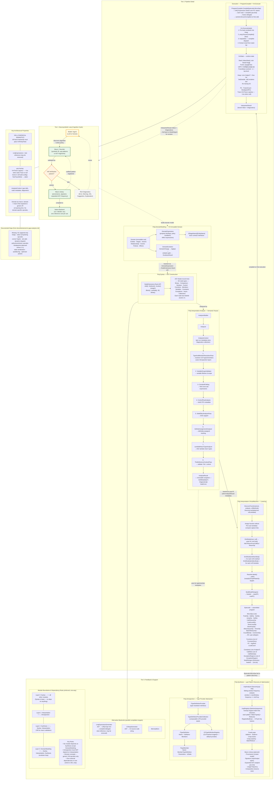

```mermaid
%% Poly Neurosymbolic Process
%% Comprehensive data-flow diagram showing the complete pipeline from Model/Agent
%% through AST construction, analysis, lowering, VM execution, and the
%% neurosymbolic feedback loop via Synthesis.

graph TB

  %% ========================================================================
  %% STYLES — Module layer colors
  %% ========================================================================
  classDef domain fill:#e3f2fd,stroke:#1565c0,stroke-width:2px
  classDef syntax fill:#f3e5f5,stroke:#7b1fa2,stroke-width:2px
  classDef analysis fill:#fff3e0,stroke:#e65100,stroke-width:2px
  classDef vm fill:#e8f5e9,stroke:#2e7d32,stroke-width:2px
  classDef exec fill:#fce4ec,stroke:#c62828,stroke-width:2px
  classDef synthesis fill:#ede7f6,stroke:#4527a0,stroke-width:2px
  classDef validation fill:#e0f2f1,stroke:#00695c,stroke-width:2px
  classDef introspection fill:#fbe9e7,stroke:#bf360c,stroke-width:2px
  classDef alt fill:#f5f5f5,stroke:#616161,stroke-width:1px
  classDef loop fill:#fff8e1,stroke:#f9a825,stroke-width:3px
  classDef macro fill:#e8f5e9,stroke:#1b5e20,stroke-width:2px
  classDef decision fill:#fff3e0,stroke:#e65100,stroke-width:2px
  classDef note fill:#f5f5f5,stroke:#9e9e9e,stroke-dasharray:4 2

  %% ========================================================================
  %% TIER 1: NEUROSYMBOLIC LOOP
  %% ========================================================================
  subgraph Loop["Tier 1: Neurosymbolic Loop (Cognitive Cycle)"]
    direction TB

    ModelAgent("Model / Agent<br/>(LLM or Human)")
    MacroHeuristic["Macro / Heuristic<br/>(symbolic IR: µop patterns<br/>or AST fragments)"]
    VerifGate{"VM Verification<br/>passes?"}
    MacroLib["Macro Library<br/>(provenance, signature,<br/>expanded AST, frequency)"]
    NativeBackend["Native Backend<br/>(C# / WASM / etc)<br/>zero inference cost per use"]
    DiagFeedback["Rich Diagnostics<br/>(Error, Warning, Info,<br/>Suggestion, Explanation)"]

    ModelAgent -->|discovers algorithm<br/>/ writes policy| MacroHeuristic
    MacroHeuristic -->|validated by| VerifGate
    VerifGate -->|passes| MacroLib
    VerifGate -->|fails| DiagFeedback
    DiagFeedback -.->|revise| ModelAgent
    MacroLib -->|compiled to| NativeBackend
    MacroLib -.->|codified pattern<br/>registered| MacroHeuristic

    %% Styling
    class ModelAgent loop
    class MacroHeuristic macro
    class VerifGate decision
    class MacroLib macro
    class NativeBackend macro
    class DiagFeedback note
  end

  %% ========================================================================
  %% TIER 2: PIPELINE DETAIL
  %% ========================================================================

  %% ---- Domain Modeling Layer -----------------------------------------------
  subgraph Tier2["Tier 2: Pipeline Detail"]

    subgraph DomainLayer["Poly.DomainModeling — V3 Immutable Domain"]
      Domain_rec["Domain (immutable root)<br/>Entities · Stages · Actions<br/>Relationships · Events · Policies · Effects"]
      DomainExpr["DomainExpression<br/>(property bindings, policy conditions,<br/>effect expressions)"]
      ContractInterfaces["I{StageName}{EntityName}<br/>actor contract interfaces"]
      Evolution["DomainEvolution<br/>DomainChange → Apply() →<br/>analysis gate → EvolutionResult"]

      Domain_rec --> DomainExpr
      Domain_rec --> Evolution
      DomainExpr --> ContractInterfaces
    end

    %% ---- Syntax Layer ------------------------------------------------------
    subgraph SyntaxLayer["Poly.Syntax — AST Construction"]
      NodeExt["NodeExtensions fluent API<br/>.Add() .Subtract() .Invoke() .Assign()<br/>.Block() .Lambda() .If() .While()"]
      AST["AST (Node record tree)<br/>— ~60 node types —<br/>Binary · Comparison · Boolean · Control<br/>Functions · Members · Variables · Constants<br/>Exceptions · Async · Collections<br/>Each node has NodeId (GUID v7)"]

      NodeExt --> AST
    end

    %% ---- Analysis Layer ----------------------------------------------------
    subgraph AnalysisLayer["Poly.Interpretation.Analysis — Semantic Passes"]
      direction TB
      AnalyzerB["AnalyzerBuilder"]
      Analyzer["Analyzer"]
      AnalysisCtx["AnalysisContext<br/>(per-run metadata store,<br/>diagnostics collection)"]
      AnalysisResult["AnalysisResult<br/>— immutable snapshot —<br/>GetMetadata(T)<br/>Diagnostics[]<br/>HasErrors"]

      Pass1["1. TypeAndMemberResolutionPass<br/>→ resolves CLR types/members<br/>(uses Introspection layer)"]
      Pass2["2. VariableScopeValidator<br/>→ variable lifetime & scope"]
      Pass3["3. ConstantFolding<br/>→ fold const sub-expressions"]
      Pass4["4. ControlFlowAnalysis<br/>→ build CFG metadata"]
      Pass5["5. SideEffectAnalysisPass<br/>→ DCE support"]
      Pass6["6. DefiniteAssignmentAnalyzer<br/>→ definitely-assigned tracking"]
      Pass7["7. LambdaReturnTypeAnalyzer<br/>→ infer lambda return types"]
      Pass8["8. ThisReferenceContextPass<br/>→ validate `this` context"]

      AnalyzerB --> Analyzer
      Analyzer --> AnalysisCtx
      AnalysisCtx --> Pass1
      Pass1 --> Pass2
      Pass2 --> Pass3
      Pass3 --> Pass4
      Pass4 --> Pass5
      Pass5 --> Pass6
      Pass6 --> Pass7
      Pass7 --> Pass8
      Pass8 --> AnalysisResult
    end

    %% ---- VM Lowering Layer ------------------------------------------------
    subgraph VMLayer["Poly.Interpretation.VirtualMachine — Lowering"]
      direction TB

      DiscFunc["DiscoverFunctions(root, analysis, refMethods)<br/>DiscoverLambdas(root, refLambdas)"]
      AssignIdx["Assign function indices<br/>Pre-scan lambdas: compute capture lists"]
      EmitRoot["EmitNode(root, null) → µops for root body<br/>Add ReturnFromCallOp / ReturnOp"]
      EmitMethods["EmitNode(method.Body) — for each ref'd method<br/>EmitNode(lambda.Body) — for each ref'd lambda"]
      ResolveLabels["ResolveLabels()<br/>→ patch JumpOp/JumpIfFalseOp targets"]
      BuildRanges["BuildNodeRanges()<br/>→ NodeId → (startPC, endPC)"]
      Bytecode["Bytecode — assembled program<br/><br/>MicroOps (List):<br/>PushOp · AddOp · SubOp · JumpOp · CallOp<br/>CallClosureOp · LoadLocalOp · StoreLocalOp<br/>NewArrayOp · AllocClosureOp · ThrowOp<br/>BatchReduceOp · CountBitsOp · CommentOp<br/>... 60+ µop subtypes<br/><br/>Functions (List of FunctionEntry)<br/>· PC · ArgSlots · LocalCount<br/><br/>Constants (List of object?)<br/>CallSites (List of CallSiteData)<br/>ExceptionRegions (List of ExceptionRegion)<br/>NodeRanges (Dictionary: NodeId → (int,int))"]

      DiscFunc --> AssignIdx
      AssignIdx --> EmitRoot
      EmitRoot --> EmitMethods
      EmitMethods --> ResolveLabels
      ResolveLabels --> BuildRanges
      BuildRanges --> Bytecode
    end

    %% ---- Execution Layer --------------------------------------------------
    subgraph ExecLayer["Execution — ProgramCompiler + Vm.Execute"]
      direction TB

      ProgComp["ProgramCompiler.Compile(bytecode.MicroOps)<br/>→ LINQ Expression.Switch over PC values<br/>→ each case = compiled µop body<br/>→ Action<VmState> delegate<br/>→ cached (EnsureCompiled on first call)"]
      VmExec["Vm.Execute(state)<br/>1. Pre-load constants into Heap<br/>2. prog.EnsureCompiled() [lazy]<br/>3. loop(state) — compiled dispatch<br/>4. Extract result from stack top"]
      VmState["VmState — runtime state<br/><br/>Stack (ValueStack): slot-based long[]<br/> Frame: [args][meta: retPC<<32|fb][locals][eval]<br/> FrameBase sentinel: -1 = top-level<br/><br/>Heap: List of object? + free-list<br/> Set(handle, null) reclaims slot<br/> No tracing GC<br/><br/>PC · FrameCount · BreakpointPCs<br/>Trace (VmTrace.LogUop — ~1ns when null)"]
      InterpResult["InterpreterResult<br/>(boxed Value + Diagnostics)"]

      ProgComp --> VmExec
      VmExec --> VmState
      VmState --> InterpResult
    end

  end

  %% ---- Intra-pipeline connections -----------------------------------------
  DomainLayer -->|"lowered via DomainExpression<br/>→ NodeExtensions fluent API"| SyntaxLayer
  SyntaxLayer -->|"analyzed by"| AnalysisLayer
  AnalysisLayer -->|"lowered to µop IR<br/>(with AnalysisResult metadata)"| VMLayer
  VMLayer -->|"compiled on first execution"| ExecLayer

  %% ---- Tier 1 ↔ Tier 2 connections ---------------------------------------
  Loop -.->|"builds domain model"| DomainLayer
  ExecLayer -.->|"InterpreterResult (Value + Diagnostics)<br/>→ fed back to Model/Agent for revision"| Loop

  %% ========================================================================
  %% TIER 3: FEEDBACK & SUPPORT
  %% ========================================================================
  subgraph Tier3["Tier 3: Feedback & Support"]

    %% ---- Synthesis --------------------------------------------------------
    subgraph SynthesisLayer["Poly.Synthesis — µop Pattern Discovery & Optimization"]
      direction TB

      UopAnalyzer["UopAnalyzer.Discover(µop seq)<br/>Sliding-window frequency analysis<br/>window 2..maxWindow, frequency >= minFreq"]
      UopRegistry["UopRegistry.Optimize(sequence)<br/>Greedy longest-match-first reduction<br/>each pattern: MatchTypes[] + Reduce()<br/>RegisterBuiltins() → 9 Push+Op fusions"]
      FusedUops["Fused µops<br/>AddImm · SubImm · CmpLocalLe<br/>CmpLocalJmp · BatchReduce · ..."]
      MacroLibFuture["Macro Library (planned)<br/>· Provenance (creator model)<br/>· Signature (input/output types)<br/>· Expanded AST (original µop seq)<br/>· Usage frequency<br/>· Composition (macros nest)"]

      UopAnalyzer --> UopRegistry
      UopRegistry --> FusedUops
      FusedUops --> MacroLibFuture
    end

    %% ---- Introspection ----------------------------------------------------
    subgraph IntrospectionLayer["Poly.Introspection — Type Provider Abstraction"]
      direction TB

      ITypeDef["ITypeDefinition<br/>· Name · FullName · Members"]
      ITypeMem["ITypeMember<br/>· Name · MemberTypeDefinition<br/>· Parameters · IsStatic"]
      ITypeProv["ITypeDefinitionProvider<br/>(type resolution interface)"]
      ProvColl["TypeDefinitionProviderCollection<br/>(composable LIFO provider stack)"]
      ClrReg["ClrTypeDefinitionRegistry<br/>(CLR-backed singleton — default provider)"]

      ITypeProv --> ProvColl
      ProvColl --> ClrReg
      ProvColl --> ITypeDef
      ITypeDef --> ITypeMem
    end

    %% ---- Alternative Backends --------------------------------------------
    subgraph AltLayer["Alternative Backends (parallel compilation targets)"]
      direction LR

      LinqGen["LinqExpressionGenerator<br/>AST → LINQ Expr tree<br/>→ compiled delegate<br/>(test reference, may be removed)"]
      CSharpGen["CSharpGenerator<br/>AST → C# source code<br/>string"]
      MermaidGen["MermaidAstGenerator<br/>AST → Mermaid graph TB<br/>(with type shapes,<br/>direction LR/TB/BT/RL)"]

      LinqGen ~~~ CSharpGen
      CSharpGen ~~~ MermaidGen
    end

    %% ---- Module Boundaries ------------------------------------------------
    subgraph Deps["Module Boundaries & Dependency Rules (enforced, one-way)"]
      direction TB

      Dep0["Layer 0: Syntax ←── all other modules<br/>(Syntax is base — no deps on anything)"]
      Dep1a["Layer 1: Interpretation ──→ Introspection"]
      Dep2["Layer 2: Synthesis ──→ Syntax, Interpretation<br/>(VM for macro validation)"]
      Dep3["Layer 3: DomainModeling ──→ Syntax, Interpretation, Synthesis<br/>(evolution loop)"]

      Dep0 --- Dep1a
      Dep1a --- Dep2
      Dep2 --- Dep3

      Notes0["Key Rules:<br/>• No module depends on Synthesis except DomainModeling<br/>• Introspection must NOT depend on Interpretation<br/>• Domain concepts → generic VM opcodes only<br/>• Zero external dependencies in core (net10.0, BCL only)"]
    end
  end

  %% ---- Tier 2 ↔ Tier 3 connections ---------------------------------------
  VMLayer -.->|"Bytecode.MicroOps fed to<br/>pattern discovery"| SynthesisLayer
  AnalysisLayer -.->|"uses for type/member<br/>resolution"| IntrospectionLayer
  SyntaxLayer --- AltLayer

  %% ---- Key architectural properties (as annotations) ---------------------
  subgraph Props["Key Architectural Properties"]
    direction TB

    P1["VM is CANONICAL SEMANTICS<br/>All future backends must pass VmParityTests"]
    P2["LinqExpressions = test reference (may be removed)"]
    P3["µop tracing: VmTrace.LogUop — ~1ns when state.Trace is null<br/>Active in all build configs. TestTraceWriter → stderr"]
    P4["AnalysisContext: type defs, node metadata, diagnostics"]
    P5["Domain-as-macro: domain = macro that expands to generic IR<br/>at lowering time. No domain-specific opcodes."]

    P1 --- P2
    P2 --- P3
    P3 --- P4
    P4 --- P5
  end

  %% ---- Documented Gaps ---------------------------------------------------
  subgraph Gaps["Documented Gaps (from docs/decisions/vm-gap-analysis.md)"]
    direction TB

    G1["Missing: GC (append-only heap) · native array/string opcodes<br/>correct TypeIs · tail calls · dynamic dispatch<br/>policy/event/actor opcodes · breakpoints (planned: Int/Iret v=1)<br/>state serialization · sandboxing · optimizer passes"]
  end

  ExecLayer --- Props
  Props --- Gaps
```