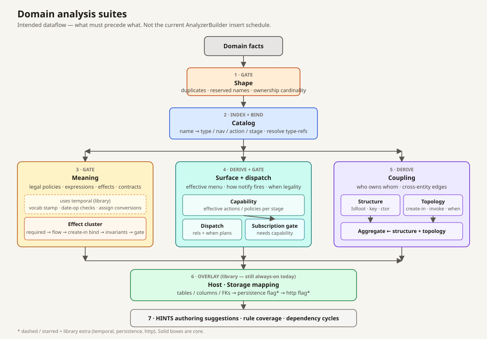
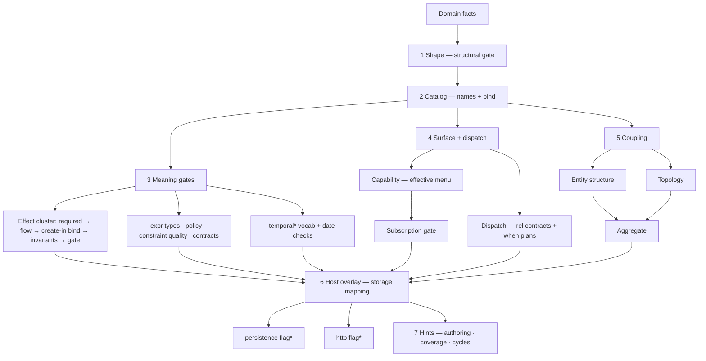

# Analysis pipeline inventory

**Date:** 2026-09-13  
**Status:** Examination (not CURRENT). Admission: [`simple-agent-tasks/PIPELINE-STATUS.md`](simple-agent-tasks/PIPELINE-STATUS.md).  
**Scope:** DomainModeling analysis only. Interpretation’s Syntax/VM pipeline is out of scope.  
**Lens:** What each domain pass *does* and *produces*, then which of those jobs belong in core vs a library.  
**Prior (stale in places):** [`archive/completed-2026-08-late/domainmodeling-metadata-artifact-catalog-2026-08-15.md`](archive/completed-2026-08-late/domainmodeling-metadata-artifact-catalog-2026-08-15.md) · [`domainmodeling-simplification-2026-08-14.md`](domainmodeling-simplification-2026-08-14.md) Wave D.

This is not a rewrite plan. It is the present-state map so we can cut or move work without guessing from type names.

---

## 0. Door

`DomainSession.Analyze` walks the `Domain` graph (21 core passes + library extras). Libraries already plug extra `INodeAnalyzer`s through `SessionBuilder.AddAnalyzer`. That slot is the extraction seam. Persistence and HTTP already use it as **flags**. Storage mapping still runs in the core list.

---

## 1. Abstract kinds of work

Every domain pass is one (sometimes two) of these. The pipeline is large because kinds were split into types, not because there are 21 independent questions.

| Kind | Question | Output | When it belongs in core |
|------|----------|--------|-------------------------|
| **Gate** | Is this tree legal enough to reason about? | Diagnostics (errors). No bag others need. | Always-on. Fail closed. |
| **Index** | Where is name X? | Lookup maps on the domain (and aliases on `default`). | One catalog. Core. |
| **Bind** | What does this node refer to? | Per-node resolved-ref bags. | Core, usually beside the index. |
| **Derive** | What follows from the facts? | A new bag consumers read. | Core iff lower/simulate/evolution need it with no `uses`. |
| **Overlay** | How does a host implement those facts? | Convention bag (tables, routes, clocks). | **Library.** Opt-in via `uses`. |
| **Flag** | Did this unit load library L? | Empty marker bag. | **Library.** Emit gates on the bag. |
| **Hint** | What might the author improve? | Warnings/hints. No bag. | Optional / MCP-only. Not runtime. |
| **Project** | DTO for a consumer walk. | Not a pipeline bag. | Off-pipeline (emit/MCP time). |

**Rule of thumb:** if the operation module can lower and the VM can run without the bag, it is overlay/flag, not core derive.

---

## 2. Domain pipeline (registration order)

Registered in `UseDomainModelAnalysisPipeline`. Library analyzers append; `After` / `Before` schedule at freeze.

| # | Pass | LoC | Kind | Question it answers | Writes | Diagnostics | Product readers |
|---|------|----:|------|---------------------|--------|-------------|-----------------|
| 1 | `StructuralDomainAnalyzer` | 151 | Gate | Are names unique, reserved words unused, ownership cardinality legal? | — | Errors (`StructuralDuplicate`, `StructuralOwnership`) | Evolution / analyze fail-closed |
| 2 | `DomainCatalogPass` | 270 | Index + Bind + Gate | What is named, and does this type-ref resolve? | Catalog + aliases + owners + resolved type refs | Unknown types, non-entity relationship ends, primitive category | Almost everything via `GetCatalog` / lookup helpers |
| 3 | `RuntimeContractAnalyzer` | 155 | Derive | How do navs and `when` dispatch at notify time? | `RelationshipContractMetadata` (`default`); `SubscriptionDispatchPlanMetadata` on entity + stage | Errors for unbound peer-like roots (in plan build) | `DomainInstanceStore.NotifyTransition`, C# notify export, MCP, `GetOrLower` |
| 4 | `RequiredPropertiesPass` | 119 | Derive | Which properties must be set (policy `exists` + `required`)? | `RequiredPropertiesMetadata` on entity/stage | — | `EffectAnalyzer`, `RuleCoverageAnalyzer` |
| 5 | `PolicyConstraintAnalyzer` | 394 | Gate | Do policy expressions refer to legal props/navs/quantifiers? | — | Errors | Authoring |
| 6 | `ExpressionTypeAnalyzer` | 683 | Gate | Are compares/arithmetic/`not`/assign/`default` category-legal? | — (reads library `CatalogTypedExpressionMetadata`) | Errors (`SemanticTypeCompatibility`) | Authoring (stops silent coerce / CS fail) |
| 7 | `ConstraintPropagationAnalyzer` | 222 | Derive | Which constraints flow from an action param into later effects? | `DownstreamConstraintsMetadata` on params | — | `EffectAnalyzer` |
| 8 | `EffectFactsPass` | 91 | Bind | Which rel/entity does this `create in` hit? | `ResolvedRelationshipTargetMetadata` on create-in nodes | — | `EffectLoweringPass` (create-in target) |
| 9 | `EffectInvariantAnalyzer` | 540 | Derive | Per action × stage: preconditions, narrowed ranges, postconditions? | `ActionInvariantMetadata` on actions | Some errors | `EffectAnalyzer`; `StorageAnalyzer` CHECK soundness |
| 10 | `EffectAnalyzer` | 1418 | Gate | Are effects bound, ordered, covering requirements? | — | Errors + some hints | Authoring |
| 11 | `ConstraintQualityAnalyzer` | 277 | Gate (property) + dead domain walk | Are this property’s constraints jointly satisfiable? | — | Errors | Authoring |
| 12 | `CapabilityAnalyzer` | 154 | Derive | What is the effective action/policy surface at a stage? | `ActionCapabilityMetadata`, `StageCapabilityMetadata` | — | `GetEffectivePolicies` / `GetEffectiveActions`, export, Oracle, `SubscriptionAnalyzer`, `BehaviorMetadata.From` |
| 13 | `RuleCoverageAnalyzer` | 63 | Hint | Does a transitioning action assign required properties? | — | Hints | Authoring |
| 14 | `ContractIntegrationAnalyzer` | 175 | Gate | Do imported contracts / bindings clash with parent types? | — | Errors | Authoring |
| 15 | `EntityStructureAnalyzer` | 155 | Derive (mixed host shape) | Per entity: IsRoot, key, ctor order, stage enum, enum props, entry-assigned? | `EntityStructureMetadata` | — | C# entity emit, MCP roots, storage, HostAbi |
| 16 | `SubscriptionAnalyzer` | 510 | Gate | Is `when` well-formed (contract, causality, replay, peer binder)? | — | Errors + warnings + hints | Authoring |
| 17 | `EffectTopologyPass` | 118 | Derive | Which create-in / cross-invoke / subscription edges exist? | `EffectTopologyMetadata` | — | Ownership, Storage, CrossReference, MCP describe |
| 18 | `OwnershipAggregatePass` | 165 | Derive | Who owns whom (aggregate tree)? | `OwnershipAggregateMetadata` | Warning (`AggregateOrphan`) | Storage, Minimal API, MCP, HTTP emit gate |
| 19 | `CrossReferencePass` | 129 | Hint | Is there a cross-entity dependency cycle? | — (graph not published) | Warning | Authoring |
| 20 | `StoragePass` → `StorageAnalyzer` | 68+446 | **Overlay** | Tables, columns, FKs, unique, CHECK from invariants? | `StorageMappingMetadata` | Error if topology/aggregate missing | DbContext, Minimal API, unique lowering *prefer*, `DomainInstanceStore.CreateIn` *prefer*, MCP `hasStorage` |
| 21 | `AuthoringSuggestionAnalyzer` | 130 | Hint | Missing stages/actions/policies? Unconditional actions? | — | Hints | Authoring |

### Library extras (not in the core list)

| Pass | Library | Kind | Question | Writes | Also does |
|------|---------|------|----------|--------|-----------|
| `PersistenceSurfacePass` | `persistence` / `sqlite` / `sqlserver` / `mysql` | Flag | Should this unit emit a DbContext? | `PersistenceSurfaceMetadata` | — |
| `HttpSurfacePass` | `http` | Flag | Should this unit emit a process door? | `HttpSurfaceMetadata` | — |
| *(none)* | `temporal` | Session `ExpressionMeaning` | Core ExpressionType/lowering read inference, checks, assign conversions | CatalogTypedExpressionMetadata / AssignedMemberConversionMetadata stamped by ExpressionType | Not a pipeline pass |

`StorageFacetLibrary` (`uses storage`) is **not** an analyzer: it only registers `column` / `table` annotation spell.

---

## 3. Bags (one question each)

Hung on the node in the **Hung on** column. Product readers must not rebuild the same map.

### 3.1 Catalog (one name index)

| Bag | Hung on | Writer | Question |
|-----|---------|--------|----------|
| `DomainCatalogMetadata` | Domain | Catalog | Types, navs, actions, stages, mutation index |
| `DomainTypeLookupMetadata` | `default` (same instance as catalog.Types) | Catalog | Name → type for child-node walks |
| `RelationshipLookupMetadata` | `default` (same instance as catalog.Relationships) | Catalog | (source, nav) → relationship |
| `ActionResolutionMetadata` | *inside catalog only* | Catalog | Entity/stage action maps |
| `MutationTargetIndexMetadata` | *inside catalog only* | Catalog | Evolution name maps (remakes type/rel/stage/action/policy indexes) |
| `OwnerEntityMetadata` | Action, Stage | Catalog | Which entity owns this node |
| `ResolvedTypeReferenceMetadata` | `DomainTypeReference` | Catalog | This ref → `DomainType` |

Tests assert ARM / MTI are **not** hung separately on entity/domain.

### 3.2 Derived (new question)

| Bag | Hung on | Writer | Question |
|-----|---------|--------|----------|
| `RelationshipContractMetadata` | `default` | RuntimeContract | Rel shape for dispatch |
| `SubscriptionDispatchPlanMetadata` | Entity, Stage | RuntimeContract | How `when` fires |
| `RequiredPropertiesMetadata` | Entity, Stage | RequiredProperties | What must be set |
| `DownstreamConstraintsMetadata` | Action param | ConstraintPropagation | Constraints into later effects |
| `ResolvedRelationshipTargetMetadata` | Create-in effect | EffectFacts | Create-in target |
| `ActionInvariantMetadata` | Action | EffectInvariant | Abstract-interpretation envelope |
| `ActionCapabilityMetadata` | Action | Capability | Effective policies, transitions |
| `StageCapabilityMetadata` | Stage | Capability | Effective policies/actions |
| `EntityStructureMetadata` | Entity | EntityStructure | IsRoot, key, ctor, enums, **StageByName copy** |
| `EffectTopologyMetadata` | Domain | Topology | Cross-entity effect graph |
| `OwnershipAggregateMetadata` | Domain | Ownership | Parent/child aggregates |

### 3.3 Overlay / flag (library or should be)

| Bag | Hung on | Writer | Question |
|-----|---------|--------|----------|
| `StorageMappingMetadata` | Domain | **Core** `StoragePass` today | Persistence mapping |
| `PersistenceSurfaceMetadata` | Domain | Library flag | Emit DbContext |
| `HttpSurfaceMetadata` | Domain | Library flag | Emit Program.cs |
| `TemporalVocabularyMetadata` | Domain | Temporal library | Vocab present |
| `CatalogTypedExpressionMetadata` | Expression | Temporal | Catalog type name for library IR |
| `AssignedMemberConversionMetadata` | Assign | Temporal | Date→DateTime conversion for lowering |

### 3.4 Not a pipeline bag

`BehaviorMetadata` / `BehaviorModel` is built at emit/MCP time from capability (`BehaviorMetadata.From`). HTTP emit still requires that projection to be non-null.

---

## 4. Library extraction — what already moved vs what is stuck

```text
uses temporal  → ExpressionMeaning     (inference / checks / assign conversions)  DONE
uses storage   → column/table spell    (no analyzer)                           DONE
uses sqlite    → PersistenceSurfacePass (flag) + vendor type maps              FLAG DONE
uses http      → HttpSurfacePass        (flag)                                 FLAG DONE
(always)       → StoragePass            (overlay: tables/columns/FKs)          STUCK IN CORE
```

Transport as a *mapping pass* is gone. `HttpSurfacePass` is the door flag. Stale comments still name `TransportAnalyzer` (`EntityStructureMetadata` xml, old capability inventory).

**Why storage is stuck:** several *prefer* paths treat the overlay as the answer.

| Consumer | If storage bag missing |
|----------|------------------------|
| Unique lowering (`EffectLoweringPass.IsUniqueProperty`) | Falls back to `UniqueConstraint` on the entity |
| `DomainInstanceStore.CreateIn` | Falls back to `ResolveCreateInRelationship` |
| DbContext emit | Fail closed **if** `PersistenceSurfaceMetadata` is present |
| HTTP emit | Fail closed (requires storage + aggregate + behavior DTO) |
| MCP `hasStorage` | Reports false |

So unique/create-in **already have domain-fact fallbacks**. The overlay is required only when a persistence/HTTP library asked for host files. Core still *always* computes it.

`StoragePass` also closes over session `TypeMaps` / `IStorageConvention` — library config injected into a core pass. That is the half-extraction.

`ActionInvariantMetadata` is a domain derive, but its only non-lint reader besides `EffectAnalyzer` is `StorageAnalyzer` (CHECK soundness). Moving storage out does not require moving invariants.

---

## 5. Overlaps (same question answered twice)

| Question | Canonical | Duplicate |
|----------|-----------|-----------|
| Name → type / rel / action / stage | Catalog | `MutationTargetIndex` remakes the maps; `EntityStructureMetadata.StageByName` remakes stages |
| Is this entity a root? | `EntityStructureMetadata.IsRoot` | Ownership copies it; Storage copies it again |
| Create-in target | `ResolvedRelationshipTargetMetadata` | Topology also lists create-in edges (different question: graph vs bind) |
| Unique? | `UniqueConstraint` on the property | Storage column `IsUnique` preferred by lowering |
| Effective actions/policies | Capability bags | `BehaviorMetadata.From` reshapes them for HTTP/MCP |
| Relationship list | Catalog RLM | `CrossReferencePass` still groups from `GetAllRelationships` (OK) then rebuilds a private adjacency |
| Nav uniqueness | Structural (entity member names) | Catalog `BuildRelationshipLookup` reports per-source duplicate navs |

`ConstraintQualityAnalyzer.ValidateDomainFixedPoint` is a no-op (inheritance removed). The property walk is the real work.

---

## 6. Dependency honesty

`AnalyzerBuilder` appends in registration order; `Build` sorts by `After` / `Before` (topo, registration tie-break; `Before` producers run as soon as `After` allows).

| Pass | Declared deps | Issue |
|------|---------------|-------|
| Catalog, Structural, Topology, ConstraintPropagation, ContractIntegration | `[]` | Topology/propagation/contract still scan the domain; they should at least depend on Catalog if they use lookups (topology currently scans `entity.Navigations` directly) |
| EffectAnalyzer | Catalog, RequiredProperties, ConstraintPropagation, EffectInvariant | Omits `EffectFactsPass` even though comments point at that bag (lowering is the real reader; registration order happens to run Facts first) |
| HttpSurfacePass | Capability, Ownership, Storage | Flag does not *read* those bags; deps only force schedule after overlays |
| PersistenceSurfacePass | Storage | Same: flag scheduled after overlay |

Flag passes do not need a tree walk. They stamp the domain and return.

---

## 7. Grok-ability (how to talk about the pipeline)

The algorithms are mostly fine. What is hard to discuss is **21 type names in three dialects**, with a registration list that does not look like the three words CORE already uses (`validate · catalog · derive`).

`Poly/DomainModeling/README.md` already sketches:

```text
Well-formed  →  Catalog  →  Derive (capability, required, topology, storage, …)
```

That sketch is the right length and the wrong grouping: storage is an overlay, not a derive; several “lint-only” comments in `UseDomainModelAnalysisPipeline` are fail-closed gates; CORE §3.1 still points “pass order” at the **Interpretation** README.

### 7.1 Discuss questions and bags, not class names

A design conversation should name **seven topics**:

| Say | Means | Do not start from |
|-----|-------|-------------------|
| **Catalog** | What is named; type-refs bind | `DomainCatalogPass` vs `DomainTypeLookupMetadata` vs MTI |
| **Dispatch** | How navs and `when` fire | `RuntimeContractAnalyzer` |
| **Capability** | Effective actions/policies at a stage | `GetEffective*` vs walking stages |
| **Coupling** | Topology + aggregate + entity structure | three pass names |
| **Meaning gates** | Policies, expressions, effects, subscriptions, contracts | the DAS fact/validate pack split |
| **Host** | Storage overlay + persistence/HTTP flags | `StoragePass` sitting in the core list |
| **Hints** | Authoring lint | three hint types |

`RequiredProperties`, `EffectFacts`, `EffectInvariant`, `ConstraintPropagation` are **inputs to the effect gate**, not discussion topics. Say “the effect gate” unless the bag itself is the bug.

### 7.2 Why the names fight you

| Dialect | Examples | Accident |
|---------|----------|----------|
| `Domain*Analyzer` | `DomainStructuralDomainAnalyzer`, `DomainCapabilityAnalyzer` | Prefix + type tautology; unspeakable IDs |
| `*Pass` | `DomainCatalogPass`, `StoragePass`, `CrossReferencePass` | DAS “fact emitter” suffix — then drifted |
| Short library IDs | `PersistenceSurface`, `HttpSurface`, `Temporal` | These are the speakable ones |

`Pass` vs `Analyzer` *was* fact vs validate and then leaked: `RuntimeContractAnalyzer` publishes bags; `CrossReferencePass` publishes nothing. Either restore that signal or pick one suffix. Do not rename 21 files in one sweep — **speakable `Id` strings** (`Catalog`, `Structural`, `Effects`, `Capability`) are what `Dependencies` and tests already say.

Four `Effect*` types (`Facts`, `Invariant`, `Analyzer`, `Topology`) are one conversation (“effects”) until topology (coupling) or the create-in bind bag is the subject.

### 7.3 Cheap grok moves (no new framework)

1. **Live map beside the builder** — `Poly/DomainModeling/Analysis/README.md` in the same shape as Interpretation’s pass table. Point CORE §3.1 at it. The inventory in this file is the draft.
2. **Group the registration list** to match the seven topics (comments + blank lines). Keep schedule as-is where deps force interleaving (capability before subscription gate, facts before effect gate). Fix the “lint-only” comment: structural / policy / effect / subscription / contract / expression-type are **gates**.
3. **Short `Id`s** when touching a pass anyway. Library flags already model this.
4. **Fewer nouns** from §8 A/B (storage out of core, one hint pass) — the grok win is “host is a library,” not a 21→16 count.

Do not invent stage enums, pass attributes, or a second pipeline type. The consumer of this cleanup is humans and agents talking about analysis — `AGENTS.md` principle 7.

### 7.4 Suite flowchart

Single chart of **intended dataflow** (what must precede what):





\* library extra.

**Schedule (shipped):** `AddAnalyzer` appends. `Build` is registration order. Temporal is a core-owned slot after Catalog (no-op unless loaded). Libraries append flags after the core list.

---

## 8. Ranked opportunities

Ordered by “removes a noun or moves overlay out of core” without shrinking `.poly` → analyze → lower/run.

### A. Finish storage overlay as a library (the unfinished extract)

**Move:** `StoragePass` + `StorageAnalyzer` + `StorageModel` off the core list. Register from `PersistenceEmitLibrary` / vendor packs (they already add `PersistenceSurfacePass`). HTTP stays a flag but must declare that persistence is loaded, or keep depending on the storage pass name.

**Keep in core:** topology, ownership, entity structure, unique *constraint*, create-in *bind*.

**Honesty work in the same slice:** unique lowering and `CreateIn` should read domain facts first (constraint + catalog rel), not prefer the overlay. Overlay becomes emit-only (DbContext / Minimal API).

**Do not** move ownership/topology into the library — those are domain coupling facts MCP and aggregate diagnostics already consume without `uses sqlite`.

### B. Collapse hint passes

Merge `AuthoringSuggestionAnalyzer` + `RuleCoverageAnalyzer` + `CrossReferencePass` into one `AuthoringLint` (or run them only from MCP `analyze`, not from `AnalyzeRequiringCatalog`). Three types, zero bags, none fail-closed.

Do **not** merge Policy / Effect / Subscription / Contract / ExpressionType — those are gates.

### C. One storage type

`StoragePass` is a 68-line wrapper around `StorageAnalyzer`. After A (or even before), one type. Standalone `new StoragePass(..., analysis)` is a test/harness dual — delete or keep tests on the pipeline.

### D. Stop remaking the catalog (small, local)

- Drop `EntityStructureMetadata.StageByName` (catalog already has stages).
- Stop treating MTI as a public parallel map (evolution-only view, or fold into catalog helpers).
- Delete empty `ConstraintQualityAnalyzer.ValidateDomainFixedPoint`.

### E. Flag passes stay flags

`PersistenceSurfacePass` / `HttpSurfacePass` are correct as marker bags (emit reads bags, not `CompileMode`). Do not replace them with `session.Extensions.Contains("http")` in the compiler — that reopens the CompileMode lie. Optionally skip `AnalyzeChildren` (they already only handle `Domain`).

### F. Leave the megapasses

`EffectAnalyzer` (1418) and `ExpressionTypeAnalyzer` (683) *do the gate*. File-split without deleting a concern is churn. After A/B, delete overlap with invariants/facts if any remains, then stop.

### G. Do not do

- A second plugin interface beside `IDomainLibrary`.
- Stuffing storage/dispatch into the catalog.
- Reintroducing `TransportPass` / `TransportAnalyzer`.
- Touching the Interpretation/VM pass list.
- Splitting `EffectAnalyzer` for file size.
- Treating MCP describe / `BehaviorMetadata.From` as a reason to keep a pipeline DTO pass (it is already off-pipeline).

---

## 9. Target shape (if we execute)

```text
Core analyze:
  Gate:   Structural, Catalog(+bind), ExpressionType,
          Policy, Effect(+facts/invariants as deps), Subscription, Contract
  Derive: RuntimeContract, RequiredProperties, Capability,
          EntityStructure, Topology, Ownership
  Hint:   one AuthoringLint (or MCP-only)

uses sqlite / persistence:
  Overlay StoragePass + Flag PersistenceSurface  → DbContext

uses http:
  Flag HttpSurface  → Program.cs (requires persistence overlay present)

uses temporal:
  Flag + date gate + conversion stamps  (already)
```

Core list today: **21**. After A+B: about **16** (lose Storage, 3 hints → 1). Wave D’s “≤ 10” only happens if we also merge gate packs, which we should not.

---

## 10. Uncommitted local note

`StructuralDomainAnalyzer` dirty diff deletes unused `ReportDuplicateReferenceNames` (duplicate type-ref names). Hygiene; not a pipeline change.

---

## 11. Proposed first slice (needs approval)

1. **Inventory is this file** — no code.
2. **Storage overlay out of core** — failing test: domain with no persistence library has no `StorageMappingMetadata`; unique/create-in still lower from constraints/catalog; `uses sqlite` still publishes mapping + persistence flag; DbContext still bag-gated.
3. **Hint collapse** — optional follow-up, exclusive files.

CORE update in the same change as (2): StoragePass is a library overlay, not a domain-fact pass.
