# Infrastructure Pass Suite

**Date:** 2026-07-22  
**Status:** Draft — planning  
**Prerequisite ADR:** [`docs/decisions/2026-07-22-persistence-units-medium-facets-pack-syntax-export.md`](../decisions/2026-07-22-persistence-units-medium-facets-pack-syntax-export.md)  
**Related:** [`docs/CORE.md`](../CORE.md), `Poly/DomainModeling/Lowering/InfrastructureAnalyzer.cs`

> **Vocabulary:** This document uses "pass" and "concern" interchangeably.
> In the codebase the contract is `INodeAnalyzer` with a `PassName` — prefer
> "pass" in code and API names. "Concern" is the domain-level concept
> ("the storage concern" = the set of analysis + metadata + artifacts for persistence).

---

## 0. What problem this solves

Today `InfrastructureAnalyzer` is a hard-coded chain that calls five sub-analyzers and stuffs them into one record. Each generator consumer independently re-derives entity lookups from the same model:

| Generator | Lookup dicts rebuilt from `InfrastructureModel` |
|-----------|--------------------------------------------------|
| `DbContextGenerator` | `_storageLookup` |
| `MinimalApiGenerator` | `_storageLookup`, `_transportLookup`, `_behaviorLookup`, `_aggregateLookup` |
| `HttpFileGenerator` | `_storageLookup`, `_behaviorLookup`, `_aggregateLookup` |

9 dictionary constructions, 3 independent fallback `new InfrastructureAnalyzer(domain).Analyze()` calls, all from the same domain and analysis. And adding a new infrastructure pass (API surface, documentation, queue routing, …) requires adding a sub-call to `InfrastructureAnalyzer`, a field to `InfrastructureModel`, and wiring it through every consumer.

## 1. Approach — analysis passes on domain data

### 1.1 Only Phase 0 is core; everything else is an enabled capability

**Phase 0 (domain analysis) is the only core.** It runs on every domain, produces the structural and semantic metadata every consumer depends on. It lives in `Poly/` and is always active.

**Everything else is an enabled capability** — loaded at runtime based on what the consumer (human, agent, MCP, CLI) requests. Storage projection, REST surface, authorization, GraphQL schema — each is a separate concern composed into the pipeline on demand. Unsatisfied dependencies fail closed via `ReportStructuralFailure` (§1.3).

| Phase | What | Always runs? |
|-------|------|:-----------:|
| **0: Domain structure** | `DomainModelAnalysisPipeline` — types, constraints, effects, subscriptions | ✅ **Core — always** |
| **1: Entity coupling** | `EffectTopologyPass`, `BehaviorPass`, `CrossReferencePass` — coupling graphs, cycle detection | Only when entity relationship analysis is requested |
| **2: Storage structure** | `StoragePass` — store/field names, types, keys, FKs | Only when DB access tool code is requested |
| **3: Storage access** | `StorageAccessPass` — query/mutation patterns from structure | Only when query/mutation generation is requested (consumes Phase 2) |
| **4: REST API surface** | `TransportPass`, `RestApiSurfacePass` — routes, DTOs, endpoints | Only when REST API generation is requested (consumes Phases 2–3) |
| **P: Pack passes** | Pack-authored passes — vendor validation, enrichment | Only when corresponding pack is loaded |

Each enabled phase is a named group on `AnalyzerBuilder`:

```csharp
// Phase 0 only: core domain analysis — always available, no features requested
var domainOnly = new AnalyzerBuilder()
    .UseDomainModelAnalysisPipeline()
    .Build();
var result = domainOnly.Analyze(domain);

// Phase 0 + 1 + 2: DB-backed target, no API surface
var withStorage = new AnalyzerBuilder()
    .UseDomainModelAnalysisPipeline()
    .UseEntityCouplingPasses()
    .UsePersistencePasses(authoring)
    .Build();

// Phase 0 + 1 + 2 + 3 + 4: full stack (today's --mode all equivalent)
var fullStack = new AnalyzerBuilder()
    .UseDomainModelAnalysisPipeline()
    .UseEntityCouplingPasses()
    .UsePersistencePasses(authoring)
    .UseStorageAccessPasses()
    .UseRestApiPasses()
    .Build();
```

Phase selection is **request-driven**, not configuration-file magic. The consumer decides which capabilities to enable.

### 1.2 The underlying mechanism

The existing [`AnalyzerBuilder` / `INodeAnalyzer` / `AnalysisContext` / `AnalysisResult`](../Poly/Syntax/Analysis/) mechanism already supports:

- Typed metadata bags via `AnalysisContext.SetMetadata<T>(Node, T)` / `AnalysisResult.GetMetadata<T>(Node)`
- Pass ordering by `Dependencies[]` (declared by string ID)
- Incremental re-analysis with invalidated nodes
- Diagnostics attached to specific nodes
- **Early termination:** `AnalysisContext.ReportStructuralFailure(node, msg)` sets `HasStructuralFailure = true`; `AnalysisContext.ShouldContinue(options)` returns `false` when `AnalysisMode` is `StopOnStructuralErrors` or `FailFast`; `AnalysisResult.AnalysisWasTerminatedEarly` signals consumers

`DomainModelAnalyzer` already uses this for **domain structure** passes (`StructuralDomainAnalyzer`, `SemanticDomainAnalyzer`, `EntityStructureAnalyzer`, …). The convention is `UseDomainModelAnalysisPipeline()` registered as an extension method on `AnalyzerBuilder`.

**Decision:** Only Phase 0 (domain analysis) is core and always active. Enabled capabilities (storage, access, API surface, pack passes) are composed into the pipeline on demand. The domain passes are pure functions of `(Domain) → metadata` and can be cached in a static `Analyzer`. Enabled passes depend on per-unit context (type maps, conventions, pack validation) when storage is involved — they need a fresh `Analyzer` + `AnalysisResult` per persistence unit.

**Two-tier architecture:**

```text
Phase 0: Domain analysis (once, cached static Analyzer)
  → DomainAnalysisResult (shared, unit-agnostic)
  → Always runs. Contains entity structure, constraints, effects.

For each requested capability:
  → Enabled passes consume Phase 0 metadata (and each other's metadata)
  → e.g., StoragePass → StorageAccessPass → RestApiSurfacePass

For each PersistenceUnit (if storage capabilities enabled):
  → Per-unit Analyzer (fresh builder + unit-specific authoring)
  → UnitAnalysisResult (storage metadata keyed by unit identity)
```

Separate `AnalysisResult` instances per unit avoid `NodeMetadataStore` single-instance-per-type overwrite.

```csharp
// Phase 0 — always
var domainResult = DomainModelAnalyzer.Analyze(domain);

// Enabled capabilities — per unit when storage is requested
foreach (var unit in units) {
    var unitAnalyzer = new AnalyzerBuilder()
        .UseInfrastructurePassPipeline(unit.Authoring)
        .Build();
    var unitResult = unitAnalyzer.Analyze(domain, priorAnalysis: domainResult);
    // unitResult.GetMetadata<StorageMappingMetadata>(domain) is unit-specific
}
```

Packs register additional passes via `DomainAuthoringContext`:

```csharp
authoring.Passes.AddAnalyzer(new VendorSpecificEnrichmentPass());
```

### 1.3 Phase dependency gating (already supported by the framework)

When a pass needs metadata from an earlier phase that wasn't run, it calls `context.ReportStructuralFailure`:

```csharp
public void Analyze(AnalysisContext context, Node node) {
    var storage = context.GetMetadata<StorageMappingMetadata>(domain);
    if (storage is null) {
        context.ReportStructuralFailure(domain,
            "Storage pass must precede RestApiSurface pass. " +
            "Enable UsePersistencePasses() before UseRestApiPasses().");
        return;
    }
    // ... use storage ...
}
```

With `AnalysisMode.StopOnStructuralErrors`, the pipeline skips subsequent passes after a structural failure. With `AnalysisMode.Full` (the default), all passes run but `AnalysisResult.AnalysisWasTerminatedEarly` and `HasStructuralFailure` signal consumers that results may be incomplete. No new framework code is needed.

### 1.4 Step 2 prerequisite: Syntax IR growth

Layer 0 (Step 1) requires no Syntax IR growth — `DomainToCSharpExporter` already produces `TypeDefinitionNode[]` using existing Syntax nodes. Steps 2 and beyond require four additions to close the gap between what the remaining string generators need and what Syntax can represent.

**Syntax nodes to add (Steps 2.1–2.4):**

| Node | Used by | Purpose |
|------|---------|---------|
| `CompilationUnitNode` | Both C# generators | Container for usings, namespace, type defs, top-level statements — maps to one `.cs` file |
| `AttributeNode` / `AttributedNode` | Both | `[Table]`, `[Column]`, `[Key]`, `[FromBody]`, `[FromRoute]` on types, methods, fields, properties |
| `BaseConstructorInvocationNode` | DbContextGenerator | `public XxxDbContext(DbContextOptions<XxxDbContext> opts) : base(opts)` |
| Lambda body in fluent chains | DbContextGenerator | `.HasKey(x => x.Id)` — lambda as argument to fluent method chain |

**Existing nodes already sufficient for:**

- `TypeDefinitionNode` — DbContext class, DTO records
- `MethodDefinitionNode` — `OnModelCreating`, action endpoints, seed methods
- `FieldDefinitionNode` — `DbSet<T>` fields, private backing fields
- `PropertyDefinitionNode` — DTO properties
- `Block`, `Return`, `Invoke`, `Member`, `Assignment`, `New` — method bodies
- `PrimitiveTypeReference`, `NamedTypeReference`, `CollectionTypeReference` — type annotations

**What stays string-based:**

- `HttpFileGenerator` — `.http` is not C# and doesn't benefit from `Poly.Syntax` IR
- Dapper prototype (Step 5) — emits strings initially; converts to Syntax when it graduates from prototype

The `CSharpGenerator` already renders all core Syntax node types. The four additions above close the gap between what generators need to express and what Syntax can represent. After Step 2, `DbContextGenerator` and `MinimalApiGenerator` produce `CompilationUnitNode` trees; `CSharpGenerator` renders them to identical `.cs` text (verified by golden-file diff).

## 2. The infrastructure passes

Each pass below corresponds roughly to one sub-analyzer or sub-model from today's `InfrastructureAnalyzer`, plus one new pass (API surface).

### 2.1 Infrastructure base passes (extracted from today)

| Pass class | Replaces | Dependencies | Produces metadata on `Domain` node | Always runs? |
|-----------|----------|--------------|-------------------------------------|:------------:|
| `EffectTopologyPass` | `EffectTopologyAnalyzer.Scan()` | — | `EffectTopologyMetadata` | ✅ Phase 0 core
| `OwnershipAggregatePass` | `AggregateAnalyzer` | `EffectTopologyPass` | `OwnershipAggregateMetadata` | ✅ Phase 0 core
| `BehaviorPass` | `BehaviorAnalyzer` | — (reads `AnalysisResult` directly) | `BehaviorMetadata` | ✅ Phase 0 core
| **`CrossReferencePass`** | *(new)* cross-entity dep graph + cycle detection | `EffectTopologyPass`, `OwnershipAggregatePass` | `EntityDependencyGraphMetadata` | ✅ Phase 0 core
| **`StoragePass`** | **`StorageAnalyzer`** | **`OwnershipAggregatePass`, `CrossReferencePass`** | **`StorageMappingMetadata`** | Only when storage is requested |
| **`StorageAccessPass`** | *(new)* query/mutation patterns from structure | **`StoragePass`** | **`StorageAccessMetadata`** | Only when query/mutation gen is requested |
| `TransportPass` | `TransportAnalyzer` | `OwnershipAggregatePass` | `TransportMetadata` | Only when REST surface is requested |
| `RestApiSurfacePass` | *(new)* REST routes, DTOs, endpoints | `StorageAccessPass`, `TransportPass`, `BehaviorPass` | `RestApiMetadata` | Only when REST surface is requested |

Each pass is an `INodeAnalyzer`. When `Analyze(context, node)` is called with the `Domain` node, it computes its view, calls `context.SetMetadata(domain, view)`, and may add `context.AddDiagnostic(node, ...)` for cross-cutting validation.

Dependency chain:

```text
EffectTopologyPass
    ↓
OwnershipAggregatePass
    │
    ├── BehaviorPass (parallel — no dep on EffectTopology)
    │
    ├── CrossReferencePass (cycle detection)
    │
    └──┐
       ↓
  StoragePass (structure: store/field names, types, keys, FKs)
       ↓
  StorageAccessPass (access: query/mutation patterns from structure)
       ↓
  RestApiSurfacePass (REST-specific — consumes access + transport + behavior)
```

### 2.2 StoragePass — storage structure (schema metadata)

**`StoragePass`** produces store/field name, type, key, and FK metadata — the logical schema view consumed by any database access tool pack (EF, Dapper, ADO, SqlKata). It is **structure only**: it describes what the data looks like in the store, not how to query or mutate it.

#### What StoragePass produces

The metadata is a _logical storage view_ with _physical annotations_:

| Metadata field | DB-agnostic? | EF pack uses it | Dapper pack uses it | Example value |
|---------------|:------------:|:---------------:|:-------------------:|---------------|
| `TableName` | ✅ | `ToTable(...)` | `[Table("...")]` | `"Books"` |
| `ColumnName` | ✅ | `.HasColumnName(...)` | column mapping | `"isbn"` |
| `KeyName` / `KeyProperty` | ✅ | `.HasKey(...)` | query filter by PK | `"ISBN"` |
| `Columns[].ClrTypeName` | ✅ | `Property<T>(...)` | type handler | `"string"` |
| `Columns[].IsRequired` | ✅ | `.IsRequired()` | null check | `true` |
| `Columns[].MaxLength` | ✅ | `.HasMaxLength(...)` | string length guard | `17` |
| `Columns[].IsUnique` | ✅ | index via annotation | unique constraint | `true` |
| `Columns[].HasDefault` | ✅ | `.HasDefaultValue()` | insert default | `false` |
| `IsRoot` / `AggregateParentName` | ✅ | relationship order | query path | `"Patron"` |
| Collection/Reference navigations | ✅ | `.HasMany()/.HasOne()` | join/query shape | `Loans → Loan` |
| Foreign keys | ✅ | `.HasForeignKey(...)` | JOIN clause | `BorrowerId → Patron` |
| `StorageColumn.ColumnType` | ❌ | `.HasColumnType(...)` | ignored | `"TEXT"`, `"nvarchar(32)"` |

The logical fields (DB-agnostic) describe **what** the data looks like. The physical field (`ColumnType`) describes **where** it lives — the SQL dialect spelling that only matters to the provider-specific data access layer.

A Dapper pack or SqlKata pack consumes only the logical half. An EF pack or ADO.NET generator consumes both.

#### StoragePass contract

```csharp
internal sealed class StoragePass : INodeAnalyzer {
    public const string Id = "InfraStoragePass";
    public string PassName => Id;
    public string[] Dependencies => [OwnershipAggregatePass.Id];

    private readonly TypeMappingRegistry _typeMaps;
    private readonly IReadOnlyList<IStorageConvention> _conventions;

    // Constructor receives pack defaults from the authoring context.
    // Same TypeMappingRegistry + convention chain that packs configure today.
    public StoragePass(
        TypeMappingRegistry? typeMaps = null,
        IReadOnlyList<IStorageConvention>? conventions = null) {
        _typeMaps = typeMaps ?? new TypeMappingRegistry();
        _conventions = conventions ?? [];
    }

    public void Analyze(AnalysisContext context, Node node) {
        if (node is not Domain domain) return;

        // Read aggregate metadata produced by earlier pass
        var aggregate = context.GetMetadata<OwnershipAggregateMetadata>(domain);

        // Use existing StorageAnalyzer logic — same code, called as a pass
        var storage = new StorageAnalyzer(
            domain,
            context.GetAnalysisResult(),   // domain analysis hub
            _typeMaps,
            _conventions
        ).Analyze(aggregate?.Aggregate);

        // Store as typed metadata on the Domain node
        context.SetMetadata(domain, new StorageMappingMetadata(storage));

        // Add cross-cutting diagnostics
        foreach (var entity in storage.Entities) {
            if (entity.HasShadowKey && entity.AggregateParentName is null) {
                context.AddDiagnostic(domain, Diagnostic.Warning(
                    $"Entity '{entity.Name}' has no natural key and no aggregate parent. "
                    + "Consider adding a `unique` constraint for natural key generation."));
            }
        }
    }
}
```

The key insight: **`StorageAnalyzer`'s logic doesn't change**. It's the same class, doing the same column/table/FK computation with the same type maps and conventions. The difference is that it's called inside an `INodeAnalyzer` pass instead of from `InfrastructureAnalyzer.Analyze()`, and its output lives in `AnalysisResult` metadata where any downstream consumer can find it by type.

#### How different DB access tool packs consume StoragePass

```mermaid
flowchart LR
  subgraph analysis [Analysis hub]
    SC[StoragePass]
    SM[StorageMappingMetadata]
    SC --> SM
  end

  subgraph ef [EF Core pack / target]
    EF[EF DbContext exporter]
    EF -->|reads ColumnType| CT[.HasColumnType&#40;&#41;]
    EF -->|reads ColumnName| CN[.HasColumnName&#40;&#41;]
    EF -->|reads Navs| FK[.HasForeignKey&#40;&#41;]
    EF -->|reads TableName| TT[.ToTable&#40;&#41;]
  end

  subgraph dapper [Dapper pack / target]
    DP[Dapper column mapper]
    DP -->|reads ColumnName| CN2[query column alias]
    DP -->|reads ClrTypeName| CT2[type handler]
    DP -->|reads TableName| TN2[Table attribute]
    DP -->|ignores ColumnType| XX["(not used)"]
  end

  subgraph sqlkata [SqlKata / query builder pack]
    SK[Query builder exporter]
    SK -->|reads TableName| TN3[.From&#40;&#41;]
    SK -->|reads Navs + FKs| JN[JOIN clauses]
    SK -->|reads KeyName| WH[WHERE on PK]
  end

  SM --> EF
  SM --> DP
  SM --> SK
```



Each tool pack takes `StorageMappingMetadata` (or the subset it needs) and projects it into its own dialect. The analysis pass is shared; the interpretation is per-tool.

#### What a new DB access tool pack author implements

To build a new DB access tool pack (e.g. a Dapper-based repository generator), the author:

1. Creates a pack library (`Poly.Packs.Dapper` or similar)
2. Registers type maps and conventions (if SQL dialect overrides are needed — likely same as EF Sqlite pack)
3. Writes an artifact consumer that takes `StorageMappingMetadata`:

```csharp
public sealed class DapperRepositoryGenerator {
    private readonly StorageModel _storage;

    public DapperRepositoryGenerator(StorageMappingMetadata storage) {
        _storage = storage.Storage;
    }

    public string GenerateRepository(Entity entity) {
        var storageEntity = _storage.Entities.First(e => e.Name == entity.Name);
        var columns = string.Join(", ", storageEntity.Columns.Select(c => c.ColumnName));
        var table = storageEntity.TableName;
        var key = storageEntity.KeyName;

        return $$"""
        public class {{entity.Name}}Repository {
            private readonly string _table = "{{table}}";
            private readonly string _columns = "{{columns}}";

            public async Task<{{entity.Name}}?> GetByIdAsync({{storageEntity.KeyClrType}} id) =>
                await _db.QuerySingleOrDefaultAsync<{{entity.Name}}>(
                    $"SELECT {_columns} FROM {_table} WHERE {key} = @id",
                    new { id });
        }
        """;
    }
}
```

No new analysis pass required. The pack consumes existing metadata from the analysis hub.

#### Why this matters for the ADR's "persistence unit" model

Per the ADR, each persistence unit has its own authoring context. `StoragePass` runs **per unit** with that unit's type maps and conventions. The metadata it produces is unit-scoped.

Two units → two `StorageMappingMetadata` instances on the `Domain` node (keyed by unit identity, or each unit gets its own analysis run — see §8). An EF pack bound to unit A reads unit A's storage metadata; a Dapper pack bound to unit A reads the same metadata. No map merge. No re-derivation.

### 2.3 StorageAccessPass — query/mutation patterns from structure

**`StorageAccessPass`** consumes storage structure (`StorageMappingMetadata`) and produces query/mutation patterns that protocol-agnostic consumers (REST, GraphQL, Dapper, EF compiled queries) use for data interaction.

| Metadata type | Depends on | Produces |
|---------------|------------|----------|
| `StorageAccessMetadata` | `StoragePass` | Query filter shapes (`WHERE` clause spec), navigation traversal paths (`JOIN`/`Include`), result projections (`SELECT` column lists), mutation column sets |

The pass is where policy expression trees are lowered to storage access patterns — `Price >= min AND Price <= max` becomes a generic filter pattern that any target can render into its dialect. The pass is **protocol-agnostic**; it produces structural access metadata that `RestApiSurfacePass`, `GraphQLSchemaExporter`, `DapperRepositoryGenerator`, and `MongoQueryBuilder` all consume.

Per-medium lowering plugs into this layer. EF renders the filter pattern as `Expression<Func<T,bool>>`, Dapper as raw SQL `WHERE`, MongoDB as `FilterDefinition<T>`, DynamoDB as a condition expression or diagnostic.

### 2.4 RestApiSurfacePass — REST-specific surface (consumes access patterns)

A pass that computes a **REST** API surface model — routes, DTO shapes, action-to-endpoint bindings, seed hints — shared by both `MinimalApiGenerator` and `HttpFileGenerator`.

| Metadata type | Depends on | Resolves |
|---------------|------------|----------|
| `RestApiMetadata` | `StorageAccessPass` + `TransportPass` + `BehaviorPass` | Route casing disagreement, DTO shape uniformity, action endpoint names |

This is the **proof pass**: it eliminates the duplication between `MinimalApiGenerator` (which computes routes inline) and `HttpFileGenerator` (which recomputes the same routes differently). After extraction, both generators take `RestApiMetadata` instead of building their own route tables.

**RestApiSurfacePass is REST-specific.** A GraphQL or gRPC target does not use it — those targets read the same lower-level passes (`StorageAccessPass`, `BehaviorPass`, `EntityStructure`) directly and produce their own schema IRs. This validates the design: the base passes are language- and protocol-agnostic; `RestApiSurfacePass` is a downstream consumer at the same level as `GraphQLSchemaExporter` or `OpenApiEmitter`.

### 2.5 Pack-contributed passes

A pack registers enrichment passes on `DomainAuthoringContext`:

```csharp
public sealed class DomainAuthoringContext {
    // Existing
    public AnnotationRegistry Annotations { get; }
    public TypeMappingRegistry TypeMaps { get; }
    public IList<IStorageConvention> StorageConventions { get; }

    // New
    public PassRegistry Passes { get; } = new();
}

public sealed class PassRegistry {
    private readonly List<INodeAnalyzer> _passes = new();
    public void AddAnalyzer(INodeAnalyzer pass) => _passes.Add(pass);
    internal IEnumerable<INodeAnalyzer> Build() => _passes;
}
```

Packs call this during configuration (e.g. in `AddSqliteDefaults`).

Where `UseInfrastructurePassPipeline` adds:

1. The five base passes (always)
2. Any passes from `authoring.Passes` (in dependency order, after base passes)

### 2.6 Metadata type shapes (proposed)

Each metadata type implements `IAnalysisMetadata`. They are the typed equivalent of today's `SubModel` records — but stored on the `Domain` node in `AnalysisResult`, not in a sidecar record.

```csharp
public sealed record EffectTopologyMetadata(EffectTopology Topology) : IAnalysisMetadata;
public sealed record OwnershipAggregateMetadata(AggregateModel Aggregate) : IAnalysisMetadata;
public sealed record BehaviorMetadata(BehaviorModel Behavior) : IAnalysisMetadata;
public sealed record StorageMappingMetadata(StorageModel Storage) : IAnalysisMetadata;
public sealed record TransportMetadata(TransportSurface Transport) : IAnalysisMetadata;

// New — unified API surface
public sealed record RestApiMetadata(
    IReadOnlyList<RestEndpoint> Endpoints,
    IReadOnlyList<DtoShape> Dtos,
    IReadOnlyList<SeedHint> Seeds
) : IAnalysisMetadata;
```

The metadata types are **wrappers** around the existing model records — no new domain modeling required. The migration is: produce them as metadata instead of returning them from `InfrastructureAnalyzer.Analyze()`.

## 3. How consumers change (before and after)

### Today — each generator rebuilds lookups

```csharp
// DbContextGenerator constructor:
_infraModel = infraModel ?? new InfrastructureAnalyzer(domain).Analyze();
_storageLookup = _infraModel.Storage.Entities.ToDictionary(...);

// MinimalApiGenerator constructor:
_infraModel = infraModel ?? new InfrastructureAnalyzer(domain).Analyze();
_storageLookup = _infraModel.Storage.Entities.ToDictionary(...);
_behaviorLookup = _infraModel.Behavior.Entities.ToDictionary(...);
// etc.
```

### After — generators take typed metadata from `AnalysisResult`

```csharp
// Host (DslCompiler) computes once:
var analysis = analyzer.Analyze(domain);

// Each generator receives exactly what it needs:
var dbGen = new DbContextGenerator(
    domain,
    analysis.GetMetadata<StorageMappingMetadata>(domain)!.Storage);

var apiGen = new MinimalApiGenerator(
    domain,
    analysis.GetMetadata<RestApiMetadata>(domain)!,
    analysis.GetMetadata<StorageMappingMetadata>(domain)!.Storage);

var httpGen = new HttpFileGenerator(
    domain,
    analysis.GetMetadata<RestApiMetadata>(domain)!,
    analysis.GetMetadata<OwnershipAggregateMetadata>(domain)!.Aggregate);
```

No re-derivation. No duplicated lookup dicts. Each generator declares only the metadata it needs.

## 4. Migration ladder — Layer 0 first, then generators, then passes

**Principle:** The entity type Syntax layer (Layer 0) is already produced by `DomainToCSharpExporter` and rendered by `CSharpGenerator`. Extracting it as a first-class analysis pass is a pure code move with immediate payoff: every downstream layer can consume typed entity Syntax metadata from `AnalysisResult` instead of calling a standalone exporter.

Then convert the remaining string generators to Syntax IR (using Layer 0 types as input), then extract analysis passes from `InfrastructureAnalyzer`. Each step is independently testable and revertable.

### Step 1: Layer 0 — entity type Syntax as analysis metadata

`DomainToCSharpExporter.Export()` already produces `TypeDefinitionNode[]` from `(Domain, AnalysisResult)`. Extract the entity-building logic into `DomainProgramProjection.ToSyntax()` and wrap as an `INodeAnalyzer` pass:

| Step | Change | What remains |
|------|--------|--------------|
| 1.1 | Create `DomainProgramProjection.ToSyntax(Domain, AnalysisResult) → TypeDefinitionNode[]` — mechanical extraction from `DomainToCSharpExporter`, same logic | `DomainToCSharpExporter` becomes a thin call-through, or is deleted |
> **Risk note:** The exporter is ~1500 lines with zero unit tests and hardcoded C# idioms
> fused with entity structure logic. Write the golden-file test (Step 1.4) **first** against
> the current output, then refactor under that safety net. The extraction will reveal
> entanglement if it exists — that's a success signal, not a failure.
| 1.2 | Create `EntitySyntaxPass : INodeAnalyzer` — calls `DomainProgramProjection.ToSyntax()`, stores result as `EntitySyntaxMetadata` on the `Domain` node | All other analysis passes unchanged |
| 1.3 | Register `EntitySyntaxPass` in `UseDomainModelAnalysisPipeline()` — it's a projection pass that converts analyzed domain structure into Syntax metadata. This is consistent with the domain analysis pipeline's role as the source of truth for entity structure. | Pipeline still produces `AnalysisResult` with no consumer-facing changes |
| 1.4 | Golden-file test: `EntitySyntaxPass` output rendered by `CSharpGenerator` matches today's `_all.cs` output | Verifies move is byte-identical; catches future drift |
| 1.5 | `DslCompiler` reads `EntitySyntaxMetadata` from `AnalysisResult` instead of calling `DomainToCSharpExporter.Export()` directly | Old `_all.cs` call path deleted; same artifact produced |

**Deliverable:** `AnalysisResult.GetMetadata<EntitySyntaxMetadata>(domain)` returns the full type schema — entities, stage enums, `DomainResult`, policies as Syntax methods. Every downstream layer references these types by name. The exporter-to-pass transition is invisible to the user.

### Step 2: Grow Syntax IR and convert string generators

DbContextGenerator and MinimalApiGenerator still emit `StringBuilder.AppendLine` strings. Convert them to produce `CompilationUnitNode` trees, consuming Layer 0 `TypeDefinitionNode[]` by reference.

| Step | Change | What remains |
|------|--------|--------------|
| 2.1 | Add `CompilationUnitNode` (usings, namespace, type defs, top-level statements) to `Poly/Syntax/Nodes/` | All existing Syntax nodes unchanged |
| 2.2 | Add `AttributeNode` / attribute attachment to `TypeDefinitionNode`, `MethodDefinitionNode`, `FieldDefinitionNode`, `PropertyDefinitionNode` | Existing nodes gain an optional `Attributes` collection |
| 2.3 | Add `BaseConstructorInvocationNode` for `base(...)` in constructors | `ConstructorDefinitionNode` gains optional base call |
| 2.4 | Extend `CSharpGenerator` to render `CompilationUnitNode`, `AttributeNode`, and top-level statements | `CSharpGenerator` still renders all existing node types |
| 2.5 | Convert `DbContextGenerator` to emit `CompilationUnitNode` — references Layer 0 entity type names for `DbSet<T>` declarations | Output byte-identical to current string output |
| 2.6 | Convert `MinimalApiGenerator` to emit `CompilationUnitNode` (top-level statements + inlined DTO type defs + API routes) — references Layer 0 DTO shapes | Same |
| 2.7 | `HttpFileGenerator` stays as-is — it emits `.http` text, not C# | No change |
| 2.8 | Generators accept `IStorageSyntaxEmitter?` for pack-specific Syntax decoration (`.HasColumnType()`, `.UseIdentityColumn()`). Default emitter = no decoration, preserving today's behavior. | Packs ship emitter implementations independently |
| 2.9 | Golden-file tests: diff old string output vs new Syntax→CSharpGenerator output; must be identical | All generator tests pass |

**Deliverable:** All three generators produce Syntax trees. DbContextGenerator and MinimalApiGenerator take `IStorageSyntaxEmitter?` but don't require it — the emitter seam is wired but inert until a pack ships one.

### Step 3: Extract analysis passes from `InfrastructureAnalyzer`

| Step | Change | What remains |
|------|--------|--------------|
| 3.1 | Define wrapper metadata records (`EffectTopologyMetadata`, `OwnershipAggregateMetadata`, etc.) | `InfrastructureAnalyzer` still works |
| 3.2 | Extract `EffectTopologyPass` + `OwnershipAggregatePass` + `BehaviorPass` as `INodeAnalyzer` passes | `StoragePass` + `TransportPass` stay in `InfrastructureAnalyzer`; external callers still get `InfrastructureModel` |
| 3.3 | Add `CrossReferencePass` — first new pass not in today's `InfrastructureAnalyzer` | Proves the open-pipeline pattern; catches coupling cycles |
| 3.4 | Extract **`StoragePass`** (pack-aware type maps + conventions) + `TransportPass` | `InfrastructureAnalyzer` becomes a thin facade or is deleted |
| 3.5 | Add **`StorageAccessPass`** — query/mutation pattern synthesis from `StoragePass` metadata | Protocol-agnostic; consumed by REST, GraphQL, Dapper, etc. |
| 3.6 | Unit tests assert pass-produced metadata matches today's sub-model values | Generator golden-file tests still pass |
| 3.7 | Add `RestApiSurfacePass` — consumes `StorageAccessPass` + `TransportPass` + `BehaviorPass` | Proves the pattern: shared REST metadata consumed by two generators |

### Step 4: Wire generators to analysis metadata

| Step | Change | What remains |
|------|--------|--------------|
| 4.1 | `DbContextGenerator` takes `EntitySyntaxMetadata` + `StorageMappingMetadata` from `AnalysisResult` instead of building `_storageLookup` from `InfrastructureModel` | Generator output unchanged (Syntax IR → same .cs text) |
| 4.2 | `MinimalApiGenerator` takes `EntitySyntaxMetadata` + `RestApiMetadata` + `StorageMappingMetadata` from `AnalysisResult` | Same |
| 4.3 | `HttpFileGenerator` takes `RestApiMetadata` from `AnalysisResult` | Same |
| 4.4 | `DslCompiler` wires `AnalyzerBuilder` once; generators consume metadata from the same `AnalysisResult` | `new InfrastructureAnalyzer(domain).Analyze()` deleted from all generator constructors |
| 4.5 | Delete `InfrastructureModel` / `InfrastructureAnalyzer` facade | All consumers consume from `AnalysisResult` |

### Step 5: Platform completion

| Step | Change |
|------|--------|
| 5.1 | Follow-up rename: `TableName` → `StoreName`, `ColumnName` → `FieldName` (after Step 3 proves stable) |
| 5.2 | Wire pack `PassRegistry` — packs contribute validation passes |
| 5.3 | Refactor `DomainToCSharpExporter` remainder into C#-idiom decorator layer *(prerequisite for second target pack)* |
| 5.4 | Pack-shipped `IStorageSyntaxEmitter` implementations (Sqlite, SqlServer) — `.HasColumnType()`, `.UseIdentityColumn()`, etc. become Syntax nodes |
| 5.5 | Policy queryable lowering + query endpoint generation (see queryable-policy-design.md) |

Each step is independently testable and revertable. No step builds more abstraction than the previous step demands.

## 5. Pack contribution examples

### 5.1 Persistence pack adds validation pass (diagnostics, not artifacts)

```csharp
// In SqliteDefaults.cs
public static DomainAuthoringContext AddSqliteDefaults(this DomainAuthoringContext ctx) {
    ctx.TypeMaps.RegisterDefaults(SqliteTypeMaps.Defaults);
    ctx.StorageConventions.Add(new SqliteCollationConvention());
    ctx.Passes.AddAnalyzer(new SqliteSpecificValidationPass());
    return ctx;
}

// SqliteSpecificValidationPass checks that columns using collation
// keywords are compatible with Sqlite — adds diagnostics, no new metadata.
internal sealed class SqliteSpecificValidationPass : INodeAnalyzer {
    public string PassName => "SqliteSpecificValidation";
    public string[] Dependencies => [StoragePass.Id]; // runs after storage

    public void Analyze(AnalysisContext context, Node node) {
        if (node is not Domain domain) return;
        var storage = context.GetMetadata<StorageMappingMetadata>(domain);
        if (storage is null) return;

        foreach (var entity in storage.Storage.Entities) {
            // validate collation keywords, column type compatibility, etc.
            // context.AddDiagnostic(entity.Source, ...) on failure
        }
    }
}
```

### 5.2 Alternative DB access tool pack consumes storage metadata

> **Transitional note:** The examples below emit raw C# strings for clarity. Per the ADR §1b, program artifacts should eventually use `Poly.Syntax` IR before text. The Dapper pack is a valid proof that `StorageMappingMetadata` feeds non-EF tools — but when it graduates from prototype to product, its artifact generation should emit `TypeDefinitionNode` / `MethodDefinitionNode` trees and let the C# target render them, same as `DbContextGenerator` will after the Syntax migration (step 8).

A Dapper-based repository generator pack doesn't need its own pass — it's purely an **artifact consumer** of the existing `StoragePass` metadata:

```csharp
// Poly.Packs.Dapper — no new analysis passes; pure artifact consumer
public static class DapperPackExtensions {
    public static DomainAuthoringContext AddDapperRepositoryDefaults(
        this DomainAuthoringContext ctx) {
        // Dapper still uses the same SQL types — can reuse existing type maps
        // or register its own conventions for repository naming
        return ctx;
    }
}

// The artifact generator takes StorageMappingMetadata from the analysis hub:
public sealed class DapperRepositoryGenerator {
    private readonly StorageModel _storage;
    private readonly BehaviorModel _behavior;

    public DapperRepositoryGenerator(
        StorageMappingMetadata storage,
        BehaviorMetadata behavior) {
        _storage = storage.Storage;
        _behavior = behavior.Behavior;
    }

    public string Generate(Entity entity) {
        var se = _storage.Entities.First(e => e.Name == entity.Name);
        return $"""
        public class {entity.Name}Repository {{
            private readonly string _table = "{se.TableName}";

            public async Task<IReadOnlyList<{entity.Name}>> GetAllAsync(IDbConnection db) =>
                await db.QueryAsync<{entity.Name}>("SELECT * FROM {se.TableName}");

            public async Task<{entity.Name}?> GetByKeyAsync(
                {se.KeyClrType} key, IDbConnection db) =>
                await db.QuerySingleOrDefaultAsync<{entity.Name}>(
                    "SELECT * FROM {se.TableName} WHERE {se.KeyName} = @key",
                    new {{ key }});
        }}
        """;
    }
}
```

The host (DslCompiler or MCP session) wires the pack — no code needs to change in `StoragePass`:

```csharp
// Host: analysis produces metadata; generators consume it
var analysis = analyzer.Analyze(domain);
var storage = analysis.GetMetadata<StorageMappingMetadata>(domain)!;
var behavior = analysis.GetMetadata<BehaviorMetadata>(domain)!;

if (mode.HasFlag(OutputKind.DapperRepositories)) {
    var repoGen = new DapperRepositoryGenerator(storage, behavior);
    foreach (var entity in domain.Types.OfType<Entity>())
        files.Add(($"{entity.Name}Repository.cs", repoGen.Generate(entity)));
}
```

--- 

## 6. Effect on `DslCompiler`

### Step 1 target (Layer 0: entity Syntax as analysis metadata)

```csharp
// DslCompiler.GenerateAllFiles — entity types from AnalysisResult:
var domainResult = DomainModelAnalyzer.Analyze(domain);
var infraModel = new InfrastructureAnalyzer(domain, domainResult).Analyze(authoring);

var files = new List<(string, string)>();

// Entity types — from EntitySyntaxMetadata on AnalysisResult
var entitySyntax = domainResult.GetMetadata<EntitySyntaxMetadata>(domain);
files.Add(("_all.cs", new CSharpGenerator().Generate(entitySyntax.Types)));
```

The `DomainToCSharpExporter` call is gone — `EntitySyntaxPass` already produced `EntitySyntaxMetadata` during analysis. The remaining generators (DbContext, MinimalApi, HttpFile) still use `StringBuilder.AppendLine` against `InfrastructureModel` unchanged.

### Step 4 target (after pass extraction, generators consume metadata from AnalysisResult)

```csharp
// DslCompiler — domain analysis once, infrastructure per unit:
var domainResult = DomainModelAnalyzer.Analyze(domain);

// Entity types — from EntitySyntaxMetadata on domain analysis (Step 1)
var entitySyntax = domainResult.GetMetadata<EntitySyntaxMetadata>(domain);
files.Add(("_all.cs", new CSharpGenerator().Generate(entitySyntax.Types)));

foreach (var unit in units) {
    var unitAnalyzer = new AnalyzerBuilder()
        .UseInfrastructurePassPipeline(unit.Authoring)
        .Build();
    var unitResult = unitAnalyzer.Analyze(domain, priorAnalysis: domainResult);

    var storage = unitResult.GetMetadata<StorageMappingMetadata>(domain)!.Storage;
    var restApi = unitResult.GetMetadata<RestApiMetadata>(domain);

    // DbContext — per unit
    var dbGen = new DbContextGenerator(domain, storage);
    files.Add(($"{unit.ContextTypeName}.cs",
        new CSharpGenerator().Generate(dbGen.GenerateCompilationUnit())));

    // API + HTTP — per unit (REST-specific)
    var apiGen = new MinimalApiGenerator(domain, restApi!, storage);
    files.Add(("Program.cs",
        new CSharpGenerator().Generate(apiGen.GenerateCompilationUnit(unit.ContextTypeName))));

    var httpGen = new HttpFileGenerator(domain, restApi!, storage);
    files.Add(("demo.http", httpGen.Generate()));
}
```

## 7. What this does not do (intentionally)

- **Does not** add MEF/assembly scanning / IoC.
- **Does not** add `IAnalysisMetadata` to the existing sub-models (wraps them instead — simpler migration).
- **Does not** require packs to implement `INodeAnalyzer` unless they need custom validation or enrichment. Packs that only register type maps and conventions (today's pattern) keep working unchanged.
- **Does not** change `DomainModelAnalyzer` — the infrastructure pipeline is additive on top of it.
- **Does not** require all phases. A consumer may run Phase 0 only (types), Phase 0+1 (entities with coupling analysis), or all the way through. Missing phase dependencies fail closed via `ReportStructuralFailure`.
- **Does not** convert `HttpFileGenerator` to Syntax — `.http` files are not C# programs and don't benefit from `Poly.Syntax` IR.

## 8. Ordering passes across persistence units

Per the ADR, each persistence unit has its own authoring context. Analysis runs in **two tiers** (see §1.2):

1. **Domain analysis — once, cached.** `DomainModelAnalyzer.Analyze(domain)` returns a shared `AnalysisResult` with entity structure, constraints, effect topology, etc. Domain passes are pure functions of `(Domain)` and are statically cached.
2. **Infrastructure analysis — per unit.** Each unit gets its own `Analyzer` pipeline with its own `DomainAuthoringContext`. The per-unit analyzer can seed from the shared domain `AnalysisResult` for incremental re-use, but infrastructure metadata (`StorageMappingMetadata`, `TransportMetadata`, etc.) lives in unit-specific `AnalysisResult` instances.

```csharp
// Tier 1: shared domain analysis (once)
var domainResult = DomainModelAnalyzer.Analyze(domain);

// Tier 2: per-unit infrastructure analysis
foreach (var unit in units) {
    var unitAnalyzer = new AnalyzerBuilder()
        .UseInfrastructurePassPipeline(unit.Authoring)
        .Build();
    var unitResult = unitAnalyzer.Analyze(domain, priorAnalysis: domainResult);
    // unitResult.GetMetadata<StorageMappingMetadata>(domain) is unit-specific
}
```

`NodeMetadataStore.Set<T>()` keys by `typeof(T)` with overwrite semantics — running two units' `StoragePass` passes on the same `Domain` node in the same `AnalysisResult` would silently clobber. Separate `AnalysisResult` instances per unit eliminate the collision. Shared domain metadata remains accessible via the domain `AnalysisResult`; per-unit infrastructure metadata lives in each unit's `AnalysisResult`.

No map merge. No silent overwrite.

## 9. Success criteria

1. `InfrastructureAnalyzer.cs` can be deleted (its passes live on `AnalyzerBuilder` as enabled capabilities).
2. No generator constructs its own lookup dicts from `InfrastructureModel` — they take typed metadata.
3. A pack can register an analysis pass that runs after storage and adds cross-cutting diagnostics.
4. `RestApiSurfacePass` proves the pattern by eliminating duplicate REST route generation between `MinimalApiGenerator` and `HttpFileGenerator`.
5. Existing tests that assert on sub-model property values continue to pass — wrapper metadata records preserve the same values. Tests that construct `InfrastructureModel` directly are updated as part of the migration.
6. A non-EF DB access tool pack consumes `StorageMappingMetadata` without any new analysis passes — proving storage structure metadata is genuinely DB-agnostic at the logical level.
7. `StorageAccessPass` produces query/mutation patterns consumed by both REST and non-REST targets — proving the storage access layer is protocol-agnostic.
8. Two persistence units produce two distinct `AnalysisResult` instances with non-overlapping `StorageMappingMetadata` — no silent overwrite.

---

## 10. Future work

These features have been designed in accompanying experiment documents but are not part of the current migration ladder. Each has a clear §6 trigger for promotion to implementation.

| Feature | Document | Trigger |
|---------|----------|---------|
| Authorization via actor-as-pack | [`docs/experiments/infrastructure-pass-stress-tests.md`](../experiments/infrastructure-pass-stress-tests.md) §3 | Actor DSL keyword ships |
| `queryable` property facet + policy query parameters | [`docs/experiments/queryable-policy-design.md`](../experiments/queryable-policy-design.md) | Step 5 completes, parser changes are needed for a consumer |
| `CrossReferenceConcern` (cycle detection) | Already in base pass set (§2.1) | Already promoted — part of Step 3 |
| Storage vocabulary rename (`TableName` → `StoreName`) | Already in Step 5.1 | Step 3 proves stable |
| `IStorageSyntaxEmitter` pack implementations | Appendix B | Step 2.8 ships the interface; packs follow when concrete need arises |

---

## Appendix A: Current sub-model equivalence table

| Today's sub-record | New metadata wrapper | Produced by pass |
|-------------------|---------------------|------------------|
| `EffectTopology` | `EffectTopologyMetadata` | `EffectTopologyPass` |
| `AggregateModel` | `OwnershipAggregateMetadata` | `OwnershipAggregatePass` |
| `BehaviorModel` | `BehaviorMetadata` | `BehaviorPass` |
| `StorageModel` | `StorageMappingMetadata` | `StoragePass` |
| `TransportSurface` | `TransportMetadata` | `TransportPass` |
| (none — new) | `RestApiMetadata` | `RestApiSurfacePass` (REST-specific) |
| (none — new) | `StorageAccessMetadata` | `StorageAccessPass` (protocol-agnostic query/mutation patterns) |

## Appendix B: `UseInfrastructurePassPipeline` implementation sketch

```csharp
public static class InfrastructureConcernPipelineExtensions {
    public const string EffectTopologyPassId  = "InfraEffectTopology";
    public const string OwnershipAggregateId    = "InfraOwnershipAggregate";
    public const string BehaviorId              = "InfraBehavior";
    public const string CrossReferenceId        = "InfraCrossReference";
    public const string StorageId               = "InfraStorage";
    public const string StorageAccessId        = "InfraStorageAccess";
    public const string TransportId             = "InfraTransport";
    public const string RestApiSurfaceId        = "InfraRestApiSurface";
    public const string SerializationId         = "InfraSerialization"; // reserved

    // ── Phase names (for error messages / telemetry) ──
    public const string PhaseCoupling    = "EntityCoupling";
    public const string PhasePersistence = "PersistenceProjection";
    public const string PhaseStorageAccess = "StorageAccess";
    public const string PhaseRestApiSurface = "RestApiSurface";

    extension(AnalyzerBuilder builder) {
        /// <summary>Phase 1: Entity coupling — topology, behavior, cycle detection.</summary>
        public AnalyzerBuilder UseEntityCouplingPasses() {
            builder.AddAnalyzer(new EffectTopologyPass());
            builder.AddAnalyzer(new OwnershipAggregatePass());
            builder.AddAnalyzer(new BehaviorPass());
            builder.AddAnalyzer(new CrossReferencePass());
            return builder;
        }

        /// <summary>Phase 2: Storage structure — store/field names, types, keys, FKs.</summary>
        public AnalyzerBuilder UsePersistencePasses(
            DomainAuthoringContext? authoring = null) {
            // Depends on Phase 1 — metadata gated via ReportStructuralFailure
            builder.AddAnalyzer(new StoragePass(authoring));
            builder.AddAnalyzer(new TransportPass());

            // Pack-contributed passes (post-storage validation, enrichment)
            if (authoring?.Passes is { } passes) {
                foreach (var pass in passes.Build())
                    builder.AddAnalyzer(pass);
            }

            return builder;
        }

        /// <summary>Phase 3: Storage access — query/mutation patterns from structure.</summary>
        /// <remarks>Consumed by REST, GraphQL, Dapper, and other protocol targets.</remarks>
        public AnalyzerBuilder UseStorageAccessPasses() {
            // Depends on Phase 2 — metadata gated via ReportStructuralFailure
            builder.AddAnalyzer(new StorageAccessPass());
            return builder;
        }

        /// <summary>Phase 4: REST API surface — routes, DTOs, endpoints (REST-specific).</summary>
        /// <remarks>GraphQL and gRPC targets skip this phase; they read StorageAccessPass + BehaviorPass directly.</remarks>
        public AnalyzerBuilder UseRestApiPasses() {
            // Depends on Phase 2 + 3 — metadata gated via ReportStructuralFailure
            builder.AddAnalyzer(new RestApiSurfacePass());
            return builder;
        }

        // ── Convenience: all analysis phases ──
        public AnalyzerBuilder UseInfrastructurePassPipeline(
            DomainAuthoringContext? authoring = null) =>
            builder
                .UseEntityCouplingPasses()
                .UsePersistencePasses(authoring)
                .UseStorageAccessPasses()
                .UseRestApiPasses();
    }
}
```

The storage pass is the one that receives pack context (type maps, conventions). It passes them through to the internal `StorageAnalyzer` logic — today's same code, just wrapped in the `INodeAnalyzer` contract. Cross-phase dependency gating (§1.3): if a pass calls `context.GetMetadata<T>` and the type is absent (because a prior phase wasn't run), it calls `context.ReportStructuralFailure(...)` — with `AnalysisMode.StopOnStructuralErrors`, subsequent passes are skipped; with `AnalysisMode.Full`, all passes run but `AnalysisResult.HasStructuralFailure` is `true`.

---

## Appendix C: `IStorageSyntaxEmitter` interface

Step 2.8 introduces an emitter seam for pack-specific Syntax decoration. The interface contract:

```csharp
/// <summary>
/// Pack-contributed emitter that decorates Syntax trees with storage-dialect-specific
/// configuration (column types, identity columns, etc.).
/// </summary>
/// <remarks>
/// The emitter runs after the generic Syntax tree is built (Step 2.5–2.6). It receives
/// the tree and returns a decorated version. This is the extension point where packs
/// inject storage-dialect knowledge without the generator needing to know about
/// specific DBMS products.
/// A null emitter means "no decoration" — the generator emits generic Syntax only.
/// </remarks>
public interface IStorageSyntaxEmitter
{
    /// <summary>Decorate a DbContext Syntax tree with pack-specific configuration.</summary>
    /// <param name="tree">The generic DbContext CompilationUnitNode (from Step 2.5).</param>
    /// <param name="storage">Storage mapping metadata (from StoragePass).</param>
    /// <returns>A decorated tree with pack-specific nodes (e.g., .HasColumnType(), .UseIdentityColumn()).</returns>
    CompilationUnitNode EmitDbContext(CompilationUnitNode tree, StorageMappingMetadata storage);

    /// <summary>Decorate an API Syntax tree with pack-specific query support.</summary>
    CompilationUnitNode EmitApi(CompilationUnitNode tree, StorageMappingMetadata storage,
        IReadOnlyList<QueryableEndpoint>? queryable);
}
```

The emitter is a **target-pack concern**, not an analysis pass. It lives alongside the C# target pack, not in the analysis pipeline. This is cleaner than having the generator know about `ColumnType` strings or `HasColumnType` syntax. The generator orchestrates; the pack localizes.
