# Infrastructure Concern Analyzer Suite

**Date:** 2026-07-22  
**Status:** Draft — planning  
**Prerequisite ADR:** [`docs/decisions/2026-07-22-persistence-units-medium-facets-pack-syntax-export.md`](../decisions/2026-07-22-persistence-units-medium-facets-pack-syntax-export.md)  
**Related:** [`docs/CORE.md`](../CORE.md), `Poly/DomainModeling/Lowering/InfrastructureAnalyzer.cs`

---

## 0. What problem this solves

Today `InfrastructureAnalyzer` is a hard-coded chain that calls five sub-analyzers and stuffs them into one record. Each generator consumer independently re-derives entity lookups from the same model:

| Generator | Lookup dicts rebuilt from `InfrastructureModel` |
|-----------|--------------------------------------------------|
| `DbContextGenerator` | `_storageLookup` |
| `MinimalApiGenerator` | `_storageLookup`, `_transportLookup`, `_behaviorLookup`, `_aggregateLookup` |
| `HttpFileGenerator` | `_storageLookup`, `_behaviorLookup`, `_aggregateLookup` |

9 dictionary constructions, 3 independent fallback `new InfrastructureAnalyzer(domain).Analyze()` calls, all from the same domain and analysis. And adding a new concern (API surface, documentation, queue routing, …) requires adding a sub-call to `InfrastructureAnalyzer`, a field to `InfrastructureModel`, and wiring it through every consumer.

## 1. Approach — analysis passes on domain data

### 1.1 Progressive, phased composition

Infrastructure concerns are **not** a monolithic pipeline you must run to completion. They are **optionally composable phases** — each phase produces metadata useful on its own, and each declares what prior analysis it needs. A consumer requests exactly the phases it requires; unsatisfied dependencies fail closed.

| Phase | Concerns | Standalone value | Skip when |
|-------|----------|------------------|-----------|
| **0: Domain structure** (always) | `DomainModelAnalysisPipeline` | Entity types, enums, `DomainResult`, enums-only targets | Never — it's the domain |
| **1: Entity coupling** | `EffectTopologyConcern`, `BehaviorConcern`, `CrossReferenceConcern` | Cycle diagnostics, reference graph for docs | No cross-entity coupling or behavior structure needed |
| **2: Storage projection** | `StorageConcern` | Column/table/FK metadata for any DB tool | Target doesn't use persistent storage (pure in-memory, event sourcing) |
| **3: REST API surface** | `TransportConcern`, `RestApiSurfaceConcern` | REST route/DTO inventory, `.http` samples, OpenAPI schemas | No REST API surface is being generated |
| **P: Pack concerns** | Pack-authored passes | Vendor-specific validation, enrichment | No pack enrichment needed |

Each phase is a named group on `AnalyzerBuilder`:

```csharp
// Phase 0 only: types-only TypeScript target, no DB, no API
var typesOnly = new AnalyzerBuilder()
    .UseDomainModelAnalysisPipeline()
    .Build();
var result = typesOnly.Analyze(domain);
// result has: EntityStructureMetadata, DomainTypeLookupMetadata, etc.

// Phase 0 + 1: cycle-aware coupling docs for architects
var couplingOnly = new AnalyzerBuilder()
    .UseDomainModelAnalysisPipeline()
    .UseEntityCouplingConcerns()
    .Build();

// Phase 0 + 1 + 2: full DB-backed C# target
var fullDb = new AnalyzerBuilder()
    .UseDomainModelAnalysisPipeline()
    .UseEntityCouplingConcerns()
    .UsePersistenceConcern(authoring)
    .Build();

// Phase 0 + 1 + 2 + 3: full stack (today's --mode all equivalent)
var fullStack = new AnalyzerBuilder()
    .UseDomainModelAnalysisPipeline()
    .UseEntityCouplingConcerns()
    .UsePersistenceConcern(authoring)
    .UseRestApiConcerns()
    .Build();
```

Phase selection is **request-driven**, not configuration-file magic. The consumer (DslCompiler, MCP, test harness) decides which phases to run. A phase cannot run if its dependency metadata is absent.

### 1.2 The underlying mechanism

The existing [`AnalyzerBuilder` / `INodeAnalyzer` / `AnalysisContext` / `AnalysisResult`](../Poly/Syntax/Analysis/) mechanism already supports:

- Typed metadata bags via `AnalysisContext.SetMetadata<T>(Node, T)` / `AnalysisResult.GetMetadata<T>(Node)`
- Pass ordering by `Dependencies[]` (declared by string ID)
- Incremental re-analysis with invalidated nodes
- Diagnostics attached to specific nodes

`DomainModelAnalyzer` already uses this for **domain structure** passes (`StructuralDomainAnalyzer`, `SemanticDomainAnalyzer`, `EntityStructureAnalyzer`, …). The convention is `UseDomainModelAnalysisPipeline()` registered as an extension method on `AnalyzerBuilder`.

**Decision:** Infrastructure concerns use the **same mechanism** but register as a separate named pipeline segment. The pipeline is one builder with both domain + infrastructure passes together; the domain passes run first, the infrastructure passes consume their metadata.

```csharp
// Conceptual — one builder, two suites
var analyzer = new AnalyzerBuilder()
    .UseDomainModelAnalysisPipeline()            // domain-structure passes (existing)
    .UseInfrastructureConcernPipeline(authoring)  // infra passes (new — this doc)
    .Build();

var result = analyzer.Analyze(domain);

// Consumer reads typed metadata from the same result:
var storage   = result.GetMetadata<StorageMappingMetadata>(domain);
var behavior  = result.GetMetadata<BehaviorMetadata>(domain);
var restApi = result.GetMetadata<RestApiMetadata>(domain);
```

Packs register additional passes via `DomainAuthoringContext`:

```csharp
authoring.Concerns.AddAnalyzer(new VendorSpecificEnrichmentPass());
```

## 2. The concern passes

Each pass below corresponds roughly to one sub-analyzer or sub-model from today's `InfrastructureAnalyzer`, plus one new pass (API surface).

### 2.1 Infrastructure base passes (extracted from today)

| Pass name (`Id`) | Replaces | Dependencies | Produces metadata on `Domain` node |
|------------------|----------|--------------|-------------------------------------|
| `EffectTopologyConcern` | `EffectTopologyAnalyzer.Scan()` | — | `EffectTopologyMetadata` |
| `OwnershipAggregateConcern` | `AggregateAnalyzer` | `EffectTopologyConcern` | `OwnershipAggregateMetadata` |
| `BehaviorConcern` | `BehaviorAnalyzer` | — (reads `AnalysisResult` directly) | `BehaviorMetadata` |
| **`CrossReferenceConcern`** | *(new)* cross-entity dependency graph + cycle detection | `EffectTopologyConcern`, `OwnershipAggregateConcern` | `EntityDependencyGraphMetadata` |
| **`StorageConcern`** | **`StorageAnalyzer`** | **`OwnershipAggregateConcern`, `CrossReferenceConcern`** | **`StorageMappingMetadata`** |
| `TransportConcern` | `TransportAnalyzer` | `OwnershipAggregateConcern` | `TransportMetadata` |

Each pass is an `INodeAnalyzer`. When `Analyze(context, node)` is called with the `Domain` node, it computes its view, calls `context.SetMetadata(domain, view)`, and may add `context.AddDiagnostic(node, ...)` for cross-cutting validation.

Dependency chain:

```text
EffectTopologyConcern
    ↓
OwnershipAggregateConcern
    │
    ├── BehaviorConcern (parallel — no dep on EffectTopology)
    │
    ├── CrossReferenceConcern (NEW — cycle detection + topological ordering)
    │
    └──┐
       ↓
StorageConcern ──── TransportConcern (parallel — both depend on OwnershipAggregate)
    ↓
RestApiSurfaceConcern (consumes Storage + Transport + Behavior; REST-specific — GraphQL reads same base metadata directly)
```

### 2.2 StorageConcern — feeds EF, Dapper, ADO, and any DB access tool

**`StorageConcern`** is the pass that produces column/table/key/nav/FK metadata. It's the single concern that any database access tool pack (EF, Dapper, ADO, SqlKata, raw SQL generators) must consume.

#### What StorageConcern produces

The metadata is a _logical storage view_ with _physical annotations_:

| Metadata field | DB-agnostic? | EF pack uses it | Dapper pack uses it | Example value |
|---------------|:------------:|:---------------:|:-------------------:|---------------|
| `TableName` | ✅ | `ToTable(...)` | `[Table("...")]` | `"Books"` |
| `ColumnName` | ✅ | `.HasColumnName(...)` | column mapping | `"isbn"` |
| `KeyName` / `KeyProperty` | ✅ | `.HasKey(...)` | query filter by PK | `"ISBN"` |
| `Columns[].ClrTypeName` | ✅ | `Property<T>(...)` | type handler | `"string"` |
| `Columns[].IsRequired` | ✅ | `.IsRequired()` | null check | `true` |
| `Columns[].MaxLength` | ✅ | `.HasMaxLength(...)` | string length guard | `17` |
| `Columns[].IsUnique` | ✅ | index via annotation | unique constraint | `true` |
| `Columns[].HasDefault` | ✅ | `.HasDefaultValue()` | insert default | `false` |
| `IsRoot` / `AggregateParentName` | ✅ | relationship order | query path | `"Patron"` |
| Collection/Reference navigations | ✅ | `.HasMany()/.HasOne()` | join/query shape | `Loans → Loan` |
| Foreign keys | ✅ | `.HasForeignKey(...)` | JOIN clause | `BorrowerId → Patron` |
| `StorageColumn.ColumnType` | ❌ | `.HasColumnType(...)` | ignored | `"TEXT"`, `"nvarchar(32)"` |

The logical fields (DB-agnostic) describe **what** the data looks like. The physical field (`ColumnType`) describes **where** it lives — the SQL dialect spelling that only matters to the provider-specific data access layer.

A Dapper pack or SqlKata pack consumes only the logical half. An EF pack or ADO.NET generator consumes both.

#### StorageConcern pass contract

```csharp
internal sealed class StorageConcern : INodeAnalyzer {
    public const string Id = "InfraStorageConcern";
    public string PassName => Id;
    public string[] Dependencies => [OwnershipAggregateConcern.Id];

    private readonly TypeMappingRegistry _typeMaps;
    private readonly IReadOnlyList<IStorageConvention> _conventions;

    // Constructor receives pack defaults from the authoring context.
    // Same TypeMappingRegistry + convention chain that packs configure today.
    public StorageConcern(
        TypeMappingRegistry? typeMaps = null,
        IReadOnlyList<IStorageConvention>? conventions = null) {
        _typeMaps = typeMaps ?? new TypeMappingRegistry();
        _conventions = conventions ?? [];
    }

    public void Analyze(AnalysisContext context, Node node) {
        if (node is not Domain domain) return;

        // Read aggregate metadata produced by earlier pass
        var aggregate = context.GetMetadata<OwnershipAggregateMetadata>(domain);

        // Use existing StorageAnalyzer logic — same code, called as a pass
        var storage = new StorageAnalyzer(
            domain,
            context.GetAnalysisResult(),   // domain analysis hub
            _typeMaps,
            _conventions
        ).Analyze(aggregate?.Aggregate);

        // Store as typed metadata on the Domain node
        context.SetMetadata(domain, new StorageMappingMetadata(storage));

        // Add cross-cutting diagnostics
        foreach (var entity in storage.Entities) {
            if (entity.HasShadowKey && entity.AggregateParentName is null) {
                context.AddDiagnostic(domain, Diagnostic.Warning(
                    $"Entity '{entity.Name}' has no natural key and no aggregate parent. "
                    + "Consider adding a `unique` constraint for natural key generation."));
            }
        }
    }
}
```

The key insight: **`StorageAnalyzer`'s logic doesn't change**. It's the same class, doing the same column/table/FK computation with the same type maps and conventions. The difference is that it's called inside an `INodeAnalyzer` pass instead of from `InfrastructureAnalyzer.Analyze()`, and its output lives in `AnalysisResult` metadata where any downstream consumer can find it by type.

#### How different DB access tool packs consume StorageConcern

```mermaid
flowchart LR
  subgraph analysis [Analysis hub]
    SC[StorageConcern pass]
    SM[StorageMappingMetadata]
    SC --> SM
  end

  subgraph ef [EF Core pack / target]
    EF[EF DbContext exporter]
    EF -->|reads ColumnType| CT[.HasColumnType&#40;&#41;]
    EF -->|reads ColumnName| CN[.HasColumnName&#40;&#41;]
    EF -->|reads Navs| FK[.HasForeignKey&#40;&#41;]
    EF -->|reads TableName| TT[.ToTable&#40;&#41;]
  end

  subgraph dapper [Dapper pack / target]
    DP[Dapper column mapper]
    DP -->|reads ColumnName| CN2[query column alias]
    DP -->|reads ClrTypeName| CT2[type handler]
    DP -->|reads TableName| TN2[Table attribute]
    DP -->|ignores ColumnType| XX["(not used)"]
  end

  subgraph sqlkata [SqlKata / query builder pack]
    SK[Query builder exporter]
    SK -->|reads TableName| TN3[.From&#40;&#41;]
    SK -->|reads Navs + FKs| JN[JOIN clauses]
    SK -->|reads KeyName| WH[WHERE on PK]
  end

  SM --> EF
  SM --> DP
  SM --> SK
```



Each tool pack takes `StorageMappingMetadata` (or the subset it needs) and projects it into its own dialect. The analysis pass is shared; the interpretation is per-tool.

#### What a new DB access tool pack author implements

To build a new DB access tool pack (e.g. a Dapper-based repository generator), the author:

1. Creates a pack library (`Poly.Packs.Dapper` or similar)
2. Registers type maps and conventions (if SQL dialect overrides are needed — likely same as EF Sqlite pack)
3. Writes an artifact consumer that takes `StorageMappingMetadata`:

```csharp
public sealed class DapperRepositoryGenerator {
    private readonly StorageModel _storage;

    public DapperRepositoryGenerator(StorageMappingMetadata storage) {
        _storage = storage.Storage;
    }

    public string GenerateRepository(Entity entity) {
        var storageEntity = _storage.Entities.First(e => e.Name == entity.Name);
        var columns = string.Join(", ", storageEntity.Columns.Select(c => c.ColumnName));
        var table = storageEntity.TableName;
        var key = storageEntity.KeyName;

        return $$"""
        public class {{entity.Name}}Repository {
            private readonly string _table = "{{table}}";
            private readonly string _columns = "{{columns}}";

            public async Task<{{entity.Name}}?> GetByIdAsync({{storageEntity.KeyClrType}} id) =>
                await _db.QuerySingleOrDefaultAsync<{{entity.Name}}>(
                    $"SELECT {_columns} FROM {_table} WHERE {key} = @id",
                    new { id });
        }
        """;
    }
}
```

No new analysis pass required. The pack consumes existing metadata from the analysis hub.

#### Why this matters for the ADR's "persistence unit" model

Per the ADR, each persistence unit has its own authoring context. `StorageConcern` runs **per unit** with that unit's type maps and conventions. The metadata it produces is unit-scoped.

Two units → two `StorageMappingMetadata` instances on the `Domain` node (keyed by unit identity, or each unit gets its own analysis run — see §8). An EF pack bound to unit A reads unit A's storage metadata; a Dapper pack bound to unit A reads the same metadata. No map merge. No re-derivation.

### 2.2 New — RestApiSurfaceConcern (REST-specific, not a base concern)

A pass that computes a **REST** API surface model — routes, DTO shapes, action-to-endpoint bindings, seed hints — shared by both `MinimalApiGenerator` and `HttpFileGenerator`.

| Metadata type | Depends on | Resolves |
|---------------|------------|----------|
| `RestApiMetadata` | `StorageConcern` + `TransportConcern` + `BehaviorConcern` | Route casing disagreement, DTO shape uniformity, action endpoint names |

This is the **proof pass**: it eliminates the duplication between `MinimalApiGenerator` (which computes routes inline) and `HttpFileGenerator` (which recomputes the same routes differently). After extraction, both generators take `RestApiMetadata` instead of building their own route tables.

**RestApiSurfaceConcern is REST-specific.** A GraphQL or gRPC target does not use it — those targets read the same lower-level concerns (BehaviorConcern, EntityStructure, StorageConcern logical fields) directly and produce their own schema IRs. This validates the design: the base concerns are language- and protocol-agnostic; `RestApiSurfaceConcern` is a downstream consumer at the same level as `GraphQLSchemaExporter` or `OpenApiEmitter`.

### 2.3 Pack-contributed passes

A pack registers enrichment passes on `DomainAuthoringContext`:

```csharp
public sealed class DomainAuthoringContext {
    // Existing
    public AnnotationRegistry Annotations { get; }
    public TypeMappingRegistry TypeMaps { get; }
    public IList<IStorageConvention> StorageConventions { get; }

    // New
    public ConcernRegistry Concerns { get; } = new();
}

public sealed class ConcernRegistry {
    private readonly List<INodeAnalyzer> _passes = new();
    public void AddAnalyzer(INodeAnalyzer pass) => _passes.Add(pass);
    internal IEnumerable<INodeAnalyzer> Build() => _passes;
}
```

Packs call this during configuration (e.g. in `AddSqliteDefaults`). The host wire:

```csharp
var analyzer = new AnalyzerBuilder()
    .UseDomainModelAnalysisPipeline()
    .UseInfrastructureConcernPipeline(authoring)
    .Build();
```

Where `UseInfrastructureConcernPipeline` adds:

1. The five base passes (always)
2. Any passes from `authoring.Concerns` (in dependency order, after base passes)

### 2.4 Metadata type shapes (proposed)

Each metadata type implements `IAnalysisMetadata`. They are the typed equivalent of today's `SubModel` records — but stored on the `Domain` node in `AnalysisResult`, not in a sidecar record.

```csharp
public sealed record EffectTopologyMetadata(EffectTopology Topology) : IAnalysisMetadata;
public sealed record OwnershipAggregateMetadata(AggregateModel Aggregate) : IAnalysisMetadata;
public sealed record BehaviorMetadata(BehaviorModel Behavior) : IAnalysisMetadata;
public sealed record StorageMappingMetadata(StorageModel Storage) : IAnalysisMetadata;
public sealed record TransportMetadata(TransportSurface Transport) : IAnalysisMetadata;

// New — unified API surface
public sealed record RestApiMetadata(
    IReadOnlyList<RestEndpoint> Endpoints,
    IReadOnlyList<DtoShape> Dtos,
    IReadOnlyList<SeedHint> Seeds
) : IAnalysisMetadata;
```

The metadata types are **wrappers** around the existing model records — no new domain modeling required. The migration is: produce them as metadata instead of returning them from `InfrastructureAnalyzer.Analyze()`.

## 3. How consumers change (before and after)

### Today — each generator rebuilds lookups

```csharp
// DbContextGenerator constructor:
_infraModel = infraModel ?? new InfrastructureAnalyzer(domain).Analyze();
_storageLookup = _infraModel.Storage.Entities.ToDictionary(...);

// MinimalApiGenerator constructor:
_infraModel = infraModel ?? new InfrastructureAnalyzer(domain).Analyze();
_storageLookup = _infraModel.Storage.Entities.ToDictionary(...);
_behaviorLookup = _infraModel.Behavior.Entities.ToDictionary(...);
// etc.
```

### After — generators take typed metadata from `AnalysisResult`

```csharp
// Host (DslCompiler) computes once:
var analysis = analyzer.Analyze(domain);

// Each generator receives exactly what it needs:
var dbGen = new DbContextGenerator(
    domain,
    analysis.GetMetadata<StorageMappingMetadata>(domain)!.Storage);

var apiGen = new MinimalApiGenerator(
    domain,
    analysis.GetMetadata<RestApiMetadata>(domain)!,
    analysis.GetMetadata<StorageMappingMetadata>(domain)!.Storage);

var httpGen = new HttpFileGenerator(
    domain,
    analysis.GetMetadata<RestApiMetadata>(domain)!,>(domain)!,
    analysis.GetMetadata<OwnershipAggregateMetadata>(domain)!.Aggregate);
```

No re-derivation. No duplicated lookup dicts. Each generator declares only the metadata it needs.

## 4. Migration from `InfrastructureAnalyzer` — incremental, not a rewrite-at-once

| Step | Change | What remains |
|------|--------|--------------|
| 1 | Define wrapper metadata records | `InfrastructureAnalyzer` still works |
| 2 | Extract `EffectTopologyConcern` + `OwnershipAggregateConcern` + `BehaviorConcern` as `INodeAnalyzer` passes | `StorageConcern` + `TransportConcern` stay in `InfrastructureAnalyzer`; external callers still get `InfrastructureModel` |
| 3 | Add `CrossReferenceConcern` — first new pass not in today's `InfrastructureAnalyzer` | Proves the open-pipeline pattern; catches coupling cycles that were invisible before |
| 4 | Extract **`StorageConcern`** (with pack-aware type maps + conventions) + `TransportConcern` | `InfrastructureAnalyzer` becomes a thin facade over `analyzer.Analyze()` + model assembly — or is deleted |
| 5 | `StorageConcern` + `CrossReferenceConcern` unit tests assert expected metadata | Existing generator tests unchanged |
| 6 | Port `DbContextGenerator` to consume `StorageMappingMetadata` from analysis (remove its `_infraModel` lookup rebuild) | `MinimalApiGenerator` + `HttpFileGenerator` still use old path |
| 7 | Add `RestApiSurfaceConcern` | Demonstrate: EF and HTTP generators share REST route metadata via shared concern |
| 8 | Refactor `DomainToCSharpExporter` into shared domain→Syntax + C#-idiom-decorator layers *(prerequisite for second target pack)* | C# target still uses the same emitter; TS target can share domain→Syntax |
| 9 | Prototype a **Dapper repository generator** as an alternative DB access tool artifact consumer of `StorageMappingMetadata` | Proves StorageConcern feeds non-EF tools without changes to the pass |
| 10 | Wire pack `ConcernRegistry` | Packs can contribute validation passes without touching infrastructure analyzer |
| 11 | Delete `InfrastructureModel`/`InfrastructureAnalyzer` facade | All consumers consume from analysis metadata |

Each step is independently testable and revertable. §6 principle: no step builds more abstraction than the previous step demands.

## 5. Pack contribution examples

### 5.1 Persistence pack adds validation pass (diagnostics, not artifacts)

```csharp
// In SqliteDefaults.cs
public static DomainAuthoringContext AddSqliteDefaults(this DomainAuthoringContext ctx) {
    ctx.TypeMaps.RegisterDefaults(SqliteTypeMaps.Defaults);
    ctx.StorageConventions.Add(new SqliteCollationConvention());
    ctx.Concerns.AddAnalyzer(new SqliteSpecificValidationPass());
    return ctx;
}

// SqliteSpecificValidationPass checks that columns using collation
// keywords are compatible with Sqlite — adds diagnostics, no new metadata.
internal sealed class SqliteSpecificValidationPass : INodeAnalyzer {
    public string PassName => "SqliteSpecificValidation";
    public string[] Dependencies => [StorageConcern.Id]; // runs after storage

    public void Analyze(AnalysisContext context, Node node) {
        if (node is not Domain domain) return;
        var storage = context.GetMetadata<StorageMappingMetadata>(domain);
        if (storage is null) return;

        foreach (var entity in storage.Storage.Entities) {
            // validate collation keywords, column type compatibility, etc.
            // context.AddDiagnostic(entity.Source, ...) on failure
        }
    }
}
```

### 5.2 Alternative DB access tool pack consumes storage metadata

A Dapper-based repository generator pack doesn't need its own pass — it's purely an **artifact consumer** of the existing `StorageConcern` metadata:

```csharp
// Poly.Packs.Dapper — no new analysis passes; pure artifact consumer
public static class DapperPackExtensions {
    public static DomainAuthoringContext AddDapperRepositoryDefaults(
        this DomainAuthoringContext ctx) {
        // Dapper still uses the same SQL types — can reuse existing type maps
        // or register its own conventions for repository naming
        return ctx;
    }
}

// The artifact generator takes StorageMappingMetadata from the analysis hub:
public sealed class DapperRepositoryGenerator {
    private readonly StorageModel _storage;
    private readonly BehaviorModel _behavior;

    public DapperRepositoryGenerator(
        StorageMappingMetadata storage,
        BehaviorMetadata behavior) {
        _storage = storage.Storage;
        _behavior = behavior.Behavior;
    }

    public string Generate(Entity entity) {
        var se = _storage.Entities.First(e => e.Name == entity.Name);
        return $"""
        public class {entity.Name}Repository {{
            private readonly string _table = "{se.TableName}";

            public async Task<IReadOnlyList<{entity.Name}>> GetAllAsync(IDbConnection db) =>
                await db.QueryAsync<{entity.Name}>("SELECT * FROM {se.TableName}");

            public async Task<{entity.Name}?> GetByKeyAsync(
                {se.KeyClrType} key, IDbConnection db) =>
                await db.QuerySingleOrDefaultAsync<{entity.Name}>(
                    "SELECT * FROM {se.TableName} WHERE {se.KeyName} = @key",
                    new {{ key }});
        }}
        """;
    }
}
```

The host (DslCompiler or MCP session) wires the pack — no code needs to change in `StorageConcern`:

```csharp
// Host: analysis produces metadata; generators consume it
var analysis = analyzer.Analyze(domain);
var storage = analysis.GetMetadata<StorageMappingMetadata>(domain)!;
var behavior = analysis.GetMetadata<BehaviorMetadata>(domain)!;

if (mode.HasFlag(OutputKind.DapperRepositories)) {
    var repoGen = new DapperRepositoryGenerator(storage, behavior);
    foreach (var entity in domain.Types.OfType<Entity>())
        files.Add(($"{entity.Name}Repository.cs", repoGen.Generate(entity)));
}
```

--- 

## 6. Effect on `DslCompiler`

### Today

```csharp
// DslCompiler.GenerateAllFiles:
var analysis = ...; // from DomainModelAnalyzer
var infraModel = new InfrastructureAnalyzer(domain, analysis).Analyze(authoring);

if (mode == CompileMode.Db || mode == CompileMode.All) {
    var dbGen = new DbContextGenerator(domain, infraModel);
    files.Add(..., dbGen.Generate());
    if (mode == CompileMode.All) {
        var apiGen = new MinimalApiGenerator(domain, infraModel);
        files.Add(..., apiGen.Generate(dbContextName));
        var httpGen = new HttpFileGenerator(domain, infraModel: infraModel);
        files.Add(..., httpGen.Generate());
    }
}
```

### After

```csharp
// DslCompiler generates all artifacts via one analysis pass:
var analyzer = new AnalyzerBuilder()
    .UseDomainModelAnalysisPipeline()
    .UseInfrastructureConcernPipeline(authoring)
    .Build();

var analysis = analyzer.Analyze(domain);

// Artifact producers consume typed metadata from analysis:
var storage = analysis.GetMetadata<StorageMappingMetadata>(domain)!.Storage;
var restApi = analysis.GetMetadata<RestApiMetadata>(domain);

var files = new List<(string, string)>();

// Entity types (always)
var exporter = new DomainToCSharpExporter();
var combinedGenerator = new CSharpGenerator();
files.Add(("_all.cs", combinedGenerator.Generate(exporter.Export(domain, analysis))));

// Per-entity files (always)
foreach (var entity in domain.Types.OfType<Entity>()) { ... }

// DbContext (when requested)
if (mode is CompileMode.Db or CompileMode.All) {
    var dbGen = new DbContextGenerator(domain, storage);
    files.Add(("LibraryDbContext.cs", dbGen.Generate()));
}

// API + HTTP (when requested) — shared RestApiMetadata (REST-specific)
if (mode == CompileMode.All) {
    var apiGen = new MinimalApiGenerator(domain, restApi!, storage);
    files.Add(("Program.cs", apiGen.Generate(dbContextName)));

    var httpGen = new HttpFileGenerator(domain, restApi!, storage);
    files.Add(("demo.http", httpGen.Generate()));
}
```

## 7. What this does not do (intentionally)

- **Does not** replace `string` generators with Syntax in this plan (separate work — ADR §12 step 6–7).
- **Does not** add MEF/assembly scanning / IoC.
- **Does not** add `IAnalysisMetadata` to the existing sub-models (wraps them instead — simpler migration).
- **Does not** require packs to implement `INodeAnalyzer` unless they need custom validation or enrichment. Packs that only register type maps and conventions (today's pattern) keep working unchanged.
- **Does not** change `DomainModelAnalyzer` — the infrastructure pipeline is additive on top of it.
- **Does not** require all phases. A consumer may run Phase 0 only (types), Phase 0+1 (entities with coupling analysis), or all the way to Phase 3. Missing phase dependencies produce diagnostics — not crashes.

## 8. Ordering concerns across persistence units

Per the ADR, each persistence unit has its own authoring context. The infrastructure analysis runs **per unit** when storage projection is required:

```csharp
// For each PersistenceUnit:
var unitAnalysis = new AnalyzerBuilder()
    .UseDomainModelAnalysisPipeline()
    .UseInfrastructureConcernPipeline(unit.Authoring)
    .Build()
    .Analyze(domain);

// unitAnalysis.GetMetadata<StorageMappingMetadata>(domain) is unit-specific
```

Shared domain passes run once and are reused; infrastructure passes that depend on unit-specific authoring (type maps, conventions, pack validation) run per unit. The `Analyzer` result caches are separate per unit — no map merge.

## 9. Success criteria

1. `InfrastructureAnalyzer.cs` can be deleted (its pipeline is in the builder).
2. No generator constructs its own lookup dicts from `InfrastructureModel` — they take typed metadata.
3. A pack can register a concern pass that runs after storage and adds cross-cutting diagnostics.
4. `RestApiSurfaceConcern` proves the pattern by eliminating duplicate REST route generation between `MinimalApiGenerator` and `HttpFileGenerator`.
5. All existing tests pass without changes to their assertions (metadata values match today's sub-model values).
6. **A non-EF DB access tool pack (e.g. Dapper repository generator) consumes `StorageMappingMetadata` without any new analysis passes or changes to `StorageConcern`** — proving the storage metadata is genuinely DB-agnostic at the logical level.
7. The same `StorageMappingMetadata` feeds both EF (`HasColumnType`) and non-EF (ignores `ColumnType`, uses `ColumnName` + `ClrTypeName`) artifact producers without friction or ambiguity.

## 10. Thought experiment: TypeScript library target

This section stress-tests the concern-suite design by mapping what a TypeScript library target would need. If the design cleanly accommodates a fundamentally different output language, the abstraction is right.

### 10.1 Shared concerns (language-agnostic, run once per domain)

These concerns produce metadata that a TypeScript target consumes **without changes**:

| Concern | What it produces | Why it's language-agnostic |
|---------|-----------------|----------------------------|
| `DomainModelAnalysisPipeline` | Entity structure, types, constraints, effects, subscriptions | The *shape* of the domain — entities, properties, stages, actions — is independent of output language |
| `EffectTopologyConcern` | Cross-entity create-in, invoke, subscriptions | Coupling topology is a domain fact, not a rendering concern |
| `OwnershipAggregateConcern` | Root/child hierarchy, aggregate parent | Ownership exists in the model; TS and C# consumers need the same hierarchy for REST nesting |
| `BehaviorConcern` | Action signatures, parameters, return types, policies | A `CheckOut(book: Book) → Loan` action has the same signature whether rendered in C# or TS |
| `StorageConcern` (logical half) | `TableName`, `ColumnName`, `KeyName`, navs, FKs | ORMs in any language need the same logical storage shape. `ColumnType` is only used by SQL-dialect renderers |
| `TransportConcern` | Resource hierarchy, exposability | REST routes are the same regardless of server framework |
| `RestApiSurfaceConcern` (proposed) | REST routes, DTOs, seed hints | REST-specific — Express and ASP.NET share it; GraphQL/gRPC skip it |

**The analysis hub does not know or care about TypeScript.** These seven concerns run once and produce metadata any target can consume.

### 10.2 What changes for TypeScript

#### A — Type mapping (a new concern or a target-pack responsibility)

Domain primitive types → TypeScript types are different from → CLR types:

| Domain type | CLR (C#) | TypeScript |
|------------|----------|------------|
| `Text` | `string` | `string` |
| `Number` | `long` | `number` |
| `Boolean` | `bool` | `boolean` |
| `DateTime` | `DateTime` | `Date` (or `string` for API) |
| `Date` | `DateOnly` | `string` (ISO date) |
| `Guid` | `Guid` | `string` |
| `Binary` | `byte[]` | `Uint8Array` \| `string` (base64) |
| `Decimal` | `decimal` | `number` (or library type) |

**Design decision:** This could be either:
- A **new `TypeMappingConcern`** pass that produces `TypeScriptTypeMetadata` on the `Domain` node (parallel to `StorageConcern`), or
- Simply a **target-pack responsibility** — the TypeScript renderer maps CLR type names to TS types inline. The ADR says C# is a pack-movable target; a TS pack would own its own type map.

**Recommendation:** Keep it a target-pack responsibility (no new analysis concern needed). The `DomainToCSharpExporter` already maps domain primitives to CLR type names via `DomainTypeMapping.ToClrTypeName()`. A `DomainToTypeScriptExporter` would do the same mapping to TS types. The AnalysisResult metadata (`EntityStructureMetadata`, `BehaviorMetadata`, `StorageMappingMetadata`) already carries the *domain* type names, not the CLR type names, so the TS renderer has the input it needs.

Exception: if many targets (TS, Python, Kotlin, …) need a shared "domain type → generic language type" map, extract a `TypeMappingConcern` that normalizes to an intermediate representation (`INTEGER`, `STRING`, `FLOAT`, `DATE`, `BOOLEAN`, `BINARY`, …) that each target pack then maps to its own syntax. This is the ADR's "resulting artifacts" principle: share the IR, differentiate the renderer.

#### B — Module graph concern (potentially new)

TypeScript projects use modules (`import`/`export`). The analyzer could compute a **dependency graph** among entities to determine:
- File-split boundaries (one file per entity, or grouped by aggregate)
- Import chains (which types must be imported where)
- Circular dependency detection (diagnostics)

```csharp
// New concern — domain-agnostic module graph
internal sealed class ModuleGraphConcern : INodeAnalyzer {
    public const string Id = "InfraModuleGraph";
    public string PassName => Id;
    public string[] Dependencies => [BehaviorConcern.Id, StorageConcern.Id];

    public void Analyze(AnalysisContext context, Node node) {
        if (node is not Domain domain) return;
        var storage = context.GetMetadata<StorageMappingMetadata>(domain);

        var graph = new ModuleGraph();
        foreach (var entity in storage.Storage.Entities) {
            graph.AddEntity(entity.Name);
            foreach (var nav in entity.CollectionNavigations)
                graph.AddEdge(entity.Name, nav.TargetEntityName);
            foreach (var nav in entity.ReferenceNavigations)
                graph.AddEdge(entity.Name, nav.TargetEntityName);
            // also: action parameters that reference other entities
        }
        context.SetMetadata(domain, new ModuleGraphMetadata(graph));
    }
}
```

**Decision:** Don't add this concern until a second target (Python, Kotlin, …) also needs module/import metadata. For a single TS pack, the file-split and import logic can live in the target pack itself (§6). If the TS pack is the **first consumer** and the module logic proves generally useful, extract it as a concern pass.

#### C — Serialization shape concern (optional, post-v1)

TypeScript/JavaScript handles serialization differently:
- `DateTime` → typically serialized as ISO string in JSON, deserialized to `Date` on the client
- Enums → may map to string unions or numeric enums
- `null` vs `undefined` vs absent property — different from C# `Nullable<T>`
- Deeply nested objects need different JSON cycle handling

A `SerializationConcern` pass could annotate properties with serialization hints (`Format: "ISO8601"`, `NullableStyle: "omit | null | undefined"`), consumed by both a TS API client generator and a TS Zod validation schema generator.

**Decision:** Defer. Start with simple conventions in the TS renderer. Extract a concern when two renderers (e.g. API client + Zod schema) must agree on serialization shape.

#### D — Validation projection concern (post-v1)

Domain constraints (`required`, `unique`, `length(2,10)`, `pattern("...")`, `range(0,150)`) need to be projected into TypeScript runtime validation. Options: Zod schemas, class-validator decorators, or handwritten guards.

The constraint information already lives in `EntityStructureMetadata` (via `Property.Constraints`) and `StorageMappingMetadata` (via `StorageColumn.Constraints`). No new analysis pass — the TS renderer can read constraint metadata and emit the appropriate Zod/validation library calls.

#### E — Async convention concern (trivial)

Domain actions that perform side effects (`create`, `invoke`, `transition`) may be async in TS. The decision of which actions are async is a target-pack rendering choice, not a new concern. The `BehaviorConcern` already provides action signatures; the TS renderer decides whether to prefix with `async`.

### 10.3 The TypeScript target pack composition

```text
Domain analysis (shared hub)
  + infrastructure concerns (shared, language-agnostic)
        │
        ▼
  TypeScript target pack (Poly.Packs.TypeScript or similar)
        │
        ├── DomainToTypeScriptExporter (entity types, enums, DomainResult equivalent)
        │     └── syntax nodes → TypeScriptGenerator (parallel to CSharpGenerator)
        │
        ├── ORM schema exporter (Prisma / TypeORM / Drizzle)
        │     └── consumes StorageMappingMetadata logical fields
        │
        ├── API router exporter (Express / Fastify / NestJS)
        │     └── consumes RestApiMetadata (REST) or BehaviorConcern (GraphQL)
        │
        ├── Validation schema exporter (Zod / class-validator)
        │     └── consumes EntityStructureMetadata (constraints)
        │
        └── API client library (optional downstream)
              └── consumes RestApiMetadata (REST endpoints) or BehaviorConcern (GraphQL ops)
```

### 10.4 What this tells us about concern design

The TypeScript hypothetical validates the design because:

1. **Seven of eight concerns need zero changes** — they're language-agnostic analysis that produces metadata the TS pack consumes.
2. **The one potentially-new concern (ModuleGraph)** can live in the target pack until a second consumer demands extraction (§6).
3. **Type mapping is a rendering concern**, not an analysis concern — `DomainToCSharpExporter` maps to CLR; a TS equivalent maps to TS types. No new pass.
4. **The Syntax IR (`TypeDefinitionNode`, `MethodDefinitionNode`, …) is genuinely language-agnostic** — a `TypeScriptGenerator` would walk the same node types that `CSharpGenerator` walks, emitting different text. The program IR is shared; the language backend is swapped.
5. **The StorageConcern's logical/physical split is validated** — a TypeScript ORM pack needs table/column/nav/FK metadata but ignores `ColumnType`.

Layers involved in a TypeScript target:

| Layer | What | Shared with C#? |
|-------|------|-----------------|
| Domain analysis hub | Structural, semantic, constraint, effect metadata | ✅ |
| Infrastructure concerns | Storage (logical), transport, API surface, aggregate, behavior | ✅ |
| Type mapping | Domain primitives → TS types | ❌ (different from CLR) |
| Module/import graph | File splits, import chains | Partially (new concern, defer) |
| Program IR → text | TypeScriptGenerator over same Syntax nodes | ❌ (different renderer) |
| DB-specific storage metadata | `ColumnType` (e.g. `"TEXT"`) | ❌ (different ORM) |
| Validation schema | Constraints → Zod schemas | Same constraints, different libraries |
| API surface (REST) | Routes, DTOs | ✅ (shared `RestApiMetadata`); other API styles read base concerns directly |

**Bottom line:** A TypeScript target pack is mostly *new artifact consumers that reuse existing analysis metadata*, plus a new *renderer* for the language-agnostic Syntax IR. The concern suite design accommodates this without reshaping the analysis hub.

### 10.5 Concerns the thought experiment revealed (gaps in the plan)

The TypeScript exercise mostly validated the concern design, but it surfaced three gaps worth addressing:

#### Gap A — Monolithic `DomainTo*Exporter` splits (export architecture concern, not a new analysis pass)

The current `DomainToCSharpExporter` does two things fused:
1. **Entity structure projection** — "Turn an Entity into a TypeDefinitionNode with properties and a static Create factory." This is *domain-to-program-structure* and is largely language-agnostic.
2. **C#-specific idiom injection** — `#nullable enable` headers, `private set` on properties, `throw new InvalidOperationException` in Create, `internal void WhenXxx()` subscription naming, `using System;` prepends, `DomainResult<T>` reference type choice.

A TypeScript `DomainToTypeScriptExporter` would share (1) but replace (2) with TS idioms — interfaces instead of classes, `export function` instead of static methods, `| null` union types instead of `Nullable<T>`, Zod imports instead of `DomainResult`.

**Recommendation:** Before a second target pack exists, refactor the exporter into two layers:

```csharp
// Layer 1 — shared: domain entity → Syntax TypeDefinitionNode (language-agnostic)
public static class DomainProgramProjection {
    public static IReadOnlyList<TypeDefinitionNode> ToSyntax(
        Domain domain, AnalysisResult analysis) { ... }

    internal static TypeDefinitionNode BuildEntityType(Entity entity, ...) {
        // Properties, methods, constructors — generic structure
    }
}

// Layer 2 — C# target: decorates shared structure with C# idioms
public static class CSharpTargetPack {
    public static IReadOnlyList<TypeDefinitionNode> ApplyCSharpIdioms(
        IReadOnlyList<TypeDefinitionNode> baseTypes) { ... }
}
```

**This is not a new analysis concern.** It's an export architecture improvement that the thought experiment revealed would be necessary before a second target is comfortable. The plan doc should call it out as a prerequisite step (insert between step 5 and 6 in the migration ladder).

---

#### Gap B — Cross-reference / circular dependency concern (new analysis pass, worth adding)

The TypeScript thought experiment highlighted a class of problem that doesn't exist in C# but *does* exist in the domain model itself: **circular initialization dependencies.**

Consider two entities that reference each other through navigations:

```poly
Team: entity {
  lead: Member       // Team.lead → Member
}
Member: entity {
  team: Team          // Member.team → Team  (mutual reference)
}
```

In C# generated code, EF handles this through lazy loading or explicit `Include`. But in TypeScript (or any language without a managed ORM), you need to decide: which gets created first? The `Create` factory methods may require both to exist simultaneously, creating a bootstrap problem.

More subtly: **action-to-action coupling** can form cycles through subscriptions and cross-entity invokes:

```poly
Entity A:
  when B transitions X { invoke C.ActionY }
Entity C:
  when D transitions Z { invoke B.ActionW }
```

These cross-entity invoke chains are real in the domain, but no pass today **detects cycles** across them. The `EffectTopologyConcern` records the edges but doesn't analyze them for cycles.

A `CrossReferenceConcern` pass could:

- Compute the full directed graph of entity dependencies (navigations + create-in + invoke + subscriptions)
- Detect cycles and produce diagnostics with the involved entity names
- Produce a `TopologicalEntityOrder` metadata that target packs use for initialization order, file-split decisions, and migration ordering

```csharp
internal sealed class CrossReferenceConcern : INodeAnalyzer {
    public const string Id = "InfraCrossReference";
    public string PassName => Id;
    public string[] Dependencies => [EffectTopologyConcern.Id, OwnershipAggregateConcern.Id];

    public void Analyze(AnalysisContext context, Node node) {
        if (node is not Domain domain) return;
        var topology = context.GetMetadata<EffectTopologyMetadata>(domain);
        var aggregate = context.GetMetadata<OwnershipAggregateMetadata>(domain);

        var graph = BuildDependencyGraph(domain, topology, aggregate);
        var cycles = DetectCycles(graph);

        foreach (var cycle in cycles)
            context.AddDiagnostic(domain, Diagnostic.Error(
                $"Cross-entity dependency cycle detected: {string.Join(" → ", cycle)}"));

        var sorted = TopologicalSort(graph, cycles);
        context.SetMetadata(domain, new EntityDependencyGraphMetadata(graph, sorted));
    }
}
```

**Decision:** Add `CrossReferenceConcern` to the base concern set. It's not hypothetical — the domain model already has mutual navigation references and cross-entity invoke chains. C# hides these through ORM lazy loading, but they're real coupling. The concern produces both:
- **Diagnostics** (cycles that should be designed away or explicitly approved)
- **Topological ordering metadata** that any target (C# file split, TypeScript import order, migration generation) can consume

Add to the dependency chain (shared base concerns, REST API surface is a downstream consumer):

```text
EffectTopologyConcern
    ↓
OwnershipAggregateConcern
    ↓
CrossReferenceConcern  ← NEW — consumes topology + aggregate; produces dep graph
    ↓
StorageConcern ──── TransportConcern
    │
    └──► RestApiSurfaceConcern (downstream REST consumer — not in base chain)
    └──► GraphQLSchemaExporter (different consumer, same base metadata)
```

---

#### Gap C — Constraint projection concern (optional, extract when duplicated)

Today every consumer re-interprets `Property.Constraints` independently:

| Consumer | Read pattern |
|----------|-------------|
| `StorageAnalyzer` → `StorageConcern` | `prop.Constraints.Any(c => c is RequiredConstraint)` (5 pattern checks) |
| `DomainToCSharpExporter` | `prop.Constraints.Any(c => c is RequiredConstraint)` (same 5 checks) |
| TypeScript Zod exporter (future) | `prop.Constraints.Any(c => c is RequiredConstraint)` (same 5 checks again) |

The constraint types (`RequiredConstraint`, `LengthConstraint`, `RangeConstraint`, `PatternConstraint`, `UniqueConstraint`, `DefaultValueConstraint`) are *already* normalized records. There's no ambiguity. But the pattern — each consumer running the same LINQ queries — is the same duplication that originally motivated the concern suite.

A `ConstraintProjectionConcern` pass could project each property's constraints into a flat, indexed metadata record:

```csharp
public sealed record ConstraintSchemaMetadata(
    IReadOnlyDictionary<string, PropertyConstraints> Properties
) : IAnalysisMetadata;

public sealed record PropertyConstraints(
    bool IsRequired,
    bool IsUnique,
    int? MinLength, int? MaxLength,
    object? RangeMin, object? RangeMax,
    string? Pattern,
    bool HasDefault
);
```

Then no consumer ever calls `prop.Constraints.Any(...)` again. They read `context.GetMetadata<ConstraintSchemaMetadata>(entity)?.Properties[propName]`.

**Decision:** Defer until a third consumer (Zod or OpenAPI) demonstrates the same duplication. This is exactly the §6 threshold — extract when the third consumer would otherwise re-implement the same 5 LINQ queries.

---

### 10.6 Updated concern dependency chain

```text
EffectTopologyConcern
    ↓
OwnershipAggregateConcern
    │
    ├── BehaviorConcern (parallel)
    │
    ├── CrossReferenceConcern (NEW — cycle detection + topological ordering)
    │
    └──┐
       ↓
StorageConcern ──── TransportConcern (parallel)
    │                  │
    └──────────────────┼──────────────────┐
                       ↓                  │
                RestApiSurfaceConcern    │
                       │                  │
                       ▼                  ▼
                Artifact consumers (target packs + host emitters)
```

| Concern | Status | Why |
|---------|--------|-----|
| `CrossReferenceConcern` | **Add to plan** | Catches real coupling cycles before they become runtime errors; benefits all targets |
| `ConstraintProjectionConcern` | **Defer** (§6) | Wait for a third consumer that re-implements the same LINQ pattern |
| Exporter split (domain→Syntax vs target idioms) | **Architecture note — not a concern** | Refactor prerequisite for second target pack, not an analysis pass |

The TypeScript thought experiment validated the core design and surfaced exactly one new analysis concern (`CrossReferenceConcern`) that should be part of the base pipeline — it catches problems that today are hidden by EF's runtime initialization ordering.

---

## A. Appendix — today's sub-model equivalence table

| Today's sub-record | New metadata wrapper | Produced by pass |
|-------------------|---------------------|------------------|
| `EffectTopology` | `EffectTopologyMetadata` | `EffectTopologyConcern` |
| `AggregateModel` | `OwnershipAggregateMetadata` | `OwnershipAggregateConcern` |
| `BehaviorModel` | `BehaviorMetadata` | `BehaviorConcern` |
| `StorageModel` | `StorageMappingMetadata` | `StorageConcern` |
| `TransportSurface` | `TransportMetadata` | `TransportConcern` |
| (none — new) | `RestApiMetadata` | `RestApiSurfaceConcern` (REST-specific) |

## B. Appendix — `UseInfrastructureConcernPipeline` implementation sketch

```csharp
public static class InfrastructureConcernPipelineExtensions {
    public const string EffectTopologyConcernId  = "InfraEffectTopology";
    public const string OwnershipAggregateId    = "InfraOwnershipAggregate";
    public const string BehaviorId              = "InfraBehavior";
    public const string CrossReferenceId        = "InfraCrossReference";
    public const string StorageId               = "InfraStorage";
    public const string TransportId             = "InfraTransport";
    public const string RestApiSurfaceId        = "InfraRestApiSurface";
    public const string SerializationId         = "InfraSerialization"; // reserved

    // ── Phase names (for error messages / telemetry) ──
    public const string PhaseCoupling    = "EntityCoupling";
    public const string PhasePersistence = "PersistenceProjection";
    public const string PhaseRestApiSurface = "RestApiSurface";

    extension(AnalyzerBuilder builder) {
        /// <summary>Phase 1: Entity coupling — topology, behavior, cycle detection.</summary>
        public AnalyzerBuilder UseEntityCouplingConcerns() {
            builder.AddAnalyzer(new EffectTopologyConcern());
            builder.AddAnalyzer(new OwnershipAggregateConcern());
            builder.AddAnalyzer(new BehaviorConcern());
            builder.AddAnalyzer(new CrossReferenceConcern());
            return builder;
        }

        /// <summary>Phase 2: Storage / persistence projection.</summary>
        public AnalyzerBuilder UsePersistenceConcerns(
            DomainAuthoringContext? authoring = null) {
            // Depends on Phase 1 — fail closed if metadata absent at runtime
            builder.AddAnalyzer(new StorageConcern(authoring));
            builder.AddAnalyzer(new TransportConcern());

            // Pack-contributed passes (post-storage validation, enrichment)
            if (authoring?.Concerns is { } concerns) {
                foreach (var pass in concerns.Build())
                    builder.AddAnalyzer(pass);
            }

            return builder;
        }

        /// <summary>Phase 3: REST API surface — routes, DTOs, endpoints (REST-specific).</summary>
        /// <remarks>GraphQL and gRPC targets skip this phase; they read BehaviorConcern + EntityStructure directly.</remarks>
        public AnalyzerBuilder UseRestApiConcerns() {
            // Depends on Phase 1 + 2 — fail closed if missing
            builder.AddAnalyzer(new RestApiSurfaceConcern());
            return builder;
        }

        // ── Convenience: all phases (today's full pipeline) ──
        public AnalyzerBuilder UseInfrastructureConcernPipeline(
            DomainAuthoringContext? authoring = null) =>
            builder
                .UseEntityCouplingConcerns()
                .UsePersistenceConcerns(authoring)
                .UseRestApiConcerns();
    }
}
```

The storage pass is the one that receives pack context (type maps, conventions). It passes them through to the internal `StorageAnalyzer` logic — today's same code, just wrapped in the `INodeAnalyzer` contract. Cross-phase dependency fallback: if a pass calls `context.GetMetadata<T>` and the type is absent (because a prior phase wasn't run), it **produces a diagnostic** rather than crashing — making phased analysis safe for experimentation.

---

## 11. Thought experiment: Rust library + NoSQL database

This section stress-tests the concern suite with a **full 180° turn**: a Rust target (no GC, no reflection, `Result<T, E>`, `Option<T>`) combined with a document NoSQL database (MongoDB / DynamoDB — no tables, columns, or foreign keys).

If the design survives this, it's genuinely target-agnostic, not just "C# for different SQL flavors."

### 11.1 What works unchanged (the analysis hub is solid)

| Concern | Status | Why it survives |
|---------|--------|----------------|
| `DomainModelAnalysisPipeline` | ✅ Unchanged | Entity structure, constraints, effects, stages — same domain |
| `EffectTopologyConcern` | ✅ Unchanged | Cross-entity coupling is domain-level, not language-level |
| `OwnershipAggregateConcern` | ✅ Unchanged | Root/child ownership drives document nesting or separate collections |
| `BehaviorConcern` | ✅ Unchanged | `CheckOut(book: Book) → Loan` has the same signature in Rust |
| `CrossReferenceConcern` | ✅ **More important** | Rust has no ORM to paper over cycles — initialization order is a hard constraint |
| `RestApiSurfaceConcern` | ✅ Unchanged (REST-specific) | REST routes and DTOs; GraphQL/gRPC use base concerns directly |

### 11.2 What fragments and why

#### A—StorageConcern's naming is SQL-centric (the logical fields are still useful)

The current `StorageModel` fields map to NoSQL as follows:

| StorageModel field | Rust + NoSQL interpretation | Natural fit? |
|-------------------|-----------------------------|:------------:|
| `TableName` | Collection name in MongoDB / table name in DynamoDB | ⚠️ The concept is right; the name is SQL-biased |
| `Columns[].ColumnName` | Document field name / serialization key | ⚠️ Concept right; name is SQL-biased |
| `Columns[].ClrTypeName` | → target type mapping (e.g. `string` → `String`) | ✅ Neutral |
| `Columns[].IsRequired` | `Option<T>` vs `T` in struct fields | ✅ Neutral |
| `Columns[].MaxLength` | Validation logic in Rust setters / DB schema | ✅ Neutral |
| `Columns[].IsUnique` | Secondary index or application-level constraint | ✅ Neutral |
| `KeyName` / `KeyProperty` | Document `_id` or partition key | ✅ Neutral |
| `CollectionNavigations` | Embedded document (`Vec<Loan>`) or reference array (`Vec<ObjectId>`) | ✅ Neutral — but the *decision* is target-specific |
| `ReferenceNavigations` | Document reference (`ObjectId` or string ID) | ✅ Neutral |
| `ForeignKeys` | **Ignored** — NoSQL has no referential integrity at the store level | N/A |
| `ColumnType` (e.g. `"TEXT"`) | **Ignored** — NoSQL has no column types; type is inferred from value | N/A |

**Insight:** The *logical* storage fields are genuinely useful for NoSQL, but the *naming* assumes a relational mental model. A Rust developer mapping `TableName` → collection name and `ColumnName` → document field is confused before they start.

**Recommendation:** Rename the storage metadata to use **generic persistence vocabulary**:

| Current name | Proposed in metadata | Meaning for any store |
|-------------|---------------------|-----------------------|
| `TableName` | `StoreName` | Table / collection / container name |
| `ColumnName` | `FieldName` | Column / document field / attribute name |
| `StorageColumn` | `PersistentField` | A persisted field with type, constraints, and optional physical override |
| `StorageForeignKey` | `CrossStoreReference` | A reference from one store entity to another (ignore in NoSQL) |
| `StorageNavigation` | `Navigation` | A relationship between entities (embedding vs join vs reference) |

This is a **rename** of the metadata records, not a restructuring. The data is the same; the vocabulary is accessible to non-relational consumers. Do it as part of the StorageConcern extraction (step 4 in the migration ladder), not as a separate project.

#### B—Rust has no reflection: serialization metadata is essential, not optional

For TypeScript, serialization could be deferred (conventions in the renderer). **Rust cannot work without explicit serialization metadata** because `serde::Serialize`/`serde::Deserialize` must be derived with field-level attributes:

```rust
#[derive(Serialize, Deserialize)]
struct Book {
    #[serde(rename = "isbn")]
    pub isbn: String,
    #[serde(rename = "title")]
    pub title: String,
    #[serde(default)]
    pub pages: Option<i64>,
}
```

Every field needs to know:
- Its serialization name (camelCase for API, snake_case for Rust convention, or explicit overrides)
- Its optionality (`Option<T>` vs `T` with `default`)
- Date/time format (`chrono::NaiveDate` serialized as ISO string or epoch millis)
- Enum representation (string vs integer)
- Skip conditions (`skip_serializing_if`)

**The TypeScript analysis deferred `SerializationConcern`.** Rust+NoSQL graduates it from "defer" to "important, but still §6-deferred until a Rust pack exists." However, the design of the serialization concern should be *informed* by Rust's requirements from the start — even if it's only implemented when the Rust pack is built.

```csharp
// Future concern (design-informed, not yet implemented)
internal sealed class SerializationConcern : INodeAnalyzer {
    public const string Id = "InfraSerialization";
    // Dependencies: StorageConcern (for field names), EntityStructureMetadata (for enum types)
    // Produces: SerializationMetadata — per-field naming, format, optionality, enum strategy
}
```

**Recommendation:** Reserve the concern ID `InfraSerialization` in the pipeline constants, document its shape, but do not implement until a Rust pack (or a second consumer like OpenAPI schema export) forces it.

#### C—Program structure: Rust is not class-based

| C# construct | Rust equivalent |
|-------------|-----------------|
| `class Book { ... }` | `struct Book { ... }` with `impl Book { ... }` |
| `DomainResult<T>.Success(value)` | `Ok(value)` |
| `DomainResult.Failure(msg)` | `Err(DomainError::new(msg))` |
| `if (!result.IsSuccess) return ...` | `result?;` / `match result { ... }` |
| `private set;` | `pub` fields with no `mut` accessor, or setters |
| `_loans.Add(loan)` | `self.loans.push(loan)` |
| `internal void WhenXxx()` | `pub(crate) fn when_xxx(&mut self)` |
| `throw new InvalidOperationException(...)` | `panic!(...)` or `Err(...)` |
| `new List<T>()` | `Vec::new()` |
| Entity navigation via object reference | ID reference or `Rc<RefCell<T>>` for shared ownership |
| `interface` | `trait` |

The Syntax IR (`TypeDefinitionNode`, `MethodDefinitionNode`, `FieldDefinitionNode`, `Block`, `Return`, `IfStatement`, etc.) is still the right intermediate representation. But the **DomainToCSharpExporter emits C#-shaped `TypeDefinitionNode` trees**: `class` semantics, `DomainResult` scaffolding, domain action framework.

A **RustGenerator** would walk `TypeDefinitionNode` trees that are *already Rust-shaped* — meaning the shared `DomainProgramProjection` (Gap A from the TypeScript analysis) needs to produce **neutral program IR**, and each target pack then decorates for its idiom.

Key difference: **Rust doesn't need `DomainResult<T>`** — it has `Result<T, E>` built in. It doesn't need `Create` factory methods with validation — Rust has `Result::Ok` and `?`. The shared projection should emit generic constructor + validation checking as structured IR, and the C# target renders them as `DomainResult<T>.Success(...)` while the Rust target renders them as `Ok(...)`.

#### D—Ownership model: no GC means no shared mutable references by default

The C# domain code assumes shared mutable state:
```csharp
// C#: Patron._loans.Add(loan) in subscription handler
this._loans.Add(loan);
```

In Rust this would require `Rc<RefCell<Patron>>` or `Arc<Mutex<Patron>>` — or a complete restructuring to an **event-store / command** pattern where state changes are processed linearly.

**This is not a concern gap.** It's an **effect-lowering architecture** issue: the domain effects (`assign`, `add to collection`, `transition`) are the same, but *how they run* differs by target. The Syntax IR for effects is fine; the Rust renderer must emit idioms that respect ownership.

The `CrossReferenceConcern` becomes *more* important here: Rust cannot have circular `Rc` references without explicit weak links. Cycles detected at analysis time become compile-time design guidance rather than runtime panics.

### 11.3 What this tells us about concern design

The Rust+NoSQL exercise validates the design with three corrections:

1. **No new base concerns are needed.** The existing base concerns (including the new `CrossReferenceConcern`) cover the Rust+NoSQL case. NoSQL-specific projection belongs in a pack, not a base concern.

2. **StorageConcern naming must be de-relationalized.** `TableName`/`ColumnName`/`ForeignKey` are SQL terms that confuse non-relational consumers. Normalize to `StoreName`/`FieldName`/`CrossStoreReference` before NoSQL pack authors hit them.

3. **The serialization concern is essential for Rust but still §6-deferred.** Design its contract now (so Rust pack authors know what to expect), implement when the first Rust consumer arrives.

4. **The exporter split (Gap A) is validated and more important.** A Rust target cannot reuse `DomainToCSharpExporter` at all — it needs `DomainToRustExporter` that walks the same domain but produces Rust-shaped `TypeDefinitionNode` trees. The shared `DomainProgramProjection.ToSyntax()` layer is essential before a second target language can be productive.

### 11.4 What it means for the StorageConcern rename

The rename affects the StorageConcern output types. It's a terminology change only — no structural change:

```csharp
// Current
public sealed record StorageModel(
    string DomainName,
    IReadOnlyList<StorageEntity> Entities,
    IReadOnlyList<StorageRelationship> Relationships
);

public sealed class StorageEntity {
    public string TableName { get; init; }      // → StoreName
    public IReadOnlyList<StorageColumn> Columns { get; }  // → PersistentFields
    // ...
}

public sealed class StorageColumn {
    public string ColumnName { get; init; }     // → FieldName
    public string ColumnType { get; init; }      // → PhysicalTypeOverride (kept, ignored by NoSQL)
    public string ClrTypeName { get; init; }     // → stays (domain of: "target type to map to")
    // ...
}

public sealed record StorageForeignKey(
    string ChildPropertyName,
    string ParentEntityName,
    string ParentKeyProperty
); // → CrossStoreReference
```

**Recommendation:** Rename as part of extracting `StorageConcern` from `InfrastructureAnalyzer` (step 4). The old names remain on the internal `StorageAnalyzer` implementation; the public metadata types get the new names. Existing C# consumers (`DbContextGenerator`, `MinimalApiGenerator`) are updated in the same change.

### 11.5 Independent axes: storage model × program target (composed by phase)

The Rust+NoSQL exercise reveals two independent design axes that the concern suite handles correctly — and that the **phased composition model** (§1.1) enables:

```text
                        Storage/projection model
              Relational (SQL)     Document (NoSQL)     Key-Value / Queue
Prog.   C#     EF + SQLite          EF + JSON col        ServiceBus emitter
struct  Rust   seaORM + SQLx        MongoDB driver       Redis / Kafka emitter
        TS     TypeORM / Prisma     Mongoose             SQS / SNS emitter
        Python SQLAlchemy           Beanie / MongoEngine Celery / RQ emitter
```

The phase a consumer needs depends on what it's doing:

| Target scenario | Phases | Why |
|-----------------|--------|-----|
| Rust library, no DB | 0 + 1 | Entity types + coupling analysis. No storage or API needed |
| Rust + MongoDB CRUD | 0 + 1 + 2 (logical fields only) | Storage metadata for document field mapping; `StoreName` → collection, `FieldName` → document key; `ColumnType` and `CrossStoreReference` ignored |
| Rust + SQLite (seaORM) | 0 + 1 + 2 (full) | Same as C# EF — table/column/FK metadata all used |
| TypeScript types library | 0 only | Just entity shapes, no storage or API |
| TypeScript + Prisma | 0 + 1 + 2 (full) | Same storage metadata as EF; different target renderer |
| OpenAPI schema only | 0 + 3 | Skip storage entirely; just API surface from domain action signatures |

### 11.6 Updated gap summary

| Gap | From | Status | Action |
|-----|------|--------|--------|
| `CrossReferenceConcern` | TypeScript + Rust | **Add to base concerns** | Catches coupling cycles; needed by both TS and Rust (more critical without ORMs) |
| `SerializationConcern` | Rust (reflectionless) | **Design now, implement when Rust pack exists** (§6) | Reserve `InfraSerialization`; document shape; implement when a Rust pack or second serialization consumer forces it |
| `StorageConcern` naming | Rust + NoSQL | **Rename during extraction** (step 4) | `TableName` → `StoreName`, `ColumnName` → `FieldName`, `ForeignKey` → `CrossStoreReference` |
| Domain→Syntax exporter split | TypeScript + Rust | **Prerequisite for second target** (step 8) | Extract `DomainProgramProjection.ToSyntax()` as shared layer; target packs add idiom decoration |
| NoSQL storage projection | Rust + NoSQL | **Pack concern, not base** | A MongoDB or DynamoDB pack adds its own `INodeAnalyzer` that consumes base storage metadata + NoSQL facets |
| Constraint projection | All targets | **Defer** (§6) | Same 5 LINQ pattern repeated by 3 consumers today; extract when a 4th would re-implement |

The concern suite survives a full 180° turn with one structural change (renaming storage metadata to generic persistence vocabulary), one new concern added (CrossReferenceConcern — already done), and one concern designed-but-deferred (SerializationConcern). Everything else validates as-is.

---

## 12. Authorization — a native domain dimension (designed, not deferred)

Authorization is the one concern that changes the domain vocabulary itself — not just a new metadata projection. Unlike storage or API surface (which project what's already expressed), authorization requires **extending the domain model** with actors, roles, and identity-aware policy evaluation. The design exists in [`docs/experiments/DOMAIN-DSL-SPEC.md`](../experiments/DOMAIN-DSL-SPEC.md); this section maps it to the concern suite.

### 12.1 Authorization is not a gap — it's a designed extension

The DOMAIN-DSL-SPEC already specifies the full authorization model. It's not speculative:

| Feature | Where specified | How it works |
|---------|----------------|--------------|
| **Actor as first-class DSL primitive** | `actor` keyword, lowers to entity + auth metadata | `Name: actor { ... }` declares an actor; inherits all entity grammar |
| **Entity extension inherits kind** | `Name: Parent { ... }` | If `Parent` is an actor, child is actor automatically |
| **Policies on actors** | Any entity can have policies; actor policies evaluate against actor properties | `Warehouse: policy { role is "Warehouse" }` |
| **`actor` keyword in policy expressions** | Reserved identifier | `customer is actor` — compares entity property to caller identity |
| **Cross-entity `require`** | Qualified names in `require` clause | `require Employee.Warehouse` resolves against the `Employee` entity |
| **AND/OR require semantics** | Comma-separated (AND), separate lines (OR) | `require OwnedByCaller, CustomerApproved` / `require Employee.CustomerService` |
| **External policies** | `Name: policy external` | Runtime resolver for DB-backed or remote authorization |
| **Action-facet seam for auth** | ADR §4.6 | Facets on actions for pack-specific auth attributes |

What exists in the engine today: `require PolicyName` gates, `DomainExpression` for policy bodies, policy evaluation against entity state. What's missing: the `actor` keyword, actor type declarations, entity→actor inheritance in the type system, and the `actor` reserved reference in policy expressions.

### 12.2 Policy evaluation IS authorization

The design unifies business preconditions and authorization through a single mechanism — `require PolicyName`. The developer never chooses "is this a business rule or a security check?" because both are just named policies. The distinction emerges from *which entity the policy is declared on*:

```swift
// Policy on a regular entity — evaluates against the entity
HasStock: policy { QuantityOnHand > 0 }

// Policy on an actor entity — evaluates against the actor
Warehouse: policy { role is "Warehouse" }

// Both referenced the same way in require
Ship: action when Submitted
  require HasStock, Employee.Warehouse
```

The engine evaluates each policy against its declaring entity. `HasStock` reads `QuantityOnHand` from the `Order`; `Employee.Warehouse` reads `role` from the authenticated `Employee` actor. Same `require` keyword, same evaluation engine, two different contexts.

This means the DSL parser needs to:
- Accept `actor` as a declaration keyword
- Accept `Name: Parent { ... }` entity extension syntax (inheriting actor-ness)
- Make `actor` a reserved word in policy expressions
- Support qualified policy references in `require`

The engine needs to:
- Carry an actor context through action invocation
- Evaluate actor-scoped policies against that context
- Resolve qualified policy names through the entity hierarchy

### 12.3 What an AuthorizationConcern pass contributes

An `AuthorizationConcern` pass consumes domain analysis + actor declarations and produces metadata target packs use for auth artifact generation. It does **not** implement authorization at runtime — that's the policy engine's job. It **projects** the authorization model into a form each target can render.

```csharp
public sealed record AuthorizationMetadata(
    // Every policy with the subset of actions that reference it
    IReadOnlyList<PolicyBinding> PolicyBindings,        // policy → action[], scope

    // Entities declared as actors, and their inheritance chain
    IReadOnlyList<ActorDefinition> Actors,               // which types are actors

    // Data ownership rules derived from aggregate + actor relationships
    IReadOnlyList<OwnershipRule> DataOwnership,          // which actor owns which entity scope

    // Actions with no require gate — implicitly public
    IReadOnlyList<string> PublicActions                  // no authorization needed
) : IAnalysisMetadata;

public sealed record PolicyBinding(
    string PolicyName,
    string DeclaringEntity,       // which entity type evaluates this policy
    bool IsActorPolicy,           // evaluates against actor vs entity
    bool IsExternal,              // requires runtime resolver
    IReadOnlyList<string> ActionNames  // actions that reference this in require
);
```

### 12.4 Per-target artifacts

Each target pack consumes `AuthorizationMetadata` to emit framework-specific auth:

| Target | Artifact | Mechanism |
|--------|----------|-----------|
| ASP.NET Core/MinApi | `[Authorize(Policy = "...")]` on endpoints | `AuthorizationMetadata.PolicyBindings` → endpoint-per-action → `[Authorize]` |
| GraphQL (HotChocolate) | `@authorize(policy: "...")` directive on resolvers | Same policy bindings, different attribute syntax |
| Rust (Actix) | `middleware::from_fn(check_role)` extractors | Policy names → middleware guards checking JWT claims |
| OpenAPI | `security` section with OAuth scopes per path | Derives OAuth scope names from actor policies |
| Audit log | Interceptor that logs actor + action + result | `ActorDefinitions` → identity capture at invocation boundary |
| Zod/TS | Custom validator chaining for role checks | Policy expressions → Zod `.refine()` validators |

ASP.NET example:

```csharp
// AuthorizationConcern produces:
//   PolicyBinding("Employee.Warehouse", "Employee", isActorPolicy: true, actions: ["Ship"])
// MinimalApiGenerator consumes this to emit:
app.MapPost("/api/orders/{id}/ship", async (string id, LibraryDbContext db) => {
    // ... body ...
}).RequireAuthorization("Employee.Warehouse");

// Or, when the policy is an actor check (role comparison), the target may emit:
app.MapPost("/api/orders/{id}/ship", ...)
    .RequireAuthorization(policy => policy.RequireRole("Warehouse"));
```

The emitter decides the idiom; the analysis concern provides the data.

### 12.5 Dependency chain

```text
Phase 0: Domain analysis (type structure)
    ↓
Phase 1: Entity coupling
    ├── EffectTopologyConcern
    ├── BehaviorConcern (actions + their require gates)
    ├── OwnershipAggregateConcern (data ownership for auth scoping)
    └── CrossReferenceConcern (entity→actor coupling)
            ↓
Phase A: AuthorizationConcern (NEW — reads actor types, policy bindings, ownership)
    ↓
    Consumed by: target packs (ASP.NET [Authorize], GraphQL @authorize, Rust middleware, etc.)
```

The `AuthorizationConcern` depends on:
- `BehaviorConcern` — action signatures and their `require` policies
- `CrossReferenceConcern` — entity coupling graph (knows which entities reference actors via navigations)
- `OwnershipAggregateConcern` — which actors own which entities (data scoping)

It's **not dependent on storage** — authorization metadata is valid regardless of persistence model. Phase 2 (storage) and Phase A (authorization) are parallel branches; neither requires the other.

### 12.6 Implementation status

| Component | Status | Detail |
|-----------|--------|--------|
| Actor DSL keyword & type extension | 📋 Designed, not implemented | `docs/experiments/DOMAIN-DSL-SPEC.md` — `Name: actor { ... }`, `Name: Parent { ... }` |
| `actor` reserved keyword in policies | 📋 Designed, not implemented | `customer is actor` in policy expressions |
| Qualified policy references in `require` | 📋 Designed, not implemented | `require Employee.Warehouse` resolution |
| Policy evaluation against actor context | 📋 Engine exists (`DomainEntityInstance.EvaluatePolicy`); actor routing missing | Need actor context through invocation chain |
| AuthorizationConcern pass | 📋 Designed (this doc) | Implement after actor DSL surface ships |
| Target pack integration per language | 🔄 Per-target | Each target pack adds auth metadata consumption independently |

Authorization is **not §6-deferred** in the sense of "wait for a consumer." It's **§5-deferred** — "shipped capability over completeness." The design is locked; implementation waits for the DSL surface (actor keyword + entity extension) to ship. Every target pack we build from now on should leave a seam for auth metadata consumption so retrofitting is additive, not a rewrite.

### 12.7 Actor as a pack — validating every extension point

The `actor` concept validates every pack extension seam we've designed. It can ship as a **pack** (`Poly.Packs.Auth` or similar) — not a core keyword — using the same `DomainAuthoringContext` + `IAnnotationSyntax` + `INodeAnalyzer` mechanisms as the Sqlite/SqlServer packs. Core needs **three small changes** to enable it.

#### 12.7.1 What an actor pack registers

An actor pack configures `DomainAuthoringContext`:

```csharp
public static DomainAuthoringContext AddActorSupport(this DomainAuthoringContext ctx) {
    // 1. Register "actor" as a keyword that can replace "entity" in declarations
    ctx.RegisterEntityKindKeyword("actor", actorFacet: new Annotation("actor", []));
    
    // 2. Register the annotation syntax for printing (no arguments variant)
    ctx.Annotations.Register(new ActorAnnotationSyntax());
    
    // 3. Register an analysis pass for authorization metadata
    ctx.Concerns.AddAnalyzer(new AuthorizationConcern());
    
    // 4. (Optional) Register actor-specific token recognition
    return ctx;
}
```

#### 12.7.2 Core extension points required

| Change | File | Impact | Lines changed |
|--------|------|--------|:------------:|
| **Entity type keyword registry** | `DomainAuthoringContext.cs` | New `EntityKindKeywords` dictionary — maps keyword string to the facet added when that keyword is used | ~10 |
| **Parser: accept registered keyword** | `PolyDslParser.cs` | Before `Expect(TokenKind.Entity)`, check for registered entity-type keyword; consume and add facet | ~5 |
| **Printer: emit correct keyword** | `DomainDslPrinter.cs` | Check entity facets against registered overrides; emit `: actor` instead of `: entity` when found | ~5 |
| **Actor pack** (new) | `src/Poly.Packs.Auth/` | Registers keyword, annotation syntax, analysis pass | ~150 |
| **AuthorizationConcern pass** (new) | pack or core? | Consumes `BehaviorConcern` + actor facets; produces `AuthorizationMetadata` | ~200 |

Nothing else in core changes:

| Unchanged | Why |
|-----------|-----|
| `TokenKind` enum | No new token needed — parser checks `Identifier` text against registry |
| `Entity` record | Actors are entities with a facet; no subclass or new field |
| `Domain` record | No new collections |
| `Facet` / `Annotation` | Already handles keyword-only annotations (`Annotation("actor", [])`) |
| `IAnnotationSyntax` | Printer uses a separate `EntityKindKeywords` lookup, not the annotation handler |
| `AnalyzerBuilder` | Pack adds `AuthorizationConcern` via `authoring.Concerns.AddAnalyzer(...)` |
| Evolution / `DomainChange` | Entity created via `AddEntityChange`; `ActorFacet` added as entity facet |
| `DomainModelAnalyzer` | Authorization is a separate pipeline phase, not a domain-structure concern |

#### 12.7.3 The exact parser change

```csharp
// In PolyDslParser.ParseEntity(), before Expect(TokenKind.Entity):

// Check for pack-registered entity type keywords (e.g. "actor")
if (_current.Kind == TokenKind.Identifier
    && _authoringContext?.EntityTypeKeywords.TryGetValue(
        _current.Text, out var entityKindFacet) == true) {
    Advance(); // consume "actor"
    if (entityKindFacet is not null)
        changes.Add(new AddFacetToDomainTypeChange(entityName, entityKindFacet));
} else {
    Expect(TokenKind.Entity); // standard "entity" keyword
}
```

#### 12.7.4 The exact printer change

```csharp
// In DomainDslPrinter.PrintEntity():
private void PrintEntity(Entity entity) {
    _sb.Append(entity.Name);
    
    // Check for entity-type keyword overrides (e.g. "actor") from facets
    var entityKind = _annotations?.GetEntityKindOverride(entity) ?? "entity";
    _sb.Append(": ");
    _sb.Append(entityKind);
    
    // Remaining facets printed after the keyword (as today)
    foreach (var facet in entity.Facets) {
        // skip facets already consumed as entity-kind override
        if (_annotations?.IsEntityKindFacet(facet) == true) continue;
        _sb.Append(' ');
        _sb.Append(PrintFacet(facet));
    }
    // ...
}
```

Where `GetEntityKindOverride` and `IsEntityKindFacet` are methods on `AnnotationRegistry` (or `DomainAuthoringContext`) populated by `RegisterEntityKindKeyword`.

#### 12.7.5 What this validates about the concern suite design

| Principle | How actor-as-a-pack validates it |
|-----------|----------------------------------|
| **Analysis drives, artifacts consume** | `AuthorizationConcern` produces metadata; target packs consume it for `[Authorize]`, GraphQL directives, etc. |
| **Phased composition** | Authorization is Phase A — independent of Phase 2 (storage) and Phase 3 (REST). Can run without either. |
| **Pack contribution via context** | `ctx.RegisterEntityKindKeyword`, `ctx.Concerns.AddAnalyzer` — exactly the seam designed |
| **§6 working code before abstractions** | Actor pack is a real second consumer of the keyword-registry seam; only extract framework when third keyword type emerges |
| **ADR medium facets** | `actor` is a facet on the entity — same pattern as `column`/`table` |

The actor pack is the strongest validation the concern suite could receive. It exercises **parser extensibility**, **printer extensibility**, **analysis pass contribution**, and **cross-phase metadata consumption** — all through seams designed for storage packs, now serving a fundamentally different concern.
| StorageConcern rename (de-SQL) | Base concern rename | 📋 Step 4 | NoSQL thought experiment |
| **AuthorizationConcern** (Phase A) | **New base concern** | **📋 Designed — implement after actor DSL surface ships** | **Actor keyword + entity extension in DSL parser** |
| SerializationConcern | Deferred (§6) | 📋 Design shape now | Rust target (or OpenAPI schema) |
| Constraint projection | Deferred (§6) | 👀 Watch for 4th consumer | Zod/validation library target |
| Exporter split (Domain→Syntax vs idioms) | Architecture refactor | 📋 Step 8 | Second target language |
| NoSQL storage projection | Pack concern | 📋 Outer loop | MongoDB/DynamoDB pack |
| Module/import graph | Deferred (§6) | 👀 Watch for 2nd module-aware target | Python/Rust file-split concerns |

Each deferred item has a clear §6 trigger — the condition that promotes it from "designed" to "implemented."

The authorization gap is the most significant blind spot revealed by this exercise — and the most validating for the pack model. Authorization can ship as a **pack** (`Poly.Packs.Auth`), using the same `DomainAuthoringContext` extension points as Sqlite/SqlServer, with only ~20 lines of core enabling changes (§12.7). The actor keyword, policy evaluation, and authorization metadata are all pack-level concerns. Core stays small; the pack model absorbs a fundamentally new domain dimension without architectural changes.
