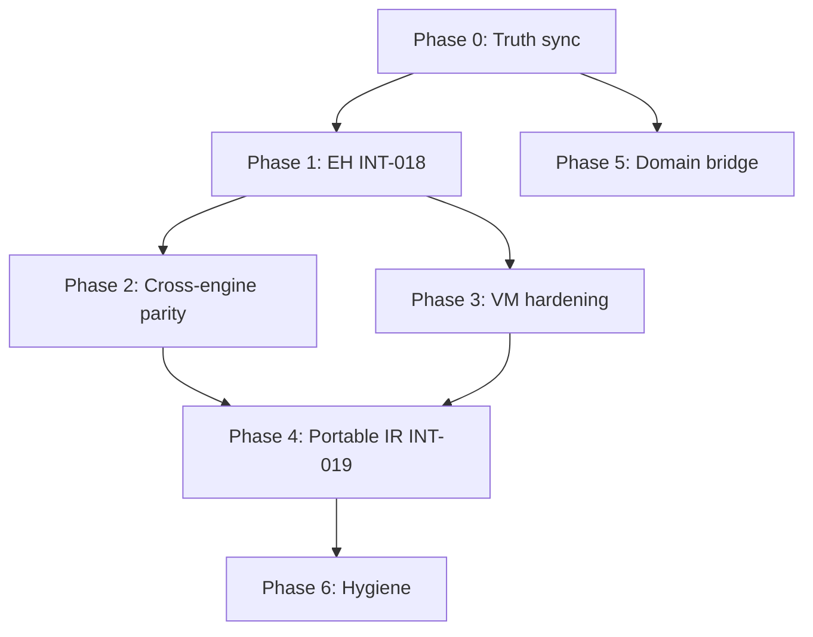

# Interpretation System — Resolution Plan

**Created:** 2026-07-05  
**Updated:** 2026-07-05 (full task breakdown)  
**Source:** [`docs/interpretation-system-architecture-review.md`](../interpretation-system-architecture-review.md) (Rev 1.15)  
**Companion:** [`interpretation-system-issues.md`](interpretation-system-issues.md) (INT-/ANA- tracker)  
**Baseline:** 1395/1395 tests green; P0 analysis sprint complete.

This plan turns architectural findings into **ordered, checkable work**. Task IDs are stable (`P0-001`, `P1C-012`, …). Check boxes in PRs or update status inline as work lands.

**Task status legend:** `open` | `in-progress` | `blocked` (needs Q#) | `done`

---

## Working agreement

**It is okay to be wrong.** This plan is a hypothesis. Update tasks, registers, and ADRs when evidence contradicts an item.

**Ask questions early.** Tasks marked `blocked — Q#` must not be guessed. Surface alternatives with tradeoffs. See [Open decisions](#open-decisions-for-the-owner).

**Per completed task:** implement → test → `dotnet run --project Poly.Tests/Poly.Tests.csproj` green → mark C-/K- resolved in architecture review → update tracker → ADR if policy-level.

---

## How to use this document

| Section | Use |
|---------|-----|
| [Priority overview](#priority-overview) | Sequencing and dependencies |
| [Phase summaries](#phase-summaries) | Goals and exit criteria |
| [Detailed task backlog](#detailed-task-backlog) | **Executable checklist** — start here |
| [Open decisions](#open-decisions-for-the-owner) | Unblock `blocked` tasks |
| [Register closure](#register-closure-checklist) | When to close C-/K- rows |

---

## Priority overview

| Phase | Theme | Task ID prefix | Exit |
|-------|-------|----------------|------|
| **0** | Truth sync | `P0-` | Doc/tracker/ADR aligned |
| **1** | EH (INT-018) | `P1A-` `P1B-` `P1C-` | throw/catch/finally/using correct |
| **2** | Parity (INT-003) | `P2-` | ≥60% overlapping features cross-validated |
| **3** | VM hardening | `P3-` | C-022, ring/closure/TypeIs gaps closed |
| **4** | Portable IR (INT-019) | `P4-` | Serialize + round-trip execute |
| **5** | Domain bridge | `P5-` | Transition documented; scope decided |
| **6** | Hygiene | `P6-` | Dead code removed; deferred ADRs triaged |

---

## Phase summaries

### Phase 0 — Truth sync
**Goal:** Docs and tracker match code. No false `done`.  
**Exit:** High-severity doc-only C-* resolved; §5 header restored.

### Phase 1 — Exception handling (INT-018)
**Goal:** VM EH matches semantics (Strategy B — side table).  
**Exit:** C-017, C-018, C-023 resolved; INT-018 `done`; INT-001 `done` only with catch/finally.

### Phase 2 — Cross-engine parity
**Goal:** VM ↔ Linq disagree in tests, not silently.  
**Exit:** C-016, C-026 resolved or narrowed; parameterized `AssertVmMatchesLinq`.

### Phase 3 — VM correctness hardening
**Goal:** Latent bugs exposed by tests.  
**Exit:** C-022, C-014, C-015, C-021 resolved.

### Phase 4 — Portable IR (INT-019)
**Goal:** Catalog + primitives serialize; one call path.  
**Exit:** INT-019 MVP; C-013, C-006 resolved.

### Phase 5 — Domain → VM (post-transition)
**Goal:** Dual-path intentional; scope explicit.  
**Exit:** C-019, C-020 updated per Q8.

### Phase 6 — Hygiene
**Goal:** Reduce dead code and doc debt.  
**Exit:** K-052–K-063 addressed or deferred with note.

---

## Detailed task backlog

### Phase 0 — Truth sync (`P0-`)

#### P0-A — Architecture review hygiene

- [ ] **P0-001** Restore `## 5. Contradiction register` header before the C-* table in `docs/interpretation-system-architecture-review.md` (currently missing after §4.22).
  - **Files:** `docs/interpretation-system-architecture-review.md` (~line 2365)
  - **Maps:** doc structure
  - **Acceptance:** TOC/nav shows §5; table is under correct heading

- [ ] **P0-002** Mark **C-004** resolved in §5 with `Status: resolved`, `Resolved: 2026-07-05`, note: README rewrite lists passes 1–13.
  - **Files:** `docs/interpretation-system-architecture-review.md` §5
  - **Evidence:** `Poly/Interpretation/README.md` lines 107–125

- [ ] **P0-003** Fix §4.22.5–4.22.8 stale text ("§4.12 favors Strategy A" / "should update to B") — §4.12.7 already recommends B.
  - **Files:** `docs/interpretation-system-architecture-review.md` §4.22.5, §4.22.8 action column

- [ ] **P0-004** Update **K-046** in §6: mark superseded by K-027 / §4.12.7 (Strategy B primary).
  - **Files:** `docs/interpretation-system-architecture-review.md` §6

- [ ] **P0-005** Fix §3.4: `EmitPhi` is compile-time no-op (K-022), not runtime merge implementation.
  - **Files:** `docs/interpretation-system-architecture-review.md` §3.4

#### P0-B — Tracker alignment

- [ ] **P0-010** Change **INT-001** status from `done` → `blocked` (blocked on INT-018) or `open`; update Problem/Acceptance to require catch/finally, not just `EmitThrowOp` exists.
  - **Files:** `docs/plans/interpretation-system-issues.md` §INT-001
  - **Maps:** C-002, C-012

- [ ] **P0-011** Update sprint summary / dependency graph: INT-001 not done until INT-018 Phase 1 complete.
  - **Files:** `docs/plans/interpretation-system-issues.md` (header, §SPRINT-W1 reference ~line 1305)

- [ ] **P0-012** Tracker hygiene: mark SPRINT-W6 rows ✅ where sprint closure completed; remove stale ❌.
  - **Files:** `docs/plans/interpretation-system-issues.md` §SPRINT-W6
  - **Maps:** C-009

#### P0-C — ADR reconciliation

- [ ] **P0-020** Revise `docs/decisions/vm-gap-analysis.md` feature matrix: Exceptions → ✗; TypeIs → ✓; remove or reorder resolved priority items (#1 TypeIs, #2 GC, #4 breakpoints partial).
  - **Files:** `docs/decisions/vm-gap-analysis.md`
  - **Maps:** C-010, C-023, K-038

- [ ] **P0-021** In vm-gap-analysis: add INT-018 reference for EH gap; note `EmitThrowOp` dead / catch-finally unconditional (C-017).
  - **Depends:** P0-020

- [ ] **P0-022** Reconcile priority #7 "policy/event opcodes" with domain-lowering-boundary ADR — document V2 lowers to generic ops; remove or reword #7.
  - **Files:** `docs/decisions/vm-gap-analysis.md`, cross-ref `2026-06-08-domain-lowering-boundary.md`
  - **Maps:** C-025, K-041

- [ ] **P0-023** Fix `docs/decisions/README.md` index bullet: remove "tree-walker interpreter" wording; VM is canonical.
  - **Files:** `docs/decisions/README.md` (~line 26)
  - **Maps:** C-005

- [ ] **P0-024** **Q1=defer** Add note to `docs/decisions/2026-05-31-neurosymbolic-platform-vision.md` or add amendment doc: two-tier VM→backend; primitives as IR; no `Poly/Ir/`; no tree-walker.
  - **Files:** vision doc or new `docs/decisions/2026-07-05-vision-amendment-vm-primitives.md`
  - **Maps:** C-024, K-039

- [ ] **P0-025** **Q1=defer** Update `2026-07-04-primitives-as-canonical-ir.md` status note: Module/BasicBlock deferred until consumer emerges; flat `CompilePrimitives` sufficient.
  - **Maps:** C-001, K-003, INT-009, INT-021

- [ ] **P0-026** **Q2=defer all** Triage unimplemented ADRs — set explicit status on each:
  - `bytecode-serialization` → Deferred until INT-019 consumer
  - `peephole-optimizer` → Deferred (INT-008)
  - `sandboxing-approach` → Deferred (no PermissionSet)
  - `breakpoint-architecture` → Partial (`DebugInterrupt` only) — defer `BreakpointPCs`
  - **Files:** each ADR front-matter + `docs/decisions/README.md`
  - **Maps:** K-040, open Q13 in architecture review

#### P0-D — Verification (no code)

- [ ] **P0-030** Run full test suite after doc-only PR; confirm still 1395/1395.
  - **Command:** `dotnet run --project Poly.Tests/Poly.Tests.csproj`

**Phase 0 exit checklist:**
- [ ] P0-001 through P0-005 (review doc)
- [ ] P0-010 through P0-012 (tracker)
- [ ] P0-020 through P0-023 (ADR sync)
- [ ] P0-025 or Q1 answer recorded

---

### Phase 1 — Exception handling (`P1A-` `P1B-` `P1C-`)

**Strategy:** Strategy B (runtime dispatch / side table) per §4.12.7 — **confirm Q3** before P1B-001.

#### Phase 1a — Wire throw (`P1A-`)

- [ ] **P1A-001** In `ProgramCompiler` primitives switch: change `PrimThrow => null` to `PrimThrow => EmitThrowOp(consumedPcs, ctx)` (or equivalent signature).
  - **Files:** `Poly/Interpretation/Vm/ProgramCompiler.cs` (~line 159)
  - **Maps:** C-012, INT-001 (partial)

- [ ] **P1A-002** Add comment above `PrimThrowProtected => null` and `RegionMarker => null`: intentional until INT-018 dispatch (P1C-*).
  - **Files:** `ProgramCompiler.cs` (~lines 160–162)

- [ ] **P1A-003** Create `Poly.Tests/Interpretation/ThrowVmTests.cs` (or extend `VmCorrectnessTests`):
  - `Throw_Uncaught_PropagatesException` — `Interpreter.Execute` on `throw new Exception("x")` throws (not silent return)
  - Uses full pipeline (`Interpreter.Analyze` + `Compile` + `Execute`), not `ExecExpand`
  - **Maps:** K-018

- [ ] **P1A-004** Add test: `Throw_InTryWithoutCatch_Propagates` — documents current behavior pre-catch (exception unwinds; catch body still wrong until P1C).
  - **Depends:** P1A-001

- [ ] **P1A-005** Verify `EmitThrowOp` dereferences heap handle correctly for string/object exceptions; fix if `ThrowStatement` lowering path differs.
  - **Files:** `ProgramCompiler.cs` `EmitThrowOp` (~319), `Poly/Syntax/Nodes/ThrowStatement.cs`

- [ ] **P1A-006** Do **not** mark INT-001 `done`; add tracker note "P1A complete — throw wired; catch/finally pending P1C".

**Phase 1a exit:** P1A-001, P1A-003 green.

---

#### Phase 1b — EH ADR (`P1B-`)

- [ ] **P1B-001** **blocked — Q3** Create ADR `docs/decisions/2026-07-05-vm-exception-handling-strategy-b.md` (or amend vm-as-canonical-semantics EH section):
  - Strategy B: `ExceptionRegionTable` on `VmProgram`
  - Handlers as `Functions[]` entries
  - Main delegate wrapped in `Expression.TryCatch` + dispatch expression
  - References ANA-003 metadata contract (`ExceptionRegionMetadata`, `ExceptionRegionEntry`)
  - **Maps:** C-018, K-027, INT-018

- [ ] **P1B-002** Document in ADR: `RegionMarker` becomes compile-time metadata only (not runtime µops) after P1C; flat expansion unchanged.

- [ ] **P1B-003** Link ADR from `Poly/Interpretation/Vm/README.md` EH section.

**Phase 1b exit:** P1B-001 merged.

---

#### Phase 1c — Strategy B implementation (`P1C-`)

##### P1C-1 — Types and table construction

- [ ] **P1C-001** Add `ExceptionRegionTable` type (new file or `VmProgram.cs`):
  - `IReadOnlyList<ExceptionRegionEntry>` or dedicated record with: `TryStartPc`, `TryEndPc`, `HandlerFuncIndex`, `Kind` (Try/Catch/Finally/UsingDispose), `CatchTypeName?`, `CatchVariableName?`, `ParentRegionIndex`
  - Serializable-friendly fields (strings + ints, no `System.Type` in table)
  - **Files:** new `Poly/Interpretation/Vm/ExceptionRegionTable.cs` (suggested)
  - **Maps:** INT-018, §4.12.4

- [ ] **P1C-002** Add `ExceptionRegionTable? Regions` property on `VmProgram`.
  - **Files:** `Poly/Interpretation/Vm/VmProgram.cs`

- [ ] **P1C-003** In `Interpreter.CompileCore` / `ProgramCompiler.CompilePrimitives`: read `ExceptionRegionMetadata` from `AnalysisResult` (module-level null key).
  - **Files:** `Poly/Interpretation/Interpreter.cs`, `ProgramCompiler.cs`

- [ ] **P1C-004** Implement `BuildExceptionRegionTable(primitives, metadata) → ExceptionRegionTable`:
  - Map `RegionMarker` positions in flat µop array to PC ranges
  - Cross-reference `ExceptionRegionEntry.AnchorNodeId`, `ProtectedNodeIds`, `HandlerNodeIds` from analysis
  - **Maps:** C-017, C-018
  - **Ask if stuck:** marker-to-PC alignment vs node-id alignment — confirm against `TryCatchFinally.ToPrimitives` emission order

- [ ] **P1C-005** Unit test: given primitives + metadata from `ExpansionIntegrationTests` fixture, table has expected PC ranges (shape test, no execution yet).
  - **Files:** new `Poly.Tests/Interpretation/ExceptionRegionTableTests.cs`

##### P1C-2 — Handler compilation

- [ ] **P1C-010** Implement `ExtractHandlerPrimitiveRanges(primitives, table) → List<(int start, int end, int funcIndex)>` for catch/finally/dispose bodies.
  - **Files:** `ProgramCompiler.cs`

- [ ] **P1C-011** Compile each handler range as independent `Action<VmState>` via existing function compilation path (`CompilePrimitives` sub-range or `CompileRange` helper).
  - Ring allocation: **fresh** `ComputePrimitiveRingDepths` per handler range (depth 0 at entry)
  - **Files:** `ProgramCompiler.cs`
  - **Maps:** §4.12.9 Option A

- [ ] **P1C-012** Append handler delegates to `VmProgram.Functions`; store `HandlerFuncIndex` in table entries.
  - **Depends:** P1C-010, P1C-011

- [ ] **P1C-013** Catch variable binding: at handler entry, store caught exception in heap slot or ring local; inject load for catch body µops referencing exception.
  - **Ask if stuck:** heap slot vs `Expression.Variable` inside dispatch wrapper — ADR should pick one

##### P1C-3 — Main body + dispatch wrapper

- [ ] **P1C-020** Compile **main** µop range excluding handler bodies (or skip handler PCs in main delegate — design choice document in PR).
  - **Depends:** P1C-010

- [ ] **P1C-021** Generate dispatch expression `EmitExceptionDispatch(catchVar, state, regionTable)`:
  - Read faulting PC (capture at throw site or use `ExceptionRegionMetadata` + stack walk)
  - Find innermost matching region; type-filter catch clauses
  - Invoke `Functions[handlerIndex](state)`; run finally chain; rethrow if unhandled
  - **Files:** `ProgramCompiler.cs`

- [ ] **P1C-022** Wrap compiled main delegate: `Expression.TryCatch(mainBody, Catch(typeof(Exception), var, dispatch))`.
  - **Depends:** P1C-021

- [ ] **P1C-023** Change `PrimThrowProtected` from `null` to protected-throw path: set PC/exception state then enter dispatch (not bare unwind-only if catch exists).
  - **Maps:** C-012, §4.12.10
  - **Depends:** P1C-021

- [ ] **P1C-024** Ensure **catch body does not run** on normal try completion (regression for C-017).
  - **Test:** `TryCatchFinally_NormalCompletion_SkipsCatch` — return value from try only

##### P1C-4 — Try/finally and using

- [ ] **P1C-030** Try/finally without catch: finally handler runs on normal and exceptional exit.
  - **Test:** `TryFinally_Normal_FinallyRuns`, `TryFinally_Throw_FinallyThenRethrow`
  - **Maps:** INT-018 acceptance

- [ ] **P1C-031** `UsingStatement` / `LeaveUsingDispose`: dispose handler invoked on exceptional exit; normal exit runs dispose in sequence or via finally dispatch.
  - **Files:** may need `UsingStatement.ToPrimitives` order verified against ANA-FIX-007
  - **Maps:** K-045, ANA-FIX-007
  - **Related open tracker:** ANA-FIX-010 (EH tests)

- [ ] **P1C-032** Test: `Using_DisposeOnException`, `Using_DisposeOnNormalExit`
  - **Maps:** ANA-FIX-010

##### P1C-5 — Nested EH

- [ ] **P1C-040** Support `ParentRegionIndex` in dispatch: unwind to parent region when catch type does not match.
  - **Test:** `TryCatch_Nested_InnerCatch`, `TryCatch_Nested_OuterCatch`

- [ ] **P1C-041** Test: multiple catch clauses (type filter order).
  - **Test:** `TryCatch_MultipleCatch_FirstMatching`

- [ ] **P1C-042** Test: throw inside catch; finally inside nested try.
  - **Maps:** ANA-FIX-010

##### P1C-6 — Ring depth side table (optional in same PR or follow-up)

- [ ] **P1C-050** Add `PcToRingDepth?` side table on `VmProgram` for debugger/EH (ghost ValueStack — K-035).
  - **Files:** `VmProgram.cs`, `ProgramCompiler.cs`
  - **Maps:** K-035, open Q9
  - **Can defer** if not needed for dispatch MVP

##### P1C-7 — Cleanup and closure

- [ ] **P1C-060** Remove or update `RegionMarker => null` comment; markers unused at runtime (metadata only).
  - **Maps:** §4.12.10

- [ ] **P1C-061** Update `vm-gap-analysis.md` EH → ✓ (after tests green).
  - **Depends:** all P1C tests
  - **Maps:** C-023

- [ ] **P1C-062** Mark **C-017**, **C-018**, **C-023** resolved in architecture review §5.
  - **Depends:** P1C-024, P1C-030, P1C-031

- [ ] **P1C-063** Mark **INT-018** `done` and **INT-001** `done` in tracker.
  - **Depends:** P1C-062

- [ ] **P1C-064** Remove "INT-018 placeholder" / stale EH comments in `ProgramCompiler.cs`, `Primitives.cs`.

**Phase 1 minimum test matrix (all required for exit):**

| Test ID | Scenario |
|---------|----------|
| T-EH-01 | Uncaught throw propagates |
| T-EH-02 | Throw caught; catch returns value |
| T-EH-03 | Try/finally; no throw; finally runs |
| T-EH-04 | Throw; finally runs; exception propagates |
| T-EH-05 | Normal try completion; catch skipped |
| T-EH-06 | Using dispose on normal exit |
| T-EH-07 | Using dispose on exception |
| T-EH-08 | Nested try/catch |

---

### Phase 2 — Cross-engine parity (`P2-`)

#### P2-A — Harness infrastructure

- [ ] **P2-001** Refactor `AssertVmMatchesLinq` in `VmCorrectnessTests.cs` to accept `object?[] args` and pass to both LINQ `DynamicInvoke(args)` and VM `SetArgs`.
  - **Files:** `Poly.Tests/Interpretation/VmCorrectnessTests.cs` (~272–295)
  - **Maps:** K-047, C-026, §4.13.5 Phase 1
  - **Template:** `Fuzz_RandomPropertyAccess_MatchLinq` (~768)

- [ ] **P2-002** Add overload `AssertVmMatchesLinq(DomainExpression expr)` → calls with empty args (preserve existing 11 tests).

- [ ] **P2-003** Extract shared `NormalizeResult(object?) → long` used by both paths (bool → 0/1, null → 0, etc.).

- [ ] **P2-004** Fix **K-048**: either add LINQ comparison to `AssertVmMatchesLinqComposite` OR rename to `AssertVmMultiCase` and document VM-only.
  - **Files:** `VmCorrectnessTests.cs` (~381–410)

#### P2-B — Breadth-first MatchLinq tests (Syntax.Node or DomainExpression)

- [ ] **P2-010** `MatchLinq_PropertyAccess_Age` — parameterized entity
- [ ] **P2-011** `MatchLinq_PropertyAccess_NameEq`
- [ ] **P2-012** `MatchLinq_MethodCall_StringLength`
- [ ] **P2-013** `MatchLinq_MethodCall_MathMax`
- [ ] **P2-014** `MatchLinq_Conditional_WithEntity`
- [ ] **P2-015** `MatchLinq_IfElse_WithComparison`
- [ ] **P2-016** `MatchLinq_WhileLoop_Count`
- [ ] **P2-017** `MatchLinq_ForLoop_Count` (if VM supports)
- [ ] **P2-018** `MatchLinq_DoWhileLoop`
- [ ] **P2-019** `MatchLinq_Coalesce`
- [ ] **P2-020** `MatchLinq_TypeIs_HeapRef` — **blocked** until P3-040 or confirm TypeCheck works
- [ ] **P2-021** `MatchLinq_Lambda_NoCapture` — simple `() => expr`
- [ ] **P2-022** `MatchLinq_Lambda_WithCapture` — **blocked** until P3-030
  - **Maps:** C-016, K-024

#### P2-C — EH cross-validation (blocked on Phase 1)

- [ ] **P2-030** `MatchLinq_Throw_Uncaught` — both engines throw
- [ ] **P2-031** `MatchLinq_TryCatch_ReturnsCatchValue`
- [ ] **P2-032** `MatchLinq_TryFinally_ReturnsFinallyValue`
- [ ] **P2-033** `MatchLinq_Using_DisposeCalled`
  - **Depends:** P1C complete

#### P2-D — Short-circuit (blocked on Q4)

- [ ] **P2-040** **blocked — Q4** If VM fix: in `EmitBinaryOp`, emit `Expression.AndAlso`/`OrElse` for `BinaryOperator.And`/`Or` when operands are boolean logic (not bitwise).
  - **Files:** `ProgramCompiler.cs`
  - **Maps:** K-042
  - **Alt:** expansion lowers `&&`/`||` to `CondGoto` chain — document in ADR

- [ ] **P2-041** `MatchLinq_And_ShortCircuit_SideEffect` — second operand not evaluated when first false
  - **Depends:** P2-040

#### P2-E — Oracle matrix documentation

- [ ] **P2-050** Add "Backend oracle matrix" table to `Poly/Interpretation/Vm/README.md`: per feature — VM / Linq / C# / cross-validated / VM-only.
  - **Maps:** K-043, K-049, §4.11

- [ ] **P2-051** Document 8 VM-only features as intentional (no Linq oracle): bitwise, shifts, NewArray, PopCount, StridedSetBits.
  - **blocked — Q10** if wiring Linq instead

#### P2-F — Type promotion / DCE (lower priority)

- [ ] **P2-060** Shared type-promotion utility or analysis pass output consumed by VM — **optional**, per §4.13.5 Phase 2.
  - **Maps:** K-025

- [ ] **P2-061** DCE cross-validation test: `if(false) sideEffect()` — both engines skip dead branch.
  - **Maps:** K-025, §4.13.5 Phase 3

**Phase 2 exit checklist:**
- [ ] P2-001–P2-003 harness done
- [ ] ≥8 new MatchLinq tests (P2-010–P2-019 minimum)
- [ ] P2-030–P2-033 after Phase 1
- [ ] C-016, C-026 updated in review

---

### Phase 3 — VM correctness hardening (`P3-`)

#### P3-A — Nested function calls (ring save)

- [ ] **P3-001** Design fix for `CtxPushRegisters`/`CtxPopRegisters` flat overwrite — options:
  - (a) `Registers` as stack of save areas
  - (b) save area indexed by call depth on `VmState`
  - (c) document nested calls unsupported + runtime guard
  - **Files:** `ProgramCompiler.cs` 549–563, `VmState.cs`
  - **Maps:** C-022, K-032
  - **Ask if stuck:** prefer (a) vs (b) — affects INT-005

- [ ] **P3-002** Implement chosen design from P3-001.

- [ ] **P3-003** Test `NestedLambda_CallPreservesOuterRing` — outer calls inner `Func<long,long>`; outer locals intact after return.
  - **Files:** new test in `VmCorrectnessTests.cs` or `ClosureVmTests.cs`

#### P3-B — Ring verification

- [ ] **P3-010** Add `#if DEBUG` method `VerifyRingDepths(primitives, ringDepths, branchTargets)` after `ComputePrimitiveRingDepths`.
  - Assert all predecessors agree at each Phi/branch target (K-034)
  - **Files:** `ProgramCompiler.cs`
  - **Maps:** C-014, K-034

- [ ] **P3-011** Call verifier from `CompilePrimitives` in DEBUG builds only.

- [ ] **P3-012** Remove `KNOWN BUG` comment from `Fuzz_Phi_NestedConditional_DifferentRingDepths`; add "fixed by ring-based BuildTargetDepth".
  - **Files:** `VmCorrectnessTests.cs` ~605
  - **Maps:** C-015

#### P3-C — Closures / upvalues

- [ ] **P3-020** Test `Closure_LoadUpvalue_ReadsCapturedLocal` — outer `let x = 42` in lambda `() => x`.
- [ ] **P3-021** Test `Closure_StoreUpvalue_WritesCapturedLocal`
- [ ] **P3-022** Test `Closure_MultipleUpvalues`
- [ ] **P3-023** `MatchLinq_Lambda_WithCapture` (after P2-001)
  - Full pipeline `Interpreter.Compile` + `Execute`
  - **Maps:** K-058

#### P3-D — TypeIs VM path

- [ ] **P3-030** Rename `Expand_TypeIs_StringRefType` → `Expand_TypeIs_WithoutAnalysis_FailsClosed`.
  - **Files:** `Poly.Tests/Interpretation/PrimitiveExpandTests.cs` ~96
  - **Maps:** C-011

- [ ] **P3-031** Test `TypeIs_HeapRef_Match` — string on heap, `is string` → true through VM.
- [ ] **P3-032** Test `TypeIs_HeapRef_Mismatch` → false
- [ ] **P3-033** Test `TypeIs_HeapRef_Null` → false
- [ ] **P3-034** Test `TypeIs_Scalar_StaticMatch` — full pipeline, `StaticTypeIsMatch` path
  - **Maps:** K-015

#### P3-E — InterpretResult ABI

- [ ] **P3-040** Add `InterpretResultAbiTests.cs`:
  - `BlockRootedScalar_ReturnsInt` (may exist — extend)
  - `HeapRef_ReturnsDereferencedObject`
  - `Void_ReturnsDefault`
  - Programs use `exec.Result` / `GetValue<T>()`, not `RawValue`
  - **Maps:** K-059, INT-002

- [ ] **P3-041** Document in `Vm/README.md`: `RawValue` for low-level tests only; production uses `InterpretResult`.

#### P3-F — PolicyEvaluator

- [ ] **P3-050** Replace `Debug.Assert(result == result2)` with `if (result != result2) throw new InvalidOperationException(...)` or structured diagnostic.
  - **Files:** `Poly/DomainModeling/Lowering/PolicyEvaluator.cs` ~62
  - **Maps:** C-021

#### P3-G — Expansion infrastructure

- [ ] **P3-060** Wrap `ExpansionPass` depth increment in try/finally (or `IDisposable` guard) so `state.Depth` restores on `ToPrimitives` exception.
  - **Files:** `Poly/Interpretation/Analysis/Semantics/ExpansionPass.cs`
  - **Maps:** K-060

- [ ] **P3-061** Replace `TryResolveSlotByNodeId` manual iteration with `_slots.TryGetValue(nodeId, out slot)`.
  - **Files:** `Poly/Interpretation/Analysis/Semantics/ExpansionEnvironment.cs`
  - **Maps:** K-061

#### P3-H — Ring depth limit

- [ ] **P3-070** Add test exercising ring depth >32 (INT-006 spill/overflow path).
  - **Files:** new test in `VmCorrectnessTests.cs`
  - **Maps:** INT-006, §4.22.2
  - **May expose bug** — fix in same task if fails

**Phase 3 exit:** P3-002+003, P3-010, P3-012, P3-020+, P3-031+, P3-050, P3-060, P3-061 done.

---

### Phase 4 — Portable IR (`P4-`) — INT-019

**Prerequisites:** Q5, Q6 answered.

#### P4-A — CallSiteCompiler decision

- [ ] **P4-001** **blocked — Q5** Decision record: delete `CallSiteCompiler` OR keep for deserialization with ring ABI bridge.
  - **Files:** `Poly/Interpretation/Vm/CallSiteCompiler.cs`, `docs/decisions/2026-06-08-bytecode-serialization.md`
  - **Maps:** C-013, C-006, K-020

- [ ] **P4-002** If delete: remove `CallSiteCompiler.cs`; grep docs/tests; amend bytecode-serialization ADR to `EmitCallExternalDirect` only.
  - **Depends:** P4-001 = delete

- [ ] **P4-003** If keep: adapt to emit ring-compatible code OR document two-phase load (deserialize → recompile via ProgramCompiler).
  - **Depends:** P4-001 = keep

#### P4-B — Catalog-only emission

- [ ] **P4-010** Audit all `CallExternal` creation sites: `Invoke.ToPrimitives`, `Member.ToPrimitives`, `New.ToPrimitives` — verify `SiteIndex` always set when catalog entry exists.
  - **Files:** `Poly/Syntax/Nodes/Invoke.cs`, `Member.cs`, `New.cs`

- [ ] **P4-011** In `EmitCallExternalDirect`: when `SiteIndex` present, resolve target **only** from `VmProgram.CallSites`; ignore embedded `MethodBase` at runtime.
  - **Files:** `ProgramCompiler.cs`
  - **Maps:** K-019

- [ ] **P4-012** Add test: compile with catalog only (strip `MethodBase` from serialized form) — **blocked** until serializer exists.

- [ ] **P4-013** **blocked — Q6** Make `CallExternal.Target` optional or remove from primitive record; compiler requires `SiteIndex` for external calls.
  - **Maps:** K-011, INT-019

#### P4-C — TypeCheck portability

- [ ] **P4-020** Replace `TypeCheck.TargetType` (`System.Type`) with assembly-qualified type name string or stable type id from analysis.
  - **Files:** `Poly/Syntax/Primitives/TypeCheck.cs`, `ProgramCompiler.EmitTypeCheckOp`
  - **Maps:** K-016

- [ ] **P4-021** Test round-trip: TypeIs on heap ref after deserialize.

#### P4-D — Serializer MVP

- [ ] **P4-030** Define wire format (no `BinaryFormatter`): version header + primitive tag stream + catalog table + optional `ExceptionRegionTable` + `RootValueKind`.
  - **Files:** new `Poly/Interpretation/Vm/BytecodeSerializer.cs` (or `Poly/Interpretation/Serialization/`)
  - **Maps:** INT-019, K-040

- [ ] **P4-031** Implement `Serialize(VmProgram, PrimitiveNode[], AnalysisResult?) → byte[]`.

- [ ] **P4-032** Implement `Deserialize(byte[]) → (VmProgram, PrimitiveNode[], CallSiteCatalog)`.

- [ ] **P4-033** Deserialize path: resolve call sites via `TypeAndMemberResolver` or embedded identity strings → `MethodBase` at load time in **fresh process**.

- [ ] **P4-034** Integration test `BytecodeSerializer_RoundTrip_ExecuteSameResult` — analyze → compile → serialize → deserialize → execute; compare to original.
  - **Maps:** INT-019 acceptance

- [ ] **P4-035** Include `ExceptionRegionTable` in serialized payload (from P1C).
  - **Depends:** P1C-002

#### P4-E — Catalog gaps

- [ ] **P4-040** **blocked — Q7** Either extend `ProcessMember` for `ClrMethod` standalone `Member` nodes OR document omission in `CallSiteCatalogPass` + ADR.
  - **Files:** `CallSiteCatalogPass.cs` 122–135
  - **Maps:** C-008

**Phase 4 exit:** P4-002 or P4-003, P4-011, P4-030–P4-034, INT-019 `done`.

---

### Phase 5 — Domain → VM bridge (`P5-`)

**Note:** Not urgent unless you reprioritize (Q8).

- [ ] **P5-001** Add "transitional dual-path" section to domain modeling docs or amend domain-lowering-boundary ADR: V2 = full lowering; V3 = expressions only (1/14).
  - **Maps:** C-019, K-029, K-030

- [ ] **P5-002** Copy V3 lowering 14-file plan status into `docs/plans/v2-to-v3/workstreams/` with checkboxes (1 done: `DomainExpressionLoweringPass`).
  - **Maps:** K-036

- [ ] **P5-003** **blocked — Q8** Decision record: action bodies — C#-only forever vs future VM path.
  - **Maps:** K-031, C-020, architecture review Q12

- [ ] **P5-004** When next V3 lowering file lands: add matching test in `DomainExpressionVmExecutionTests.cs`.
  - **Depends:** V3 workstream priority

- [ ] **P5-005** When V3 effect lowering exists: end-to-end VM test for `Assign`/`Publish`/`Transition` effect — **maps C-020**.

- [ ] **P5-006** Decouple `PolicyEvaluator.CompileVMPredicate<T>` from `TypeReference.To<T>()` — symbolic entity parameter + late CLR bind.
  - **Files:** `PolicyEvaluator.cs` 30–42
  - **Maps:** K-037
  - **Can defer** until INT-019 needs portability for domain policies

---

### Phase 6 — Hygiene and deferred (`P6-`)

#### P6-A — Dead code removal (independent small PRs)

- [ ] **P6-001** Delete `FunctionEntry.cs` if still zero usages.
  - **Maps:** K-057

- [ ] **P6-002** Delete `Closure.cs` OR refactor `EmitAllocClosure` to use it — grep `new Closure(` first.
  - **Maps:** K-054

- [ ] **P6-003** Remove `CSharpGenerator.WriteTestTopLevelStatement` (~line 46).
  - **Maps:** K-053

- [ ] **P6-004** Remove `NodeExtensions.Null`, `.True`, `.False`, `.Wrap()`.
  - **Files:** `Poly/Syntax/NodeExtensions.cs`
  - **Maps:** K-062

- [ ] **P6-005** Remove `PendingFunction.CapturedInfo` field if still unread; fix tuple naming doc if needed.
  - **Maps:** K-056

#### P6-B — Visualization and docs

- [ ] **P6-010** Add `GetChildren` cases in `MermaidAstGenerator` for `TryCatchFinally`, `SwitchStatement`, `UsingStatement`.
  - **Files:** `Poly/Interpretation/Mermaid/MermaidAstGenerator.cs`
  - **Maps:** K-063

- [ ] **P6-011** Fix Phi `StackEffect` in `Poly/Syntax/Primitives/README.md` → `(0,0)`.
  - **Maps:** K-033

- [ ] **P6-012** Create `Poly/Interpretation/CSharp/README.md` — input contract, ToString fallback list, production entry via `DomainTools`.
  - **Maps:** K-052

- [ ] **P6-013** Document ring-vs-ValueStack ghost model in `Poly/Interpretation/Vm/README.md`.
  - **Maps:** K-035

#### P6-C — Heap API

- [ ] **P6-020** Add `Heap.Free(int handle)` and optionally `Take(int handle)`.
  - **Files:** `Poly/Interpretation/Vm/Heap.cs`
  - **Maps:** K-055

- [ ] **P6-021** Tests for Free/Take; document null-as-deleted semantics.

#### P6-D — Tracker items (as scheduled)

- [ ] **P6-030** **INT-002** — complete remaining `InterpretResult` edge cases per tracker (coordinate with P3-040).
- [ ] **P6-031** **INT-028** — per tracker spec.
- [ ] **P6-032** **INT-006** — propagate `MaxActiveLocalsDepth` from ring analysis (coordinate P3-070).
- [ ] **P6-033** **INT-007** — **blocked — Q9** incremental analysis for expressions: tests first or document domain-only.
  - **Maps:** K-050

#### P6-E — Analysis pipeline tooling

- [ ] **P6-040** Add `RequiredMetadata` or `[DependsOn]` to `INodeAnalyzer`; validate order at `AnalyzerBuilder.Build()`.
  - **Maps:** K-051

- [ ] **P6-041** Mirror §4.14.2 dependency table in `Analysis/README.md` with explicit edges.

#### P6-F — Deferred until first consumer

- [ ] **P6-050** INT-008 peephole optimizer — no implementation until consumer identified.
- [ ] **P6-051** Sandboxing `PermissionSet` — deferred (K-012).
- [ ] **P6-052** Breakpoint `BreakpointPCs` — optional quick win per Q2.
- [ ] **P6-053** INT-009 SSA slots / `CompileModule` — blocked on first consumer (K-003).

#### P6-G — Open ANA-FIX tracker items (still relevant)

- [ ] **P6-060** **ANA-FIX-008** — CFG-unreachable catch regions: filter or document in expansion.
  - **Status:** `blocked` in tracker

- [ ] **P6-061** **ANA-FIX-009** — stable `CatchTypeId` instead of `GetHashCode()`.
  - **Status:** `blocked`

- [ ] **P6-062** **ANA-FIX-010** — EH test suite (may be satisfied by P1C test matrix — close when covered).

- [ ] **P6-063** **ANA-FIX-013** — `CallSiteEntry` overload collision identity string.

---

## Open decisions for the owner

| # | Question | Default | Answer | Unblocks tasks |
|---|----------|---------|--------|----------------|
| **Q1** | Module/BasicBlock: amend ADR vs implement? | Amend to partial | **Defer until real need arises** — avoid implementing speculative abstraction. Keep flat `CompilePrimitives` as-is. | P0-025, INT-021 → drop both |
| **Q2** | Unimplemented ADRs: defer all vs breakpoint `BreakpointPCs` now? | Defer + annotate | **Defer all.** Bytecode serialization not important. Peephole useful later, not now. Sandboxing after current problem set. | P0-026, P6-052 |
| **Q3** | Confirm EH Strategy B? | Yes | **Yes** — side-table dispatch makes sense. | P1B-001, all P1C |
| **Q4** | Short-circuit: VM `AndAlso`/`OrElse` vs expansion branches? | VM emit | _Open_ | P2-040 |
| **Q5** | Delete `CallSiteCompiler`? | Delete | _Open_ | P4-001–003 |
| **Q6** | Drop `MethodBase` from IR when? | After serializer sketch | _Open_ | P4-013 |
| **Q7** | Catalog standalone `Member`→method? | Document omit | _Open_ | P4-040 |
| **Q8** | Domain action bodies through VM ever? | C#-only for now | _Open_ | P5-003, C-020 |
| **Q9** | Incremental analysis on expression ASTs? | Domain-only | _Open_ | P6-033, K-050 |
| **Q10** | Wire 8 VM-only ops into Linq for oracle? | VM-only doc | _Open_ | P2-051 |

**It is okay to answer partially** — e.g. "Q3 yes, Q5 delete, Q8 defer" is enough to start Phase 1 and 4.

---

## Suggested execution order

| Sprint | Tasks | Deliverable |
|--------|-------|-------------|
| **S1** | P0-001–P0-023, P1A-001–P1A-003 | Docs synced; throw wired + test |
| **S2** | P1B-001, P1C-001–P1C-012 | EH ADR; region table; handlers compile |
| **S3** | P1C-020–P1C-042, P1C-062–P1C-064 | Full EH; INT-018 done |
| **S4** | P2-001–P2-019, P2-030–P2-033 | Parameterized MatchLinq + EH parity |
| **S5** | P3-001–P3-034, P3-050, P3-060–P3-061 | Ring fix; closures; TypeIs |
| **S6** | P4-001–P4-034 | INT-019 MVP |
| **ongoing** | P6-* between sprints | Hygiene |

---

## Register closure checklist

| Register | Close when task(s) done |
|----------|-------------------------|
| C-004 | P0-002 |
| C-002, C-012 | P1C-063 (not P1A alone) |
| C-017, C-018, C-023 | P1C-062 |
| C-010, C-023 (ADR) | P0-020, P1C-061 |
| C-025, K-041 | P0-022 |
| C-005 | P0-023 |
| C-009 | P0-012 |
| C-001 | P0-025 or INT-021 |
| C-016, C-026 | P2 exit |
| C-022, K-032 | P3-003 |
| C-014, C-015 | P3-010, P3-012 |
| C-021 | P3-050 |
| C-011, K-015 | P3-030–P3-034 |
| C-013, C-006 | P4-001–002 |
| C-008 | P4-040 |
| C-019, C-020 | P5-001, P5-003, P5-005 |
| K-046 | P0-004 |
| K-058 | P3-020–P3-023 |
| K-059 | P3-040 |

---

## Risks and mitigations

| Risk | Mitigation |
|------|------------|
| EH Strategy B >10 days | Timebox P1C-020–022 dispatch MVP; nested EH (P1C-040) can follow |
| P1C-004 marker/PC mapping wrong | P1C-005 shape test before execution tests |
| MatchLinq explosion | P2-010–019 breadth-first only; no cartesian fuzz |
| INT-019 scope creep | P4-030 MVP format only; metadata bundle v2 later |
| Wrong task order | Working agreement + Q1–Q10 |

---

## Related links

- [Architecture review](../interpretation-system-architecture-review.md)
- [Issue tracker](interpretation-system-issues.md)
- [Analysis README](../../Poly/Interpretation/Analysis/README.md)
- [VM README](../../Poly/Interpretation/Vm/README.md)

---

*Task count: Phase 0 (16) · Phase 1a (6) · Phase 1b (3) · Phase 1c (27) · Phase 2 (22) · Phase 3 (22) · Phase 4 (16) · Phase 5 (6) · Phase 6 (22) ≈ **140 checkable tasks**.*